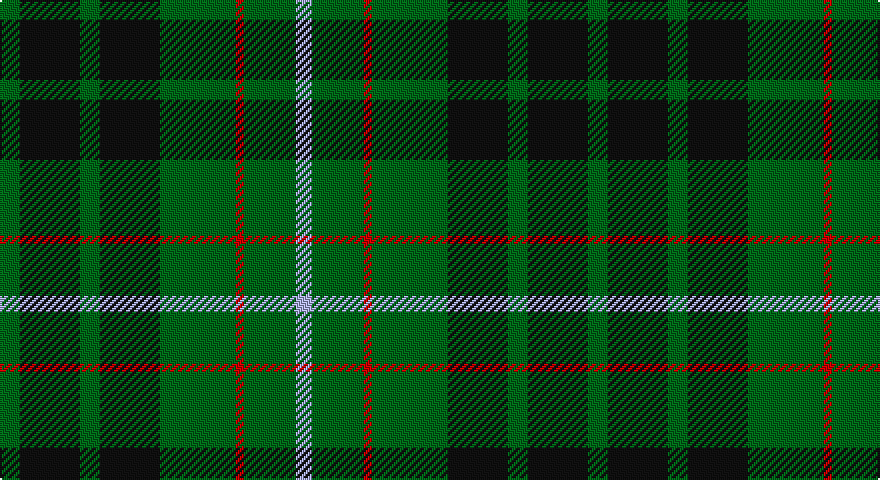

This page is one **sett** — a single exact thread-count. It belongs to the [tartan](/setts/g5k15g5k15g19r2g13lb4/)
(the same proportion at any scale), whose colour order is pattern [GKGKGRGW](/stripes/gkgkgrgw/).

Part of the [Strath Hallidale](/tartans/strath-hallidale/) tartan — the named design grouping this sett with its other cloths.

Sourced from tartans-authority.  It is a [8 stripe tartan](/stripes/stripes8/).

Original link http://www.tartansauthority.com/tartan-ferret/display/2570/

## Register references

External register numbers recorded for this tartan.

- Scottish Tartans Authority (ITI): 2570

## Thread count
G/10 K30 G10 K30 G38 R4 G26 LP/8

One full sett is **294 threads**.

## Palette

Palette: <strong>Tartan Register</strong>
<table><thead><tr><th>Colour</th><th>Threads</th><th>Shade</th><th>Base</th><th>OKLCh</th></tr></thead><tbody><tr><td>G/</td><td style="text-align:right;font-variant-numeric:tabular-nums">10</td><td><code style="background-color:#006818;">#006818</code> <small style="color:#888">#006818</small></td><td>G <code style="background-color:#006100;">#006100</code></td><td><small style="color:#888">oklch(45.0% 0.142 145.0)</small></td></tr><tr><td>K</td><td style="text-align:right;font-variant-numeric:tabular-nums">30</td><td><code style="background-color:#101010;">#101010</code> <small style="color:#888">#101010</small></td><td>K <code style="background-color:#000000;">#000000</code></td><td><small style="color:#888">oklch(17.3% 0.000 89.9)</small></td></tr><tr><td>G</td><td style="text-align:right;font-variant-numeric:tabular-nums">10</td><td><code style="background-color:#006818;">#006818</code> <small style="color:#888">#006818</small></td><td>G <code style="background-color:#006100;">#006100</code></td><td><small style="color:#888">oklch(45.0% 0.142 145.0)</small></td></tr><tr><td>K</td><td style="text-align:right;font-variant-numeric:tabular-nums">30</td><td><code style="background-color:#101010;">#101010</code> <small style="color:#888">#101010</small></td><td>K <code style="background-color:#000000;">#000000</code></td><td><small style="color:#888">oklch(17.3% 0.000 89.9)</small></td></tr><tr><td>G</td><td style="text-align:right;font-variant-numeric:tabular-nums">38</td><td><code style="background-color:#006818;">#006818</code> <small style="color:#888">#006818</small></td><td>G <code style="background-color:#006100;">#006100</code></td><td><small style="color:#888">oklch(45.0% 0.142 145.0)</small></td></tr><tr><td>R</td><td style="text-align:right;font-variant-numeric:tabular-nums">4</td><td><code style="background-color:#C80000;">#C80000</code> <small style="color:#888">#C80000</small></td><td>R <code style="background-color:#CC0000;">#CC0000</code></td><td><small style="color:#888">oklch(52.3% 0.215 29.2)</small></td></tr><tr><td>G</td><td style="text-align:right;font-variant-numeric:tabular-nums">26</td><td><code style="background-color:#006818;">#006818</code> <small style="color:#888">#006818</small></td><td>G <code style="background-color:#006100;">#006100</code></td><td><small style="color:#888">oklch(45.0% 0.142 145.0)</small></td></tr><tr><td>LP/</td><td style="text-align:right;font-variant-numeric:tabular-nums">8</td><td><code style="background-color:#A8ACE8;">#A8ACE8</code> <small style="color:#888">#A8ACE8</small></td><td>W <code style="background-color:#F7F7F7;">#F7F7F7</code></td><td><small style="color:#888">oklch(76.3% 0.086 281.2)</small></td></tr></tbody></table>

# Sample pattern

## Compared to the master

This cloth is one sett of its design; the master sett (the exemplar the design is anchored on) is below for comparison.

<figure style="margin:0"><figcaption style="color:#888;font-size:smaller">this sett</figcaption></figure>
<figure style="margin:0"><figcaption style="color:#888;font-size:smaller"><a href="/setts/g13r2g19k15g5k15g5k15g5k15g19r2g13lb4/">master sett →</a></figcaption></figure>

## Nearest tartans

The nearest existing variants by ΔTartan distance, with this tartan at the top so the swatches line up against it.

ΔTartan

Tartan

Sett

—

<a href="/ttd/edit/#slug=g5k15g5k15g19r2g13lb4~x2">Strath Hallidale (Fashion)</a> <a class="nn-out" href="/variants/s8/g5k15g5k15g19r2g13lb4~x2/" title="open its dictionary page">↗</a>

0.62

<a href="/ttd/edit/#slug=g6k16r3k16g28k4g12w3~x2&amp;base=g5k15g5k15g19r2g13lb4~x2">MacAulay of Lewis</a> <a class="nn-out" href="/variants/s8/g6k16r3k16g28k4g12w3~x2/" title="open its dictionary page">↗</a>

1.00

<a href="/ttd/edit/#slug=g5ly1g3ly2g8k8db1k8g1~x4&amp;base=g5k15g5k15g19r2g13lb4~x2">Fitzpatrick Hunting</a> <a class="nn-out" href="/variants/s9/g5ly1g3ly2g8k8db1k8g1~x4/" title="open its dictionary page">↗</a>

1.01

<a href="/ttd/edit/#slug=db5dg8k1ly2k1dg8db4~x4&amp;base=g5k15g5k15g19r2g13lb4~x2">Salvation Army Htg (Corporate)</a> <a class="nn-out" href="/variants/s7/db5dg8k1ly2k1dg8db4~x4/" title="open its dictionary page">↗</a>

1.06

<a href="/ttd/edit/#slug=g6k16w1k16g8k4g12r2~x2&amp;base=g5k15g5k15g19r2g13lb4~x2">MacAulay Hunting</a> <a class="nn-out" href="/variants/s8/g6k16w1k16g8k4g12r2~x2/" title="open its dictionary page">↗</a>

1.15

<a href="/ttd/edit/#slug=r3k9g20k16g7b3~x2&amp;base=g5k15g5k15g19r2g13lb4~x2">Holman (Personal)</a> <a class="nn-out" href="/variants/s6/r3k9g20k16g7b3~x2/" title="open its dictionary page">↗</a>

1.15

<a href="/ttd/edit/#slug=g7k12g12k9r3k9g20k16g7b3~x2&amp;base=g5k15g5k15g19r2g13lb4~x2">Holman (Personal)</a> <a class="nn-out" href="/variants/s10/g7k12g12k9r3k9g20k16g7b3~x2/" title="open its dictionary page">↗</a>

1.16

<a href="/ttd/edit/#slug=ly2dg12db6r3dg12r4db1&amp;base=g5k15g5k15g19r2g13lb4~x2">MacKintosh Hunting</a> <a class="nn-out" href="/variants/s7/ly2dg12db6r3dg12r4db1/" title="open its dictionary page">↗</a>

1.18

<a href="/ttd/edit/#slug=r3dg10r3dg14db16dg3ly2&amp;base=g5k15g5k15g19r2g13lb4~x2">Cameron Hunting</a> <a class="nn-out" href="/variants/s7/r3dg10r3dg14db16dg3ly2/" title="open its dictionary page">↗</a>

1.18

<a href="/ttd/edit/#slug=g13r2g19k15g5k15g5k15g5k15g19r2g13lb4~x2&amp;base=g5k15g5k15g19r2g13lb4~x2">Strath Hallidale (Sutherland)</a> <a class="nn-out" href="/variants/s14/g13r2g19k15g5k15g5k15g5k15g19r2g13lb4~x2/" title="open its dictionary page">↗</a>

1.21

<a href="/ttd/edit/#slug=w2g12k3g3k16g3k3g12ly2~x2&amp;base=g5k15g5k15g19r2g13lb4~x2">MacIver Hunting</a> <a class="nn-out" href="/variants/s9/w2g12k3g3k16g3k3g12ly2~x2/" title="open its dictionary page">↗</a>

## Neighbour map

Every grey dot is one of 14360 variants placed by the first two principal components of the ΔTartan feature space (44% of its variance). Red is this tartan; blue dots are its nearest — click one to open its page.

<svg viewBox="0 0 640 380" role="img" style="max-width:100%;height:auto;border:1px solid #e0e0e0;border-radius:4px;display:block" xmlns="http://www.w3.org/2000/svg"><image href="/nn/cloud.v1.png" width="640" height="380"/><a href="/variants/s8/g6k16r3k16g28k4g12w3~x2/"><circle cx="279.7" cy="222.7" r="4" fill="#3465a4"><title>MacAulay of Lewis</title></circle></a><a href="/variants/s9/g5ly1g3ly2g8k8db1k8g1~x4/"><circle cx="232.0" cy="221.8" r="4" fill="#3465a4"><title>Fitzpatrick Hunting</title></circle></a><a href="/variants/s7/db5dg8k1ly2k1dg8db4~x4/"><circle cx="295.3" cy="252.9" r="4" fill="#3465a4"><title>Salvation Army Htg (Corporate)</title></circle></a><a href="/variants/s8/g6k16w1k16g8k4g12r2~x2/"><circle cx="326.3" cy="217.2" r="4" fill="#3465a4"><title>MacAulay Hunting</title></circle></a><a href="/variants/s6/r3k9g20k16g7b3~x2/"><circle cx="252.1" cy="264.1" r="4" fill="#3465a4"><title>Holman (Personal)</title></circle></a><a href="/variants/s10/g7k12g12k9r3k9g20k16g7b3~x2/"><circle cx="245.5" cy="262.2" r="4" fill="#3465a4"><title>Holman (Personal)</title></circle></a><a href="/variants/s7/ly2dg12db6r3dg12r4db1/"><circle cx="301.7" cy="210.3" r="4" fill="#3465a4"><title>MacKintosh Hunting</title></circle></a><a href="/variants/s7/r3dg10r3dg14db16dg3ly2/"><circle cx="263.4" cy="230.7" r="4" fill="#3465a4"><title>Cameron Hunting</title></circle></a><a href="/variants/s14/g13r2g19k15g5k15g5k15g5k15g19r2g13lb4~x2/"><circle cx="276.4" cy="224.7" r="4" fill="#3465a4"><title>Strath Hallidale (Sutherland)</title></circle></a><a href="/variants/s9/w2g12k3g3k16g3k3g12ly2~x2/"><circle cx="273.3" cy="206.0" r="4" fill="#3465a4"><title>MacIver Hunting</title></circle></a><circle cx="279.2" cy="239.1" r="5" fill="#c00000"/></svg>

ID: /variants/s8/g5k15g5k15g19r2g13lb4~x2/
