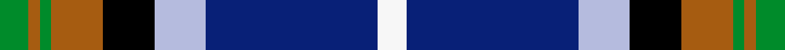
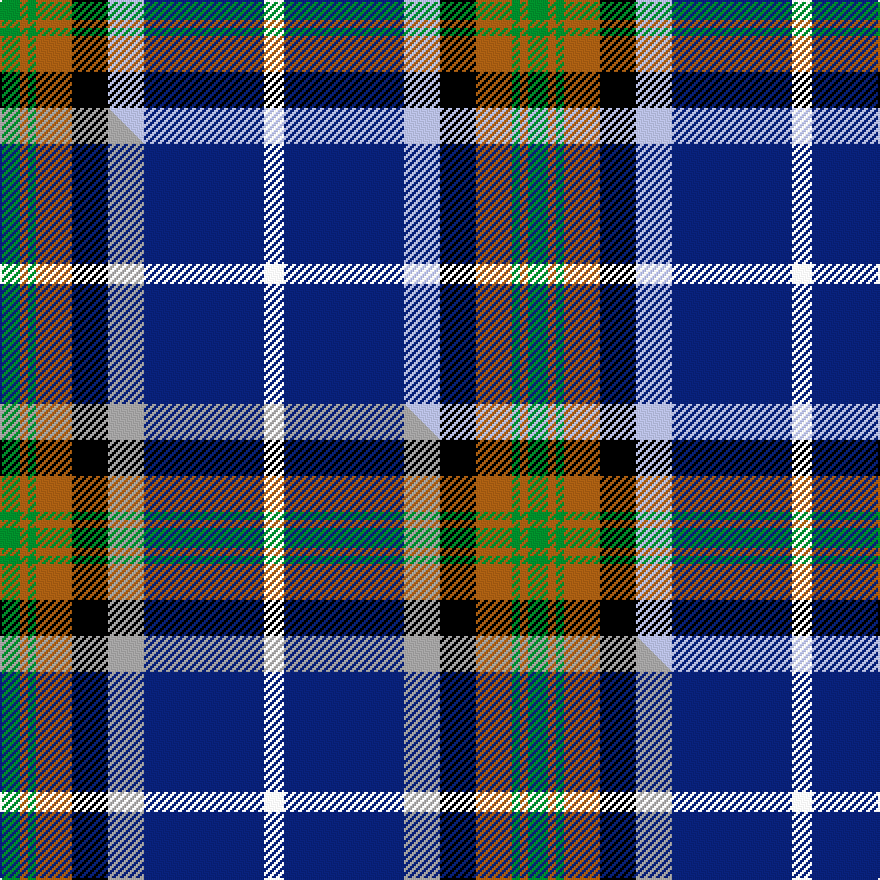

This is one **variant** — a specific cloth: this exact thread count and colourway, with its own
provenance below. It is one weaving of the [sett](/setts/g5o2g2o9k9lb9db30w5/) (the scale-free proportion — the
same cloth at any scale or shade), whose colour order is pattern [GRGRKWBW](/stripes/grgrkwbw/).

Part of the [Alexander of Menstry](/tartans/a/al/alexander-of-menstry/) tartan — the named design grouping this sett with its other cloths.

Sourced from tartans-authority.  It is a [8 stripe tartan](/stripes/stripes8/).

Original link [https://www.tartanregister.gov.uk/tartanDetails.aspx?ref=6713](https://www.tartanregister.gov.uk/tartanDetails.aspx?ref=6713)

Dataset <small>— provenance for this record, inherited from the source manifest</small>

<dl class="dataset-prov">
<dt>source</dt><dd><a href="/sources/tartans-authority/">Scottish Tartans Authority</a></dd>
<dt>data captured from</dt><dd><a href="https://github.com/thetartan/tartan-database/blob/master/data/tartans-authority/data.csv">https://github.com/thetartan/tartan-database/blob/master/data/tartans-authority/data.csv</a></dd>
<dt>data date</dt><dd>2002 <small>(this record)</small></dd>
<dt>licence</dt><dd><a href="https://creativecommons.org/licenses/by-nc-nd/4.0/">CC BY-NC-ND 4.0</a></dd>
</dl>

Capture chain <small>— the hands this data passed through, oldest first; each capture carries its own licence</small>

<ol class="capture-chain">
<li><a href="https://www.tartansauthority.com/">Scottish Tartans Authority</a> <small>the heritage body's archive — its tartan-ferret record browser is retired (links repaired to the SRT, above)</small></li>
<li><a href="https://github.com/thetartan/tartan-database">thetartan/tartan-database</a> <small>2016-2017</small> · <a href="https://creativecommons.org/licenses/by-nc-nd/4.0/">CC BY-NC-ND 4.0</a> <small>Levko Kravets's frozen compilation — the capture we vendored, and where its CC licence text came from</small></li>
<li>this dictionary <small>captured 2026-06-10 · commit 5bf86c7566</small> <small>each re-capture is a git commit to data/sources</small></li>
</ol>

## Register references

External register numbers recorded for this tartan.

- Scottish Tartans Authority (ITI): 6713

## Thread count
G/10 O4 G4 O18 K18 LB18 DB60 W/10

One full sett is **264 threads**.

## Palette
<table><thead><tr><th>Colour</th><th>Shade</th><th>OKLCh</th></tr></thead><tbody><tr><td>DB</td><td><code style="background-color:#082077;">#082077</code> <small style="color:#888">#082077</small></td><td><small style="color:#888">oklch(30.0% 0.149 265.1)</small></td></tr><tr><td>G</td><td><code style="background-color:#008B2A;">#008B2A</code> <small style="color:#888">#008B2A</small></td><td><small style="color:#888">oklch(55.4% 0.170 145.9)</small></td></tr><tr><td>K</td><td><code style="background-color:#000000;">#000000</code> <small style="color:#888">#000000</small></td><td><small style="color:#888">oklch(0.0% 0.000 0.0)</small></td></tr><tr><td>O</td><td><code style="background-color:#A65C11;">#A65C11</code> <small style="color:#888">#A65C11</small></td><td><small style="color:#888">oklch(55.0% 0.125 58.3)</small></td></tr><tr><td>LB</td><td><code style="background-color:#B5BBDE;">#B5BBDE</code> <small style="color:#888">#B5BBDE</small></td><td><small style="color:#888">oklch(79.9% 0.050 277.6)</small></td></tr><tr><td>W</td><td><code style="background-color:#F7F7F7;">#F7F7F7</code> <small style="color:#888">#F7F7F7</small></td><td><small style="color:#888">oklch(97.6% 0.000 89.9)</small></td></tr></tbody></table>

# Sample pattern

## Compared to the master

This cloth is one sett of its design; the master sett (the exemplar the design is anchored on) is below for comparison.

Its **ΔTartan distance** from the master is **0.60** — the same measure the nearest-tartans table ranks by (0 is identical; a re-scale of the same cloth is near 0, a recolour or a different proportion further).

<figure class="master-compare" style="margin:0">

this sett
master sett ★

<figcaption style="color:#888;font-size:smaller">One weave of this sett against the <a href="/setts/g5o2g2o9k9lr9db30w5/">master sett ★</a>, split on the diagonal: a shared proportion runs seamlessly across it with only the shades shifting; a different proportion breaks on it.</figcaption>
</figure>

## Nearest tartan variants

The nearest existing variants by ΔTartan distance, with this cloth at the top so the swatches line up against it.

ΔTartan

Threads

Variant

Sett

—

264

<a href="/variants/s8/g5o2g2o9k9lb9db30w5~x2/">Alexander of Menstry (Personal)</a>

<a href="/ttd/edit/#slug=g5o2g2o9k9lr9db30w5~x2~lr2800000&amp;base=g5o2g2o9k9lb9db30w5~x2" title="compare in the TTD">0.60</a>

264

<a href="/variants/s8/g5o2g2o9k9lr9db30w5~x2~lr2800000/">Alexander of Menstry</a>

<a href="/ttd/edit/#slug=k16w6k4b64m19k8g42y6&amp;base=g5o2g2o9k9lb9db30w5~x2" title="compare in the TTD">1.14</a>

308

<a href="/variants/s8/k16w6k4b64m19k8g42y6/">Unidentified (Woven sample)</a>

<a href="/ttd/edit/#slug=lb26db13k13w2g8k5r3lb3~x2&amp;base=g5o2g2o9k9lb9db30w5~x2" title="compare in the TTD">1.59</a>

234

<a href="/variants/s8/lb26db13k13w2g8k5r3lb3~x2/">Moran (Coilessan) (Personal)</a>

<a href="/ttd/edit/#slug=k6w3k2db30r9k4g20dy3~x2&amp;base=g5o2g2o9k9lb9db30w5~x2" title="compare in the TTD">1.65</a>

290

<a href="/variants/s8/k6w3k2db30r9k4g20dy3~x2/">Minnesota (District)</a>

<a href="/ttd/edit/#slug=w8db50k4r8k6r12g17dp7k4&amp;base=g5o2g2o9k9lb9db30w5~x2" title="compare in the TTD">1.67</a>

220

<a href="/variants/s9/w8db50k4r8k6r12g17dp7k4/">Edinburgh</a>

<a href="/ttd/edit/#slug=k6w3k2db30r9k4g20dy3~x2~g2408144&amp;base=g5o2g2o9k9lb9db30w5~x2" title="compare in the TTD">1.69</a>

290

<a href="/variants/s8/k6w3k2db30r9k4g20dy3~x2~g2408144/">Minnesota American District Tartan</a>

<a href="/ttd/edit/#slug=w3lb26db13k13w2g8k5r3lb3~x2&amp;base=g5o2g2o9k9lb9db30w5~x2" title="compare in the TTD">1.79</a>

292

<a href="/variants/s9/w3lb26db13k13w2g8k5r3lb3~x2/">Moran (Virgin Islands) (Personal)</a>

<a href="/ttd/edit/#slug=dp4k2w3k2db30g9k4w20dy3~x2&amp;base=g5o2g2o9k9lb9db30w5~x2" title="compare in the TTD">1.89</a>

294

<a href="/variants/s9/dp4k2w3k2db30g9k4w20dy3~x2/">Minnesota Dress</a>

<a href="/ttd/edit/#slug=r2k1y2g3y4g3db12k1w2~x4&amp;base=g5o2g2o9k9lb9db30w5~x2" title="compare in the TTD">1.95</a>

224

<a href="/variants/s9/r2k1y2g3y4g3db12k1w2~x4/">Federated Women's Institutes of</a>

<a href="/ttd/edit/#slug=dp4k2w3k2db30g9k4w20dy3~x2~g2408144&amp;base=g5o2g2o9k9lb9db30w5~x2" title="compare in the TTD">1.96</a>

294

<a href="/variants/s9/dp4k2w3k2db30g9k4w20dy3~x2~g2408144/">Minnesota Dress American District Tartan</a>

## Neighbour map

Every grey dot is one of 13656 variants placed by the first two principal components of the ΔTartan feature space (42% of its variance). Red is this tartan; blue dots are its nearest — click one to open its page. The map is a flat projection of a many-dimensional space — [how to read it](/posts/neighbourhood-maps/).

<svg viewBox="0 0 640 380" role="img" style="max-width:100%;height:auto;border:1px solid #e0e0e0;border-radius:4px;display:block" xmlns="http://www.w3.org/2000/svg"><image href="/nn/cloud.v1.png" width="640" height="380"/><a href="/variants/s8/g5o2g2o9k9lr9db30w5~x2~lr2800000/"><circle cx="134.8" cy="128.8" r="4" fill="#3465a4"><title>Alexander of Menstry</title></circle></a><a href="/variants/s8/k16w6k4b64m19k8g42y6/"><circle cx="134.9" cy="128.2" r="4" fill="#3465a4"><title>Unidentified (Woven sample)</title></circle></a><a href="/variants/s8/lb26db13k13w2g8k5r3lb3~x2/"><circle cx="106.1" cy="140.8" r="4" fill="#3465a4"><title>Moran (Coilessan) (Personal)</title></circle></a><a href="/variants/s8/k6w3k2db30r9k4g20dy3~x2/"><circle cx="134.1" cy="129.1" r="4" fill="#3465a4"><title>Minnesota (District)</title></circle></a><a href="/variants/s9/w8db50k4r8k6r12g17dp7k4/"><circle cx="141.0" cy="119.8" r="4" fill="#3465a4"><title>Edinburgh</title></circle></a><a href="/variants/s8/k6w3k2db30r9k4g20dy3~x2~g2408144/"><circle cx="128.7" cy="127.6" r="4" fill="#3465a4"><title>Minnesota American District Tartan</title></circle></a><a href="/variants/s9/w3lb26db13k13w2g8k5r3lb3~x2/"><circle cx="95.0" cy="132.6" r="4" fill="#3465a4"><title>Moran (Virgin Islands) (Personal)</title></circle></a><a href="/variants/s9/dp4k2w3k2db30g9k4w20dy3~x2/"><circle cx="123.0" cy="113.8" r="4" fill="#3465a4"><title>Minnesota Dress</title></circle></a><a href="/variants/s9/r2k1y2g3y4g3db12k1w2~x4/"><circle cx="130.2" cy="137.6" r="4" fill="#3465a4"><title>Federated Women's Institutes of</title></circle></a><a href="/variants/s9/dp4k2w3k2db30g9k4w20dy3~x2~g2408144/"><circle cx="122.4" cy="113.8" r="4" fill="#3465a4"><title>Minnesota Dress American District Tartan</title></circle></a><circle cx="130.5" cy="127.4" r="5" fill="#c00000"/><text x="320" y="376" text-anchor="middle" font-size="11" fill="#999">ground</text><text x="11" y="190" text-anchor="middle" font-size="11" fill="#999" transform="rotate(-90 11 190)">complexity</text></svg>

ID: /variants/s8/g5o2g2o9k9lb9db30w5~x2/
