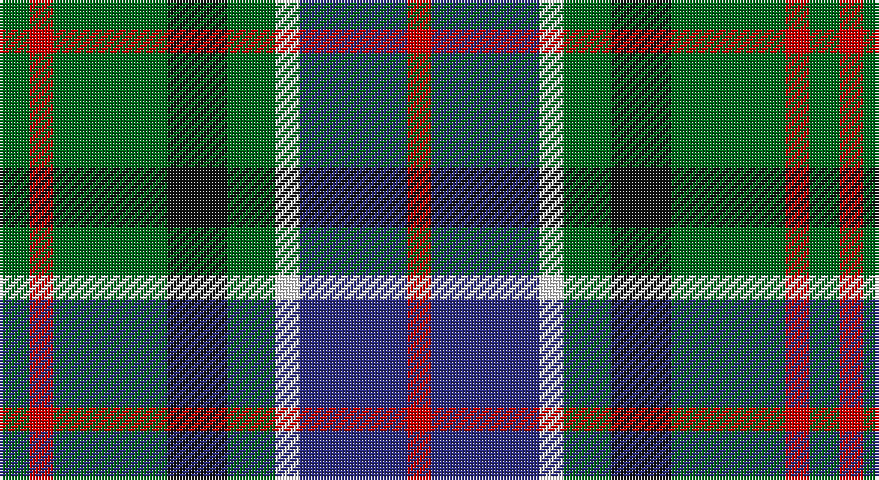

This page is one **sett** — a single exact thread-count. It belongs to the [tartan](/setts/g5r4g19k10g8w4db18r4/)
(the same proportion at any scale), whose colour order is pattern [GRGKGWBR](/stripes/grgkgwbr/).

Sourced from tartans-authority.  It is a [8 stripe tartan](/stripes/stripes8/).

Original link http://www.tartansauthority.com/tartan-ferret/display/6050/

## Register references

External register numbers recorded for this tartan.

- Scottish Tartans Authority (ITI): 6050

## Thread count
G/10 R8 G38 K20 G16 W8 DB36 R/8

One full sett is **270 threads**.

## Palette

Palette: <strong>Tartan Register</strong>
<table><thead><tr><th>Colour</th><th>Threads</th><th>Shade</th><th>Base</th><th>OKLCh</th></tr></thead><tbody><tr><td>G/</td><td style="text-align:right;font-variant-numeric:tabular-nums">10</td><td><code style="background-color:#006818;">#006818</code> <small style="color:#888">#006818</small></td><td>G <code style="background-color:#006100;">#006100</code></td><td><small style="color:#888">oklch(45.0% 0.142 145.0)</small></td></tr><tr><td>R</td><td style="text-align:right;font-variant-numeric:tabular-nums">8</td><td><code style="background-color:#C80000;">#C80000</code> <small style="color:#888">#C80000</small></td><td>R <code style="background-color:#CC0000;">#CC0000</code></td><td><small style="color:#888">oklch(52.3% 0.215 29.2)</small></td></tr><tr><td>G</td><td style="text-align:right;font-variant-numeric:tabular-nums">38</td><td><code style="background-color:#006818;">#006818</code> <small style="color:#888">#006818</small></td><td>G <code style="background-color:#006100;">#006100</code></td><td><small style="color:#888">oklch(45.0% 0.142 145.0)</small></td></tr><tr><td>K</td><td style="text-align:right;font-variant-numeric:tabular-nums">20</td><td><code style="background-color:#101010;">#101010</code> <small style="color:#888">#101010</small></td><td>K <code style="background-color:#000000;">#000000</code></td><td><small style="color:#888">oklch(17.3% 0.000 89.9)</small></td></tr><tr><td>G</td><td style="text-align:right;font-variant-numeric:tabular-nums">16</td><td><code style="background-color:#006818;">#006818</code> <small style="color:#888">#006818</small></td><td>G <code style="background-color:#006100;">#006100</code></td><td><small style="color:#888">oklch(45.0% 0.142 145.0)</small></td></tr><tr><td>W</td><td style="text-align:right;font-variant-numeric:tabular-nums">8</td><td><code style="background-color:#FCFCFC;">#FCFCFC</code> <small style="color:#888">#FCFCFC</small></td><td>W <code style="background-color:#F7F7F7;">#F7F7F7</code></td><td><small style="color:#888">oklch(99.1% 0.000 89.9)</small></td></tr><tr><td>DB</td><td style="text-align:right;font-variant-numeric:tabular-nums">36</td><td><code style="background-color:#2C2C80;">#2C2C80</code> <small style="color:#888">#2C2C80</small></td><td>B <code style="background-color:#2A418A;">#2A418A</code></td><td><small style="color:#888">oklch(35.0% 0.138 276.6)</small></td></tr><tr><td>R/</td><td style="text-align:right;font-variant-numeric:tabular-nums">8</td><td><code style="background-color:#C80000;">#C80000</code> <small style="color:#888">#C80000</small></td><td>R <code style="background-color:#CC0000;">#CC0000</code></td><td><small style="color:#888">oklch(52.3% 0.215 29.2)</small></td></tr></tbody></table>

# Sample pattern

## Nearest tartans

The nearest existing variants by ΔTartan distance, with this tartan at the top so the swatches line up against it.

ΔTartan

Tartan

Sett

—

<a href="/ttd/edit/#slug=g5r4g19k10g8w4db18r4~x2">CSCA (Corporate)</a> <a class="nn-out" href="/variants/s8/g5r4g19k10g8w4db18r4~x2/" title="open its dictionary page">↗</a>

0.93

<a href="/ttd/edit/#slug=r1k2g4k1g1k2db3k1w1~x6&amp;base=g5r4g19k10g8w4db18r4~x2">MacKean Dress (Personal)</a> <a class="nn-out" href="/variants/s9/r1k2g4k1g1k2db3k1w1~x6/" title="open its dictionary page">↗</a>

0.95

<a href="/ttd/edit/#slug=k20w3t20k3r3dg20r10w3k20~x2&amp;base=g5r4g19k10g8w4db18r4~x2">Soutar (Name)</a> <a class="nn-out" href="/variants/s9/k20w3t20k3r3dg20r10w3k20~x2/" title="open its dictionary page">↗</a>

0.97

<a href="/variants/s10/k3r1g5k3w1dp3~x2/">Wilson's No.194</a>

1.01

<a href="/ttd/edit/#slug=r2k8lo1k8g8t8r2~x4&amp;base=g5r4g19k10g8w4db18r4~x2">Brodie Hunting</a> <a class="nn-out" href="/variants/s7/r2k8lo1k8g8t8r2~x4/" title="open its dictionary page">↗</a>

1.01

<a href="/ttd/edit/#slug=dg3db8dg3k4dg9ly2db2ly2r2~x2&amp;base=g5r4g19k10g8w4db18r4~x2">Maitland</a> <a class="nn-out" href="/variants/s9/dg3db8dg3k4dg9ly2db2ly2r2~x2/" title="open its dictionary page">↗</a>

1.01

<a href="/ttd/edit/#slug=dg3db8dg3k4dg9ly2db2ly2r2&amp;base=g5r4g19k10g8w4db18r4~x2">Maitland</a> <a class="nn-out" href="/variants/s9/dg3db8dg3k4dg9ly2db2ly2r2/" title="open its dictionary page">↗</a>

1.03

<a href="/ttd/edit/#slug=k22g21k5g12t12o3w4~x2&amp;base=g5r4g19k10g8w4db18r4~x2">Disciples of Christ Motorcycle Ministry (Switzerland)</a> <a class="nn-out" href="/variants/s7/k22g21k5g12t12o3w4~x2/" title="open its dictionary page">↗</a>

1.05

<a href="/variants/s8/k8t3g13dp12ly2~x2/">Wilson's No.176</a>

1.06

<a href="/ttd/edit/#slug=dg24k4dg6r4dg6k19dt22w5~x2&amp;base=g5r4g19k10g8w4db18r4~x2">MacRae Hunting</a> <a class="nn-out" href="/variants/s8/dg24k4dg6r4dg6k19dt22w5~x2/" title="open its dictionary page">↗</a>

1.07

<a href="/ttd/edit/#slug=g14dp11y3k5y3dp11g14ly2~x2&amp;base=g5r4g19k10g8w4db18r4~x2">Wilson's No.124</a> <a class="nn-out" href="/variants/s8/g14dp11y3k5y3dp11g14ly2~x2/" title="open its dictionary page">↗</a>

## Neighbour map

Every grey dot is one of 14360 variants placed by the first two principal components of the ΔTartan feature space (44% of its variance). Red is this tartan; blue dots are its nearest — click one to open its page.

<svg viewBox="0 0 640 380" role="img" style="max-width:100%;height:auto;border:1px solid #e0e0e0;border-radius:4px;display:block" xmlns="http://www.w3.org/2000/svg"><image href="/nn/cloud.v1.png" width="640" height="380"/><a href="/variants/s9/r1k2g4k1g1k2db3k1w1~x6/"><circle cx="100.2" cy="238.0" r="4" fill="#3465a4"><title>MacKean Dress (Personal)</title></circle></a><a href="/variants/s9/k20w3t20k3r3dg20r10w3k20~x2/"><circle cx="134.6" cy="196.7" r="4" fill="#3465a4"><title>Soutar (Name)</title></circle></a><a href="/variants/s10/k3r1g5k3w1dp3~x2/"><circle cx="108.9" cy="221.8" r="4" fill="#3465a4"><title>Wilson's No.194</title></circle></a><a href="/variants/s7/r2k8lo1k8g8t8r2~x4/"><circle cx="155.3" cy="219.1" r="4" fill="#3465a4"><title>Brodie Hunting</title></circle></a><a href="/variants/s9/dg3db8dg3k4dg9ly2db2ly2r2~x2/"><circle cx="134.5" cy="230.0" r="4" fill="#3465a4"><title>Maitland</title></circle></a><a href="/variants/s9/dg3db8dg3k4dg9ly2db2ly2r2/"><circle cx="134.5" cy="230.0" r="4" fill="#3465a4"><title>Maitland</title></circle></a><a href="/variants/s7/k22g21k5g12t12o3w4~x2/"><circle cx="156.0" cy="222.3" r="4" fill="#3465a4"><title>Disciples of Christ Motorcycle Ministry (Switzerland)</title></circle></a><a href="/variants/s8/k8t3g13dp12ly2~x2/"><circle cx="150.3" cy="234.7" r="4" fill="#3465a4"><title>Wilson's No.176</title></circle></a><a href="/variants/s8/dg24k4dg6r4dg6k19dt22w5~x2/"><circle cx="156.9" cy="222.3" r="4" fill="#3465a4"><title>MacRae Hunting</title></circle></a><a href="/variants/s8/g14dp11y3k5y3dp11g14ly2~x2/"><circle cx="184.5" cy="221.6" r="4" fill="#3465a4"><title>Wilson's No.124</title></circle></a><circle cx="140.7" cy="226.0" r="5" fill="#c00000"/></svg>

ID: /variants/s8/g5r4g19k10g8w4db18r4~x2/
