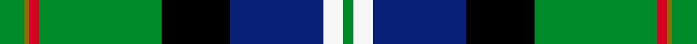
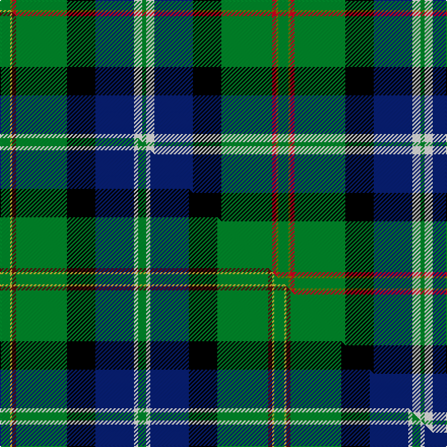

This page is one **sett** — a single exact thread-count. It belongs to the [tartan](/setts/g5y1r2g25k14db19w4g2/)
(the same proportion at any scale), whose colour order is pattern [GGRGKBWG](/stripes/ggrgkbwg/).

Part of the [Tooth](/tartans/tooth/) tartan — the named design grouping this sett with its other cloths.

Sourced from weddslist.  It is a [8 stripe tartan](/stripes/stripes8/).

Original link http://www.weddslist.com/cgi-bin/tartans/pg.pl?source=sts

## Provenance

Earliest known date: 1980 STS collection.

2 attestations — the source records this cloth was collapsed from (oldest owns this page)

<ul>
<li>undated — Tooth (weddslist, <a href="http://www.weddslist.com/cgi-bin/tartans/pg.pl?source=sts">record</a>) </li>
<li>undated — Tooth Family Tartan (house-of-tartan, <a href="http://www.house-of-tartan.scotland.net/house/TartanViewjs.asp?colr=Def&tnam=922">record</a>) </li>
</ul>

## Thread count
G/10 Y2 R4 G50 K28 DB38 W8 G/4

One full sett is **274 threads**.

## Palette
<table><thead><tr><th>Colour</th><th>Shade</th><th>OKLCh</th></tr></thead><tbody><tr><td>DB</td><td><code style="background-color:#082077;">#082077</code> <small style="color:#888">#082077</small></td><td><small style="color:#888">oklch(30.0% 0.149 265.1)</small></td></tr><tr><td>G</td><td><code style="background-color:#008B2A;">#008B2A</code> <small style="color:#888">#008B2A</small></td><td><small style="color:#888">oklch(55.4% 0.170 145.9)</small></td></tr><tr><td>K</td><td><code style="background-color:#000000;">#000000</code> <small style="color:#888">#000000</small></td><td><small style="color:#888">oklch(0.0% 0.000 0.0)</small></td></tr><tr><td>W</td><td><code style="background-color:#F7F7F7;">#F7F7F7</code> <small style="color:#888">#F7F7F7</small></td><td><small style="color:#888">oklch(97.6% 0.000 89.9)</small></td></tr><tr><td>R</td><td><code style="background-color:#D60020;">#D60020</code> <small style="color:#888">#D60020</small></td><td><small style="color:#888">oklch(55.2% 0.224 25.5)</small></td></tr><tr><td>Y</td><td><code style="background-color:#8B6E00;">#8B6E00</code> <small style="color:#888">#8B6E00</small></td><td><small style="color:#888">oklch(55.1% 0.113 90.4)</small></td></tr></tbody></table>

# Sample pattern

## Compared to the master

This cloth is one sett of its design; the master sett (the exemplar the design is anchored on) is below for comparison.

Its **ΔTartan distance** from the master is **0.39** — the same measure the nearest-tartans table ranks by (0 is identical; a re-scale of the same cloth is near 0, a recolour or a different proportion further).

<figure class="master-compare" style="margin:0">

this sett
master sett ★

<figcaption style="color:#888;font-size:smaller">One weave of this sett against the <a href="/setts/g5ly1dr2g25k14db19w2g4/">master sett ★</a>, split on the diagonal: a shared proportion runs seamlessly across it with only the shades shifting; a different proportion breaks on it.</figcaption>
</figure>

## Nearest variants

The nearest existing variants by ΔTartan distance, with this cloth at the top so the swatches line up against it.

ΔTartan

Threads

Variant

Sett

—

274

<a href="/variants/s8/g5y1r2g25k14db19w4g2~x2/">Tooth</a>

<a href="/ttd/edit/#slug=g5ly1dr2g25k14db19w2g4~x2&amp;base=g5y1r2g25k14db19w4g2~x2" title="compare in the TTD">0.11</a>

270

<a href="/variants/s8/g5ly1dr2g25k14db19w2g4~x2/">Tooth (Personal)</a>

<a href="/ttd/edit/#slug=w4k1db16k1g32dr6k6lo6g4lo2g1~x2&amp;base=g5y1r2g25k14db19w4g2~x2" title="compare in the TTD">1.86</a>

306

<a href="/variants/s11/w4k1db16k1g32dr6k6lo6g4lo2g1~x2/">Zambia</a>

<a href="/ttd/edit/#slug=g30dp5db32k32g36lg2y5~g2208144-lg3105139&amp;base=g5y1r2g25k14db19w4g2~x2" title="compare in the TTD">2.02</a>

249

<a href="/variants/s7/g30dp5db32k32g36lg2y5~g2208144-lg3105139/">Camelot (Corporate)</a>

<a href="/ttd/edit/#slug=t24k8g8r2g8k1w2~x2&amp;base=g5y1r2g25k14db19w4g2~x2" title="compare in the TTD">2.19</a>

160

<a href="/variants/s7/t24k8g8r2g8k1w2~x2/">Ferguson of Atholl Clan</a>

<a href="/ttd/edit/#slug=r2db16w1k16g30r1g2~x2&amp;base=g5y1r2g25k14db19w4g2~x2" title="compare in the TTD">2.26</a>

264

<a href="/variants/s7/r2db16w1k16g30r1g2~x2/">Sinclair Hunting (VS)</a>

<a href="/ttd/edit/#slug=g22y2g4dp3g4k20db20k1w3~x2&amp;base=g5y1r2g25k14db19w4g2~x2" title="compare in the TTD">2.49</a>

266

<a href="/variants/s9/g22y2g4dp3g4k20db20k1w3~x2/">National Wedding</a>

<a href="/ttd/edit/#slug=g32w2g2y3g2w2g2k16lb2db16w3~x2&amp;base=g5y1r2g25k14db19w4g2~x2" title="compare in the TTD">2.66</a>

258

<a href="/variants/s11/g32w2g2y3g2w2g2k16lb2db16w3~x2/">MacKellar</a>

2.79

—

<a href="/variants/s7/dbi5w3r12g37k12db21w2~x2~dbi1406275-db1204274/">Bergen Scottish</a>

## Neighbour map

Every grey dot is one of 13620 variants placed by the first two principal components of the ΔTartan feature space (42% of its variance). Red is this tartan; blue dots are its nearest — click one to open its page.

<svg viewBox="0 0 640 380" role="img" style="max-width:100%;height:auto;border:1px solid #e0e0e0;border-radius:4px;display:block" xmlns="http://www.w3.org/2000/svg"><image href="/nn/cloud.v1.png" width="640" height="380"/><a href="/variants/s8/g5ly1dr2g25k14db19w2g4~x2/"><circle cx="195.2" cy="117.4" r="4" fill="#3465a4"><title>Tooth (Personal)</title></circle></a><a href="/variants/s11/w4k1db16k1g32dr6k6lo6g4lo2g1~x2/"><circle cx="194.0" cy="76.4" r="4" fill="#3465a4"><title>Zambia</title></circle></a><a href="/variants/s7/g30dp5db32k32g36lg2y5~g2208144-lg3105139/"><circle cx="168.1" cy="157.6" r="4" fill="#3465a4"><title>Camelot (Corporate)</title></circle></a><a href="/variants/s7/t24k8g8r2g8k1w2~x2/"><circle cx="214.4" cy="140.5" r="4" fill="#3465a4"><title>Ferguson of Atholl Clan</title></circle></a><a href="/variants/s7/r2db16w1k16g30r1g2~x2/"><circle cx="225.8" cy="118.2" r="4" fill="#3465a4"><title>Sinclair Hunting (VS)</title></circle></a><a href="/variants/s9/g22y2g4dp3g4k20db20k1w3~x2/"><circle cx="142.3" cy="115.6" r="4" fill="#3465a4"><title>National Wedding</title></circle></a><a href="/variants/s11/g32w2g2y3g2w2g2k16lb2db16w3~x2/"><circle cx="167.9" cy="99.4" r="4" fill="#3465a4"><title>MacKellar</title></circle></a><a href="/variants/s7/dbi5w3r12g37k12db21w2~x2~dbi1406275-db1204274/"><circle cx="138.9" cy="137.0" r="4" fill="#3465a4"><title>Bergen Scottish</title></circle></a><circle cx="173.4" cy="115.1" r="5" fill="#c00000"/><text x="320" y="376" text-anchor="middle" font-size="11" fill="#999">ground</text><text x="11" y="190" text-anchor="middle" font-size="11" fill="#999" transform="rotate(-90 11 190)">complexity</text></svg>

ID: /variants/s8/g5y1r2g25k14db19w4g2~x2/
