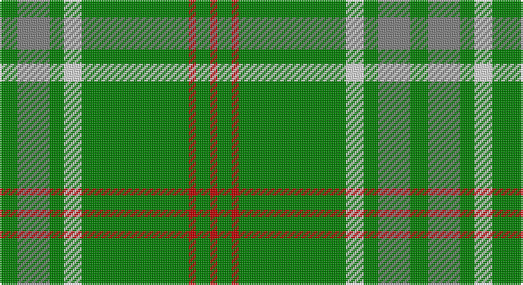

This page is one **sett** — a single exact thread-count. It belongs to the [tartan](/setts/g5y9g4w5g30r2g4r2/)
(the same proportion at any scale), whose colour order is pattern [GGGWGRGR](/stripes/gggwgrgr/).

Sourced from weddslist.  It is a [8 stripe tartan](/stripes/stripes8/).

Original link http://www.weddslist.com/cgi-bin/tartans/pg.pl?source=sts

## Thread count
G/10 N18 G8 LN10 G60 R4 G8 R/4

One full sett is **230 threads**.

## Palette

Palette: <strong>Tartan Register</strong> <small style="color:#888">(2 of 4 colours)</small>
<table><thead><tr><th>Colour</th><th>Threads</th><th>Shade</th><th>Base</th><th>OKLCh</th></tr></thead><tbody><tr><td>G/</td><td style="text-align:right;font-variant-numeric:tabular-nums">10</td><td><code style="background-color:#008000;">#008000</code> <small style="color:#888">#008000</small></td><td>G <code style="background-color:#006100;">#006100</code></td><td><small style="color:#888">oklch(52.0% 0.177 142.5)</small></td></tr><tr><td>N</td><td style="text-align:right;font-variant-numeric:tabular-nums">18</td><td><code style="background-color:#808080;">#808080</code> <small style="color:#888">#808080</small></td><td>G <code style="background-color:#006100;">#006100</code></td><td><small style="color:#888">oklch(60.0% 0.000 89.9)</small></td></tr><tr><td>G</td><td style="text-align:right;font-variant-numeric:tabular-nums">8</td><td><code style="background-color:#008000;">#008000</code> <small style="color:#888">#008000</small></td><td>G <code style="background-color:#006100;">#006100</code></td><td><small style="color:#888">oklch(52.0% 0.177 142.5)</small></td></tr><tr><td>LN</td><td style="text-align:right;font-variant-numeric:tabular-nums">10</td><td><code style="background-color:#E0E0E0;">#E0E0E0</code> <small style="color:#888">#E0E0E0</small></td><td>W <code style="background-color:#F7F7F7;">#F7F7F7</code></td><td><small style="color:#888">oklch(90.7% 0.000 89.9)</small></td></tr><tr><td>G</td><td style="text-align:right;font-variant-numeric:tabular-nums">60</td><td><code style="background-color:#008000;">#008000</code> <small style="color:#888">#008000</small></td><td>G <code style="background-color:#006100;">#006100</code></td><td><small style="color:#888">oklch(52.0% 0.177 142.5)</small></td></tr><tr><td>R</td><td style="text-align:right;font-variant-numeric:tabular-nums">4</td><td><code style="background-color:#C00000;">#C00000</code> <small style="color:#888">#C00000</small></td><td>R <code style="background-color:#CC0000;">#CC0000</code></td><td><small style="color:#888">oklch(50.7% 0.208 29.2)</small></td></tr><tr><td>G</td><td style="text-align:right;font-variant-numeric:tabular-nums">8</td><td><code style="background-color:#008000;">#008000</code> <small style="color:#888">#008000</small></td><td>G <code style="background-color:#006100;">#006100</code></td><td><small style="color:#888">oklch(52.0% 0.177 142.5)</small></td></tr><tr><td>R/</td><td style="text-align:right;font-variant-numeric:tabular-nums">4</td><td><code style="background-color:#C00000;">#C00000</code> <small style="color:#888">#C00000</small></td><td>R <code style="background-color:#CC0000;">#CC0000</code></td><td><small style="color:#888">oklch(50.7% 0.208 29.2)</small></td></tr></tbody></table>

# Sample pattern

## Nearest tartans

The nearest existing variants by ΔTartan distance, with this tartan at the top so the swatches line up against it.

ΔTartan

Tartan

Sett

—

<a href="/ttd/edit/#slug=g5y9g4w5g30r2g4r2~x2">Welsh Assembly</a> <a class="nn-out" href="/variants/s8/g5y9g4w5g30r2g4r2~x2/" title="open its dictionary page">↗</a>

0.63

<a href="/ttd/edit/#slug=g18r6g75b6g13dy35g12b6&amp;base=g5y9g4w5g30r2g4r2~x2">Glenlivet</a> <a class="nn-out" href="/variants/s8/g18r6g75b6g13dy35g12b6/" title="open its dictionary page">↗</a>

0.78

<a href="/ttd/edit/#slug=g5o9g4w5g30r2g4r2~x2&amp;base=g5y9g4w5g30r2g4r2~x2">Welsh Assembly (Fashion)</a> <a class="nn-out" href="/variants/s8/g5o9g4w5g30r2g4r2~x2/" title="open its dictionary page">↗</a>

1.28

<a href="/ttd/edit/#slug=g30t8g5lb4g5r2~x4&amp;base=g5y9g4w5g30r2g4r2~x2">Annapolis Valley</a> <a class="nn-out" href="/variants/s6/g30t8g5lb4g5r2~x4/" title="open its dictionary page">↗</a>

1.32

<a href="/ttd/edit/#slug=dg5r3dg3lo2dg1ly8dg24lo2~x2&amp;base=g5y9g4w5g30r2g4r2~x2">St. Christopher (Corporate)</a> <a class="nn-out" href="/variants/s8/dg5r3dg3lo2dg1ly8dg24lo2~x2/" title="open its dictionary page">↗</a>

1.37

<a href="/ttd/edit/#slug=o9g4w5g30r2g4r2g4r2g30w5g4o9g5~x2&amp;base=g5y9g4w5g30r2g4r2~x2">Welsh Assembly</a> <a class="nn-out" href="/variants/s14/o9g4w5g30r2g4r2g4r2g30w5g4o9g5~x2/" title="open its dictionary page">↗</a>

1.42

<a href="/ttd/edit/#slug=gi6g3gi3g4gi4k5gi3k5gi28r2gi4r2~x2&amp;base=g5y9g4w5g30r2g4r2~x2">Ross Hunting Clan Tartan</a> <a class="nn-out" href="/variants/s12/gi6g3gi3g4gi4k5gi3k5gi28r2gi4r2~x2/" title="open its dictionary page">↗</a>

1.49

<a href="/ttd/edit/#slug=g14w1db2r1g1r1db2w1g4ly1~x4&amp;base=g5y9g4w5g30r2g4r2~x2">Seattle</a> <a class="nn-out" href="/variants/s10/g14w1db2r1g1r1db2w1g4ly1~x4/" title="open its dictionary page">↗</a>

1.50

<a href="/ttd/edit/#slug=r3g22db16g14r2g6ly1~x2&amp;base=g5y9g4w5g30r2g4r2~x2">Scottish Scouts</a> <a class="nn-out" href="/variants/s7/r3g22db16g14r2g6ly1~x2/" title="open its dictionary page">↗</a>

1.50

<a href="/ttd/edit/#slug=db1r3g11r2db5g11ly1~x2&amp;base=g5y9g4w5g30r2g4r2~x2">MacKintosh, hunting</a> <a class="nn-out" href="/variants/s7/db1r3g11r2db5g11ly1~x2/" title="open its dictionary page">↗</a>

1.61

<a href="/ttd/edit/#slug=g3r1g2db1g3r3g2r2g18r2~x2&amp;base=g5y9g4w5g30r2g4r2~x2">Owen (Welsh Name)</a> <a class="nn-out" href="/variants/s10/g3r1g2db1g3r3g2r2g18r2~x2/" title="open its dictionary page">↗</a>

## Neighbour map

Every grey dot is one of 14360 variants placed by the first two principal components of the ΔTartan feature space (44% of its variance). Red is this tartan; blue dots are its nearest — click one to open its page.

<svg viewBox="0 0 640 380" role="img" style="max-width:100%;height:auto;border:1px solid #e0e0e0;border-radius:4px;display:block" xmlns="http://www.w3.org/2000/svg"><image href="/nn/cloud.v1.png" width="640" height="380"/><a href="/variants/s8/g18r6g75b6g13dy35g12b6/"><circle cx="418.6" cy="200.2" r="4" fill="#3465a4"><title>Glenlivet</title></circle></a><a href="/variants/s8/g5o9g4w5g30r2g4r2~x2/"><circle cx="433.2" cy="182.1" r="4" fill="#3465a4"><title>Welsh Assembly (Fashion)</title></circle></a><a href="/variants/s6/g30t8g5lb4g5r2~x4/"><circle cx="477.5" cy="213.2" r="4" fill="#3465a4"><title>Annapolis Valley</title></circle></a><a href="/variants/s8/dg5r3dg3lo2dg1ly8dg24lo2~x2/"><circle cx="441.4" cy="158.5" r="4" fill="#3465a4"><title>St. Christopher (Corporate)</title></circle></a><a href="/variants/s14/o9g4w5g30r2g4r2g4r2g30w5g4o9g5~x2/"><circle cx="419.7" cy="160.8" r="4" fill="#3465a4"><title>Welsh Assembly</title></circle></a><a href="/variants/s12/gi6g3gi3g4gi4k5gi3k5gi28r2gi4r2~x2/"><circle cx="435.3" cy="180.0" r="4" fill="#3465a4"><title>Ross Hunting Clan Tartan</title></circle></a><a href="/variants/s10/g14w1db2r1g1r1db2w1g4ly1~x4/"><circle cx="383.3" cy="138.9" r="4" fill="#3465a4"><title>Seattle</title></circle></a><a href="/variants/s7/r3g22db16g14r2g6ly1~x2/"><circle cx="407.9" cy="202.5" r="4" fill="#3465a4"><title>Scottish Scouts</title></circle></a><a href="/variants/s7/db1r3g11r2db5g11ly1~x2/"><circle cx="364.5" cy="217.9" r="4" fill="#3465a4"><title>MacKintosh, hunting</title></circle></a><a href="/variants/s10/g3r1g2db1g3r3g2r2g18r2~x2/"><circle cx="513.4" cy="169.9" r="4" fill="#3465a4"><title>Owen (Welsh Name)</title></circle></a><circle cx="441.2" cy="186.9" r="5" fill="#c00000"/></svg>

ID: /variants/s8/g5y9g4w5g30r2g4r2~x2/
