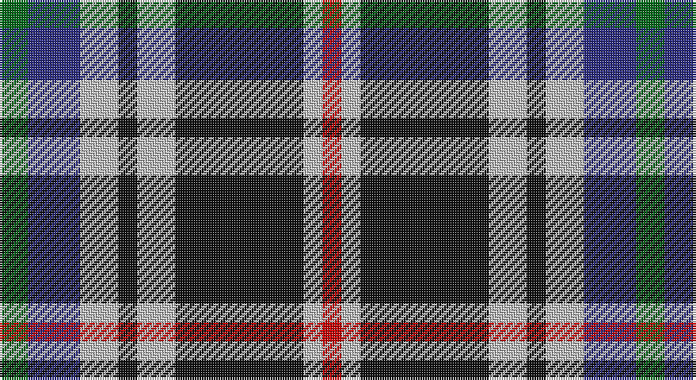

This page is one **sett** — a single exact thread-count. It belongs to the [tartan](/setts/g6db11lb8k4lb8k27lb4r4/)
(the same proportion at any scale), whose colour order is pattern [GBWKWKWR](/stripes/gbwkwkwr/).

Part of the [Kervegant, Suzanne](/tartans/kervegant-suzanne/) tartan — the named design grouping this sett with its other cloths.

Sourced from tartans-authority.  It is a [8 stripe tartan](/stripes/stripes8/).

Original link http://www.tartansauthority.com/tartan-ferret/display/11269/

## Register references

External register numbers recorded for this tartan.

- Scottish Register of Tartans: [11269](https://www.tartanregister.gov.uk/tartanDetails?ref=11269)
- Scottish Tartans Authority (ITI): 11269

## Thread count
G/12 DB22 N16 K8 N16 K54 N8 R/8

One full sett is **268 threads**.

## Palette

Palette: <strong>Tartan Register</strong>
<table><thead><tr><th>Colour</th><th>Threads</th><th>Shade</th><th>Base</th><th>OKLCh</th></tr></thead><tbody><tr><td>G/</td><td style="text-align:right;font-variant-numeric:tabular-nums">12</td><td><code style="background-color:#006818;">#006818</code> <small style="color:#888">#006818</small></td><td>G <code style="background-color:#006100;">#006100</code></td><td><small style="color:#888">oklch(45.0% 0.142 145.0)</small></td></tr><tr><td>DB</td><td style="text-align:right;font-variant-numeric:tabular-nums">22</td><td><code style="background-color:#2C2C80;">#2C2C80</code> <small style="color:#888">#2C2C80</small></td><td>B <code style="background-color:#2A418A;">#2A418A</code></td><td><small style="color:#888">oklch(35.0% 0.138 276.6)</small></td></tr><tr><td>N</td><td style="text-align:right;font-variant-numeric:tabular-nums">16</td><td><code style="background-color:#C0C0C0;">#C0C0C0</code> <small style="color:#888">#C0C0C0</small></td><td>W <code style="background-color:#F7F7F7;">#F7F7F7</code></td><td><small style="color:#888">oklch(80.8% 0.000 89.9)</small></td></tr><tr><td>K</td><td style="text-align:right;font-variant-numeric:tabular-nums">8</td><td><code style="background-color:#101010;">#101010</code> <small style="color:#888">#101010</small></td><td>K <code style="background-color:#000000;">#000000</code></td><td><small style="color:#888">oklch(17.3% 0.000 89.9)</small></td></tr><tr><td>N</td><td style="text-align:right;font-variant-numeric:tabular-nums">16</td><td><code style="background-color:#C0C0C0;">#C0C0C0</code> <small style="color:#888">#C0C0C0</small></td><td>W <code style="background-color:#F7F7F7;">#F7F7F7</code></td><td><small style="color:#888">oklch(80.8% 0.000 89.9)</small></td></tr><tr><td>K</td><td style="text-align:right;font-variant-numeric:tabular-nums">54</td><td><code style="background-color:#101010;">#101010</code> <small style="color:#888">#101010</small></td><td>K <code style="background-color:#000000;">#000000</code></td><td><small style="color:#888">oklch(17.3% 0.000 89.9)</small></td></tr><tr><td>N</td><td style="text-align:right;font-variant-numeric:tabular-nums">8</td><td><code style="background-color:#C0C0C0;">#C0C0C0</code> <small style="color:#888">#C0C0C0</small></td><td>W <code style="background-color:#F7F7F7;">#F7F7F7</code></td><td><small style="color:#888">oklch(80.8% 0.000 89.9)</small></td></tr><tr><td>R/</td><td style="text-align:right;font-variant-numeric:tabular-nums">8</td><td><code style="background-color:#C80000;">#C80000</code> <small style="color:#888">#C80000</small></td><td>R <code style="background-color:#CC0000;">#CC0000</code></td><td><small style="color:#888">oklch(52.3% 0.215 29.2)</small></td></tr></tbody></table>

# Sample pattern

## Compared to the master

This cloth is one sett of its design; the master sett (the exemplar the design is anchored on) is below for comparison.

<figure style="margin:0"><figcaption style="color:#888;font-size:smaller">this sett</figcaption></figure>
<figure style="margin:0"><figcaption style="color:#888;font-size:smaller"><a href="/setts/g6db11lb8k4lb8r4lb8k27lb4r4/">master sett →</a></figcaption></figure>

## Nearest tartans

The nearest existing variants by ΔTartan distance, with this tartan at the top so the swatches line up against it.

ΔTartan

Tartan

Sett

—

<a href="/ttd/edit/#slug=g6db11lb8k4lb8k27lb4r4~x2">Kervegant, Suzanne (Personal)</a> <a class="nn-out" href="/variants/s8/g6db11lb8k4lb8k27lb4r4~x2/" title="open its dictionary page">↗</a>

0.76

<a href="/ttd/edit/#slug=k20w3t20k3r3dg20r10w3k20~x2&amp;base=g6db11lb8k4lb8k27lb4r4~x2">Soutar (Name)</a> <a class="nn-out" href="/variants/s9/k20w3t20k3r3dg20r10w3k20~x2/" title="open its dictionary page">↗</a>

0.85

<a href="/ttd/edit/#slug=dg7dp3w1g2dg1r2dp1~x8&amp;base=g6db11lb8k4lb8k27lb4r4~x2">Lindley-Highfield (Name)</a> <a class="nn-out" href="/variants/s7/dg7dp3w1g2dg1r2dp1~x8/" title="open its dictionary page">↗</a>

0.87

<a href="/ttd/edit/#slug=k2t1p6g6r1g1~x4&amp;base=g6db11lb8k4lb8k27lb4r4~x2">Wilson's, No 183</a> <a class="nn-out" href="/variants/s6/k2t1p6g6r1g1~x4/" title="open its dictionary page">↗</a>

0.87

<a href="/ttd/edit/#slug=g6db11lb8k4lb8r4lb8k27lb4r4~x2&amp;base=g6db11lb8k4lb8k27lb4r4~x2">Kervegant, Suzanne (Personal)</a> <a class="nn-out" href="/variants/s10/g6db11lb8k4lb8r4lb8k27lb4r4~x2/" title="open its dictionary page">↗</a>

0.92

<a href="/ttd/edit/#slug=r12db3g5dbi16ly2g2~x2&amp;base=g6db11lb8k4lb8k27lb4r4~x2">Dunbog, Primary School</a> <a class="nn-out" href="/variants/s6/r12db3g5dbi16ly2g2~x2/" title="open its dictionary page">↗</a>

0.93

<a href="/ttd/edit/#slug=lt16k3lt16k26dp4k26n20w3n8&amp;base=g6db11lb8k4lb8k27lb4r4~x2">Scotsburn Croft</a> <a class="nn-out" href="/variants/s9/lt16k3lt16k26dp4k26n20w3n8/" title="open its dictionary page">↗</a>

0.97

<a href="/ttd/edit/#slug=lp4k16lr5n8lr2p2lr2p2n8k3~x2&amp;base=g6db11lb8k4lb8k27lb4r4~x2">Ryukoku University Heian Junior High School</a> <a class="nn-out" href="/variants/s10/lp4k16lr5n8lr2p2lr2p2n8k3~x2/" title="open its dictionary page">↗</a>

1.00

<a href="/ttd/edit/#slug=g6db11lr8k4lr8k4lr8k27lr4~x2&amp;base=g6db11lb8k4lb8k27lb4r4~x2">Brittany National (District)</a> <a class="nn-out" href="/variants/s9/g6db11lr8k4lr8k4lr8k27lr4~x2/" title="open its dictionary page">↗</a>

1.02

<a href="/ttd/edit/#slug=w6k29o29dp7k3r3~x2&amp;base=g6db11lb8k4lb8k27lb4r4~x2">Jewell of Kernow (Personal)</a> <a class="nn-out" href="/variants/s6/w6k29o29dp7k3r3~x2/" title="open its dictionary page">↗</a>

1.04

<a href="/ttd/edit/#slug=db18w3db3w3r3w3k5ly12~x2&amp;base=g6db11lb8k4lb8k27lb4r4~x2">Kile (Red line) (Personal)</a> <a class="nn-out" href="/variants/s8/db18w3db3w3r3w3k5ly12~x2/" title="open its dictionary page">↗</a>

## Neighbour map

Every grey dot is one of 14360 variants placed by the first two principal components of the ΔTartan feature space (44% of its variance). Red is this tartan; blue dots are its nearest — click one to open its page.

<svg viewBox="0 0 640 380" role="img" style="max-width:100%;height:auto;border:1px solid #e0e0e0;border-radius:4px;display:block" xmlns="http://www.w3.org/2000/svg"><image href="/nn/cloud.v1.png" width="640" height="380"/><a href="/variants/s9/k20w3t20k3r3dg20r10w3k20~x2/"><circle cx="134.6" cy="196.7" r="4" fill="#3465a4"><title>Soutar (Name)</title></circle></a><a href="/variants/s7/dg7dp3w1g2dg1r2dp1~x8/"><circle cx="185.0" cy="195.1" r="4" fill="#3465a4"><title>Lindley-Highfield (Name)</title></circle></a><a href="/variants/s6/k2t1p6g6r1g1~x4/"><circle cx="161.0" cy="206.6" r="4" fill="#3465a4"><title>Wilson's, No 183</title></circle></a><a href="/variants/s10/g6db11lb8k4lb8r4lb8k27lb4r4~x2/"><circle cx="107.7" cy="169.8" r="4" fill="#3465a4"><title>Kervegant, Suzanne (Personal)</title></circle></a><a href="/variants/s6/r12db3g5dbi16ly2g2~x2/"><circle cx="159.6" cy="194.4" r="4" fill="#3465a4"><title>Dunbog, Primary School</title></circle></a><a href="/variants/s9/lt16k3lt16k26dp4k26n20w3n8/"><circle cx="150.3" cy="186.1" r="4" fill="#3465a4"><title>Scotsburn Croft</title></circle></a><a href="/variants/s10/lp4k16lr5n8lr2p2lr2p2n8k3~x2/"><circle cx="113.2" cy="167.0" r="4" fill="#3465a4"><title>Ryukoku University Heian Junior High School</title></circle></a><a href="/variants/s9/g6db11lr8k4lr8k4lr8k27lr4~x2/"><circle cx="171.9" cy="200.9" r="4" fill="#3465a4"><title>Brittany National (District)</title></circle></a><a href="/variants/s6/w6k29o29dp7k3r3~x2/"><circle cx="188.2" cy="178.3" r="4" fill="#3465a4"><title>Jewell of Kernow (Personal)</title></circle></a><a href="/variants/s8/db18w3db3w3r3w3k5ly12~x2/"><circle cx="120.9" cy="172.4" r="4" fill="#3465a4"><title>Kile (Red line) (Personal)</title></circle></a><circle cx="144.9" cy="185.7" r="5" fill="#c00000"/></svg>

ID: /variants/s8/g6db11lb8k4lb8k27lb4r4~x2/
