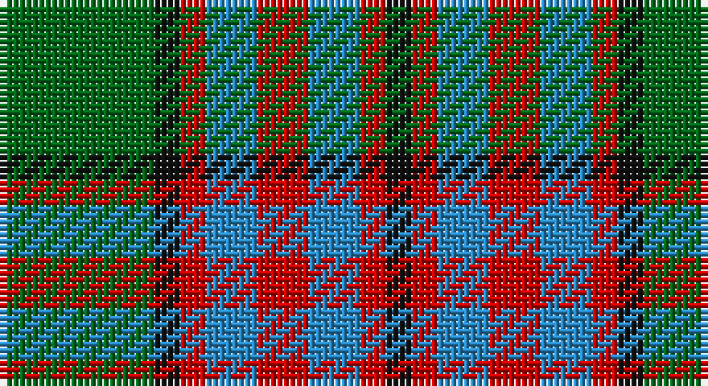

This page is one **sett** — a single exact thread-count. It belongs to the [tartan](/setts/g6k1r1t2r2/)
(the same proportion at any scale), whose colour order is pattern [GKRBRBRK](/stripes/gkrbrbrk/).

Sourced from register-of-tartans.  It is a [8 stripe tartan](/stripes/stripes8/).

Original link https://www.tartanregister.gov.uk/tartanDetails.aspx?ref=4725

## Also known as

This cloth is also recorded under:

- Wilson's, No 193

## Register references

External register numbers recorded for this tartan.

- Scottish Register of Tartans: [4725](https://www.tartanregister.gov.uk/tartanDetails.aspx?ref=4725)
- Scottish Tartans Authority (ITI): 813
- Scottish Tartans World Register: 813

## Thread count
G/24 K4 R4 B8 R8 B8 R4 K/4

One full sett is **100 threads**.

## Palette

Palette: <strong>Tartan Register</strong>
<table><thead><tr><th>Colour</th><th>Threads</th><th>Shade</th><th>Base</th><th>OKLCh</th></tr></thead><tbody><tr><td>G/</td><td style="text-align:right;font-variant-numeric:tabular-nums">24</td><td><code style="background-color:#006818;">#006818</code> <small style="color:#888">#006818</small></td><td>G <code style="background-color:#006100;">#006100</code></td><td><small style="color:#888">oklch(45.0% 0.142 145.0)</small></td></tr><tr><td>K</td><td style="text-align:right;font-variant-numeric:tabular-nums">4</td><td><code style="background-color:#101010;">#101010</code> <small style="color:#888">#101010</small></td><td>K <code style="background-color:#000000;">#000000</code></td><td><small style="color:#888">oklch(17.3% 0.000 89.9)</small></td></tr><tr><td>R</td><td style="text-align:right;font-variant-numeric:tabular-nums">4</td><td><code style="background-color:#C80000;">#C80000</code> <small style="color:#888">#C80000</small></td><td>R <code style="background-color:#CC0000;">#CC0000</code></td><td><small style="color:#888">oklch(52.3% 0.215 29.2)</small></td></tr><tr><td>B</td><td style="text-align:right;font-variant-numeric:tabular-nums">8</td><td><code style="background-color:#2888C4;">#2888C4</code> <small style="color:#888">#2888C4</small></td><td>B <code style="background-color:#2A418A;">#2A418A</code></td><td><small style="color:#888">oklch(60.1% 0.125 241.5)</small></td></tr><tr><td>R</td><td style="text-align:right;font-variant-numeric:tabular-nums">8</td><td><code style="background-color:#C80000;">#C80000</code> <small style="color:#888">#C80000</small></td><td>R <code style="background-color:#CC0000;">#CC0000</code></td><td><small style="color:#888">oklch(52.3% 0.215 29.2)</small></td></tr><tr><td>B</td><td style="text-align:right;font-variant-numeric:tabular-nums">8</td><td><code style="background-color:#2888C4;">#2888C4</code> <small style="color:#888">#2888C4</small></td><td>B <code style="background-color:#2A418A;">#2A418A</code></td><td><small style="color:#888">oklch(60.1% 0.125 241.5)</small></td></tr><tr><td>R</td><td style="text-align:right;font-variant-numeric:tabular-nums">4</td><td><code style="background-color:#C80000;">#C80000</code> <small style="color:#888">#C80000</small></td><td>R <code style="background-color:#CC0000;">#CC0000</code></td><td><small style="color:#888">oklch(52.3% 0.215 29.2)</small></td></tr><tr><td>K/</td><td style="text-align:right;font-variant-numeric:tabular-nums">4</td><td><code style="background-color:#101010;">#101010</code> <small style="color:#888">#101010</small></td><td>K <code style="background-color:#000000;">#000000</code></td><td><small style="color:#888">oklch(17.3% 0.000 89.9)</small></td></tr></tbody></table>

# Sample pattern

## Nearest tartans

The nearest existing variants by ΔTartan distance, with this tartan at the top so the swatches line up against it.

ΔTartan

Tartan

Sett

—

<a href="/ttd/edit/#slug=g6k1r1t2r2~x4">Wilson's No.193</a> <a class="nn-out" href="/variants/s8/g6k1r1t2r2~x4/" title="open its dictionary page">↗</a>

0.81

<a href="/variants/s8/g6ly1r1t2r2~x4/">Wilson's No.179</a>

0.85

<a href="/ttd/edit/#slug=r2ly1b8r1g7ly1r2~x6&amp;base=g6k1r1t2r2~x4">Cercle de Fermieres de St-Elie . . .</a> <a class="nn-out" href="/variants/s7/r2ly1b8r1g7ly1r2~x6/" title="open its dictionary page">↗</a>

0.91

<a href="/ttd/edit/#slug=r33g17db50g17r11g17r9k7&amp;base=g6k1r1t2r2~x4">Carnegie</a> <a class="nn-out" href="/variants/s8/r33g17db50g17r11g17r9k7/" title="open its dictionary page">↗</a>

0.92

<a href="/ttd/edit/#slug=ly5k5g17k6o24k6ly3~x2&amp;base=g6k1r1t2r2~x4">Cape Breton District Tartan</a> <a class="nn-out" href="/variants/s7/ly5k5g17k6o24k6ly3~x2/" title="open its dictionary page">↗</a>

1.04

<a href="/ttd/edit/#slug=dy3k7dy2w2lo12k2lo2dy3~x2&amp;base=g6k1r1t2r2~x4">Daks (Brown)</a> <a class="nn-out" href="/variants/s8/dy3k7dy2w2lo12k2lo2dy3~x2/" title="open its dictionary page">↗</a>

1.06

<a href="/ttd/edit/#slug=db9r3ly1r3g9r3ly1~x2&amp;base=g6k1r1t2r2~x4">Logan</a> <a class="nn-out" href="/variants/s7/db9r3ly1r3g9r3ly1~x2/" title="open its dictionary page">↗</a>

1.11

<a href="/ttd/edit/#slug=r1g6ly1r2ly1r2ly1db6ly1~x8&amp;base=g6k1r1t2r2~x4">Stevenson (Name)</a> <a class="nn-out" href="/variants/s9/r1g6ly1r2ly1r2ly1db6ly1~x8/" title="open its dictionary page">↗</a>

1.15

<a href="/ttd/edit/#slug=lr10dt3lr3dt3lr3dt11dy11o3~x2&amp;base=g6k1r1t2r2~x4">Holden Monaro Corporate Tartan</a> <a class="nn-out" href="/variants/s8/lr10dt3lr3dt3lr3dt11dy11o3~x2/" title="open its dictionary page">↗</a>

1.15

<a href="/ttd/edit/#slug=p11o2p2o2p2o11g14w2~x2&amp;base=g6k1r1t2r2~x4">Lamont</a> <a class="nn-out" href="/variants/s8/p11o2p2o2p2o11g14w2~x2/" title="open its dictionary page">↗</a>

1.16

<a href="/ttd/edit/#slug=r1g8ly1r2ly1r2ly1db8ly1~x4&amp;base=g6k1r1t2r2~x4">Stevenson Family Tartan</a> <a class="nn-out" href="/variants/s9/r1g8ly1r2ly1r2ly1db8ly1~x4/" title="open its dictionary page">↗</a>

## Neighbour map

Every grey dot is one of 14360 variants placed by the first two principal components of the ΔTartan feature space (44% of its variance). Red is this tartan; blue dots are its nearest — click one to open its page.

<svg viewBox="0 0 640 380" role="img" style="max-width:100%;height:auto;border:1px solid #e0e0e0;border-radius:4px;display:block" xmlns="http://www.w3.org/2000/svg"><image href="/nn/cloud.v1.png" width="640" height="380"/><a href="/variants/s8/g6ly1r1t2r2~x4/"><circle cx="161.7" cy="213.9" r="4" fill="#3465a4"><title>Wilson's No.179</title></circle></a><a href="/variants/s7/r2ly1b8r1g7ly1r2~x6/"><circle cx="184.9" cy="204.3" r="4" fill="#3465a4"><title>Cercle de Fermieres de St-Elie . . .</title></circle></a><a href="/variants/s8/r33g17db50g17r11g17r9k7/"><circle cx="157.8" cy="222.2" r="4" fill="#3465a4"><title>Carnegie</title></circle></a><a href="/variants/s7/ly5k5g17k6o24k6ly3~x2/"><circle cx="152.1" cy="208.8" r="4" fill="#3465a4"><title>Cape Breton District Tartan</title></circle></a><a href="/variants/s8/dy3k7dy2w2lo12k2lo2dy3~x2/"><circle cx="178.8" cy="205.2" r="4" fill="#3465a4"><title>Daks (Brown)</title></circle></a><a href="/variants/s7/db9r3ly1r3g9r3ly1~x2/"><circle cx="166.4" cy="208.0" r="4" fill="#3465a4"><title>Logan</title></circle></a><a href="/variants/s9/r1g6ly1r2ly1r2ly1db6ly1~x8/"><circle cx="114.3" cy="198.6" r="4" fill="#3465a4"><title>Stevenson (Name)</title></circle></a><a href="/variants/s8/lr10dt3lr3dt3lr3dt11dy11o3~x2/"><circle cx="141.2" cy="251.5" r="4" fill="#3465a4"><title>Holden Monaro Corporate Tartan</title></circle></a><a href="/variants/s8/p11o2p2o2p2o11g14w2~x2/"><circle cx="186.8" cy="212.2" r="4" fill="#3465a4"><title>Lamont</title></circle></a><a href="/variants/s9/r1g8ly1r2ly1r2ly1db8ly1~x4/"><circle cx="157.6" cy="177.0" r="4" fill="#3465a4"><title>Stevenson Family Tartan</title></circle></a><circle cx="164.0" cy="219.3" r="5" fill="#c00000"/></svg>

ID: /variants/s8/g6k1r1t2r2~x4/
