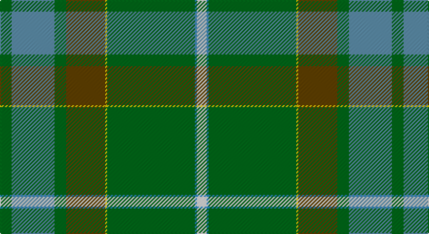

This page is one **sett** — a single exact thread-count. It belongs to the [tartan](/setts/g6ti22g6dy20ly1g45t1w5/)
(the same proportion at any scale), whose colour order is pattern [GBGGYGBW](/stripes/gbggygbw/).

Sourced from register-of-tartans.  It is a [8 stripe tartan](/stripes/stripes8/).

Original link https://www.tartanregister.gov.uk/tartanDetails.aspx?ref=5052

2 attestations — the source records this cloth was collapsed from (oldest owns this page)

<ul>
<li>01/12/2004 — Elbrick Hunting (Personal) (register-of-tartans, <a href="https://www.tartanregister.gov.uk/tartanDetails.aspx?ref=5052">record</a>)</li>
<li>pre 2004 — Elbrick Hunting (Personal) (tartans-authority, <a href="http://www.tartansauthority.com/tartan-ferret/display/7362/">record</a>)</li>
</ul>

## Register references

External register numbers recorded for this tartan.

- Scottish Register of Tartans: [5052](https://www.tartanregister.gov.uk/tartanDetails.aspx?ref=5052)
- Scottish Tartans Authority (ITI): 7362
- Scottish Tartans World Register: 3034

## Thread count
G/12 Ba44 G12 T40 Y2 G90 B2 LN/10

One full sett is **402 threads**.

## Palette

Palette: <strong>Tartan Register</strong>
<table><thead><tr><th>Colour</th><th>Threads</th><th>Shade</th><th>Base</th><th>OKLCh</th></tr></thead><tbody><tr><td>G/</td><td style="text-align:right;font-variant-numeric:tabular-nums">12</td><td><code style="background-color:#006818;">#006818</code> <small style="color:#888">#006818</small></td><td>G <code style="background-color:#006100;">#006100</code></td><td><small style="color:#888">oklch(45.0% 0.142 145.0)</small></td></tr><tr><td>Ba</td><td style="text-align:right;font-variant-numeric:tabular-nums">44</td><td><code style="background-color:#5C8CA8;">#5C8CA8</code> <small style="color:#888">#5C8CA8</small></td><td>B <code style="background-color:#2A418A;">#2A418A</code></td><td><small style="color:#888">oklch(61.7% 0.067 235.0)</small></td></tr><tr><td>G</td><td style="text-align:right;font-variant-numeric:tabular-nums">12</td><td><code style="background-color:#006818;">#006818</code> <small style="color:#888">#006818</small></td><td>G <code style="background-color:#006100;">#006100</code></td><td><small style="color:#888">oklch(45.0% 0.142 145.0)</small></td></tr><tr><td>T</td><td style="text-align:right;font-variant-numeric:tabular-nums">40</td><td><code style="background-color:#604000;">#604000</code> <small style="color:#888">#604000</small></td><td>G <code style="background-color:#006100;">#006100</code></td><td><small style="color:#888">oklch(39.8% 0.083 76.8)</small></td></tr><tr><td>Y</td><td style="text-align:right;font-variant-numeric:tabular-nums">2</td><td><code style="background-color:#E8C000;">#E8C000</code> <small style="color:#888">#E8C000</small></td><td>Y <code style="background-color:#F2BF00;">#F2BF00</code></td><td><small style="color:#888">oklch(81.9% 0.168 93.7)</small></td></tr><tr><td>G</td><td style="text-align:right;font-variant-numeric:tabular-nums">90</td><td><code style="background-color:#006818;">#006818</code> <small style="color:#888">#006818</small></td><td>G <code style="background-color:#006100;">#006100</code></td><td><small style="color:#888">oklch(45.0% 0.142 145.0)</small></td></tr><tr><td>B</td><td style="text-align:right;font-variant-numeric:tabular-nums">2</td><td><code style="background-color:#2888C4;">#2888C4</code> <small style="color:#888">#2888C4</small></td><td>B <code style="background-color:#2A418A;">#2A418A</code></td><td><small style="color:#888">oklch(60.1% 0.125 241.5)</small></td></tr><tr><td>LN/</td><td style="text-align:right;font-variant-numeric:tabular-nums">10</td><td><code style="background-color:#E0E0E0;">#E0E0E0</code> <small style="color:#888">#E0E0E0</small></td><td>W <code style="background-color:#F7F7F7;">#F7F7F7</code></td><td><small style="color:#888">oklch(90.7% 0.000 89.9)</small></td></tr></tbody></table>

# Sample pattern

## Nearest tartans

The nearest existing variants by ΔTartan distance, with this tartan at the top so the swatches line up against it.

ΔTartan

Tartan

Sett

—

<a href="/ttd/edit/#slug=g6ti22g6dy20ly1g45t1w5~x2">Elbrick Hunting (Personal)</a> <a class="nn-out" href="/variants/s8/g6ti22g6dy20ly1g45t1w5~x2/" title="open its dictionary page">↗</a>

1.25

<a href="/ttd/edit/#slug=p4g4dy2w3g27dy30ly1r3~x2&amp;base=g6ti22g6dy20ly1g45t1w5~x2">Hannigan of Dirleton</a> <a class="nn-out" href="/variants/s8/p4g4dy2w3g27dy30ly1r3~x2/" title="open its dictionary page">↗</a>

1.47

<a href="/ttd/edit/#slug=gi62o3gi3o31k4g5t5r3~x2&amp;base=g6ti22g6dy20ly1g45t1w5~x2">Sheffield, City of (District)</a> <a class="nn-out" href="/variants/s8/gi62o3gi3o31k4g5t5r3~x2/" title="open its dictionary page">↗</a>

1.56

<a href="/ttd/edit/#slug=g92ly3k28n18r12db18w2g12&amp;base=g6ti22g6dy20ly1g45t1w5~x2">Mull Millennium</a> <a class="nn-out" href="/variants/s8/g92ly3k28n18r12db18w2g12/" title="open its dictionary page">↗</a>

1.57

<a href="/ttd/edit/#slug=g45k4ri2g4ri2k4n21r5~x2&amp;base=g6ti22g6dy20ly1g45t1w5~x2">Shiach (Personal)</a> <a class="nn-out" href="/variants/s8/g45k4ri2g4ri2k4n21r5~x2/" title="open its dictionary page">↗</a>

1.64

<a href="/ttd/edit/#slug=w4g10t24g42r3y4ri4ly2&amp;base=g6ti22g6dy20ly1g45t1w5~x2">Muskoka</a> <a class="nn-out" href="/variants/s8/w4g10t24g42r3y4ri4ly2/" title="open its dictionary page">↗</a>

1.68

<a href="/ttd/edit/#slug=db30r2db4w1o11g4ly2g22~x2&amp;base=g6ti22g6dy20ly1g45t1w5~x2">Yorkland</a> <a class="nn-out" href="/variants/s8/db30r2db4w1o11g4ly2g22~x2/" title="open its dictionary page">↗</a>

1.69

<a href="/ttd/edit/#slug=dp4g4y2w3g27y30ly1r3~x2&amp;base=g6ti22g6dy20ly1g45t1w5~x2">Hannigan of Dirleton (Personal)</a> <a class="nn-out" href="/variants/s8/dp4g4y2w3g27y30ly1r3~x2/" title="open its dictionary page">↗</a>

1.71

<a href="/ttd/edit/#slug=p4g24dg6lg4dg4lg4dg44lo1w4&amp;base=g6ti22g6dy20ly1g45t1w5~x2">Macmillan Cancer Support</a> <a class="nn-out" href="/variants/s9/p4g24dg6lg4dg4lg4dg44lo1w4/" title="open its dictionary page">↗</a>

1.71

<a href="/ttd/edit/#slug=y32w1k3w1g14y7k3dp3w1~x2&amp;base=g6ti22g6dy20ly1g45t1w5~x2">Leach Htg #2 (Name)</a> <a class="nn-out" href="/variants/s9/y32w1k3w1g14y7k3dp3w1~x2/" title="open its dictionary page">↗</a>

1.71

<a href="/ttd/edit/#slug=r3db6ly2db15dg12g39w3~x2&amp;base=g6ti22g6dy20ly1g45t1w5~x2">Wagland</a> <a class="nn-out" href="/variants/s7/r3db6ly2db15dg12g39w3~x2/" title="open its dictionary page">↗</a>

## Neighbour map

Every grey dot is one of 14360 variants placed by the first two principal components of the ΔTartan feature space (44% of its variance). Red is this tartan; blue dots are its nearest — click one to open its page.

<svg viewBox="0 0 640 380" role="img" style="max-width:100%;height:auto;border:1px solid #e0e0e0;border-radius:4px;display:block" xmlns="http://www.w3.org/2000/svg"><image href="/nn/cloud.v1.png" width="640" height="380"/><a href="/variants/s8/p4g4dy2w3g27dy30ly1r3~x2/"><circle cx="305.6" cy="129.9" r="4" fill="#3465a4"><title>Hannigan of Dirleton</title></circle></a><a href="/variants/s8/gi62o3gi3o31k4g5t5r3~x2/"><circle cx="364.0" cy="142.1" r="4" fill="#3465a4"><title>Sheffield, City of (District)</title></circle></a><a href="/variants/s8/g92ly3k28n18r12db18w2g12/"><circle cx="320.9" cy="94.2" r="4" fill="#3465a4"><title>Mull Millennium</title></circle></a><a href="/variants/s8/g45k4ri2g4ri2k4n21r5~x2/"><circle cx="368.8" cy="154.6" r="4" fill="#3465a4"><title>Shiach (Personal)</title></circle></a><a href="/variants/s8/w4g10t24g42r3y4ri4ly2/"><circle cx="302.0" cy="124.1" r="4" fill="#3465a4"><title>Muskoka</title></circle></a><a href="/variants/s8/db30r2db4w1o11g4ly2g22~x2/"><circle cx="276.1" cy="130.8" r="4" fill="#3465a4"><title>Yorkland</title></circle></a><a href="/variants/s8/dp4g4y2w3g27y30ly1r3~x2/"><circle cx="332.8" cy="146.3" r="4" fill="#3465a4"><title>Hannigan of Dirleton (Personal)</title></circle></a><a href="/variants/s9/p4g24dg6lg4dg4lg4dg44lo1w4/"><circle cx="331.2" cy="91.2" r="4" fill="#3465a4"><title>Macmillan Cancer Support</title></circle></a><a href="/variants/s9/y32w1k3w1g14y7k3dp3w1~x2/"><circle cx="381.5" cy="121.0" r="4" fill="#3465a4"><title>Leach Htg #2 (Name)</title></circle></a><a href="/variants/s7/r3db6ly2db15dg12g39w3~x2/"><circle cx="281.3" cy="156.9" r="4" fill="#3465a4"><title>Wagland</title></circle></a><circle cx="345.3" cy="127.6" r="5" fill="#c00000"/></svg>

ID: /variants/s8/g6ti22g6dy20ly1g45t1w5~x2/
