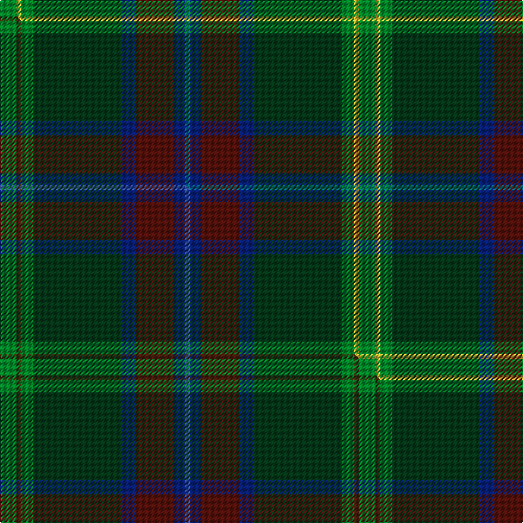

This page is one **sett** — a single exact thread-count. It belongs to the [tartan](/setts/g7ly2g5dg37db6dr16db5t2/)
(the same proportion at any scale), whose colour order is pattern [BBBBGGYG](/stripes/bbbbggyg/).

Part of the [Telfer](/tartans/telfer/) tartan — the named design grouping this sett with its other cloths.

Sourced from tartans-authority.  It is a [8 stripe tartan](/stripes/stripes8/).

Original link http://www.tartansauthority.com/tartan-ferret/display/10095/

## Provenance

Earliest known date: 2009 A tartan partly inspired by the Hunting Stewart that the designer wears occasionally, and the brooding darkness of the forests. The electric blue stripe is reminiscent of summer lightning across the Scottish landscape, and the sun (gold) is never far away. This tartan is dedicated to all who enjoy nature, trees and plants; to professionals and hobbyists in radio, electronics and communication; and those who are interested in the weather, storms and lightning. Although there are no restrictions, anyone intending to manufacture or use this tartan is encouraged to contact the designer (or his direct descendants) and a choice of preferred charities will be offered for a suggested donation. Copyright of this design belongs to Duncan Telfer.

2 attestations — the source records this cloth was collapsed from (oldest owns this page)

<ul>
<li>pre 2009 — Telfer Green (Name) (tartans-authority, <a href="http://www.tartansauthority.com/tartan-ferret/display/10095/">record</a>)  <em>A tartan partly inspired by the Hunting Stewart that the designer wears occasionally, and the brooding darkness of the forests. The electric blue stripe is reminiscent of summer lightning across the Scottish landscape, and the sun (gold) is never far away. This tartan is dedicated to all who enjoy nature, trees and plants; to professionals and hobbyists in radio, electronics and communication; and those who are interested in the weather, storms and lightning. Although there are no restrictions, anyone intending to manufacture or use this tartan is encouraged to contact the designer (or his direct descendants) and a choice of preferred charities will be offered for a suggested donation. Copyright of this design belongs to Duncan Telfer.</em></li>
<li>undated — Telfer Green Name Tartan (house-of-tartan, <a href="http://www.house-of-tartan.scotland.net/house/TartanViewjs.asp?colr=Def&tnam=10095">record</a>) </li>
</ul>

## Register references

External register numbers recorded for this tartan.

- Scottish Register of Tartans: [10095](https://www.tartanregister.gov.uk/tartanDetails?ref=10095)
- Scottish Tartans Authority (ITI): 10095

## Thread count
G/14 LY4 G10 DG74 DB12 DR32 DB10 T/4

One full sett is **302 threads**.

## Palette
<table><thead><tr><th>Colour</th><th>Shade</th><th>OKLCh</th></tr></thead><tbody><tr><td>T</td><td><code style="background-color:#00879F;">#00879F</code> <small style="color:#888">#00879F</small></td><td><small style="color:#888">oklch(57.4% 0.102 216.1)</small></td></tr><tr><td>DB</td><td><code style="background-color:#082077;">#082077</code> <small style="color:#888">#082077</small></td><td><small style="color:#888">oklch(30.0% 0.149 265.1)</small></td></tr><tr><td>DR</td><td><code style="background-color:#55120C;">#55120C</code> <small style="color:#888">#55120C</small></td><td><small style="color:#888">oklch(30.0% 0.099 29.3)</small></td></tr><tr><td>LY</td><td><code style="background-color:#DCBC32;">#DCBC32</code> <small style="color:#888">#DCBC32</small></td><td><small style="color:#888">oklch(80.0% 0.150 95.2)</small></td></tr><tr><td>G</td><td><code style="background-color:#008B2A;">#008B2A</code> <small style="color:#888">#008B2A</small></td><td><small style="color:#888">oklch(55.4% 0.170 145.9)</small></td></tr><tr><td>DG</td><td><code style="background-color:#053819;">#053819</code> <small style="color:#888">#053819</small></td><td><small style="color:#888">oklch(30.0% 0.075 151.3)</small></td></tr></tbody></table>

# Sample pattern

## Compared to the master

This cloth is one sett of its design; the master sett (the exemplar the design is anchored on) is below for comparison.

Its **ΔTartan distance** from the master is **0.79** — the same measure the nearest-tartans table ranks by (0 is identical; a re-scale of the same cloth is near 0, a recolour or a different proportion further).

<figure class="master-compare" style="margin:0">

this sett
master sett ★

<figcaption style="color:#888;font-size:smaller">One weave of this sett against the <a href="/setts/g7dy2g5dg37db6dr16db5b2/">master sett ★</a>, split on the diagonal: a shared proportion runs seamlessly across it with only the shades shifting; a different proportion breaks on it.</figcaption>
</figure>

## Nearest tartan variants

The nearest existing variants by ΔTartan distance, with this cloth at the top so the swatches line up against it.

ΔTartan

Threads

Variant

Sett

—

302

<a href="/variants/s8/g7ly2g5dg37db6dr16db5t2~x2/">Telfer Green (Name)</a>

<a href="/ttd/edit/#slug=g7dy2g5dg37db6dr16db5b2~x2&amp;base=g7ly2g5dg37db6dr16db5t2~x2" title="compare in the TTD">0.00</a>

302

<a href="/variants/s8/g7dy2g5dg37db6dr16db5b2~x2/">Telfer Green</a>

<a href="/ttd/edit/#slug=r3db6y2db15g12dg39w3~x2&amp;base=g7ly2g5dg37db6dr16db5t2~x2" title="compare in the TTD">2.74</a>

308

<a href="/variants/s7/r3db6y2db15g12dg39w3~x2/">Wagland (Name)</a>

<a href="/ttd/edit/#slug=g1dr7g7n2dr1dg15lb1~x4&amp;base=g7ly2g5dg37db6dr16db5t2~x2" title="compare in the TTD">2.82</a>

264

<a href="/variants/s7/g1dr7g7n2dr1dg15lb1~x4/">Ramsay (Green Fashion)</a>

<a href="/ttd/edit/#slug=o5dr8dp13dgi21dg34g55o3~dgi1104144&amp;base=g7ly2g5dg37db6dr16db5t2~x2" title="compare in the TTD">2.82</a>

270

<a href="/variants/s7/o5dr8dp13dgi21dg34g55o3~dgi1104144/">Lunting Papi (Personal)</a>

<a href="/ttd/edit/#slug=ly3dg30g20lo6g3lo3g3db20r2~x2~dg1806142-g1903114&amp;base=g7ly2g5dg37db6dr16db5t2~x2" title="compare in the TTD">2.83</a>

350

<a href="/variants/s9/ly3dg30g20lo6g3lo3g3db20r2~x2~dg1806142-g1903114/">Glens of Corbie</a>

## Neighbour map

Every grey dot is one of 13620 variants placed by the first two principal components of the ΔTartan feature space (42% of its variance). Red is this tartan; blue dots are its nearest — click one to open its page.

<svg viewBox="0 0 640 380" role="img" style="max-width:100%;height:auto;border:1px solid #e0e0e0;border-radius:4px;display:block" xmlns="http://www.w3.org/2000/svg"><image href="/nn/cloud.v1.png" width="640" height="380"/><a href="/variants/s8/g7dy2g5dg37db6dr16db5b2~x2/"><circle cx="338.6" cy="181.8" r="4" fill="#3465a4"><title>Telfer Green</title></circle></a><a href="/variants/s7/r3db6y2db15g12dg39w3~x2/"><circle cx="276.4" cy="153.8" r="4" fill="#3465a4"><title>Wagland (Name)</title></circle></a><a href="/variants/s7/g1dr7g7n2dr1dg15lb1~x4/"><circle cx="321.0" cy="209.2" r="4" fill="#3465a4"><title>Ramsay (Green Fashion)</title></circle></a><a href="/variants/s7/o5dr8dp13dgi21dg34g55o3~dgi1104144/"><circle cx="236.6" cy="181.7" r="4" fill="#3465a4"><title>Lunting Papi (Personal)</title></circle></a><a href="/variants/s9/ly3dg30g20lo6g3lo3g3db20r2~x2~dg1806142-g1903114/"><circle cx="197.6" cy="167.3" r="4" fill="#3465a4"><title>Glens of Corbie</title></circle></a><circle cx="312.9" cy="173.3" r="5" fill="#c00000"/><text x="320" y="376" text-anchor="middle" font-size="11" fill="#999">ground</text><text x="11" y="190" text-anchor="middle" font-size="11" fill="#999" transform="rotate(-90 11 190)">complexity</text></svg>

ID: /variants/s8/g7ly2g5dg37db6dr16db5t2~x2/
