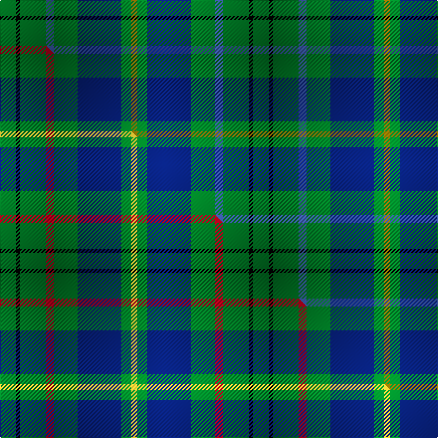

This is one **variant** — a specific cloth: this exact thread count and colourway, with its own
provenance below. It is one weaving of the [sett](/setts/g8k2g13b4g12db22g5y3/) (the scale-free proportion — the
same cloth at any scale or shade), whose colour order is pattern [GGBGBGKG](/stripes/ggbgbgkg/).

Part of the [Taylor](/tartans/taylor/) tartan — the named design grouping this sett with its other cloths.

Sourced from weddslist.  It is a [8 stripe tartan](/stripes/stripes8/).

Original link [http://www.weddslist.com/cgi-bin/tartans/pg.pl?source=sts](http://www.weddslist.com/cgi-bin/tartans/pg.pl?source=sts)

Dataset <small>— provenance for this record, inherited from the source manifest</small>

<dl class="dataset-prov">
<dt>source</dt><dd><a href="/sources/weddslist/">Weddslist</a></dd>
<dt>data captured from</dt><dd><a href="https://github.com/thetartan/tartan-database/blob/master/data/weddslist/data.csv">https://github.com/thetartan/tartan-database/blob/master/data/weddslist/data.csv</a></dd>
<dt>data date</dt><dd>2016-11-17 <small>(dataset default)</small></dd>
<dt>licence</dt><dd><a href="https://creativecommons.org/licenses/by-nc-nd/4.0/">CC BY-NC-ND 4.0</a></dd>
</dl>

Capture chain <small>— the hands this data passed through, oldest first; each capture carries its own licence</small>

<ol class="capture-chain">
<li><a href="https://www.weddslist.com/tartans/">Weddslist</a> <small>the living privately compiled reference</small></li>
<li><a href="https://github.com/thetartan/tartan-database">thetartan/tartan-database</a> <small>2016-2017</small> · <a href="https://creativecommons.org/licenses/by-nc-nd/4.0/">CC BY-NC-ND 4.0</a> <small>Levko Kravets's frozen compilation — the capture we vendored, and where its CC licence text came from</small></li>
<li>this dictionary <small>captured 2026-06-10 · commit 5bf86c7566</small> <small>each re-capture is a git commit to data/sources</small></li>
</ol>

## Thread count
G/16 K4 G26 B8 G24 DB44 G10 Y/6

One full sett is **254 threads**.

## Palette
<table><thead><tr><th>Colour</th><th>Shade</th><th>OKLCh</th></tr></thead><tbody><tr><td>DB</td><td><code style="background-color:#082077;">#082077</code> <small style="color:#888">#082077</small></td><td><small style="color:#888">oklch(30.0% 0.149 265.1)</small></td></tr><tr><td>G</td><td><code style="background-color:#008B2A;">#008B2A</code> <small style="color:#888">#008B2A</small></td><td><small style="color:#888">oklch(55.4% 0.170 145.9)</small></td></tr><tr><td>K</td><td><code style="background-color:#000000;">#000000</code> <small style="color:#888">#000000</small></td><td><small style="color:#888">oklch(0.0% 0.000 0.0)</small></td></tr><tr><td>B</td><td><code style="background-color:#466CC8;">#466CC8</code> <small style="color:#888">#466CC8</small></td><td><small style="color:#888">oklch(55.1% 0.149 265.0)</small></td></tr><tr><td>Y</td><td><code style="background-color:#8B6E00;">#8B6E00</code> <small style="color:#888">#8B6E00</small></td><td><small style="color:#888">oklch(55.1% 0.113 90.4)</small></td></tr></tbody></table>

# Sample pattern

## Compared to the master

This cloth is one sett of its design; the master sett (the exemplar the design is anchored on) is below for comparison.

Its **ΔTartan distance** from the master is **0.32** — the same measure the nearest-tartans table ranks by (0 is identical; a re-scale of the same cloth is near 0, a recolour or a different proportion further).

<figure class="master-compare" style="margin:0">

this sett
master sett ★

<figcaption style="color:#888;font-size:smaller">One weave of this sett against the <a href="/setts/g8k2g13r4g12db22g5ly3/">master sett ★</a>, split on the diagonal: a shared proportion runs seamlessly across it with only the shades shifting; a different proportion breaks on it.</figcaption>
</figure>

## Nearest tartan variants

The nearest existing variants by ΔTartan distance, with this cloth at the top so the swatches line up against it.

ΔTartan

Threads

Variant

Sett

—

254

<a href="/variants/s8/g8k2g13b4g12db22g5y3~x2/">Taylor</a>

<a href="/ttd/edit/#slug=g8k2g13r4g12db22g5ly3~x2&amp;base=g8k2g13b4g12db22g5y3~x2" title="compare in the TTD">0.32</a>

254

<a href="/variants/s8/g8k2g13r4g12db22g5ly3~x2/">Taylor</a>

<a href="/ttd/edit/#slug=g10r1g1r2g8db10g1ly1~x4&amp;base=g8k2g13b4g12db22g5y3~x2" title="compare in the TTD">1.13</a>

228

<a href="/variants/s8/g10r1g1r2g8db10g1ly1~x4/">Glen Esk</a>

<a href="/ttd/edit/#slug=g14r2g2r3g7db12g2dr2~x2~r1606028-dr1004029&amp;base=g8k2g13b4g12db22g5y3~x2" title="compare in the TTD">1.50</a>

144

<a href="/variants/s8/g14r2g2r3g7db12g2dr2~x2~r1606028-dr1004029/">Glen Nevis #3</a>

<a href="/ttd/edit/#slug=g8k2g13r4g12dp22g5y3~x2&amp;base=g8k2g13b4g12db22g5y3~x2" title="compare in the TTD">1.70</a>

254

<a href="/variants/s8/g8k2g13r4g12dp22g5y3~x2/">Taylor Family Tartan</a>

<a href="/ttd/edit/#slug=b26g6k8g3k8g30w3g3~x2&amp;base=g8k2g13b4g12db22g5y3~x2" title="compare in the TTD">1.80</a>

290

<a href="/variants/s8/b26g6k8g3k8g30w3g3~x2/">Riley (Personal)</a>

<a href="/ttd/edit/#slug=g2k1g12dr4g3db9lb2~x4&amp;base=g8k2g13b4g12db22g5y3~x2" title="compare in the TTD">1.80</a>

248

<a href="/variants/s7/g2k1g12dr4g3db9lb2~x4/">Lee (Personal)</a>

<a href="/ttd/edit/#slug=r3g10r3g14db16g3dy2~x2&amp;base=g8k2g13b4g12db22g5y3~x2" title="compare in the TTD">1.91</a>

194

<a href="/variants/s7/r3g10r3g14db16g3dy2~x2/">Cameron Hunting Clan Tartan</a>

<a href="/ttd/edit/#slug=r3g10r3g14db16g3y2~x2&amp;base=g8k2g13b4g12db22g5y3~x2" title="compare in the TTD">1.91</a>

194

<a href="/variants/s7/r3g10r3g14db16g3y2~x2/">Cameron of Lochiel (Hunting)</a>

<a href="/ttd/edit/#slug=r3g10r3g14db16g3y2&amp;base=g8k2g13b4g12db22g5y3~x2" title="compare in the TTD">1.91</a>

97

<a href="/variants/s7/r3g10r3g14db16g3y2/">Cameron Hunting</a>

<a href="/ttd/edit/#slug=db19g7db7lb2g20k9g6k4g10w3~x2&amp;base=g8k2g13b4g12db22g5y3~x2" title="compare in the TTD">2.03</a>

304

<a href="/variants/s10/db19g7db7lb2g20k9g6k4g10w3~x2/">O'Connell, William (Name)</a>

## Neighbour map

Every grey dot is one of 13621 variants placed by the first two principal components of the ΔTartan feature space (42% of its variance). Red is this tartan; blue dots are its nearest — click one to open its page.

<svg viewBox="0 0 640 380" role="img" style="max-width:100%;height:auto;border:1px solid #e0e0e0;border-radius:4px;display:block" xmlns="http://www.w3.org/2000/svg"><image href="/nn/cloud.v1.png" width="640" height="380"/><a href="/variants/s8/g8k2g13r4g12db22g5ly3~x2/"><circle cx="245.0" cy="185.9" r="4" fill="#3465a4"><title>Taylor</title></circle></a><a href="/variants/s8/g10r1g1r2g8db10g1ly1~x4/"><circle cx="325.0" cy="200.8" r="4" fill="#3465a4"><title>Glen Esk</title></circle></a><a href="/variants/s8/g14r2g2r3g7db12g2dr2~x2~r1606028-dr1004029/"><circle cx="302.0" cy="224.6" r="4" fill="#3465a4"><title>Glen Nevis #3</title></circle></a><a href="/variants/s8/g8k2g13r4g12dp22g5y3~x2/"><circle cx="256.7" cy="185.0" r="4" fill="#3465a4"><title>Taylor Family Tartan</title></circle></a><a href="/variants/s8/b26g6k8g3k8g30w3g3~x2/"><circle cx="209.7" cy="179.8" r="4" fill="#3465a4"><title>Riley (Personal)</title></circle></a><a href="/variants/s7/g2k1g12dr4g3db9lb2~x4/"><circle cx="232.3" cy="182.2" r="4" fill="#3465a4"><title>Lee (Personal)</title></circle></a><a href="/variants/s7/r3g10r3g14db16g3dy2~x2/"><circle cx="277.6" cy="230.4" r="4" fill="#3465a4"><title>Cameron Hunting Clan Tartan</title></circle></a><a href="/variants/s7/r3g10r3g14db16g3y2~x2/"><circle cx="279.2" cy="231.2" r="4" fill="#3465a4"><title>Cameron of Lochiel (Hunting)</title></circle></a><a href="/variants/s7/r3g10r3g14db16g3y2/"><circle cx="279.2" cy="231.2" r="4" fill="#3465a4"><title>Cameron Hunting</title></circle></a><a href="/variants/s10/db19g7db7lb2g20k9g6k4g10w3~x2/"><circle cx="173.8" cy="179.8" r="4" fill="#3465a4"><title>O'Connell, William (Name)</title></circle></a><circle cx="260.5" cy="192.7" r="5" fill="#c00000"/><text x="320" y="376" text-anchor="middle" font-size="11" fill="#999">ground</text><text x="11" y="190" text-anchor="middle" font-size="11" fill="#999" transform="rotate(-90 11 190)">complexity</text></svg>

ID: /variants/s8/g8k2g13b4g12db22g5y3~x2/
