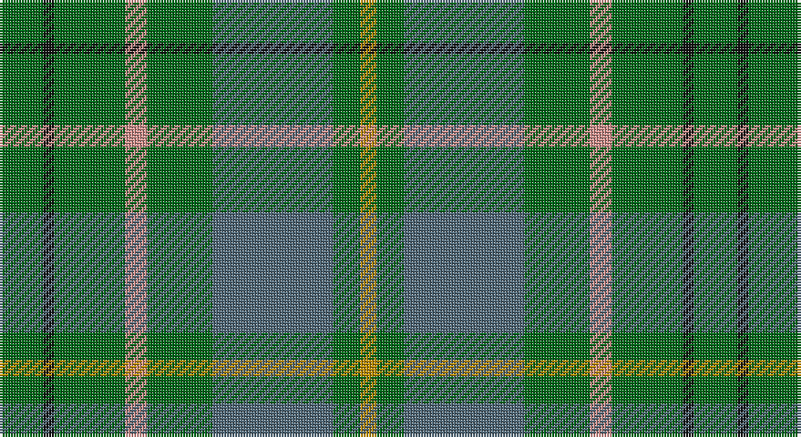

This page is one **sett** — a single exact thread-count. It belongs to the [tartan](/setts/g8k2g13lr4g12n22g5lo3/)
(the same proportion at any scale), whose colour order is pattern [GKGYGBGY](/stripes/gkgygbgy/).

Part of the [Taylor](/tartans/taylor/) tartan — the named design grouping this sett with its other cloths.

Sourced from register-of-tartans.  It is a [8 stripe tartan](/stripes/stripes8/).

Original link https://www.tartanregister.gov.uk/tartanDetails.aspx?ref=4080

2 attestations — the source records this cloth was collapsed from (oldest owns this page)

<ul>
<li>01/01/1955 — Taylor (register-of-tartans, <a href="https://www.tartanregister.gov.uk/tartanDetails.aspx?ref=4080">record</a>)</li>
<li>1955 — Taylor (Clan) (tartans-authority, <a href="http://www.tartansauthority.com/tartan-ferret/display/809/">record</a>)</li>
</ul>

## Register references

External register numbers recorded for this tartan.

- Scottish Register of Tartans: [4080](https://www.tartanregister.gov.uk/tartanDetails.aspx?ref=4080)
- Scottish Tartans Authority (ITI): 809
- Scottish Tartans World Register: 809

## Thread count
G/16 K4 G26 LR8 G24 N44 G10 DY/6

One full sett is **254 threads**.

## Palette

Palette: <strong>Tartan Register</strong> <small style="color:#888">(3 of 5 colours)</small>
<table><thead><tr><th>Colour</th><th>Threads</th><th>Shade</th><th>Base</th><th>OKLCh</th></tr></thead><tbody><tr><td>G/</td><td style="text-align:right;font-variant-numeric:tabular-nums">16</td><td><code style="background-color:#006818;">#006818</code> <small style="color:#888">#006818</small></td><td>G <code style="background-color:#006100;">#006100</code></td><td><small style="color:#888">oklch(45.0% 0.142 145.0)</small></td></tr><tr><td>K</td><td style="text-align:right;font-variant-numeric:tabular-nums">4</td><td><code style="background-color:#101010;">#101010</code> <small style="color:#888">#101010</small></td><td>K <code style="background-color:#000000;">#000000</code></td><td><small style="color:#888">oklch(17.3% 0.000 89.9)</small></td></tr><tr><td>G</td><td style="text-align:right;font-variant-numeric:tabular-nums">26</td><td><code style="background-color:#006818;">#006818</code> <small style="color:#888">#006818</small></td><td>G <code style="background-color:#006100;">#006100</code></td><td><small style="color:#888">oklch(45.0% 0.142 145.0)</small></td></tr><tr><td>LR</td><td style="text-align:right;font-variant-numeric:tabular-nums">8</td><td><code style="background-color:#D0908C;">#D0908C</code> <small style="color:#888">#D0908C</small></td><td>Y <code style="background-color:#F2BF00;">#F2BF00</code></td><td><small style="color:#888">oklch(71.5% 0.079 23.2)</small></td></tr><tr><td>G</td><td style="text-align:right;font-variant-numeric:tabular-nums">24</td><td><code style="background-color:#006818;">#006818</code> <small style="color:#888">#006818</small></td><td>G <code style="background-color:#006100;">#006100</code></td><td><small style="color:#888">oklch(45.0% 0.142 145.0)</small></td></tr><tr><td>N</td><td style="text-align:right;font-variant-numeric:tabular-nums">44</td><td><code style="background-color:#506878;">#506878</code> <small style="color:#888">#506878</small></td><td>B <code style="background-color:#2A418A;">#2A418A</code></td><td><small style="color:#888">oklch(50.4% 0.038 237.7)</small></td></tr><tr><td>G</td><td style="text-align:right;font-variant-numeric:tabular-nums">10</td><td><code style="background-color:#006818;">#006818</code> <small style="color:#888">#006818</small></td><td>G <code style="background-color:#006100;">#006100</code></td><td><small style="color:#888">oklch(45.0% 0.142 145.0)</small></td></tr><tr><td>DY/</td><td style="text-align:right;font-variant-numeric:tabular-nums">6</td><td><code style="background-color:#BC8C00;">#BC8C00</code> <small style="color:#888">#BC8C00</small></td><td>Y <code style="background-color:#F2BF00;">#F2BF00</code></td><td><small style="color:#888">oklch(66.8% 0.137 84.1)</small></td></tr></tbody></table>

# Sample pattern

## Nearest tartans

The nearest existing variants by ΔTartan distance, with this tartan at the top so the swatches line up against it.

ΔTartan

Tartan

Sett

—

<a href="/ttd/edit/#slug=g8k2g13lr4g12n22g5lo3~x2">Taylor</a> <a class="nn-out" href="/variants/s8/g8k2g13lr4g12n22g5lo3~x2/" title="open its dictionary page">↗</a>

0.98

<a href="/ttd/edit/#slug=g8dr2g13r4g12t22g5y3~x2&amp;base=g8k2g13lr4g12n22g5lo3~x2">Kildare</a> <a class="nn-out" href="/variants/s8/g8dr2g13r4g12t22g5y3~x2/" title="open its dictionary page">↗</a>

1.17

<a href="/ttd/edit/#slug=g10n2w2n16g6ly2g4r2g3n6~x4&amp;base=g8k2g13lr4g12n22g5lo3~x2">Harkness Htg (Name)</a> <a class="nn-out" href="/variants/s10/g10n2w2n16g6ly2g4r2g3n6~x4/" title="open its dictionary page">↗</a>

1.32

<a href="/ttd/edit/#slug=dg8do2dg13db4dg12n22dg5ly3~x2&amp;base=g8k2g13lr4g12n22g5lo3~x2">Scottish Pup</a> <a class="nn-out" href="/variants/s8/dg8do2dg13db4dg12n22dg5ly3~x2/" title="open its dictionary page">↗</a>

1.41

<a href="/variants/s7/dp3n24ni10n2g11n8w3~x2/">Hesco</a>

1.44

<a href="/ttd/edit/#slug=g1o8g8r1g8o8w1~x4&amp;base=g8k2g13lr4g12n22g5lo3~x2">MacKinnon, hunting</a> <a class="nn-out" href="/variants/s7/g1o8g8r1g8o8w1~x4/" title="open its dictionary page">↗</a>

1.47

<a href="/ttd/edit/#slug=db3dy7g2y2g14dy2g2db3~x2&amp;base=g8k2g13lr4g12n22g5lo3~x2">Daks (Loden)</a> <a class="nn-out" href="/variants/s8/db3dy7g2y2g14dy2g2db3~x2/" title="open its dictionary page">↗</a>

1.51

<a href="/ttd/edit/#slug=dt17g5dt5g17dt4g17k2dy2k2g5~x2&amp;base=g8k2g13lr4g12n22g5lo3~x2">Hueg (Hunting) (Personal)</a> <a class="nn-out" href="/variants/s10/dt17g5dt5g17dt4g17k2dy2k2g5~x2/" title="open its dictionary page">↗</a>

1.52

<a href="/ttd/edit/#slug=g28db9dg18w3dg18db9g28r3~x2&amp;base=g8k2g13lr4g12n22g5lo3~x2">Simple Technology</a> <a class="nn-out" href="/variants/s8/g28db9dg18w3dg18db9g28r3~x2/" title="open its dictionary page">↗</a>

1.53

<a href="/ttd/edit/#slug=db3o7g2r2g14o2g2db3~x2&amp;base=g8k2g13lr4g12n22g5lo3~x2">Daks, Tartan-Loden</a> <a class="nn-out" href="/variants/s8/db3o7g2r2g14o2g2db3~x2/" title="open its dictionary page">↗</a>

1.55

<a href="/ttd/edit/#slug=r3n34db4g47lb3~x2&amp;base=g8k2g13lr4g12n22g5lo3~x2">Exabyte</a> <a class="nn-out" href="/variants/s5/r3n34db4g47lb3~x2/" title="open its dictionary page">↗</a>

## Neighbour map

Every grey dot is one of 14360 variants placed by the first two principal components of the ΔTartan feature space (44% of its variance). Red is this tartan; blue dots are its nearest — click one to open its page.

<svg viewBox="0 0 640 380" role="img" style="max-width:100%;height:auto;border:1px solid #e0e0e0;border-radius:4px;display:block" xmlns="http://www.w3.org/2000/svg"><image href="/nn/cloud.v1.png" width="640" height="380"/><a href="/variants/s8/g8dr2g13r4g12t22g5y3~x2/"><circle cx="349.4" cy="239.1" r="4" fill="#3465a4"><title>Kildare</title></circle></a><a href="/variants/s10/g10n2w2n16g6ly2g4r2g3n6~x4/"><circle cx="283.7" cy="231.7" r="4" fill="#3465a4"><title>Harkness Htg (Name)</title></circle></a><a href="/variants/s8/dg8do2dg13db4dg12n22dg5ly3~x2/"><circle cx="358.2" cy="250.6" r="4" fill="#3465a4"><title>Scottish Pup</title></circle></a><a href="/variants/s7/dp3n24ni10n2g11n8w3~x2/"><circle cx="323.8" cy="218.0" r="4" fill="#3465a4"><title>Hesco</title></circle></a><a href="/variants/s7/g1o8g8r1g8o8w1~x4/"><circle cx="334.8" cy="268.5" r="4" fill="#3465a4"><title>MacKinnon, hunting</title></circle></a><a href="/variants/s8/db3dy7g2y2g14dy2g2db3~x2/"><circle cx="329.5" cy="256.6" r="4" fill="#3465a4"><title>Daks (Loden)</title></circle></a><a href="/variants/s10/dt17g5dt5g17dt4g17k2dy2k2g5~x2/"><circle cx="380.8" cy="256.4" r="4" fill="#3465a4"><title>Hueg (Hunting) (Personal)</title></circle></a><a href="/variants/s8/g28db9dg18w3dg18db9g28r3~x2/"><circle cx="252.9" cy="240.6" r="4" fill="#3465a4"><title>Simple Technology</title></circle></a><a href="/variants/s8/db3o7g2r2g14o2g2db3~x2/"><circle cx="304.6" cy="239.6" r="4" fill="#3465a4"><title>Daks, Tartan-Loden</title></circle></a><a href="/variants/s5/r3n34db4g47lb3~x2/"><circle cx="380.5" cy="226.2" r="4" fill="#3465a4"><title>Exabyte</title></circle></a><circle cx="336.0" cy="237.5" r="5" fill="#c00000"/></svg>

ID: /variants/s8/g8k2g13lr4g12n22g5lo3~x2/
