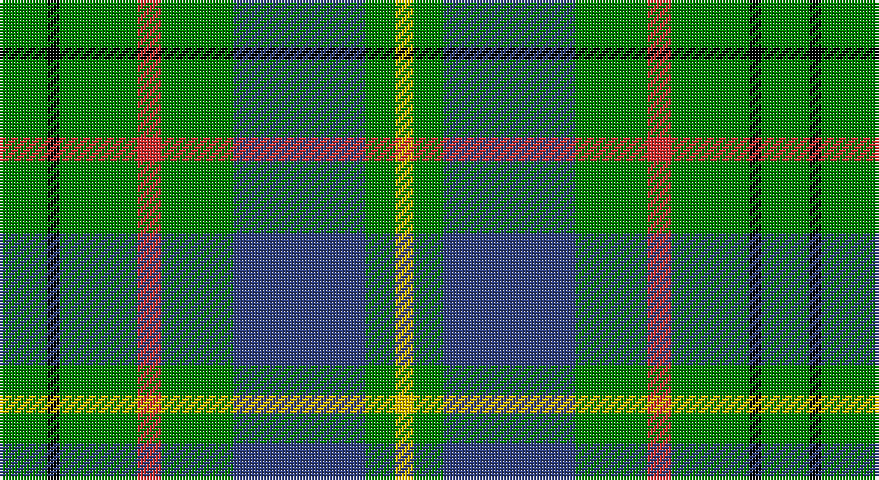

This page is one **sett** — a single exact thread-count. It belongs to the [tartan](/setts/g8k2g13r4g12db22g5ly3/)
(the same proportion at any scale), whose colour order is pattern [GKGRGBGY](/stripes/gkgrgbgy/).

Part of the [Taylor](/tartans/taylor/) tartan — the named design grouping this sett with its other cloths.

Sourced from weddslist.  It is a [8 stripe tartan](/stripes/stripes8/).

Original link http://www.weddslist.com/cgi-bin/tartans/pg.pl?source=sts

## Thread count
G/16 K4 G26 R8 G24 B44 G10 Y/6

One full sett is **254 threads**.

## Palette

Palette: <strong>Ingles Buchan</strong> <small style="color:#888">(1 of 5 colours)</small>
<table><thead><tr><th>Colour</th><th>Threads</th><th>Shade</th><th>Base</th><th>OKLCh</th></tr></thead><tbody><tr><td>G/</td><td style="text-align:right;font-variant-numeric:tabular-nums">16</td><td><code style="background-color:#008000;">#008000</code> <small style="color:#888">#008000</small></td><td>G <code style="background-color:#006100;">#006100</code></td><td><small style="color:#888">oklch(52.0% 0.177 142.5)</small></td></tr><tr><td>K</td><td style="text-align:right;font-variant-numeric:tabular-nums">4</td><td><code style="background-color:#000000;">#000000</code> <small style="color:#888">#000000</small></td><td>K <code style="background-color:#000000;">#000000</code></td><td><small style="color:#888">oklch(0.0% 0.000 0.0)</small></td></tr><tr><td>G</td><td style="text-align:right;font-variant-numeric:tabular-nums">26</td><td><code style="background-color:#008000;">#008000</code> <small style="color:#888">#008000</small></td><td>G <code style="background-color:#006100;">#006100</code></td><td><small style="color:#888">oklch(52.0% 0.177 142.5)</small></td></tr><tr><td>R</td><td style="text-align:right;font-variant-numeric:tabular-nums">8</td><td><code style="background-color:#D03030;">#D03030</code> <small style="color:#888">#D03030</small></td><td>R <code style="background-color:#CC0000;">#CC0000</code></td><td><small style="color:#888">oklch(56.4% 0.196 26.2)</small></td></tr><tr><td>G</td><td style="text-align:right;font-variant-numeric:tabular-nums">24</td><td><code style="background-color:#008000;">#008000</code> <small style="color:#888">#008000</small></td><td>G <code style="background-color:#006100;">#006100</code></td><td><small style="color:#888">oklch(52.0% 0.177 142.5)</small></td></tr><tr><td>B</td><td style="text-align:right;font-variant-numeric:tabular-nums">44</td><td><code style="background-color:#304080;">#304080</code> <small style="color:#888">#304080</small></td><td>B <code style="background-color:#2A418A;">#2A418A</code></td><td><small style="color:#888">oklch(39.4% 0.109 270.2)</small></td></tr><tr><td>G</td><td style="text-align:right;font-variant-numeric:tabular-nums">10</td><td><code style="background-color:#008000;">#008000</code> <small style="color:#888">#008000</small></td><td>G <code style="background-color:#006100;">#006100</code></td><td><small style="color:#888">oklch(52.0% 0.177 142.5)</small></td></tr><tr><td>Y/</td><td style="text-align:right;font-variant-numeric:tabular-nums">6</td><td><code style="background-color:#F0C000;">#F0C000</code> <small style="color:#888">#F0C000</small></td><td>Y <code style="background-color:#F2BF00;">#F2BF00</code></td><td><small style="color:#888">oklch(82.7% 0.169 90.5)</small></td></tr></tbody></table>

# Sample pattern

## Compared to the master

This cloth is one sett of its design; the master sett (the exemplar the design is anchored on) is below for comparison.

<figure style="margin:0"><figcaption style="color:#888;font-size:smaller">this sett</figcaption></figure>
<figure style="margin:0"><figcaption style="color:#888;font-size:smaller"><a href="/setts/g8k2g13lr4g12n22g5lo3/">master sett →</a></figcaption></figure>

## Nearest tartans

The nearest existing variants by ΔTartan distance, with this tartan at the top so the swatches line up against it.

ΔTartan

Tartan

Sett

—

<a href="/ttd/edit/#slug=g8k2g13r4g12db22g5ly3~x2">Taylor</a> <a class="nn-out" href="/variants/s8/g8k2g13r4g12db22g5ly3~x2/" title="open its dictionary page">↗</a>

0.68

<a href="/ttd/edit/#slug=g12k4g12w1b6w1ly4~x4&amp;base=g8k2g13r4g12db22g5ly3~x2">Pinder, Nigel (Personal)</a> <a class="nn-out" href="/variants/s7/g12k4g12w1b6w1ly4~x4/" title="open its dictionary page">↗</a>

0.95

<a href="/ttd/edit/#slug=db22g6db5t2g22r6g5r4g9w3~x2&amp;base=g8k2g13r4g12db22g5ly3~x2">MacConnell</a> <a class="nn-out" href="/variants/s10/db22g6db5t2g22r6g5r4g9w3~x2/" title="open its dictionary page">↗</a>

1.06

<a href="/ttd/edit/#slug=g4lo1dt1lo1dt2g9r1dt6w1~x4&amp;base=g8k2g13r4g12db22g5ly3~x2">Casey of West Virginia (Personal)</a> <a class="nn-out" href="/variants/s9/g4lo1dt1lo1dt2g9r1dt6w1~x4/" title="open its dictionary page">↗</a>

1.09

<a href="/ttd/edit/#slug=t1dp10k10g12k1g12t2g16w1~x2&amp;base=g8k2g13r4g12db22g5ly3~x2">Faskin Family (Aberdeenshire)</a> <a class="nn-out" href="/variants/s9/t1dp10k10g12k1g12t2g16w1~x2/" title="open its dictionary page">↗</a>

1.09

<a href="/ttd/edit/#slug=r3k8g17ly2g17k8b8k2~x2&amp;base=g8k2g13r4g12db22g5ly3~x2">Aztec, New Mexico</a> <a class="nn-out" href="/variants/s8/r3k8g17ly2g17k8b8k2~x2/" title="open its dictionary page">↗</a>

1.11

<a href="/ttd/edit/#slug=g25r4db25r13g25ly2t6~x2&amp;base=g8k2g13r4g12db22g5ly3~x2">Rotary</a> <a class="nn-out" href="/variants/s7/g25r4db25r13g25ly2t6~x2/" title="open its dictionary page">↗</a>

1.17

<a href="/ttd/edit/#slug=g10db1w1db1ly1db6g8r1~x8&amp;base=g8k2g13r4g12db22g5ly3~x2">Marshall Field</a> <a class="nn-out" href="/variants/s8/g10db1w1db1ly1db6g8r1~x8/" title="open its dictionary page">↗</a>

1.18

<a href="/ttd/edit/#slug=g13dp1g1dp1g3db5k4ly2~x2&amp;base=g8k2g13r4g12db22g5ly3~x2">Carrick Hunting District Tartan</a> <a class="nn-out" href="/variants/s8/g13dp1g1dp1g3db5k4ly2~x2/" title="open its dictionary page">↗</a>

1.18

<a href="/ttd/edit/#slug=k4g21w3g21db21r4~x2&amp;base=g8k2g13r4g12db22g5ly3~x2">Duncan</a> <a class="nn-out" href="/variants/s6/k4g21w3g21db21r4~x2/" title="open its dictionary page">↗</a>

1.20

<a href="/ttd/edit/#slug=g10r3g30y10w2db15r4~x2&amp;base=g8k2g13r4g12db22g5ly3~x2">Sinclair</a> <a class="nn-out" href="/variants/s7/g10r3g30y10w2db15r4~x2/" title="open its dictionary page">↗</a>

## Neighbour map

Every grey dot is one of 14360 variants placed by the first two principal components of the ΔTartan feature space (44% of its variance). Red is this tartan; blue dots are its nearest — click one to open its page.

<svg viewBox="0 0 640 380" role="img" style="max-width:100%;height:auto;border:1px solid #e0e0e0;border-radius:4px;display:block" xmlns="http://www.w3.org/2000/svg"><image href="/nn/cloud.v1.png" width="640" height="380"/><a href="/variants/s7/g12k4g12w1b6w1ly4~x4/"><circle cx="276.2" cy="196.5" r="4" fill="#3465a4"><title>Pinder, Nigel (Personal)</title></circle></a><a href="/variants/s10/db22g6db5t2g22r6g5r4g9w3~x2/"><circle cx="246.2" cy="180.8" r="4" fill="#3465a4"><title>MacConnell</title></circle></a><a href="/variants/s9/g4lo1dt1lo1dt2g9r1dt6w1~x4/"><circle cx="240.1" cy="181.0" r="4" fill="#3465a4"><title>Casey of West Virginia (Personal)</title></circle></a><a href="/variants/s9/t1dp10k10g12k1g12t2g16w1~x2/"><circle cx="317.4" cy="183.0" r="4" fill="#3465a4"><title>Faskin Family (Aberdeenshire)</title></circle></a><a href="/variants/s8/r3k8g17ly2g17k8b8k2~x2/"><circle cx="222.5" cy="208.5" r="4" fill="#3465a4"><title>Aztec, New Mexico</title></circle></a><a href="/variants/s7/g25r4db25r13g25ly2t6~x2/"><circle cx="242.5" cy="205.5" r="4" fill="#3465a4"><title>Rotary</title></circle></a><a href="/variants/s8/g10db1w1db1ly1db6g8r1~x8/"><circle cx="325.8" cy="186.9" r="4" fill="#3465a4"><title>Marshall Field</title></circle></a><a href="/variants/s8/g13dp1g1dp1g3db5k4ly2~x2/"><circle cx="288.9" cy="173.7" r="4" fill="#3465a4"><title>Carrick Hunting District Tartan</title></circle></a><a href="/variants/s6/k4g21w3g21db21r4~x2/"><circle cx="264.5" cy="235.7" r="4" fill="#3465a4"><title>Duncan</title></circle></a><a href="/variants/s7/g10r3g30y10w2db15r4~x2/"><circle cx="288.8" cy="190.0" r="4" fill="#3465a4"><title>Sinclair</title></circle></a><circle cx="265.6" cy="200.2" r="5" fill="#c00000"/></svg>

ID: /variants/s8/g8k2g13r4g12db22g5ly3~x2/
