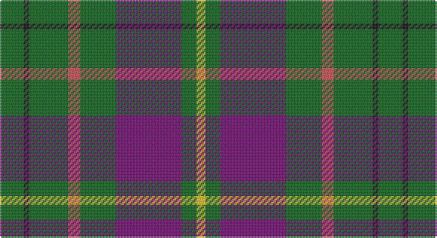

This page is one **sett** — a single exact thread-count. It belongs to the [tartan](/setts/g8k2g13r4g12dp22g5ly3/)
(the same proportion at any scale), whose colour order is pattern [GKGRGBGY](/stripes/gkgrgbgy/).

Part of the [Taylor](/tartans/taylor/) tartan — the named design grouping this sett with its other cloths.

Sourced from house-of-tartan.  It is a [8 stripe tartan](/stripes/stripes8/).

Original link http://www.house-of-tartan.scotland.net/house/TartanViewjs.asp?colr=Def&tnam=809

## Provenance

Earliest known date: 1955 Some similarity to the Cameron recorded in the Vestiarium Scoticum, which may be connected with the name of the designer, Lt Col Iain Cameron Taylor, or to the Clan Cameron warrior Taillear dubh na Tuaighe (Black Taylor of the Axe) who lived in the seventeenth century. The pink stripe is described as 'coral'. The tartan is recognised by the Cameron of Lochiel.

## Thread count
G/16 K4 G26 DO8 G24 P44 G10 Y/6

One full sett is **254 threads**.

## Palette

Palette: <strong>Tartan Register</strong> <small style="color:#888">(4 of 5 colours)</small>
<table><thead><tr><th>Colour</th><th>Threads</th><th>Shade</th><th>Base</th><th>OKLCh</th></tr></thead><tbody><tr><td>G/</td><td style="text-align:right;font-variant-numeric:tabular-nums">16</td><td><code style="background-color:#006818;">#006818</code> <small style="color:#888">#006818</small></td><td>G <code style="background-color:#006100;">#006100</code></td><td><small style="color:#888">oklch(45.0% 0.142 145.0)</small></td></tr><tr><td>K</td><td style="text-align:right;font-variant-numeric:tabular-nums">4</td><td><code style="background-color:#101010;">#101010</code> <small style="color:#888">#101010</small></td><td>K <code style="background-color:#000000;">#000000</code></td><td><small style="color:#888">oklch(17.3% 0.000 89.9)</small></td></tr><tr><td>G</td><td style="text-align:right;font-variant-numeric:tabular-nums">26</td><td><code style="background-color:#006818;">#006818</code> <small style="color:#888">#006818</small></td><td>G <code style="background-color:#006100;">#006100</code></td><td><small style="color:#888">oklch(45.0% 0.142 145.0)</small></td></tr><tr><td>DO</td><td style="text-align:right;font-variant-numeric:tabular-nums">8</td><td><code style="background-color:#D05054;">#D05054</code> <small style="color:#888">#D05054</small></td><td>R <code style="background-color:#CC0000;">#CC0000</code></td><td><small style="color:#888">oklch(60.2% 0.162 21.5)</small></td></tr><tr><td>G</td><td style="text-align:right;font-variant-numeric:tabular-nums">24</td><td><code style="background-color:#006818;">#006818</code> <small style="color:#888">#006818</small></td><td>G <code style="background-color:#006100;">#006100</code></td><td><small style="color:#888">oklch(45.0% 0.142 145.0)</small></td></tr><tr><td>P</td><td style="text-align:right;font-variant-numeric:tabular-nums">44</td><td><code style="background-color:#780078;">#780078</code> <small style="color:#888">#780078</small></td><td>B <code style="background-color:#2A418A;">#2A418A</code></td><td><small style="color:#888">oklch(40.2% 0.185 328.4)</small></td></tr><tr><td>G</td><td style="text-align:right;font-variant-numeric:tabular-nums">10</td><td><code style="background-color:#006818;">#006818</code> <small style="color:#888">#006818</small></td><td>G <code style="background-color:#006100;">#006100</code></td><td><small style="color:#888">oklch(45.0% 0.142 145.0)</small></td></tr><tr><td>Y/</td><td style="text-align:right;font-variant-numeric:tabular-nums">6</td><td><code style="background-color:#E8C000;">#E8C000</code> <small style="color:#888">#E8C000</small></td><td>Y <code style="background-color:#F2BF00;">#F2BF00</code></td><td><small style="color:#888">oklch(81.9% 0.168 93.7)</small></td></tr></tbody></table>

# Sample pattern

## Compared to the master

This cloth is one sett of its design; the master sett (the exemplar the design is anchored on) is below for comparison.

<figure style="margin:0"><figcaption style="color:#888;font-size:smaller">this sett</figcaption></figure>
<figure style="margin:0"><figcaption style="color:#888;font-size:smaller"><a href="/setts/g8k2g13lr4g12n22g5lo3/">master sett →</a></figcaption></figure>

## Nearest tartans

The nearest existing variants by ΔTartan distance, with this tartan at the top so the swatches line up against it.

ΔTartan

Tartan

Sett

—

<a href="/ttd/edit/#slug=g8k2g13r4g12dp22g5ly3~x2">Taylor Family Tartan</a> <a class="nn-out" href="/variants/s8/g8k2g13r4g12dp22g5ly3~x2/" title="open its dictionary page">↗</a>

0.80

<a href="/ttd/edit/#slug=g20k2g20dp25w2t3~x2&amp;base=g8k2g13r4g12dp22g5ly3~x2">Lawrence of Broughty Ferry (Corporat</a> <a class="nn-out" href="/variants/s6/g20k2g20dp25w2t3~x2/" title="open its dictionary page">↗</a>

0.95

<a href="/ttd/edit/#slug=g26db3g12k10dp15w2~x2&amp;base=g8k2g13r4g12dp22g5ly3~x2">Lossiemouth/Hersbruck</a> <a class="nn-out" href="/variants/s6/g26db3g12k10dp15w2~x2/" title="open its dictionary page">↗</a>

1.02

<a href="/ttd/edit/#slug=ly4n17k11r17n27k2w3~x2&amp;base=g8k2g13r4g12dp22g5ly3~x2">MacNamara</a> <a class="nn-out" href="/variants/s7/ly4n17k11r17n27k2w3~x2/" title="open its dictionary page">↗</a>

1.14

<a href="/ttd/edit/#slug=dg4k4m4k2dg12k2dg12k2m4dg4w1r4~x2&amp;base=g8k2g13r4g12dp22g5ly3~x2">Otago Peninsula</a> <a class="nn-out" href="/variants/s12/dg4k4m4k2dg12k2dg12k2m4dg4w1r4~x2/" title="open its dictionary page">↗</a>

1.20

<a href="/ttd/edit/#slug=g14dp11t3k2t3dp11g14ly1~x2&amp;base=g8k2g13r4g12dp22g5ly3~x2">Wellington (Wilson 122)</a> <a class="nn-out" href="/variants/s8/g14dp11t3k2t3dp11g14ly1~x2/" title="open its dictionary page">↗</a>

1.22

<a href="/ttd/edit/#slug=n8ly2n22dg6r2lb10dg12n3~x2&amp;base=g8k2g13r4g12dp22g5ly3~x2">Bahamas</a> <a class="nn-out" href="/variants/s8/n8ly2n22dg6r2lb10dg12n3~x2/" title="open its dictionary page">↗</a>

1.22

<a href="/ttd/edit/#slug=db1o9g5o1k5o1g5o9w1~x2&amp;base=g8k2g13r4g12dp22g5ly3~x2">Duchess of York</a> <a class="nn-out" href="/variants/s9/db1o9g5o1k5o1g5o9w1~x2/" title="open its dictionary page">↗</a>

1.24

<a href="/ttd/edit/#slug=lo2n10k2r5k2n19k2n19g17k2lo2~x2&amp;base=g8k2g13r4g12dp22g5ly3~x2">Montreat</a> <a class="nn-out" href="/variants/s11/lo2n10k2r5k2n19k2n19g17k2lo2~x2/" title="open its dictionary page">↗</a>

1.27

<a href="/ttd/edit/#slug=dg3w1dg12r6dg3k3g2~x4&amp;base=g8k2g13r4g12dp22g5ly3~x2">Arkansas</a> <a class="nn-out" href="/variants/s7/dg3w1dg12r6dg3k3g2~x4/" title="open its dictionary page">↗</a>

1.30

<a href="/ttd/edit/#slug=r3g10r3g14db16g3ly2~x2&amp;base=g8k2g13r4g12dp22g5ly3~x2">Cameron of Lochiel (Hunting)</a> <a class="nn-out" href="/variants/s7/r3g10r3g14db16g3ly2~x2/" title="open its dictionary page">↗</a>

## Neighbour map

Every grey dot is one of 14360 variants placed by the first two principal components of the ΔTartan feature space (44% of its variance). Red is this tartan; blue dots are its nearest — click one to open its page.

<svg viewBox="0 0 640 380" role="img" style="max-width:100%;height:auto;border:1px solid #e0e0e0;border-radius:4px;display:block" xmlns="http://www.w3.org/2000/svg"><image href="/nn/cloud.v1.png" width="640" height="380"/><a href="/variants/s6/g20k2g20dp25w2t3~x2/"><circle cx="303.1" cy="198.0" r="4" fill="#3465a4"><title>Lawrence of Broughty Ferry (Corporat</title></circle></a><a href="/variants/s6/g26db3g12k10dp15w2~x2/"><circle cx="275.1" cy="208.3" r="4" fill="#3465a4"><title>Lossiemouth/Hersbruck</title></circle></a><a href="/variants/s7/ly4n17k11r17n27k2w3~x2/"><circle cx="263.0" cy="181.6" r="4" fill="#3465a4"><title>MacNamara</title></circle></a><a href="/variants/s12/dg4k4m4k2dg12k2dg12k2m4dg4w1r4~x2/"><circle cx="280.9" cy="181.2" r="4" fill="#3465a4"><title>Otago Peninsula</title></circle></a><a href="/variants/s8/g14dp11t3k2t3dp11g14ly1~x2/"><circle cx="245.0" cy="190.1" r="4" fill="#3465a4"><title>Wellington (Wilson 122)</title></circle></a><a href="/variants/s8/n8ly2n22dg6r2lb10dg12n3~x2/"><circle cx="248.8" cy="196.4" r="4" fill="#3465a4"><title>Bahamas</title></circle></a><a href="/variants/s9/db1o9g5o1k5o1g5o9w1~x2/"><circle cx="248.1" cy="189.9" r="4" fill="#3465a4"><title>Duchess of York</title></circle></a><a href="/variants/s11/lo2n10k2r5k2n19k2n19g17k2lo2~x2/"><circle cx="285.7" cy="172.0" r="4" fill="#3465a4"><title>Montreat</title></circle></a><a href="/variants/s7/dg3w1dg12r6dg3k3g2~x4/"><circle cx="294.3" cy="191.2" r="4" fill="#3465a4"><title>Arkansas</title></circle></a><a href="/variants/s7/r3g10r3g14db16g3ly2~x2/"><circle cx="259.6" cy="225.9" r="4" fill="#3465a4"><title>Cameron of Lochiel (Hunting)</title></circle></a><circle cx="274.1" cy="194.5" r="5" fill="#c00000"/></svg>

ID: /variants/s8/g8k2g13r4g12dp22g5ly3~x2/
