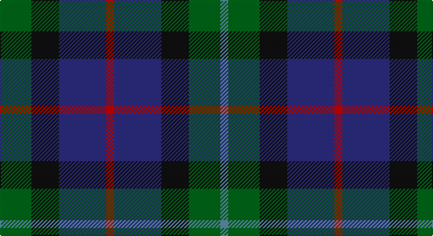

This page is one **sett** — a single exact thread-count. It belongs to the [tartan](/setts/g8k7db12r2db12k7g8t2/)
(the same proportion at any scale), whose colour order is pattern [BGKBRBKG](/stripes/bgkbrbkg/).

Part of the [Forbo Nairn](/tartans/forbo-nairn/) tartan — the named design grouping this sett with its other cloths.

Sourced from house-of-tartan.  It is a [8 stripe tartan](/stripes/stripes8/).

Original link http://www.house-of-tartan.scotland.net/house/TartanViewjs.asp?colr=Def&tnam=2298

## Provenance

Earliest known date: pre 2002 Designed for Forbo Nairn Ltd - a Swiss based company with two factories in Kirkcaldy, Fife. Tartan is based on the Nairn (#1331) because of an association with Michael Nairn, builder of the first 'floor cloth' (linoleum) factory in Scotland in 1843.STS said Approved by Sir Robert Spencer Nairn. Blue and red used in this graphic in place of dark blue and red so that sett could be seen.

## Thread count
G/32 K28 DB48 R8 DB48 K28 G32 B/8

One full sett is **424 threads**.

## Palette

Palette: <strong>Tartan Register</strong>
<table><thead><tr><th>Colour</th><th>Threads</th><th>Shade</th><th>Base</th><th>OKLCh</th></tr></thead><tbody><tr><td>G/</td><td style="text-align:right;font-variant-numeric:tabular-nums">32</td><td><code style="background-color:#006818;">#006818</code> <small style="color:#888">#006818</small></td><td>G <code style="background-color:#006100;">#006100</code></td><td><small style="color:#888">oklch(45.0% 0.142 145.0)</small></td></tr><tr><td>K</td><td style="text-align:right;font-variant-numeric:tabular-nums">28</td><td><code style="background-color:#101010;">#101010</code> <small style="color:#888">#101010</small></td><td>K <code style="background-color:#000000;">#000000</code></td><td><small style="color:#888">oklch(17.3% 0.000 89.9)</small></td></tr><tr><td>DB</td><td style="text-align:right;font-variant-numeric:tabular-nums">48</td><td><code style="background-color:#2C2C80;">#2C2C80</code> <small style="color:#888">#2C2C80</small></td><td>B <code style="background-color:#2A418A;">#2A418A</code></td><td><small style="color:#888">oklch(35.0% 0.138 276.6)</small></td></tr><tr><td>R</td><td style="text-align:right;font-variant-numeric:tabular-nums">8</td><td><code style="background-color:#C80000;">#C80000</code> <small style="color:#888">#C80000</small></td><td>R <code style="background-color:#CC0000;">#CC0000</code></td><td><small style="color:#888">oklch(52.3% 0.215 29.2)</small></td></tr><tr><td>DB</td><td style="text-align:right;font-variant-numeric:tabular-nums">48</td><td><code style="background-color:#2C2C80;">#2C2C80</code> <small style="color:#888">#2C2C80</small></td><td>B <code style="background-color:#2A418A;">#2A418A</code></td><td><small style="color:#888">oklch(35.0% 0.138 276.6)</small></td></tr><tr><td>K</td><td style="text-align:right;font-variant-numeric:tabular-nums">28</td><td><code style="background-color:#101010;">#101010</code> <small style="color:#888">#101010</small></td><td>K <code style="background-color:#000000;">#000000</code></td><td><small style="color:#888">oklch(17.3% 0.000 89.9)</small></td></tr><tr><td>G</td><td style="text-align:right;font-variant-numeric:tabular-nums">32</td><td><code style="background-color:#006818;">#006818</code> <small style="color:#888">#006818</small></td><td>G <code style="background-color:#006100;">#006100</code></td><td><small style="color:#888">oklch(45.0% 0.142 145.0)</small></td></tr><tr><td>B/</td><td style="text-align:right;font-variant-numeric:tabular-nums">8</td><td><code style="background-color:#5C8CA8;">#5C8CA8</code> <small style="color:#888">#5C8CA8</small></td><td>B <code style="background-color:#2A418A;">#2A418A</code></td><td><small style="color:#888">oklch(61.7% 0.067 235.0)</small></td></tr></tbody></table>

# Sample pattern

## Compared to the master

This cloth is one sett of its design; the master sett (the exemplar the design is anchored on) is below for comparison.

<figure style="margin:0"><figcaption style="color:#888;font-size:smaller">this sett</figcaption></figure>
<figure style="margin:0"><figcaption style="color:#888;font-size:smaller"><a href="/setts/r2db12k7g8t2/">master sett →</a></figcaption></figure>

## Nearest tartans

The nearest existing variants by ΔTartan distance, with this tartan at the top so the swatches line up against it.

ΔTartan

Tartan

Sett

—

<a href="/ttd/edit/#slug=g8k7db12r2db12k7g8t2~x4">Forbo Nairn Corporate Tartan</a> <a class="nn-out" href="/variants/s8/g8k7db12r2db12k7g8t2~x4/" title="open its dictionary page">↗</a>

1.10

<a href="/ttd/edit/#slug=db18k17db3g18db4g18db3k17db18p4~x2&amp;base=g8k7db12r2db12k7g8t2~x4">Scottish Airports Corporate Tartan</a> <a class="nn-out" href="/variants/s10/db18k17db3g18db4g18db3k17db18p4~x2/" title="open its dictionary page">↗</a>

1.11

<a href="/ttd/edit/#slug=db10r7db31k25dg23k8db7k8ly5~x2&amp;base=g8k7db12r2db12k7g8t2~x4">MacCallum of Berwick</a> <a class="nn-out" href="/variants/s9/db10r7db31k25dg23k8db7k8ly5~x2/" title="open its dictionary page">↗</a>

1.11

<a href="/ttd/edit/#slug=g21k14g9db21k3db12dp3~x2&amp;base=g8k7db12r2db12k7g8t2~x4">Scotsman</a> <a class="nn-out" href="/variants/s7/g21k14g9db21k3db12dp3~x2/" title="open its dictionary page">↗</a>

1.12

<a href="/ttd/edit/#slug=db10o3db10r3k21g20k15r3~x2&amp;base=g8k7db12r2db12k7g8t2~x4">Williamson/Smart (Personal)</a> <a class="nn-out" href="/variants/s8/db10o3db10r3k21g20k15r3~x2/" title="open its dictionary page">↗</a>

1.14

<a href="/ttd/edit/#slug=db4dg6w1dg6k6db6k2~x2&amp;base=g8k7db12r2db12k7g8t2~x4">MacNeil of Colonsay</a> <a class="nn-out" href="/variants/s7/db4dg6w1dg6k6db6k2~x2/" title="open its dictionary page">↗</a>

1.16

<a href="/ttd/edit/#slug=k19g3db19lo5db19g3k19g19r7g19~x2&amp;base=g8k7db12r2db12k7g8t2~x4">Casely Family Tartan</a> <a class="nn-out" href="/variants/s10/k19g3db19lo5db19g3k19g19r7g19~x2/" title="open its dictionary page">↗</a>

1.17

<a href="/ttd/edit/#slug=db8dg8db1dg8k8db8ly2~x2&amp;base=g8k7db12r2db12k7g8t2~x4">MacKay</a> <a class="nn-out" href="/variants/s7/db8dg8db1dg8k8db8ly2~x2/" title="open its dictionary page">↗</a>

1.19

<a href="/variants/s8/k8t3g13dp12ly2~x2/">Wilson's No.176</a>

1.20

<a href="/ttd/edit/#slug=k6dg6ly1dg6k6dp6k1~x4&amp;base=g8k7db12r2db12k7g8t2~x4">Abercrombie (Wilsons No 2/64)</a> <a class="nn-out" href="/variants/s7/k6dg6ly1dg6k6dp6k1~x4/" title="open its dictionary page">↗</a>

1.20

<a href="/ttd/edit/#slug=dg8k9db7r2db2r2db7k9dg8t3~x2&amp;base=g8k7db12r2db12k7g8t2~x4">Wellington (Wilson)</a> <a class="nn-out" href="/variants/s10/dg8k9db7r2db2r2db7k9dg8t3~x2/" title="open its dictionary page">↗</a>

## Neighbour map

Every grey dot is one of 14360 variants placed by the first two principal components of the ΔTartan feature space (44% of its variance). Red is this tartan; blue dots are its nearest — click one to open its page.

<svg viewBox="0 0 640 380" role="img" style="max-width:100%;height:auto;border:1px solid #e0e0e0;border-radius:4px;display:block" xmlns="http://www.w3.org/2000/svg"><image href="/nn/cloud.v1.png" width="640" height="380"/><a href="/variants/s10/db18k17db3g18db4g18db3k17db18p4~x2/"><circle cx="183.7" cy="258.6" r="4" fill="#3465a4"><title>Scottish Airports Corporate Tartan</title></circle></a><a href="/variants/s9/db10r7db31k25dg23k8db7k8ly5~x2/"><circle cx="159.6" cy="225.1" r="4" fill="#3465a4"><title>MacCallum of Berwick</title></circle></a><a href="/variants/s7/g21k14g9db21k3db12dp3~x2/"><circle cx="210.8" cy="270.0" r="4" fill="#3465a4"><title>Scotsman</title></circle></a><a href="/variants/s8/db10o3db10r3k21g20k15r3~x2/"><circle cx="172.9" cy="225.3" r="4" fill="#3465a4"><title>Williamson/Smart (Personal)</title></circle></a><a href="/variants/s7/db4dg6w1dg6k6db6k2~x2/"><circle cx="161.7" cy="281.1" r="4" fill="#3465a4"><title>MacNeil of Colonsay</title></circle></a><a href="/variants/s10/k19g3db19lo5db19g3k19g19r7g19~x2/"><circle cx="116.6" cy="232.4" r="4" fill="#3465a4"><title>Casely Family Tartan</title></circle></a><a href="/variants/s7/db8dg8db1dg8k8db8ly2~x2/"><circle cx="200.6" cy="277.9" r="4" fill="#3465a4"><title>MacKay</title></circle></a><a href="/variants/s8/k8t3g13dp12ly2~x2/"><circle cx="150.3" cy="234.7" r="4" fill="#3465a4"><title>Wilson's No.176</title></circle></a><a href="/variants/s7/k6dg6ly1dg6k6dp6k1~x4/"><circle cx="192.8" cy="280.0" r="4" fill="#3465a4"><title>Abercrombie (Wilsons No 2/64)</title></circle></a><a href="/variants/s10/dg8k9db7r2db2r2db7k9dg8t3~x2/"><circle cx="102.9" cy="254.2" r="4" fill="#3465a4"><title>Wellington (Wilson)</title></circle></a><circle cx="163.7" cy="259.9" r="5" fill="#c00000"/></svg>

ID: /variants/s8/g8k7db12r2db12k7g8t2~x4/
