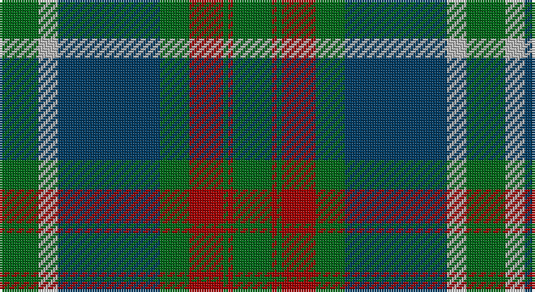

This page is one **sett** — a single exact thread-count. It belongs to the [tartan](/setts/g8lr4dt21g6r7g1r1g8/)
(the same proportion at any scale), whose colour order is pattern [GRGRGBYG](/stripes/grgrgbyg/).

Sourced from register-of-tartans.  It is a [8 stripe tartan](/stripes/stripes8/).

Original link https://www.tartanregister.gov.uk/tartanDetails.aspx?ref=596

2 attestations — the source records this cloth was collapsed from (oldest owns this page)

<ul>
<li>01/01/1840 — Cathcart (register-of-tartans, <a href="https://www.tartanregister.gov.uk/tartanDetails.aspx?ref=596">record</a>)</li>
<li>pre 1840 — Cathcart (Artefact) (tartans-authority, <a href="http://www.tartansauthority.com/tartan-ferret/display/4479/">record</a>)</li>
</ul>

## Register references

External register numbers recorded for this tartan.

- Scottish Register of Tartans: [596](https://www.tartanregister.gov.uk/tartanDetails.aspx?ref=596)
- Scottish Tartans Authority (ITI): 4479

## Thread count
G/16 N8 DB42 G12 DR14 G2 DR2 G/16

One full sett is **192 threads**.

## Palette

Palette: <strong>Tartan Register</strong> <small style="color:#888">(3 of 4 colours)</small>
<table><thead><tr><th>Colour</th><th>Threads</th><th>Shade</th><th>Base</th><th>OKLCh</th></tr></thead><tbody><tr><td>G/</td><td style="text-align:right;font-variant-numeric:tabular-nums">16</td><td><code style="background-color:#006818;">#006818</code> <small style="color:#888">#006818</small></td><td>G <code style="background-color:#006100;">#006100</code></td><td><small style="color:#888">oklch(45.0% 0.142 145.0)</small></td></tr><tr><td>N</td><td style="text-align:right;font-variant-numeric:tabular-nums">8</td><td><code style="background-color:#B8B8B8;">#B8B8B8</code> <small style="color:#888">#B8B8B8</small></td><td>Y <code style="background-color:#F2BF00;">#F2BF00</code></td><td><small style="color:#888">oklch(78.3% 0.000 89.9)</small></td></tr><tr><td>DB</td><td style="text-align:right;font-variant-numeric:tabular-nums">42</td><td><code style="background-color:#003C64;">#003C64</code> <small style="color:#888">#003C64</small></td><td>B <code style="background-color:#2A418A;">#2A418A</code></td><td><small style="color:#888">oklch(34.5% 0.089 246.0)</small></td></tr><tr><td>G</td><td style="text-align:right;font-variant-numeric:tabular-nums">12</td><td><code style="background-color:#006818;">#006818</code> <small style="color:#888">#006818</small></td><td>G <code style="background-color:#006100;">#006100</code></td><td><small style="color:#888">oklch(45.0% 0.142 145.0)</small></td></tr><tr><td>DR</td><td style="text-align:right;font-variant-numeric:tabular-nums">14</td><td><code style="background-color:#A00000;">#A00000</code> <small style="color:#888">#A00000</small></td><td>R <code style="background-color:#CC0000;">#CC0000</code></td><td><small style="color:#888">oklch(44.3% 0.182 29.2)</small></td></tr><tr><td>G</td><td style="text-align:right;font-variant-numeric:tabular-nums">2</td><td><code style="background-color:#006818;">#006818</code> <small style="color:#888">#006818</small></td><td>G <code style="background-color:#006100;">#006100</code></td><td><small style="color:#888">oklch(45.0% 0.142 145.0)</small></td></tr><tr><td>DR</td><td style="text-align:right;font-variant-numeric:tabular-nums">2</td><td><code style="background-color:#A00000;">#A00000</code> <small style="color:#888">#A00000</small></td><td>R <code style="background-color:#CC0000;">#CC0000</code></td><td><small style="color:#888">oklch(44.3% 0.182 29.2)</small></td></tr><tr><td>G/</td><td style="text-align:right;font-variant-numeric:tabular-nums">16</td><td><code style="background-color:#006818;">#006818</code> <small style="color:#888">#006818</small></td><td>G <code style="background-color:#006100;">#006100</code></td><td><small style="color:#888">oklch(45.0% 0.142 145.0)</small></td></tr></tbody></table>

# Sample pattern

## Nearest tartans

The nearest existing variants by ΔTartan distance, with this tartan at the top so the swatches line up against it.

ΔTartan

Tartan

Sett

—

<a href="/ttd/edit/#slug=g8lr4dt21g6r7g1r1g8~x2">Cathcart</a> <a class="nn-out" href="/variants/s8/g8lr4dt21g6r7g1r1g8~x2/" title="open its dictionary page">↗</a>

0.83

<a href="/ttd/edit/#slug=g5k1lo2k1g19k15lo2y20g3~x2&amp;base=g8lr4dt21g6r7g1r1g8~x2">Maine Acadia</a> <a class="nn-out" href="/variants/s9/g5k1lo2k1g19k15lo2y20g3~x2/" title="open its dictionary page">↗</a>

0.95

<a href="/ttd/edit/#slug=oi28g2oi4db18g23db2g3o4~x2&amp;base=g8lr4dt21g6r7g1r1g8~x2">Dalbraith-Eastern Western Motor Group</a> <a class="nn-out" href="/variants/s8/oi28g2oi4db18g23db2g3o4~x2/" title="open its dictionary page">↗</a>

0.96

<a href="/ttd/edit/#slug=dg5k1ly2k1dg19k15ly2dt20dg3~x2&amp;base=g8lr4dt21g6r7g1r1g8~x2">Maine Acadia (Fashion)</a> <a class="nn-out" href="/variants/s9/dg5k1ly2k1dg19k15ly2dt20dg3~x2/" title="open its dictionary page">↗</a>

0.96

<a href="/ttd/edit/#slug=k4db16k12g24r1g2k2~x2&amp;base=g8lr4dt21g6r7g1r1g8~x2">Dundas Clan Tartan</a> <a class="nn-out" href="/variants/s7/k4db16k12g24r1g2k2~x2/" title="open its dictionary page">↗</a>

1.18

<a href="/ttd/edit/#slug=g24ly3g4ly1g17k25t2k2t2k2t22~x2&amp;base=g8lr4dt21g6r7g1r1g8~x2">Hunting, The</a> <a class="nn-out" href="/variants/s11/g24ly3g4ly1g17k25t2k2t2k2t22~x2/" title="open its dictionary page">↗</a>

1.18

<a href="/ttd/edit/#slug=r6db2r1db16r3db16dg28w2dg4~x2&amp;base=g8lr4dt21g6r7g1r1g8~x2">George (Personal)</a> <a class="nn-out" href="/variants/s9/r6db2r1db16r3db16dg28w2dg4~x2/" title="open its dictionary page">↗</a>

1.18

<a href="/ttd/edit/#slug=t3dy26g4t13k13t2~x2&amp;base=g8lr4dt21g6r7g1r1g8~x2">MacTavish Hunting Clan Tartan</a> <a class="nn-out" href="/variants/s6/t3dy26g4t13k13t2~x2/" title="open its dictionary page">↗</a>

1.19

<a href="/ttd/edit/#slug=g19w1db12t2db2t2db2t16~x2&amp;base=g8lr4dt21g6r7g1r1g8~x2">Norwich No.052</a> <a class="nn-out" href="/variants/s8/g19w1db12t2db2t2db2t16~x2/" title="open its dictionary page">↗</a>

1.20

<a href="/ttd/edit/#slug=g28r12g4db20lo2db3lo2db3g7~x2&amp;base=g8lr4dt21g6r7g1r1g8~x2">Cork Irish County Tartan</a> <a class="nn-out" href="/variants/s9/g28r12g4db20lo2db3lo2db3g7~x2/" title="open its dictionary page">↗</a>

1.20

<a href="/ttd/edit/#slug=g14w1g7k7db2k2db2k2db7~x4&amp;base=g8lr4dt21g6r7g1r1g8~x2">Abercrombie</a> <a class="nn-out" href="/variants/s9/g14w1g7k7db2k2db2k2db7~x4/" title="open its dictionary page">↗</a>

## Neighbour map

Every grey dot is one of 14360 variants placed by the first two principal components of the ΔTartan feature space (44% of its variance). Red is this tartan; blue dots are its nearest — click one to open its page.

<svg viewBox="0 0 640 380" role="img" style="max-width:100%;height:auto;border:1px solid #e0e0e0;border-radius:4px;display:block" xmlns="http://www.w3.org/2000/svg"><image href="/nn/cloud.v1.png" width="640" height="380"/><a href="/variants/s9/g5k1lo2k1g19k15lo2y20g3~x2/"><circle cx="252.5" cy="172.8" r="4" fill="#3465a4"><title>Maine Acadia</title></circle></a><a href="/variants/s8/oi28g2oi4db18g23db2g3o4~x2/"><circle cx="231.4" cy="188.8" r="4" fill="#3465a4"><title>Dalbraith-Eastern Western Motor Group</title></circle></a><a href="/variants/s9/dg5k1ly2k1dg19k15ly2dt20dg3~x2/"><circle cx="262.9" cy="182.6" r="4" fill="#3465a4"><title>Maine Acadia (Fashion)</title></circle></a><a href="/variants/s7/k4db16k12g24r1g2k2~x2/"><circle cx="292.0" cy="191.6" r="4" fill="#3465a4"><title>Dundas Clan Tartan</title></circle></a><a href="/variants/s11/g24ly3g4ly1g17k25t2k2t2k2t22~x2/"><circle cx="274.8" cy="159.1" r="4" fill="#3465a4"><title>Hunting, The</title></circle></a><a href="/variants/s9/r6db2r1db16r3db16dg28w2dg4~x2/"><circle cx="316.1" cy="164.9" r="4" fill="#3465a4"><title>George (Personal)</title></circle></a><a href="/variants/s6/t3dy26g4t13k13t2~x2/"><circle cx="251.6" cy="215.6" r="4" fill="#3465a4"><title>MacTavish Hunting Clan Tartan</title></circle></a><a href="/variants/s8/g19w1db12t2db2t2db2t16~x2/"><circle cx="236.1" cy="176.2" r="4" fill="#3465a4"><title>Norwich No.052</title></circle></a><a href="/variants/s9/g28r12g4db20lo2db3lo2db3g7~x2/"><circle cx="303.5" cy="193.3" r="4" fill="#3465a4"><title>Cork Irish County Tartan</title></circle></a><a href="/variants/s9/g14w1g7k7db2k2db2k2db7~x4/"><circle cx="266.7" cy="203.9" r="4" fill="#3465a4"><title>Abercrombie</title></circle></a><circle cx="270.9" cy="193.1" r="5" fill="#c00000"/></svg>

ID: /variants/s8/g8lr4dt21g6r7g1r1g8~x2/
