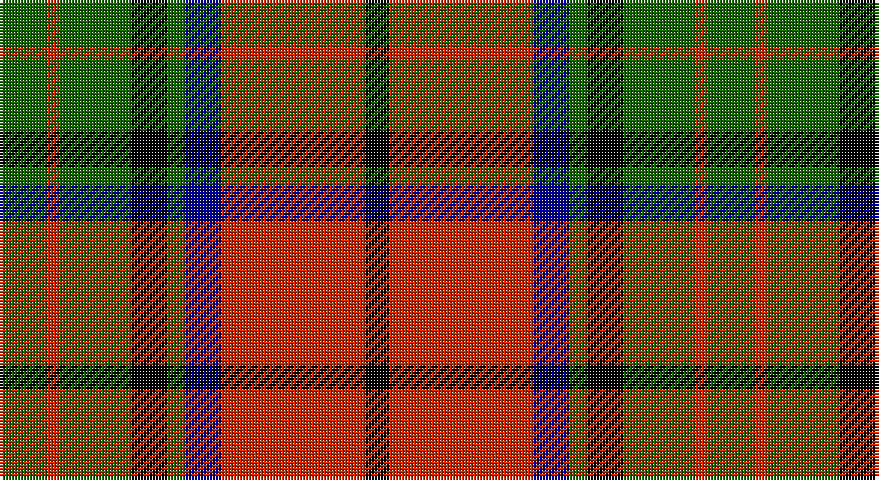

This page is one **sett** — a single exact thread-count. It belongs to the [tartan](/setts/g8r2g12k6g3db6r24k4/)
(the same proportion at any scale), whose colour order is pattern [GRGKGBRK](/stripes/grgkgbrk/).

Part of the [Dickie](/tartans/dickie/) tartan — the named design grouping this sett with its other cloths.

Sourced from register-of-tartans.  It is a [8 stripe tartan](/stripes/stripes8/).

Original link https://www.tartanregister.gov.uk/tartanDetails.aspx?ref=936

2 attestations — the source records this cloth was collapsed from (oldest owns this page)

<ul>
<li>01/01/1982 — Dickie (register-of-tartans, <a href="https://www.tartanregister.gov.uk/tartanDetails.aspx?ref=936">record</a>)</li>
<li>1982 — Dickie (Name) (tartans-authority, <a href="http://www.tartansauthority.com/tartan-ferret/display/4192/">record</a>)</li>
</ul>

## Register references

External register numbers recorded for this tartan.

- Scottish Register of Tartans: [936](https://www.tartanregister.gov.uk/tartanDetails.aspx?ref=936)
- Scottish Tartans Authority (ITI): 4192

## Thread count
G/16 R4 G24 K12 G6 DB12 R48 K/8

One full sett is **236 threads**.

## Palette

Palette: <strong>Tartan Register</strong> <small style="color:#888">(4 of 5 colours)</small>
<table><thead><tr><th>Colour</th><th>Threads</th><th>Shade</th><th>Base</th><th>OKLCh</th></tr></thead><tbody><tr><td>G/</td><td style="text-align:right;font-variant-numeric:tabular-nums">16</td><td><code style="background-color:#146400;">#146400</code> <small style="color:#888">#146400</small></td><td>G <code style="background-color:#006100;">#006100</code></td><td><small style="color:#888">oklch(43.9% 0.144 140.9)</small></td></tr><tr><td>R</td><td style="text-align:right;font-variant-numeric:tabular-nums">4</td><td><code style="background-color:#C82800;">#C82800</code> <small style="color:#888">#C82800</small></td><td>R <code style="background-color:#CC0000;">#CC0000</code></td><td><small style="color:#888">oklch(54.0% 0.199 33.0)</small></td></tr><tr><td>G</td><td style="text-align:right;font-variant-numeric:tabular-nums">24</td><td><code style="background-color:#146400;">#146400</code> <small style="color:#888">#146400</small></td><td>G <code style="background-color:#006100;">#006100</code></td><td><small style="color:#888">oklch(43.9% 0.144 140.9)</small></td></tr><tr><td>K</td><td style="text-align:right;font-variant-numeric:tabular-nums">12</td><td><code style="background-color:#000000;">#000000</code> <small style="color:#888">#000000</small></td><td>K <code style="background-color:#000000;">#000000</code></td><td><small style="color:#888">oklch(0.0% 0.000 0.0)</small></td></tr><tr><td>G</td><td style="text-align:right;font-variant-numeric:tabular-nums">6</td><td><code style="background-color:#146400;">#146400</code> <small style="color:#888">#146400</small></td><td>G <code style="background-color:#006100;">#006100</code></td><td><small style="color:#888">oklch(43.9% 0.144 140.9)</small></td></tr><tr><td>DB</td><td style="text-align:right;font-variant-numeric:tabular-nums">12</td><td><code style="background-color:#00008C;">#00008C</code> <small style="color:#888">#00008C</small></td><td>B <code style="background-color:#2A418A;">#2A418A</code></td><td><small style="color:#888">oklch(28.9% 0.200 264.1)</small></td></tr><tr><td>R</td><td style="text-align:right;font-variant-numeric:tabular-nums">48</td><td><code style="background-color:#C82800;">#C82800</code> <small style="color:#888">#C82800</small></td><td>R <code style="background-color:#CC0000;">#CC0000</code></td><td><small style="color:#888">oklch(54.0% 0.199 33.0)</small></td></tr><tr><td>K/</td><td style="text-align:right;font-variant-numeric:tabular-nums">8</td><td><code style="background-color:#000000;">#000000</code> <small style="color:#888">#000000</small></td><td>K <code style="background-color:#000000;">#000000</code></td><td><small style="color:#888">oklch(0.0% 0.000 0.0)</small></td></tr></tbody></table>

# Sample pattern

## Compared to the master

This cloth is one sett of its design; the master sett (the exemplar the design is anchored on) is below for comparison.

<figure style="margin:0"><figcaption style="color:#888;font-size:smaller">this sett</figcaption></figure>
<figure style="margin:0"><figcaption style="color:#888;font-size:smaller"><a href="/setts/k5db1k1n1k3n1k1db1k3db1k1g1k16g1k1n1k2/">master sett →</a></figcaption></figure>

## Nearest tartans

The nearest existing variants by ΔTartan distance, with this tartan at the top so the swatches line up against it.

ΔTartan

Tartan

Sett

—

<a href="/ttd/edit/#slug=g8r2g12k6g3db6r24k4~x2">Dickie</a> <a class="nn-out" href="/variants/s8/g8r2g12k6g3db6r24k4~x2/" title="open its dictionary page">↗</a>

0.56

<a href="/ttd/edit/#slug=g1r9g3k3g3r1k9w1~x2&amp;base=g8r2g12k6g3db6r24k4~x2">Manson Family Tartan</a> <a class="nn-out" href="/variants/s8/g1r9g3k3g3r1k9w1~x2/" title="open its dictionary page">↗</a>

0.68

<a href="/ttd/edit/#slug=k44lo9k3lo8lo16lo15lo6k7~x2&amp;base=g8r2g12k6g3db6r24k4~x2">Longford County Crest (Fashion)</a> <a class="nn-out" href="/variants/s8/k44lo9k3lo8lo16lo15lo6k7~x2/" title="open its dictionary page">↗</a>

0.69

<a href="/ttd/edit/#slug=k15dg1k3r9dg1r3lo11k1~x4&amp;base=g8r2g12k6g3db6r24k4~x2">Island of Innis, The</a> <a class="nn-out" href="/variants/s8/k15dg1k3r9dg1r3lo11k1~x4/" title="open its dictionary page">↗</a>

0.71

<a href="/ttd/edit/#slug=g3r20g16k22lo6k3g2~x2&amp;base=g8r2g12k6g3db6r24k4~x2">Wcwm 1062</a> <a class="nn-out" href="/variants/s7/g3r20g16k22lo6k3g2~x2/" title="open its dictionary page">↗</a>

0.80

<a href="/ttd/edit/#slug=w2k1dg16k12r12k1w2~x2&amp;base=g8r2g12k6g3db6r24k4~x2">Prince Edward Island #2</a> <a class="nn-out" href="/variants/s7/w2k1dg16k12r12k1w2~x2/" title="open its dictionary page">↗</a>

0.81

<a href="/ttd/edit/#slug=ly2dg7k6r11k1r1ly2~x4&amp;base=g8r2g12k6g3db6r24k4~x2">Blackstock Red (Dress)</a> <a class="nn-out" href="/variants/s7/ly2dg7k6r11k1r1ly2~x4/" title="open its dictionary page">↗</a>

0.82

<a href="/ttd/edit/#slug=k1db1r16g16k12db8r16db1k1~x2&amp;base=g8r2g12k6g3db6r24k4~x2">MacNaughton</a> <a class="nn-out" href="/variants/s9/k1db1r16g16k12db8r16db1k1~x2/" title="open its dictionary page">↗</a>

0.86

<a href="/ttd/edit/#slug=db1k1r12g12k6db5r12k1db1~x2&amp;base=g8r2g12k6g3db6r24k4~x2">Montrose</a> <a class="nn-out" href="/variants/s9/db1k1r12g12k6db5r12k1db1~x2/" title="open its dictionary page">↗</a>

0.88

<a href="/ttd/edit/#slug=k3r8k3r8lo19r7dt36r3~x2&amp;base=g8r2g12k6g3db6r24k4~x2">Private SA Club</a> <a class="nn-out" href="/variants/s8/k3r8k3r8lo19r7dt36r3~x2/" title="open its dictionary page">↗</a>

0.88

<a href="/ttd/edit/#slug=k9lr4k1lr4dg15r4k1~x4&amp;base=g8r2g12k6g3db6r24k4~x2">Logan - 1797 (Dark)</a> <a class="nn-out" href="/variants/s7/k9lr4k1lr4dg15r4k1~x4/" title="open its dictionary page">↗</a>

## Neighbour map

Every grey dot is one of 14360 variants placed by the first two principal components of the ΔTartan feature space (44% of its variance). Red is this tartan; blue dots are its nearest — click one to open its page.

<svg viewBox="0 0 640 380" role="img" style="max-width:100%;height:auto;border:1px solid #e0e0e0;border-radius:4px;display:block" xmlns="http://www.w3.org/2000/svg"><image href="/nn/cloud.v1.png" width="640" height="380"/><a href="/variants/s8/g1r9g3k3g3r1k9w1~x2/"><circle cx="202.7" cy="193.3" r="4" fill="#3465a4"><title>Manson Family Tartan</title></circle></a><a href="/variants/s8/k44lo9k3lo8lo16lo15lo6k7~x2/"><circle cx="212.1" cy="166.7" r="4" fill="#3465a4"><title>Longford County Crest (Fashion)</title></circle></a><a href="/variants/s8/k15dg1k3r9dg1r3lo11k1~x4/"><circle cx="232.9" cy="163.7" r="4" fill="#3465a4"><title>Island of Innis, The</title></circle></a><a href="/variants/s7/g3r20g16k22lo6k3g2~x2/"><circle cx="179.2" cy="197.8" r="4" fill="#3465a4"><title>Wcwm 1062</title></circle></a><a href="/variants/s7/w2k1dg16k12r12k1w2~x2/"><circle cx="191.0" cy="168.3" r="4" fill="#3465a4"><title>Prince Edward Island #2</title></circle></a><a href="/variants/s7/ly2dg7k6r11k1r1ly2~x4/"><circle cx="187.8" cy="183.9" r="4" fill="#3465a4"><title>Blackstock Red (Dress)</title></circle></a><a href="/variants/s9/k1db1r16g16k12db8r16db1k1~x2/"><circle cx="218.3" cy="160.0" r="4" fill="#3465a4"><title>MacNaughton</title></circle></a><a href="/variants/s9/db1k1r12g12k6db5r12k1db1~x2/"><circle cx="226.2" cy="169.7" r="4" fill="#3465a4"><title>Montrose</title></circle></a><a href="/variants/s8/k3r8k3r8lo19r7dt36r3~x2/"><circle cx="229.0" cy="173.9" r="4" fill="#3465a4"><title>Private SA Club</title></circle></a><a href="/variants/s7/k9lr4k1lr4dg15r4k1~x4/"><circle cx="214.9" cy="186.2" r="4" fill="#3465a4"><title>Logan - 1797 (Dark)</title></circle></a><circle cx="200.1" cy="181.3" r="5" fill="#c00000"/></svg>

ID: /variants/s8/g8r2g12k6g3db6r24k4~x2/
