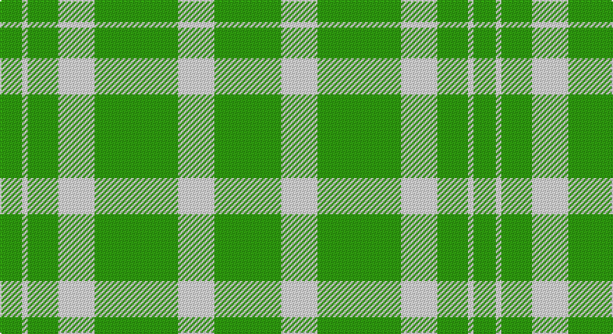

This page is one **sett** — a single exact thread-count. It belongs to the [tartan](/setts/g8w2g11w13g30w13g11g2/)
(the same proportion at any scale), whose colour order is pattern [GGWGWGWG](/stripes/ggwgwgwg/).

Part of the [Jubilation](/tartans/jubilation/) tartan — the named design grouping this sett with its other cloths.

Sourced from weddslist.  It is a [8 stripe tartan](/stripes/stripes8/).

Original link http://www.weddslist.com/cgi-bin/tartans/pg.pl?source=sts

## Thread count
G/16 LN4 G22 LN26 G60 LN26 G22 G/4

One full sett is **340 threads**.

## Palette

Palette: <strong>Tartan Dictionary</strong> <small style="color:#888">(1 of 2 colours)</small>
<table><thead><tr><th>Colour</th><th>Threads</th><th>Shade</th><th>Base</th><th>OKLCh</th></tr></thead><tbody><tr><td>G/</td><td style="text-align:right;font-variant-numeric:tabular-nums">16</td><td><code style="background-color:#30A010;">#30A010</code> <small style="color:#888">#30A010</small></td><td>G <code style="background-color:#006100;">#006100</code></td><td><small style="color:#888">oklch(61.9% 0.195 140.5)</small></td></tr><tr><td>LN</td><td style="text-align:right;font-variant-numeric:tabular-nums">4</td><td><code style="background-color:#E0E0E0;">#E0E0E0</code> <small style="color:#888">#E0E0E0</small></td><td>W <code style="background-color:#F7F7F7;">#F7F7F7</code></td><td><small style="color:#888">oklch(90.7% 0.000 89.9)</small></td></tr><tr><td>G</td><td style="text-align:right;font-variant-numeric:tabular-nums">22</td><td><code style="background-color:#30A010;">#30A010</code> <small style="color:#888">#30A010</small></td><td>G <code style="background-color:#006100;">#006100</code></td><td><small style="color:#888">oklch(61.9% 0.195 140.5)</small></td></tr><tr><td>LN</td><td style="text-align:right;font-variant-numeric:tabular-nums">26</td><td><code style="background-color:#E0E0E0;">#E0E0E0</code> <small style="color:#888">#E0E0E0</small></td><td>W <code style="background-color:#F7F7F7;">#F7F7F7</code></td><td><small style="color:#888">oklch(90.7% 0.000 89.9)</small></td></tr><tr><td>G</td><td style="text-align:right;font-variant-numeric:tabular-nums">60</td><td><code style="background-color:#30A010;">#30A010</code> <small style="color:#888">#30A010</small></td><td>G <code style="background-color:#006100;">#006100</code></td><td><small style="color:#888">oklch(61.9% 0.195 140.5)</small></td></tr><tr><td>LN</td><td style="text-align:right;font-variant-numeric:tabular-nums">26</td><td><code style="background-color:#E0E0E0;">#E0E0E0</code> <small style="color:#888">#E0E0E0</small></td><td>W <code style="background-color:#F7F7F7;">#F7F7F7</code></td><td><small style="color:#888">oklch(90.7% 0.000 89.9)</small></td></tr><tr><td>G</td><td style="text-align:right;font-variant-numeric:tabular-nums">22</td><td><code style="background-color:#30A010;">#30A010</code> <small style="color:#888">#30A010</small></td><td>G <code style="background-color:#006100;">#006100</code></td><td><small style="color:#888">oklch(61.9% 0.195 140.5)</small></td></tr><tr><td>G/</td><td style="text-align:right;font-variant-numeric:tabular-nums">4</td><td><code style="background-color:#30A010;">#30A010</code> <small style="color:#888">#30A010</small></td><td>G <code style="background-color:#006100;">#006100</code></td><td><small style="color:#888">oklch(61.9% 0.195 140.5)</small></td></tr></tbody></table>

# Sample pattern

## Compared to the master

This cloth is one sett of its design; the master sett (the exemplar the design is anchored on) is below for comparison.

<figure style="margin:0"><figcaption style="color:#888;font-size:smaller">this sett</figcaption></figure>
<figure style="margin:0"><figcaption style="color:#888;font-size:smaller"><a href="/setts/r11w13db30w13db11w2db8w2db11w13db30w13r11db2/">master sett →</a></figcaption></figure>

## Nearest tartans

The nearest existing variants by ΔTartan distance, with this tartan at the top so the swatches line up against it.

ΔTartan

Tartan

Sett

—

<a href="/ttd/edit/#slug=g8w2g11w13g30w13g11g2~x2">Jubilation Tartan</a> <a class="nn-out" href="/variants/s8/g8w2g11w13g30w13g11g2~x2/" title="open its dictionary page">↗</a>

1.93

<a href="/ttd/edit/#slug=g20w2g9w2ly5w7g10~x2&amp;base=g8w2g11w13g30w13g11g2~x2">Heritage (Commemorative)</a> <a class="nn-out" href="/variants/s7/g20w2g9w2ly5w7g10~x2/" title="open its dictionary page">↗</a>

2.38

<a href="/ttd/edit/#slug=g10r4g1r4g15ri4g1~x4&amp;base=g8w2g11w13g30w13g11g2~x2">Logan</a> <a class="nn-out" href="/variants/s7/g10r4g1r4g15ri4g1~x4/" title="open its dictionary page">↗</a>

2.45

<a href="/ttd/edit/#slug=g9ly20g40w5~x2&amp;base=g8w2g11w13g30w13g11g2~x2">O'Neill Irish Family Tartan</a> <a class="nn-out" href="/variants/s4/g9ly20g40w5~x2/" title="open its dictionary page">↗</a>

2.46

<a href="/ttd/edit/#slug=g9lo20g40w5~x2&amp;base=g8w2g11w13g30w13g11g2~x2">O'Neill</a> <a class="nn-out" href="/variants/s4/g9lo20g40w5~x2/" title="open its dictionary page">↗</a>

2.54

<a href="/ttd/edit/#slug=g9ri4g1ri4g15r4g1~x4&amp;base=g8w2g11w13g30w13g11g2~x2">Logan #4</a> <a class="nn-out" href="/variants/s7/g9ri4g1ri4g15r4g1~x4/" title="open its dictionary page">↗</a>

2.59

<a href="/ttd/edit/#slug=g5y9g4w5g30r2g4r2~x2&amp;base=g8w2g11w13g30w13g11g2~x2">Welsh Assembly</a> <a class="nn-out" href="/variants/s8/g5y9g4w5g30r2g4r2~x2/" title="open its dictionary page">↗</a>

2.60

<a href="/ttd/edit/#slug=dg20w2dg9w2ly5w7dg10~x2&amp;base=g8w2g11w13g30w13g11g2~x2">Heritage #2</a> <a class="nn-out" href="/variants/s7/dg20w2dg9w2ly5w7dg10~x2/" title="open its dictionary page">↗</a>

2.62

<a href="/ttd/edit/#slug=lg60r7w10dg16lg15w3lg15~x2&amp;base=g8w2g11w13g30w13g11g2~x2">Deer Park (Loton) (Personal)</a> <a class="nn-out" href="/variants/s7/lg60r7w10dg16lg15w3lg15~x2/" title="open its dictionary page">↗</a>

2.62

<a href="/ttd/edit/#slug=r2g1r1g11w1~x8&amp;base=g8w2g11w13g30w13g11g2~x2">Welsh, National</a> <a class="nn-out" href="/variants/s5/r2g1r1g11w1~x8/" title="open its dictionary page">↗</a>

2.68

<a href="/ttd/edit/#slug=g18r6g75b6g13dy35g12b6&amp;base=g8w2g11w13g30w13g11g2~x2">Glenlivet</a> <a class="nn-out" href="/variants/s8/g18r6g75b6g13dy35g12b6/" title="open its dictionary page">↗</a>

## Neighbour map

Every grey dot is one of 14360 variants placed by the first two principal components of the ΔTartan feature space (44% of its variance). Red is this tartan; blue dots are its nearest — click one to open its page.

<svg viewBox="0 0 640 380" role="img" style="max-width:100%;height:auto;border:1px solid #e0e0e0;border-radius:4px;display:block" xmlns="http://www.w3.org/2000/svg"><image href="/nn/cloud.v1.png" width="640" height="380"/><a href="/variants/s7/g20w2g9w2ly5w7g10~x2/"><circle cx="379.3" cy="230.0" r="4" fill="#3465a4"><title>Heritage (Commemorative)</title></circle></a><a href="/variants/s7/g10r4g1r4g15ri4g1~x4/"><circle cx="444.0" cy="223.5" r="4" fill="#3465a4"><title>Logan</title></circle></a><a href="/variants/s4/g9ly20g40w5~x2/"><circle cx="361.9" cy="261.1" r="4" fill="#3465a4"><title>O'Neill Irish Family Tartan</title></circle></a><a href="/variants/s4/g9lo20g40w5~x2/"><circle cx="404.7" cy="281.8" r="4" fill="#3465a4"><title>O'Neill</title></circle></a><a href="/variants/s7/g9ri4g1ri4g15r4g1~x4/"><circle cx="427.7" cy="217.7" r="4" fill="#3465a4"><title>Logan #4</title></circle></a><a href="/variants/s8/g5y9g4w5g30r2g4r2~x2/"><circle cx="441.2" cy="186.9" r="4" fill="#3465a4"><title>Welsh Assembly</title></circle></a><a href="/variants/s7/dg20w2dg9w2ly5w7dg10~x2/"><circle cx="371.6" cy="226.4" r="4" fill="#3465a4"><title>Heritage #2</title></circle></a><a href="/variants/s7/lg60r7w10dg16lg15w3lg15~x2/"><circle cx="428.4" cy="168.6" r="4" fill="#3465a4"><title>Deer Park (Loton) (Personal)</title></circle></a><a href="/variants/s5/r2g1r1g11w1~x8/"><circle cx="490.3" cy="219.9" r="4" fill="#3465a4"><title>Welsh, National</title></circle></a><a href="/variants/s8/g18r6g75b6g13dy35g12b6/"><circle cx="418.6" cy="200.2" r="4" fill="#3465a4"><title>Glenlivet</title></circle></a><circle cx="430.3" cy="233.6" r="5" fill="#c00000"/></svg>

ID: /variants/s8/g8w2g11w13g30w13g11g2~x2/
