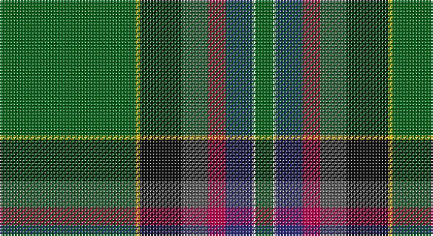

This page is one **sett** — a single exact thread-count. It belongs to the [tartan](/setts/g92ly3k28n18r12db18w2g12/)
(the same proportion at any scale), whose colour order is pattern [GWBRBKYG](/stripes/gwbrbkyg/).

Sourced from register-of-tartans.  It is a [8 stripe tartan](/stripes/stripes8/).

Original link https://www.tartanregister.gov.uk/tartanDetails.aspx?ref=3044

2 attestations — the source records this cloth was collapsed from (oldest owns this page)

<ul>
<li>01/01/1998 — Mull Millennium (register-of-tartans, <a href="https://www.tartanregister.gov.uk/tartanDetails.aspx?ref=3044">record</a>)</li>
<li>January 1998 — Mull Millennium (Corporate) (tartans-authority, <a href="http://www.tartansauthority.com/tartan-ferret/display/2573/">record</a>)</li>
</ul>

## Register references

External register numbers recorded for this tartan.

- Scottish Register of Tartans: [3044](https://www.tartanregister.gov.uk/tartanDetails.aspx?ref=3044)
- Scottish Tartans Authority (ITI): 2573
- Scottish Tartans World Register: 2573

## Thread count
G/92 Y3 K28 N18 R12 DB18 LN2 G/12

One full sett is **266 threads**.

## Palette

Palette: <strong>Tartan Register</strong> <small style="color:#888">(5 of 7 colours)</small>
<table><thead><tr><th>Colour</th><th>Threads</th><th>Shade</th><th>Base</th><th>OKLCh</th></tr></thead><tbody><tr><td>G/</td><td style="text-align:right;font-variant-numeric:tabular-nums">92</td><td><code style="background-color:#006818;">#006818</code> <small style="color:#888">#006818</small></td><td>G <code style="background-color:#006100;">#006100</code></td><td><small style="color:#888">oklch(45.0% 0.142 145.0)</small></td></tr><tr><td>Y</td><td style="text-align:right;font-variant-numeric:tabular-nums">3</td><td><code style="background-color:#E8C000;">#E8C000</code> <small style="color:#888">#E8C000</small></td><td>Y <code style="background-color:#F2BF00;">#F2BF00</code></td><td><small style="color:#888">oklch(81.9% 0.168 93.7)</small></td></tr><tr><td>K</td><td style="text-align:right;font-variant-numeric:tabular-nums">28</td><td><code style="background-color:#101010;">#101010</code> <small style="color:#888">#101010</small></td><td>K <code style="background-color:#000000;">#000000</code></td><td><small style="color:#888">oklch(17.3% 0.000 89.9)</small></td></tr><tr><td>N</td><td style="text-align:right;font-variant-numeric:tabular-nums">18</td><td><code style="background-color:#5C5C5C;">#5C5C5C</code> <small style="color:#888">#5C5C5C</small></td><td>B <code style="background-color:#2A418A;">#2A418A</code></td><td><small style="color:#888">oklch(47.5% 0.000 89.9)</small></td></tr><tr><td>R</td><td style="text-align:right;font-variant-numeric:tabular-nums">12</td><td><code style="background-color:#C80050;">#C80050</code> <small style="color:#888">#C80050</small></td><td>R <code style="background-color:#CC0000;">#CC0000</code></td><td><small style="color:#888">oklch(53.2% 0.213 9.9)</small></td></tr><tr><td>DB</td><td style="text-align:right;font-variant-numeric:tabular-nums">18</td><td><code style="background-color:#2C2C80;">#2C2C80</code> <small style="color:#888">#2C2C80</small></td><td>B <code style="background-color:#2A418A;">#2A418A</code></td><td><small style="color:#888">oklch(35.0% 0.138 276.6)</small></td></tr><tr><td>LN</td><td style="text-align:right;font-variant-numeric:tabular-nums">2</td><td><code style="background-color:#E0E0E0;">#E0E0E0</code> <small style="color:#888">#E0E0E0</small></td><td>W <code style="background-color:#F7F7F7;">#F7F7F7</code></td><td><small style="color:#888">oklch(90.7% 0.000 89.9)</small></td></tr><tr><td>G/</td><td style="text-align:right;font-variant-numeric:tabular-nums">12</td><td><code style="background-color:#006818;">#006818</code> <small style="color:#888">#006818</small></td><td>G <code style="background-color:#006100;">#006100</code></td><td><small style="color:#888">oklch(45.0% 0.142 145.0)</small></td></tr></tbody></table>

# Sample pattern

## Nearest tartans

The nearest existing variants by ΔTartan distance, with this tartan at the top so the swatches line up against it.

ΔTartan

Tartan

Sett

—

<a href="/ttd/edit/#slug=g92ly3k28n18r12db18w2g12">Mull Millennium</a> <a class="nn-out" href="/variants/s8/g92ly3k28n18r12db18w2g12/" title="open its dictionary page">↗</a>

1.24

<a href="/ttd/edit/#slug=db2dy12k1b5w3b5k1g30ly2~x2&amp;base=g92ly3k28n18r12db18w2g12">St Brigid's Parish Triple Celebratio</a> <a class="nn-out" href="/variants/s9/db2dy12k1b5w3b5k1g30ly2~x2/" title="open its dictionary page">↗</a>

1.42

<a href="/ttd/edit/#slug=dg90r1k10w6k4dg6r10db62ly8&amp;base=g92ly3k28n18r12db18w2g12">Stirling, University of</a> <a class="nn-out" href="/variants/s9/dg90r1k10w6k4dg6r10db62ly8/" title="open its dictionary page">↗</a>

1.48

<a href="/ttd/edit/#slug=g91ly3k28n18r12dt18w2g12&amp;base=g92ly3k28n18r12db18w2g12">Mull Millenium Tartan</a> <a class="nn-out" href="/variants/s8/g91ly3k28n18r12dt18w2g12/" title="open its dictionary page">↗</a>

1.49

<a href="/ttd/edit/#slug=g9lo1g2r3g28k16t1g8t1db8r1~x2&amp;base=g92ly3k28n18r12db18w2g12">New York Caledonian Club Day</a> <a class="nn-out" href="/variants/s11/g9lo1g2r3g28k16t1g8t1db8r1~x2/" title="open its dictionary page">↗</a>

1.53

<a href="/ttd/edit/#slug=g9o1g2r3g28k16lb1g8lb1db8r1~x2&amp;base=g92ly3k28n18r12db18w2g12">New York Caledonian Club Day</a> <a class="nn-out" href="/variants/s11/g9o1g2r3g28k16lb1g8lb1db8r1~x2/" title="open its dictionary page">↗</a>

1.54

<a href="/ttd/edit/#slug=p4g24dg6lg4dg4lg4dg44lo1w4&amp;base=g92ly3k28n18r12db18w2g12">Macmillan Cancer Support</a> <a class="nn-out" href="/variants/s9/p4g24dg6lg4dg4lg4dg44lo1w4/" title="open its dictionary page">↗</a>

1.56

<a href="/ttd/edit/#slug=g6ti22g6dy20ly1g45t1w5~x2&amp;base=g92ly3k28n18r12db18w2g12">Elbrick Hunting (Personal)</a> <a class="nn-out" href="/variants/s8/g6ti22g6dy20ly1g45t1w5~x2/" title="open its dictionary page">↗</a>

1.57

<a href="/ttd/edit/#slug=b14k3b14k10gi40k1g3k1w3k1o3k1gi40k10~x2&amp;base=g92ly3k28n18r12db18w2g12">Irish Diaspora</a> <a class="nn-out" href="/variants/s14/b14k3b14k10gi40k1g3k1w3k1o3k1gi40k10~x2/" title="open its dictionary page">↗</a>

1.61

<a href="/ttd/edit/#slug=w4g10t24g42r3ly4ri4ly2&amp;base=g92ly3k28n18r12db18w2g12">Muskoka Canadian Tartan</a> <a class="nn-out" href="/variants/s8/w4g10t24g42r3ly4ri4ly2/" title="open its dictionary page">↗</a>

1.61

<a href="/ttd/edit/#slug=w3r4db13g37t3k3ly2~x2&amp;base=g92ly3k28n18r12db18w2g12">Washington District Tartan</a> <a class="nn-out" href="/variants/s7/w3r4db13g37t3k3ly2~x2/" title="open its dictionary page">↗</a>

## Neighbour map

Every grey dot is one of 14360 variants placed by the first two principal components of the ΔTartan feature space (44% of its variance). Red is this tartan; blue dots are its nearest — click one to open its page.

<svg viewBox="0 0 640 380" role="img" style="max-width:100%;height:auto;border:1px solid #e0e0e0;border-radius:4px;display:block" xmlns="http://www.w3.org/2000/svg"><image href="/nn/cloud.v1.png" width="640" height="380"/><a href="/variants/s9/db2dy12k1b5w3b5k1g30ly2~x2/"><circle cx="258.4" cy="90.5" r="4" fill="#3465a4"><title>St Brigid's Parish Triple Celebratio</title></circle></a><a href="/variants/s9/dg90r1k10w6k4dg6r10db62ly8/"><circle cx="314.0" cy="87.9" r="4" fill="#3465a4"><title>Stirling, University of</title></circle></a><a href="/variants/s8/g91ly3k28n18r12dt18w2g12/"><circle cx="278.7" cy="76.4" r="4" fill="#3465a4"><title>Mull Millenium Tartan</title></circle></a><a href="/variants/s11/g9lo1g2r3g28k16t1g8t1db8r1~x2/"><circle cx="347.3" cy="121.2" r="4" fill="#3465a4"><title>New York Caledonian Club Day</title></circle></a><a href="/variants/s11/g9o1g2r3g28k16lb1g8lb1db8r1~x2/"><circle cx="345.0" cy="114.7" r="4" fill="#3465a4"><title>New York Caledonian Club Day</title></circle></a><a href="/variants/s9/p4g24dg6lg4dg4lg4dg44lo1w4/"><circle cx="331.2" cy="91.2" r="4" fill="#3465a4"><title>Macmillan Cancer Support</title></circle></a><a href="/variants/s8/g6ti22g6dy20ly1g45t1w5~x2/"><circle cx="345.3" cy="127.6" r="4" fill="#3465a4"><title>Elbrick Hunting (Personal)</title></circle></a><a href="/variants/s14/b14k3b14k10gi40k1g3k1w3k1o3k1gi40k10~x2/"><circle cx="329.2" cy="90.4" r="4" fill="#3465a4"><title>Irish Diaspora</title></circle></a><a href="/variants/s8/w4g10t24g42r3ly4ri4ly2/"><circle cx="292.3" cy="117.9" r="4" fill="#3465a4"><title>Muskoka Canadian Tartan</title></circle></a><a href="/variants/s7/w3r4db13g37t3k3ly2~x2/"><circle cx="282.8" cy="115.5" r="4" fill="#3465a4"><title>Washington District Tartan</title></circle></a><circle cx="320.9" cy="94.2" r="5" fill="#c00000"/></svg>

ID: /variants/s8/g92ly3k28n18r12db18w2g12/
