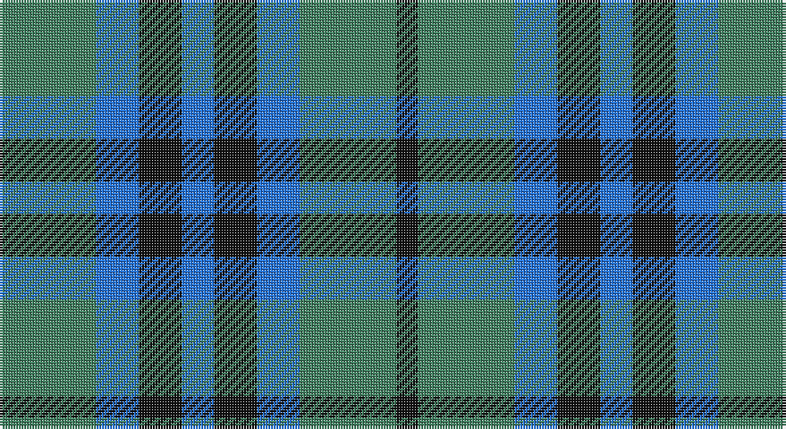

This page is one **sett** — a single exact thread-count. It belongs to the [tartan](/setts/g9b4k4b3k4b4g9k2/)
(the same proportion at any scale), whose colour order is pattern [GBKBKBGK](/stripes/gbkbkbgk/).

Part of the [Keith](/tartans/keith/) tartan — the named design grouping this sett with its other cloths.

Sourced from register-of-tartans.  It is a [8 stripe tartan](/stripes/stripes8/).

Original link https://www.tartanregister.gov.uk/tartanDetails.aspx?ref=1936

## Also known as

This cloth is also recorded under:

- Keith Clan

## Register references

External register numbers recorded for this tartan.

- Scottish Register of Tartans: [1936](https://www.tartanregister.gov.uk/tartanDetails.aspx?ref=1936)
- Scottish Tartans Authority (ITI): 253
- Scottish Tartans World Register: 253

## Thread count
G/36 B16 K16 B12 K16 B16 G36 K/8

One full sett is **268 threads**.

## Palette

Palette: <strong>Tartan Register</strong>
<table><thead><tr><th>Colour</th><th>Threads</th><th>Shade</th><th>Base</th><th>OKLCh</th></tr></thead><tbody><tr><td>G/</td><td style="text-align:right;font-variant-numeric:tabular-nums">36</td><td><code style="background-color:#408060;">#408060</code> <small style="color:#888">#408060</small></td><td>G <code style="background-color:#006100;">#006100</code></td><td><small style="color:#888">oklch(54.8% 0.084 160.1)</small></td></tr><tr><td>B</td><td style="text-align:right;font-variant-numeric:tabular-nums">16</td><td><code style="background-color:#2474E8;">#2474E8</code> <small style="color:#888">#2474E8</small></td><td>B <code style="background-color:#2A418A;">#2A418A</code></td><td><small style="color:#888">oklch(57.8% 0.192 258.7)</small></td></tr><tr><td>K</td><td style="text-align:right;font-variant-numeric:tabular-nums">16</td><td><code style="background-color:#101010;">#101010</code> <small style="color:#888">#101010</small></td><td>K <code style="background-color:#000000;">#000000</code></td><td><small style="color:#888">oklch(17.3% 0.000 89.9)</small></td></tr><tr><td>B</td><td style="text-align:right;font-variant-numeric:tabular-nums">12</td><td><code style="background-color:#2474E8;">#2474E8</code> <small style="color:#888">#2474E8</small></td><td>B <code style="background-color:#2A418A;">#2A418A</code></td><td><small style="color:#888">oklch(57.8% 0.192 258.7)</small></td></tr><tr><td>K</td><td style="text-align:right;font-variant-numeric:tabular-nums">16</td><td><code style="background-color:#101010;">#101010</code> <small style="color:#888">#101010</small></td><td>K <code style="background-color:#000000;">#000000</code></td><td><small style="color:#888">oklch(17.3% 0.000 89.9)</small></td></tr><tr><td>B</td><td style="text-align:right;font-variant-numeric:tabular-nums">16</td><td><code style="background-color:#2474E8;">#2474E8</code> <small style="color:#888">#2474E8</small></td><td>B <code style="background-color:#2A418A;">#2A418A</code></td><td><small style="color:#888">oklch(57.8% 0.192 258.7)</small></td></tr><tr><td>G</td><td style="text-align:right;font-variant-numeric:tabular-nums">36</td><td><code style="background-color:#408060;">#408060</code> <small style="color:#888">#408060</small></td><td>G <code style="background-color:#006100;">#006100</code></td><td><small style="color:#888">oklch(54.8% 0.084 160.1)</small></td></tr><tr><td>K/</td><td style="text-align:right;font-variant-numeric:tabular-nums">8</td><td><code style="background-color:#101010;">#101010</code> <small style="color:#888">#101010</small></td><td>K <code style="background-color:#000000;">#000000</code></td><td><small style="color:#888">oklch(17.3% 0.000 89.9)</small></td></tr></tbody></table>

# Sample pattern

## Compared to the master

This cloth is one sett of its design; the master sett (the exemplar the design is anchored on) is below for comparison.

<figure style="margin:0"><figcaption style="color:#888;font-size:smaller">this sett</figcaption></figure>
<figure style="margin:0"><figcaption style="color:#888;font-size:smaller"><a href="/setts/b18r5b3r5b3k20g18ly4g18k20b20k6b6/">master sett →</a></figcaption></figure>

## Nearest tartans

The nearest existing variants by ΔTartan distance, with this tartan at the top so the swatches line up against it.

ΔTartan

Tartan

Sett

—

<a href="/ttd/edit/#slug=g9b4k4b3k4b4g9k2~x4">Keith Clan</a> <a class="nn-out" href="/variants/s8/g9b4k4b3k4b4g9k2~x4/" title="open its dictionary page">↗</a>

1.09

<a href="/ttd/edit/#slug=b3k4b4g9k2~x4&amp;base=g9b4k4b3k4b4g9k2~x4">Falconer</a> <a class="nn-out" href="/variants/s5/b3k4b4g9k2~x4/" title="open its dictionary page">↗</a>

1.12

<a href="/ttd/edit/#slug=dg3ly1db3ly1db3ly1dg3ly1db3ly1~x4&amp;base=g9b4k4b3k4b4g9k2~x4">Unidentified Printing #2</a> <a class="nn-out" href="/variants/s10/dg3ly1db3ly1db3ly1dg3ly1db3ly1~x4/" title="open its dictionary page">↗</a>

1.30

<a href="/ttd/edit/#slug=b6k6b18k18g22k5~x2&amp;base=g9b4k4b3k4b4g9k2~x4">Campbell, The 42nd</a> <a class="nn-out" href="/variants/s6/b6k6b18k18g22k5~x2/" title="open its dictionary page">↗</a>

1.31

<a href="/ttd/edit/#slug=g12k14t11k3t3k3t11k14g12t3~x2&amp;base=g9b4k4b3k4b4g9k2~x4">Wilson's No.166</a> <a class="nn-out" href="/variants/s10/g12k14t11k3t3k3t11k14g12t3~x2/" title="open its dictionary page">↗</a>

1.52

<a href="/ttd/edit/#slug=g7k6b7k1b2~x2&amp;base=g9b4k4b3k4b4g9k2~x4">Campbell of Glenlyon</a> <a class="nn-out" href="/variants/s5/g7k6b7k1b2~x2/" title="open its dictionary page">↗</a>

1.52

<a href="/ttd/edit/#slug=g7k6b7k1b2~x4&amp;base=g9b4k4b3k4b4g9k2~x4">Campbell of Glenlyon Check (Clan)</a> <a class="nn-out" href="/variants/s5/g7k6b7k1b2~x4/" title="open its dictionary page">↗</a>

1.56

<a href="/ttd/edit/#slug=g11t2db11t6g3t6db11t2g11db3~x2&amp;base=g9b4k4b3k4b4g9k2~x4">Norwich No.029</a> <a class="nn-out" href="/variants/s10/g11t2db11t6g3t6db11t2g11db3~x2/" title="open its dictionary page">↗</a>

1.57

<a href="/variants/s8/k12n3k12n18w5~x2/">Grampian Television</a>

1.58

<a href="/ttd/edit/#slug=g7r4g14db10g5db10w2db10g5db5~x2&amp;base=g9b4k4b3k4b4g9k2~x4">Edmonstone of Duntreath</a> <a class="nn-out" href="/variants/s10/g7r4g14db10g5db10w2db10g5db5~x2/" title="open its dictionary page">↗</a>

1.63

<a href="/ttd/edit/#slug=g9b9k24b35dr5b35k24b9g9dr5~x2&amp;base=g9b4k4b3k4b4g9k2~x4">Notre Dame Marching Guard</a> <a class="nn-out" href="/variants/s10/g9b9k24b35dr5b35k24b9g9dr5~x2/" title="open its dictionary page">↗</a>

## Neighbour map

Every grey dot is one of 14360 variants placed by the first two principal components of the ΔTartan feature space (44% of its variance). Red is this tartan; blue dots are its nearest — click one to open its page.

<svg viewBox="0 0 640 380" role="img" style="max-width:100%;height:auto;border:1px solid #e0e0e0;border-radius:4px;display:block" xmlns="http://www.w3.org/2000/svg"><image href="/nn/cloud.v1.png" width="640" height="380"/><a href="/variants/s5/b3k4b4g9k2~x4/"><circle cx="180.5" cy="297.0" r="4" fill="#3465a4"><title>Falconer</title></circle></a><a href="/variants/s10/dg3ly1db3ly1db3ly1dg3ly1db3ly1~x4/"><circle cx="149.7" cy="281.1" r="4" fill="#3465a4"><title>Unidentified Printing #2</title></circle></a><a href="/variants/s6/b6k6b18k18g22k5~x2/"><circle cx="181.0" cy="298.8" r="4" fill="#3465a4"><title>Campbell, The 42nd</title></circle></a><a href="/variants/s10/g12k14t11k3t3k3t11k14g12t3~x2/"><circle cx="164.1" cy="268.6" r="4" fill="#3465a4"><title>Wilson's No.166</title></circle></a><a href="/variants/s5/g7k6b7k1b2~x2/"><circle cx="204.4" cy="290.4" r="4" fill="#3465a4"><title>Campbell of Glenlyon</title></circle></a><a href="/variants/s5/g7k6b7k1b2~x4/"><circle cx="204.4" cy="290.4" r="4" fill="#3465a4"><title>Campbell of Glenlyon Check (Clan)</title></circle></a><a href="/variants/s10/g11t2db11t6g3t6db11t2g11db3~x2/"><circle cx="207.4" cy="277.7" r="4" fill="#3465a4"><title>Norwich No.029</title></circle></a><a href="/variants/s8/k12n3k12n18w5~x2/"><circle cx="257.8" cy="271.4" r="4" fill="#3465a4"><title>Grampian Television</title></circle></a><a href="/variants/s10/g7r4g14db10g5db10w2db10g5db5~x2/"><circle cx="206.0" cy="247.7" r="4" fill="#3465a4"><title>Edmonstone of Duntreath</title></circle></a><a href="/variants/s10/g9b9k24b35dr5b35k24b9g9dr5~x2/"><circle cx="238.4" cy="223.5" r="4" fill="#3465a4"><title>Notre Dame Marching Guard</title></circle></a><circle cx="190.6" cy="283.9" r="5" fill="#c00000"/></svg>

ID: /variants/s8/g9b4k4b3k4b4g9k2~x4/
