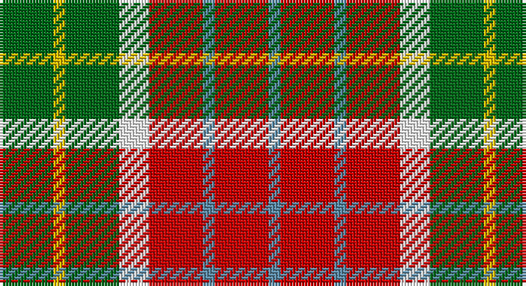

This page is one **sett** — a single exact thread-count. It belongs to the [tartan](/setts/g9ly2g9w5r9t2r9t2/)
(the same proportion at any scale), whose colour order is pattern [BRBRWGYG](/stripes/brbrwgyg/).

Sourced from register-of-tartans.  It is a [8 stripe tartan](/stripes/stripes8/).

Original link https://www.tartanregister.gov.uk/tartanDetails.aspx?ref=285

2 attestations — the source records this cloth was collapsed from (oldest owns this page)

<ul>
<li>01/01/1880 — Blackie (register-of-tartans, <a href="https://www.tartanregister.gov.uk/tartanDetails.aspx?ref=285">record</a>)</li>
<li>1880s? — Blackie (Artefact) (tartans-authority, <a href="http://www.tartansauthority.com/tartan-ferret/display/7184/">record</a>)</li>
</ul>

## Register references

External register numbers recorded for this tartan.

- Scottish Register of Tartans: [285](https://www.tartanregister.gov.uk/tartanDetails.aspx?ref=285)
- Scottish Tartans Authority (ITI): 7184

## Thread count
G/18 Y4 G18 W10 R18 B4 R18 B/4

One full sett is **166 threads**.

## Palette

Palette: <strong>Tartan Register</strong>
<table><thead><tr><th>Colour</th><th>Threads</th><th>Shade</th><th>Base</th><th>OKLCh</th></tr></thead><tbody><tr><td>G/</td><td style="text-align:right;font-variant-numeric:tabular-nums">18</td><td><code style="background-color:#006818;">#006818</code> <small style="color:#888">#006818</small></td><td>G <code style="background-color:#006100;">#006100</code></td><td><small style="color:#888">oklch(45.0% 0.142 145.0)</small></td></tr><tr><td>Y</td><td style="text-align:right;font-variant-numeric:tabular-nums">4</td><td><code style="background-color:#E8C000;">#E8C000</code> <small style="color:#888">#E8C000</small></td><td>Y <code style="background-color:#F2BF00;">#F2BF00</code></td><td><small style="color:#888">oklch(81.9% 0.168 93.7)</small></td></tr><tr><td>G</td><td style="text-align:right;font-variant-numeric:tabular-nums">18</td><td><code style="background-color:#006818;">#006818</code> <small style="color:#888">#006818</small></td><td>G <code style="background-color:#006100;">#006100</code></td><td><small style="color:#888">oklch(45.0% 0.142 145.0)</small></td></tr><tr><td>W</td><td style="text-align:right;font-variant-numeric:tabular-nums">10</td><td><code style="background-color:#FFFFFF;">#FFFFFF</code> <small style="color:#888">#FFFFFF</small></td><td>W <code style="background-color:#F7F7F7;">#F7F7F7</code></td><td><small style="color:#888">oklch(100.0% 0.000 89.9)</small></td></tr><tr><td>R</td><td style="text-align:right;font-variant-numeric:tabular-nums">18</td><td><code style="background-color:#C80000;">#C80000</code> <small style="color:#888">#C80000</small></td><td>R <code style="background-color:#CC0000;">#CC0000</code></td><td><small style="color:#888">oklch(52.3% 0.215 29.2)</small></td></tr><tr><td>B</td><td style="text-align:right;font-variant-numeric:tabular-nums">4</td><td><code style="background-color:#5C8CA8;">#5C8CA8</code> <small style="color:#888">#5C8CA8</small></td><td>B <code style="background-color:#2A418A;">#2A418A</code></td><td><small style="color:#888">oklch(61.7% 0.067 235.0)</small></td></tr><tr><td>R</td><td style="text-align:right;font-variant-numeric:tabular-nums">18</td><td><code style="background-color:#C80000;">#C80000</code> <small style="color:#888">#C80000</small></td><td>R <code style="background-color:#CC0000;">#CC0000</code></td><td><small style="color:#888">oklch(52.3% 0.215 29.2)</small></td></tr><tr><td>B/</td><td style="text-align:right;font-variant-numeric:tabular-nums">4</td><td><code style="background-color:#5C8CA8;">#5C8CA8</code> <small style="color:#888">#5C8CA8</small></td><td>B <code style="background-color:#2A418A;">#2A418A</code></td><td><small style="color:#888">oklch(61.7% 0.067 235.0)</small></td></tr></tbody></table>

# Sample pattern

## Nearest tartans

The nearest existing variants by ΔTartan distance, with this tartan at the top so the swatches line up against it.

ΔTartan

Tartan

Sett

—

<a href="/ttd/edit/#slug=g9ly2g9w5r9t2r9t2~x2">Blackie</a> <a class="nn-out" href="/variants/s8/g9ly2g9w5r9t2r9t2~x2/" title="open its dictionary page">↗</a>

1.03

<a href="/ttd/edit/#slug=g13ly16w4ly4r4ly4k20ly8r8~x2&amp;base=g9ly2g9w5r9t2r9t2~x2">Cawte of Middlebanknock (Personal)</a> <a class="nn-out" href="/variants/s9/g13ly16w4ly4r4ly4k20ly8r8~x2/" title="open its dictionary page">↗</a>

1.11

<a href="/ttd/edit/#slug=r8dy33ly33k33r8db8ly33db8r8&amp;base=g9ly2g9w5r9t2r9t2~x2">Jardine of Castlemilk</a> <a class="nn-out" href="/variants/s9/r8dy33ly33k33r8db8ly33db8r8/" title="open its dictionary page">↗</a>

1.18

<a href="/ttd/edit/#slug=r2ly1r5k4g5w1~x4&amp;base=g9ly2g9w5r9t2r9t2~x2">Aboyne II (Fashion)</a> <a class="nn-out" href="/variants/s6/r2ly1r5k4g5w1~x4/" title="open its dictionary page">↗</a>

1.26

<a href="/ttd/edit/#slug=r8o33ly33k33r8db8ly33db8r8&amp;base=g9ly2g9w5r9t2r9t2~x2">Jardine, of Castlemilk</a> <a class="nn-out" href="/variants/s9/r8o33ly33k33r8db8ly33db8r8/" title="open its dictionary page">↗</a>

1.34

<a href="/ttd/edit/#slug=r6k2g12lo8r5k2g3~x4&amp;base=g9ly2g9w5r9t2r9t2~x2">Londonderry</a> <a class="nn-out" href="/variants/s7/r6k2g12lo8r5k2g3~x4/" title="open its dictionary page">↗</a>

1.35

<a href="/ttd/edit/#slug=r5g2ri2k2lo7r2~x4&amp;base=g9ly2g9w5r9t2r9t2~x2">Victoria, City of (British Columbia)</a> <a class="nn-out" href="/variants/s6/r5g2ri2k2lo7r2~x4/" title="open its dictionary page">↗</a>

1.36

<a href="/ttd/edit/#slug=r5db12lyi11n21ly5~x2&amp;base=g9ly2g9w5r9t2r9t2~x2">Inspiration</a> <a class="nn-out" href="/variants/s5/r5db12lyi11n21ly5~x2/" title="open its dictionary page">↗</a>

1.40

<a href="/ttd/edit/#slug=do3o1lr1do1o3do3lr3ly6n1~x6&amp;base=g9ly2g9w5r9t2r9t2~x2">Toorak Chapler</a> <a class="nn-out" href="/variants/s9/do3o1lr1do1o3do3lr3ly6n1~x6/" title="open its dictionary page">↗</a>

1.40

<a href="/ttd/edit/#slug=g8r11k3ly2p8g15r5w2~x2&amp;base=g9ly2g9w5r9t2r9t2~x2">Wilson's, No 109</a> <a class="nn-out" href="/variants/s8/g8r11k3ly2p8g15r5w2~x2/" title="open its dictionary page">↗</a>

1.41

<a href="/ttd/edit/#slug=dy3lo1lb1dy1lo1dy3lb3ly6r1~x6&amp;base=g9ly2g9w5r9t2r9t2~x2">Toorak Chapler (Fashion)</a> <a class="nn-out" href="/variants/s9/dy3lo1lb1dy1lo1dy3lb3ly6r1~x6/" title="open its dictionary page">↗</a>

## Neighbour map

Every grey dot is one of 14360 variants placed by the first two principal components of the ΔTartan feature space (44% of its variance). Red is this tartan; blue dots are its nearest — click one to open its page.

<svg viewBox="0 0 640 380" role="img" style="max-width:100%;height:auto;border:1px solid #e0e0e0;border-radius:4px;display:block" xmlns="http://www.w3.org/2000/svg"><image href="/nn/cloud.v1.png" width="640" height="380"/><a href="/variants/s9/g13ly16w4ly4r4ly4k20ly8r8~x2/"><circle cx="86.4" cy="190.3" r="4" fill="#3465a4"><title>Cawte of Middlebanknock (Personal)</title></circle></a><a href="/variants/s9/r8dy33ly33k33r8db8ly33db8r8/"><circle cx="77.7" cy="196.8" r="4" fill="#3465a4"><title>Jardine of Castlemilk</title></circle></a><a href="/variants/s6/r2ly1r5k4g5w1~x4/"><circle cx="112.9" cy="222.9" r="4" fill="#3465a4"><title>Aboyne II (Fashion)</title></circle></a><a href="/variants/s9/r8o33ly33k33r8db8ly33db8r8/"><circle cx="70.8" cy="193.3" r="4" fill="#3465a4"><title>Jardine, of Castlemilk</title></circle></a><a href="/variants/s7/r6k2g12lo8r5k2g3~x4/"><circle cx="148.3" cy="225.5" r="4" fill="#3465a4"><title>Londonderry</title></circle></a><a href="/variants/s6/r5g2ri2k2lo7r2~x4/"><circle cx="107.7" cy="236.3" r="4" fill="#3465a4"><title>Victoria, City of (British Columbia)</title></circle></a><a href="/variants/s5/r5db12lyi11n21ly5~x2/"><circle cx="94.6" cy="241.3" r="4" fill="#3465a4"><title>Inspiration</title></circle></a><a href="/variants/s9/do3o1lr1do1o3do3lr3ly6n1~x6/"><circle cx="79.1" cy="190.9" r="4" fill="#3465a4"><title>Toorak Chapler</title></circle></a><a href="/variants/s8/g8r11k3ly2p8g15r5w2~x2/"><circle cx="132.1" cy="179.4" r="4" fill="#3465a4"><title>Wilson's, No 109</title></circle></a><a href="/variants/s9/dy3lo1lb1dy1lo1dy3lb3ly6r1~x6/"><circle cx="126.4" cy="194.0" r="4" fill="#3465a4"><title>Toorak Chapler (Fashion)</title></circle></a><circle cx="114.2" cy="219.4" r="5" fill="#c00000"/></svg>

ID: /variants/s8/g9ly2g9w5r9t2r9t2~x2/
