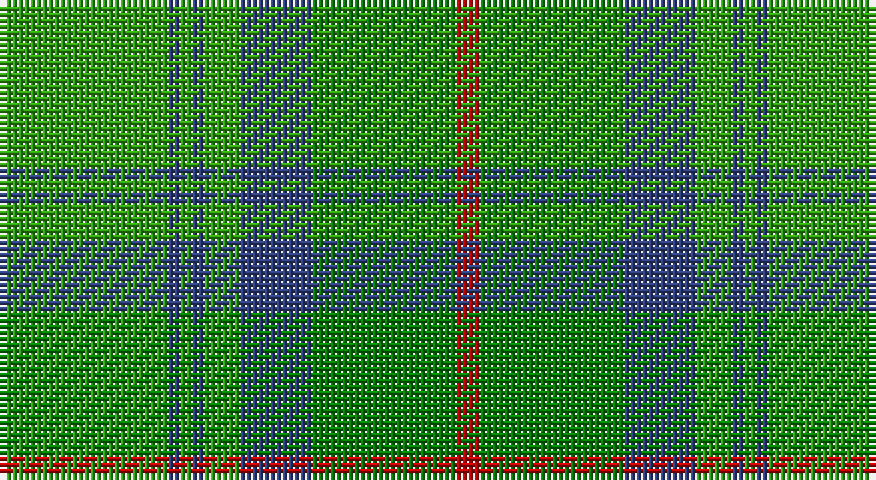

This page is one **sett** — a single exact thread-count. It belongs to the [tartan](/setts/gi14db1gi1db1gi3db6g12r2/)
(the same proportion at any scale), whose colour order is pattern [GBGBGBGR](/stripes/gbgbgbgr/).

Sourced from weddslist.  It is a [8 stripe tartan](/stripes/stripes8/).

Original link http://www.weddslist.com/cgi-bin/tartans/pg.pl?source=sts

## Thread count
G/28 B2 G2 B2 G6 B12 Ga24 R/4

One full sett is **128 threads**.

## Palette

Palette: <strong>custom</strong>
<table><thead><tr><th>Colour</th><th>Threads</th><th>Shade</th><th>Base</th><th>OKLCh</th></tr></thead><tbody><tr><td>G/</td><td style="text-align:right;font-variant-numeric:tabular-nums">28</td><td><code style="background-color:#30A010;">#30A010</code> <small style="color:#888">#30A010</small></td><td>G <code style="background-color:#006100;">#006100</code></td><td><small style="color:#888">oklch(61.9% 0.195 140.5)</small></td></tr><tr><td>B</td><td style="text-align:right;font-variant-numeric:tabular-nums">2</td><td><code style="background-color:#304080;">#304080</code> <small style="color:#888">#304080</small></td><td>B <code style="background-color:#2A418A;">#2A418A</code></td><td><small style="color:#888">oklch(39.4% 0.109 270.2)</small></td></tr><tr><td>G</td><td style="text-align:right;font-variant-numeric:tabular-nums">2</td><td><code style="background-color:#30A010;">#30A010</code> <small style="color:#888">#30A010</small></td><td>G <code style="background-color:#006100;">#006100</code></td><td><small style="color:#888">oklch(61.9% 0.195 140.5)</small></td></tr><tr><td>B</td><td style="text-align:right;font-variant-numeric:tabular-nums">2</td><td><code style="background-color:#304080;">#304080</code> <small style="color:#888">#304080</small></td><td>B <code style="background-color:#2A418A;">#2A418A</code></td><td><small style="color:#888">oklch(39.4% 0.109 270.2)</small></td></tr><tr><td>G</td><td style="text-align:right;font-variant-numeric:tabular-nums">6</td><td><code style="background-color:#30A010;">#30A010</code> <small style="color:#888">#30A010</small></td><td>G <code style="background-color:#006100;">#006100</code></td><td><small style="color:#888">oklch(61.9% 0.195 140.5)</small></td></tr><tr><td>B</td><td style="text-align:right;font-variant-numeric:tabular-nums">12</td><td><code style="background-color:#304080;">#304080</code> <small style="color:#888">#304080</small></td><td>B <code style="background-color:#2A418A;">#2A418A</code></td><td><small style="color:#888">oklch(39.4% 0.109 270.2)</small></td></tr><tr><td>Ga</td><td style="text-align:right;font-variant-numeric:tabular-nums">24</td><td><code style="background-color:#008000;">#008000</code> <small style="color:#888">#008000</small></td><td>G <code style="background-color:#006100;">#006100</code></td><td><small style="color:#888">oklch(52.0% 0.177 142.5)</small></td></tr><tr><td>R/</td><td style="text-align:right;font-variant-numeric:tabular-nums">4</td><td><code style="background-color:#C00000;">#C00000</code> <small style="color:#888">#C00000</small></td><td>R <code style="background-color:#CC0000;">#CC0000</code></td><td><small style="color:#888">oklch(50.7% 0.208 29.2)</small></td></tr></tbody></table>

# Sample pattern

## Nearest tartans

The nearest existing variants by ΔTartan distance, with this tartan at the top so the swatches line up against it.

ΔTartan

Tartan

Sett

—

<a href="/ttd/edit/#slug=gi14db1gi1db1gi3db6g12r2~x2">Cranstoun</a> <a class="nn-out" href="/variants/s8/gi14db1gi1db1gi3db6g12r2~x2/" title="open its dictionary page">↗</a>

0.87

<a href="/ttd/edit/#slug=g14db1g1db1g3db6gi12r2~x2&amp;base=gi14db1gi1db1gi3db6g12r2~x2">Cranstoun Clan Tartan</a> <a class="nn-out" href="/variants/s8/g14db1g1db1g3db6gi12r2~x2/" title="open its dictionary page">↗</a>

1.22

<a href="/ttd/edit/#slug=r3gi2g32gi32g2w3~x2&amp;base=gi14db1gi1db1gi3db6g12r2~x2">Galloway Hunting</a> <a class="nn-out" href="/variants/s6/r3gi2g32gi32g2w3~x2/" title="open its dictionary page">↗</a>

1.39

<a href="/ttd/edit/#slug=dg70ly6lr28g56lr5g11lr5g11r12&amp;base=gi14db1gi1db1gi3db6g12r2~x2">Dalwhinnie</a> <a class="nn-out" href="/variants/s9/dg70ly6lr28g56lr5g11lr5g11r12/" title="open its dictionary page">↗</a>

1.43

<a href="/ttd/edit/#slug=gi2lo1gi12lb6g12r1~x4&amp;base=gi14db1gi1db1gi3db6g12r2~x2">City of Vancouver (Commemorative)</a> <a class="nn-out" href="/variants/s6/gi2lo1gi12lb6g12r1~x4/" title="open its dictionary page">↗</a>

1.46

<a href="/ttd/edit/#slug=gi18w1gi4w1lo4g1lo2g12r2g4~x2&amp;base=gi14db1gi1db1gi3db6g12r2~x2">Michigan, State of (District)</a> <a class="nn-out" href="/variants/s10/gi18w1gi4w1lo4g1lo2g12r2g4~x2/" title="open its dictionary page">↗</a>

1.46

<a href="/ttd/edit/#slug=t4dg26gi8t8gi8g3t2~x2&amp;base=gi14db1gi1db1gi3db6g12r2~x2">Valley of the Green (The ) Canadian Tartan</a> <a class="nn-out" href="/variants/s7/t4dg26gi8t8gi8g3t2~x2/" title="open its dictionary page">↗</a>

1.49

<a href="/ttd/edit/#slug=t12gi2t2gi2t2dy8g8dy1~x2&amp;base=gi14db1gi1db1gi3db6g12r2~x2">Universal Ancient International Tartan</a> <a class="nn-out" href="/variants/s8/t12gi2t2gi2t2dy8g8dy1~x2/" title="open its dictionary page">↗</a>

1.50

<a href="/ttd/edit/#slug=gi14t2gi2t2gi3t6g12r2~x2&amp;base=gi14db1gi1db1gi3db6g12r2~x2">Cranston</a> <a class="nn-out" href="/variants/s8/gi14t2gi2t2gi3t6g12r2~x2/" title="open its dictionary page">↗</a>

1.55

<a href="/ttd/edit/#slug=t4dg26g8t8g8gi3t2~x2&amp;base=gi14db1gi1db1gi3db6g12r2~x2">Valley, of the Green. (The )</a> <a class="nn-out" href="/variants/s7/t4dg26g8t8g8gi3t2~x2/" title="open its dictionary page">↗</a>

1.69

<a href="/ttd/edit/#slug=t12dg2t2dg2t2dy8g8dy1~x2&amp;base=gi14db1gi1db1gi3db6g12r2~x2">Universal Ancient</a> <a class="nn-out" href="/variants/s8/t12dg2t2dg2t2dy8g8dy1~x2/" title="open its dictionary page">↗</a>

## Neighbour map

Every grey dot is one of 14360 variants placed by the first two principal components of the ΔTartan feature space (44% of its variance). Red is this tartan; blue dots are its nearest — click one to open its page.

<svg viewBox="0 0 640 380" role="img" style="max-width:100%;height:auto;border:1px solid #e0e0e0;border-radius:4px;display:block" xmlns="http://www.w3.org/2000/svg"><image href="/nn/cloud.v1.png" width="640" height="380"/><a href="/variants/s8/g14db1g1db1g3db6gi12r2~x2/"><circle cx="265.8" cy="195.1" r="4" fill="#3465a4"><title>Cranstoun Clan Tartan</title></circle></a><a href="/variants/s6/r3gi2g32gi32g2w3~x2/"><circle cx="342.3" cy="206.4" r="4" fill="#3465a4"><title>Galloway Hunting</title></circle></a><a href="/variants/s9/dg70ly6lr28g56lr5g11lr5g11r12/"><circle cx="221.8" cy="170.8" r="4" fill="#3465a4"><title>Dalwhinnie</title></circle></a><a href="/variants/s6/gi2lo1gi12lb6g12r1~x4/"><circle cx="246.1" cy="215.0" r="4" fill="#3465a4"><title>City of Vancouver (Commemorative)</title></circle></a><a href="/variants/s10/gi18w1gi4w1lo4g1lo2g12r2g4~x2/"><circle cx="280.4" cy="156.2" r="4" fill="#3465a4"><title>Michigan, State of (District)</title></circle></a><a href="/variants/s7/t4dg26gi8t8gi8g3t2~x2/"><circle cx="278.7" cy="224.7" r="4" fill="#3465a4"><title>Valley of the Green (The ) Canadian Tartan</title></circle></a><a href="/variants/s8/t12gi2t2gi2t2dy8g8dy1~x2/"><circle cx="264.9" cy="222.1" r="4" fill="#3465a4"><title>Universal Ancient International Tartan</title></circle></a><a href="/variants/s8/gi14t2gi2t2gi3t6g12r2~x2/"><circle cx="270.7" cy="251.5" r="4" fill="#3465a4"><title>Cranston</title></circle></a><a href="/variants/s7/t4dg26g8t8g8gi3t2~x2/"><circle cx="252.7" cy="211.3" r="4" fill="#3465a4"><title>Valley, of the Green. (The )</title></circle></a><a href="/variants/s8/t12dg2t2dg2t2dy8g8dy1~x2/"><circle cx="254.5" cy="219.5" r="4" fill="#3465a4"><title>Universal Ancient</title></circle></a><circle cx="280.9" cy="203.8" r="5" fill="#c00000"/></svg>

ID: /variants/s8/gi14db1gi1db1gi3db6g12r2~x2/
