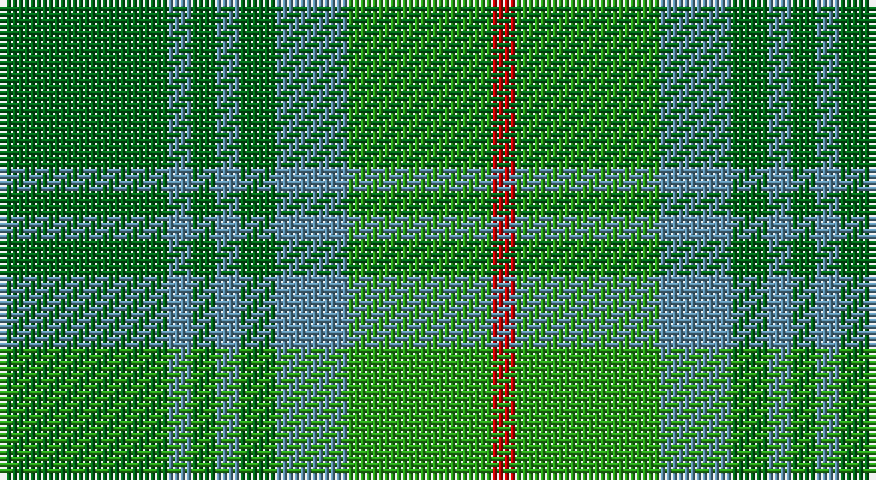

This page is one **sett** — a single exact thread-count. It belongs to the [tartan](/setts/gi14t2gi2t2gi3t6g12r2/)
(the same proportion at any scale), whose colour order is pattern [GBGBGBGR](/stripes/gbgbgbgr/).

Sourced from register-of-tartans.  It is a [8 stripe tartan](/stripes/stripes8/).

Original link https://www.tartanregister.gov.uk/tartanDetails.aspx?ref=795

2 attestations — the source records this cloth was collapsed from (oldest owns this page)

<ul>
<li>01/01/1842 — Cranston (register-of-tartans, <a href="https://www.tartanregister.gov.uk/tartanDetails.aspx?ref=795">record</a>)</li>
<li>1842 — Cranston (Clan) (tartans-authority, <a href="http://www.tartansauthority.com/tartan-ferret/display/706/">record</a>)</li>
</ul>

## Register references

External register numbers recorded for this tartan.

- Scottish Register of Tartans: [795](https://www.tartanregister.gov.uk/tartanDetails.aspx?ref=795)
- Scottish Tartans Authority (ITI): 706
- Scottish Tartans World Register: 706

## Thread count
G/28 B4 G4 B4 G6 B12 Ga24 R/4

One full sett is **140 threads**.

## Palette

Palette: <strong>Tartan Register</strong>
<table><thead><tr><th>Colour</th><th>Threads</th><th>Shade</th><th>Base</th><th>OKLCh</th></tr></thead><tbody><tr><td>G/</td><td style="text-align:right;font-variant-numeric:tabular-nums">28</td><td><code style="background-color:#006818;">#006818</code> <small style="color:#888">#006818</small></td><td>G <code style="background-color:#006100;">#006100</code></td><td><small style="color:#888">oklch(45.0% 0.142 145.0)</small></td></tr><tr><td>B</td><td style="text-align:right;font-variant-numeric:tabular-nums">4</td><td><code style="background-color:#5C8CA8;">#5C8CA8</code> <small style="color:#888">#5C8CA8</small></td><td>B <code style="background-color:#2A418A;">#2A418A</code></td><td><small style="color:#888">oklch(61.7% 0.067 235.0)</small></td></tr><tr><td>G</td><td style="text-align:right;font-variant-numeric:tabular-nums">4</td><td><code style="background-color:#006818;">#006818</code> <small style="color:#888">#006818</small></td><td>G <code style="background-color:#006100;">#006100</code></td><td><small style="color:#888">oklch(45.0% 0.142 145.0)</small></td></tr><tr><td>B</td><td style="text-align:right;font-variant-numeric:tabular-nums">4</td><td><code style="background-color:#5C8CA8;">#5C8CA8</code> <small style="color:#888">#5C8CA8</small></td><td>B <code style="background-color:#2A418A;">#2A418A</code></td><td><small style="color:#888">oklch(61.7% 0.067 235.0)</small></td></tr><tr><td>G</td><td style="text-align:right;font-variant-numeric:tabular-nums">6</td><td><code style="background-color:#006818;">#006818</code> <small style="color:#888">#006818</small></td><td>G <code style="background-color:#006100;">#006100</code></td><td><small style="color:#888">oklch(45.0% 0.142 145.0)</small></td></tr><tr><td>B</td><td style="text-align:right;font-variant-numeric:tabular-nums">12</td><td><code style="background-color:#5C8CA8;">#5C8CA8</code> <small style="color:#888">#5C8CA8</small></td><td>B <code style="background-color:#2A418A;">#2A418A</code></td><td><small style="color:#888">oklch(61.7% 0.067 235.0)</small></td></tr><tr><td>Ga</td><td style="text-align:right;font-variant-numeric:tabular-nums">24</td><td><code style="background-color:#289C18;">#289C18</code> <small style="color:#888">#289C18</small></td><td>G <code style="background-color:#006100;">#006100</code></td><td><small style="color:#888">oklch(60.6% 0.191 141.6)</small></td></tr><tr><td>R/</td><td style="text-align:right;font-variant-numeric:tabular-nums">4</td><td><code style="background-color:#C80000;">#C80000</code> <small style="color:#888">#C80000</small></td><td>R <code style="background-color:#CC0000;">#CC0000</code></td><td><small style="color:#888">oklch(52.3% 0.215 29.2)</small></td></tr></tbody></table>

# Sample pattern

## Nearest tartans

The nearest existing variants by ΔTartan distance, with this tartan at the top so the swatches line up against it.

ΔTartan

Tartan

Sett

—

<a href="/ttd/edit/#slug=gi14t2gi2t2gi3t6g12r2~x2">Cranston</a> <a class="nn-out" href="/variants/s8/gi14t2gi2t2gi3t6g12r2~x2/" title="open its dictionary page">↗</a>

1.26

<a href="/ttd/edit/#slug=db3o7g2r2g14o2g2db3~x2&amp;base=gi14t2gi2t2gi3t6g12r2~x2">Daks, Tartan-Loden</a> <a class="nn-out" href="/variants/s8/db3o7g2r2g14o2g2db3~x2/" title="open its dictionary page">↗</a>

1.43

<a href="/ttd/edit/#slug=t12gi2t2gi2t2dy8g8dy1~x2&amp;base=gi14t2gi2t2gi3t6g12r2~x2">Universal Ancient International Tartan</a> <a class="nn-out" href="/variants/s8/t12gi2t2gi2t2dy8g8dy1~x2/" title="open its dictionary page">↗</a>

1.50

<a href="/ttd/edit/#slug=gi14db1gi1db1gi3db6g12r2~x2&amp;base=gi14t2gi2t2gi3t6g12r2~x2">Cranstoun</a> <a class="nn-out" href="/variants/s8/gi14db1gi1db1gi3db6g12r2~x2/" title="open its dictionary page">↗</a>

1.52

<a href="/ttd/edit/#slug=g10n2w2n16g6ly2g4r2g3n6~x4&amp;base=gi14t2gi2t2gi3t6g12r2~x2">Harkness Htg (Name)</a> <a class="nn-out" href="/variants/s10/g10n2w2n16g6ly2g4r2g3n6~x4/" title="open its dictionary page">↗</a>

1.54

<a href="/ttd/edit/#slug=db3dy7g2y2g14dy2g2db3~x2&amp;base=gi14t2gi2t2gi3t6g12r2~x2">Daks (Loden)</a> <a class="nn-out" href="/variants/s8/db3dy7g2y2g14dy2g2db3~x2/" title="open its dictionary page">↗</a>

1.56

<a href="/ttd/edit/#slug=gi11dg1gi1dg1gi1dg8g8dgi1g8dg8gi8g1gi1~x4&amp;base=gi14t2gi2t2gi3t6g12r2~x2">Keogh Hunting (Name)</a> <a class="nn-out" href="/variants/s13/gi11dg1gi1dg1gi1dg8g8dgi1g8dg8gi8g1gi1~x4/" title="open its dictionary page">↗</a>

1.65

<a href="/ttd/edit/#slug=gi2lo1gi12lb6g12r1~x4&amp;base=gi14t2gi2t2gi3t6g12r2~x2">City of Vancouver (Commemorative)</a> <a class="nn-out" href="/variants/s6/gi2lo1gi12lb6g12r1~x4/" title="open its dictionary page">↗</a>

1.69

<a href="/ttd/edit/#slug=g1o8g8r1g8o8w1~x4&amp;base=gi14t2gi2t2gi3t6g12r2~x2">MacKinnon, hunting</a> <a class="nn-out" href="/variants/s7/g1o8g8r1g8o8w1~x4/" title="open its dictionary page">↗</a>

1.70

<a href="/ttd/edit/#slug=t12g2t2g2t2o8gi8o1~x2&amp;base=gi14t2gi2t2gi3t6g12r2~x2">Universal, Ancient</a> <a class="nn-out" href="/variants/s8/t12g2t2g2t2o8gi8o1~x2/" title="open its dictionary page">↗</a>

1.73

<a href="/ttd/edit/#slug=yi12dg2yi2dg2yi2dy8y8dy1~x2&amp;base=gi14t2gi2t2gi3t6g12r2~x2">Ancient Universal (Fashion?)</a> <a class="nn-out" href="/variants/s8/yi12dg2yi2dg2yi2dy8y8dy1~x2/" title="open its dictionary page">↗</a>

## Neighbour map

Every grey dot is one of 14360 variants placed by the first two principal components of the ΔTartan feature space (44% of its variance). Red is this tartan; blue dots are its nearest — click one to open its page.

<svg viewBox="0 0 640 380" role="img" style="max-width:100%;height:auto;border:1px solid #e0e0e0;border-radius:4px;display:block" xmlns="http://www.w3.org/2000/svg"><image href="/nn/cloud.v1.png" width="640" height="380"/><a href="/variants/s8/db3o7g2r2g14o2g2db3~x2/"><circle cx="304.6" cy="239.6" r="4" fill="#3465a4"><title>Daks, Tartan-Loden</title></circle></a><a href="/variants/s8/t12gi2t2gi2t2dy8g8dy1~x2/"><circle cx="264.9" cy="222.1" r="4" fill="#3465a4"><title>Universal Ancient International Tartan</title></circle></a><a href="/variants/s8/gi14db1gi1db1gi3db6g12r2~x2/"><circle cx="280.9" cy="203.8" r="4" fill="#3465a4"><title>Cranstoun</title></circle></a><a href="/variants/s10/g10n2w2n16g6ly2g4r2g3n6~x4/"><circle cx="283.7" cy="231.7" r="4" fill="#3465a4"><title>Harkness Htg (Name)</title></circle></a><a href="/variants/s8/db3dy7g2y2g14dy2g2db3~x2/"><circle cx="329.5" cy="256.6" r="4" fill="#3465a4"><title>Daks (Loden)</title></circle></a><a href="/variants/s13/gi11dg1gi1dg1gi1dg8g8dgi1g8dg8gi8g1gi1~x4/"><circle cx="258.2" cy="223.2" r="4" fill="#3465a4"><title>Keogh Hunting (Name)</title></circle></a><a href="/variants/s6/gi2lo1gi12lb6g12r1~x4/"><circle cx="246.1" cy="215.0" r="4" fill="#3465a4"><title>City of Vancouver (Commemorative)</title></circle></a><a href="/variants/s7/g1o8g8r1g8o8w1~x4/"><circle cx="334.8" cy="268.5" r="4" fill="#3465a4"><title>MacKinnon, hunting</title></circle></a><a href="/variants/s8/t12g2t2g2t2o8gi8o1~x2/"><circle cx="290.1" cy="235.2" r="4" fill="#3465a4"><title>Universal, Ancient</title></circle></a><a href="/variants/s8/yi12dg2yi2dg2yi2dy8y8dy1~x2/"><circle cx="283.4" cy="227.7" r="4" fill="#3465a4"><title>Ancient Universal (Fashion?)</title></circle></a><circle cx="270.7" cy="251.5" r="5" fill="#c00000"/></svg>

ID: /variants/s8/gi14t2gi2t2gi3t6g12r2~x2/
