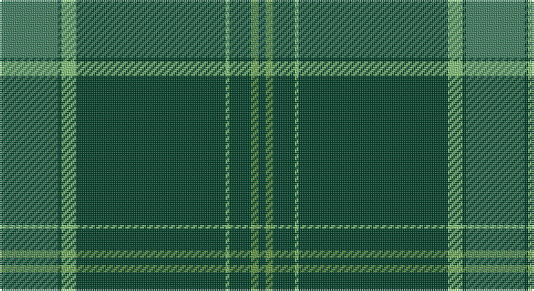

This page is one **sett** — a single exact thread-count. It belongs to the [tartan](/setts/gi16dg1lg4dg41lg1dg6g2dg2/)
(the same proportion at any scale), whose colour order is pattern [GGGYGYGG](/stripes/gggygygg/).

Part of the [Semper](/tartans/semper/) tartan — the named design grouping this sett with its other cloths.

Sourced from register-of-tartans.  It is a [8 stripe tartan](/stripes/stripes8/).

Original link https://www.tartanregister.gov.uk/tartanDetails.aspx?ref=11007

## Register references

External register numbers recorded for this tartan.

- Scottish Register of Tartans: [11007](https://www.tartanregister.gov.uk/tartanDetails.aspx?ref=11007)

## Thread count
G/32 DG2 LGa8 DG82 LGa2 DG12 LG4 DG/4

One full sett is **256 threads**.

## Palette

Palette: <strong>Tartan Register</strong>
<table><thead><tr><th>Colour</th><th>Threads</th><th>Shade</th><th>Base</th><th>OKLCh</th></tr></thead><tbody><tr><td>G/</td><td style="text-align:right;font-variant-numeric:tabular-nums">32</td><td><code style="background-color:#408060;">#408060</code> <small style="color:#888">#408060</small></td><td>G <code style="background-color:#006100;">#006100</code></td><td><small style="color:#888">oklch(54.8% 0.084 160.1)</small></td></tr><tr><td>DG</td><td style="text-align:right;font-variant-numeric:tabular-nums">2</td><td><code style="background-color:#004028;">#004028</code> <small style="color:#888">#004028</small></td><td>G <code style="background-color:#006100;">#006100</code></td><td><small style="color:#888">oklch(32.8% 0.073 160.8)</small></td></tr><tr><td>LGa</td><td style="text-align:right;font-variant-numeric:tabular-nums">8</td><td><code style="background-color:#86C67C;">#86C67C</code> <small style="color:#888">#86C67C</small></td><td>Y <code style="background-color:#F2BF00;">#F2BF00</code></td><td><small style="color:#888">oklch(76.5% 0.122 141.1)</small></td></tr><tr><td>DG</td><td style="text-align:right;font-variant-numeric:tabular-nums">82</td><td><code style="background-color:#004028;">#004028</code> <small style="color:#888">#004028</small></td><td>G <code style="background-color:#006100;">#006100</code></td><td><small style="color:#888">oklch(32.8% 0.073 160.8)</small></td></tr><tr><td>LGa</td><td style="text-align:right;font-variant-numeric:tabular-nums">2</td><td><code style="background-color:#86C67C;">#86C67C</code> <small style="color:#888">#86C67C</small></td><td>Y <code style="background-color:#F2BF00;">#F2BF00</code></td><td><small style="color:#888">oklch(76.5% 0.122 141.1)</small></td></tr><tr><td>DG</td><td style="text-align:right;font-variant-numeric:tabular-nums">12</td><td><code style="background-color:#004028;">#004028</code> <small style="color:#888">#004028</small></td><td>G <code style="background-color:#006100;">#006100</code></td><td><small style="color:#888">oklch(32.8% 0.073 160.8)</small></td></tr><tr><td>LG</td><td style="text-align:right;font-variant-numeric:tabular-nums">4</td><td><code style="background-color:#649848;">#649848</code> <small style="color:#888">#649848</small></td><td>G <code style="background-color:#006100;">#006100</code></td><td><small style="color:#888">oklch(62.4% 0.125 135.7)</small></td></tr><tr><td>DG/</td><td style="text-align:right;font-variant-numeric:tabular-nums">4</td><td><code style="background-color:#004028;">#004028</code> <small style="color:#888">#004028</small></td><td>G <code style="background-color:#006100;">#006100</code></td><td><small style="color:#888">oklch(32.8% 0.073 160.8)</small></td></tr></tbody></table>

# Sample pattern

## Nearest tartans

The nearest existing variants by ΔTartan distance, with this tartan at the top so the swatches line up against it.

ΔTartan

Tartan

Sett

—

<a href="/ttd/edit/#slug=gi16dg1lg4dg41lg1dg6g2dg2~x2">Semper</a> <a class="nn-out" href="/variants/s8/gi16dg1lg4dg41lg1dg6g2dg2~x2/" title="open its dictionary page">↗</a>

0.36

<a href="/ttd/edit/#slug=gi16dg1y4dg41y1dg6g2dg2~x2&amp;base=gi16dg1lg4dg41lg1dg6g2dg2~x2">Semper</a> <a class="nn-out" href="/variants/s8/gi16dg1y4dg41y1dg6g2dg2~x2/" title="open its dictionary page">↗</a>

1.30

<a href="/ttd/edit/#slug=g44db11g5t3g4db8g4w1~x2&amp;base=gi16dg1lg4dg41lg1dg6g2dg2~x2">Hastings-Stephenson (Personal)</a> <a class="nn-out" href="/variants/s8/g44db11g5t3g4db8g4w1~x2/" title="open its dictionary page">↗</a>

1.32

<a href="/ttd/edit/#slug=g50db20k3db2dy2db5~x2&amp;base=gi16dg1lg4dg41lg1dg6g2dg2~x2">St Andrews Old Course Hotel Corporate Tartan</a> <a class="nn-out" href="/variants/s6/g50db20k3db2dy2db5~x2/" title="open its dictionary page">↗</a>

1.42

<a href="/ttd/edit/#slug=g44k2g2k2g3k12db10r3~x2&amp;base=gi16dg1lg4dg41lg1dg6g2dg2~x2">Celtic (New) Corporate Sport Tartan</a> <a class="nn-out" href="/variants/s8/g44k2g2k2g3k12db10r3~x2/" title="open its dictionary page">↗</a>

1.46

<a href="/ttd/edit/#slug=y36dg4k1y2k1dg4k4dg60r4dg4~x2&amp;base=gi16dg1lg4dg41lg1dg6g2dg2~x2">Orvis Sports Company (Corporate)</a> <a class="nn-out" href="/variants/s10/y36dg4k1y2k1dg4k4dg60r4dg4~x2/" title="open its dictionary page">↗</a>

1.47

<a href="/ttd/edit/#slug=r4dp12g2dp2g46w1~x2&amp;base=gi16dg1lg4dg41lg1dg6g2dg2~x2">Kinfauns Castle (Corporate)</a> <a class="nn-out" href="/variants/s6/r4dp12g2dp2g46w1~x2/" title="open its dictionary page">↗</a>

1.51

<a href="/ttd/edit/#slug=dg32k6dg4k8r1k2~x4&amp;base=gi16dg1lg4dg41lg1dg6g2dg2~x2">Fife, Duke Of</a> <a class="nn-out" href="/variants/s6/dg32k6dg4k8r1k2~x4/" title="open its dictionary page">↗</a>

1.52

<a href="/ttd/edit/#slug=g49db16dy3db2dy2db6~x2&amp;base=gi16dg1lg4dg41lg1dg6g2dg2~x2">Royal and Ancient, The</a> <a class="nn-out" href="/variants/s6/g49db16dy3db2dy2db6~x2/" title="open its dictionary page">↗</a>

1.55

<a href="/ttd/edit/#slug=g49db16o3db2o2db6~x2&amp;base=gi16dg1lg4dg41lg1dg6g2dg2~x2">Royal and Ancient, The</a> <a class="nn-out" href="/variants/s6/g49db16o3db2o2db6~x2/" title="open its dictionary page">↗</a>

1.55

<a href="/ttd/edit/#slug=g50db20k3db2o2db5~x2&amp;base=gi16dg1lg4dg41lg1dg6g2dg2~x2">St Andrews Hotel, Golf Resort, and SPA</a> <a class="nn-out" href="/variants/s6/g50db20k3db2o2db5~x2/" title="open its dictionary page">↗</a>

## Neighbour map

Every grey dot is one of 14360 variants placed by the first two principal components of the ΔTartan feature space (44% of its variance). Red is this tartan; blue dots are its nearest — click one to open its page.

<svg viewBox="0 0 640 380" role="img" style="max-width:100%;height:auto;border:1px solid #e0e0e0;border-radius:4px;display:block" xmlns="http://www.w3.org/2000/svg"><image href="/nn/cloud.v1.png" width="640" height="380"/><a href="/variants/s8/gi16dg1y4dg41y1dg6g2dg2~x2/"><circle cx="512.2" cy="157.8" r="4" fill="#3465a4"><title>Semper</title></circle></a><a href="/variants/s8/g44db11g5t3g4db8g4w1~x2/"><circle cx="501.6" cy="146.5" r="4" fill="#3465a4"><title>Hastings-Stephenson (Personal)</title></circle></a><a href="/variants/s6/g50db20k3db2dy2db5~x2/"><circle cx="446.9" cy="189.2" r="4" fill="#3465a4"><title>St Andrews Old Course Hotel Corporate Tartan</title></circle></a><a href="/variants/s8/g44k2g2k2g3k12db10r3~x2/"><circle cx="419.3" cy="165.0" r="4" fill="#3465a4"><title>Celtic (New) Corporate Sport Tartan</title></circle></a><a href="/variants/s10/y36dg4k1y2k1dg4k4dg60r4dg4~x2/"><circle cx="470.6" cy="124.2" r="4" fill="#3465a4"><title>Orvis Sports Company (Corporate)</title></circle></a><a href="/variants/s6/r4dp12g2dp2g46w1~x2/"><circle cx="517.4" cy="140.8" r="4" fill="#3465a4"><title>Kinfauns Castle (Corporate)</title></circle></a><a href="/variants/s6/dg32k6dg4k8r1k2~x4/"><circle cx="529.9" cy="209.0" r="4" fill="#3465a4"><title>Fife, Duke Of</title></circle></a><a href="/variants/s6/g49db16dy3db2dy2db6~x2/"><circle cx="484.8" cy="209.7" r="4" fill="#3465a4"><title>Royal and Ancient, The</title></circle></a><a href="/variants/s6/g49db16o3db2o2db6~x2/"><circle cx="470.2" cy="201.7" r="4" fill="#3465a4"><title>Royal and Ancient, The</title></circle></a><a href="/variants/s6/g50db20k3db2o2db5~x2/"><circle cx="416.1" cy="173.6" r="4" fill="#3465a4"><title>St Andrews Hotel, Golf Resort, and SPA</title></circle></a><circle cx="503.0" cy="153.0" r="5" fill="#c00000"/></svg>

ID: /variants/s8/gi16dg1lg4dg41lg1dg6g2dg2~x2/
