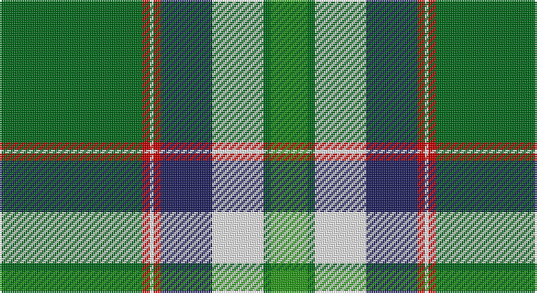

This page is one **sett** — a single exact thread-count. It belongs to the [tartan](/setts/gi39r2w1r2db14w14gi2g10/)
(the same proportion at any scale), whose colour order is pattern [GGWBRWRG](/stripes/ggwbrwrg/).

Sourced from tartans-authority.  It is a [8 stripe tartan](/stripes/stripes8/).

Original link http://www.tartansauthority.com/tartan-ferret/display/6744/

## Register references

External register numbers recorded for this tartan.

- Scottish Tartans Authority (ITI): 6744

## Thread count
Ga/78 R4 W2 R4 DB28 W28 Ga4 G/20

One full sett is **238 threads**.

## Palette

Palette: <strong>Tartan Register</strong>
<table><thead><tr><th>Colour</th><th>Threads</th><th>Shade</th><th>Base</th><th>OKLCh</th></tr></thead><tbody><tr><td>Ga/</td><td style="text-align:right;font-variant-numeric:tabular-nums">78</td><td><code style="background-color:#006818;">#006818</code> <small style="color:#888">#006818</small></td><td>G <code style="background-color:#006100;">#006100</code></td><td><small style="color:#888">oklch(45.0% 0.142 145.0)</small></td></tr><tr><td>R</td><td style="text-align:right;font-variant-numeric:tabular-nums">4</td><td><code style="background-color:#C80000;">#C80000</code> <small style="color:#888">#C80000</small></td><td>R <code style="background-color:#CC0000;">#CC0000</code></td><td><small style="color:#888">oklch(52.3% 0.215 29.2)</small></td></tr><tr><td>W</td><td style="text-align:right;font-variant-numeric:tabular-nums">2</td><td><code style="background-color:#FCFCFC;">#FCFCFC</code> <small style="color:#888">#FCFCFC</small></td><td>W <code style="background-color:#F7F7F7;">#F7F7F7</code></td><td><small style="color:#888">oklch(99.1% 0.000 89.9)</small></td></tr><tr><td>R</td><td style="text-align:right;font-variant-numeric:tabular-nums">4</td><td><code style="background-color:#C80000;">#C80000</code> <small style="color:#888">#C80000</small></td><td>R <code style="background-color:#CC0000;">#CC0000</code></td><td><small style="color:#888">oklch(52.3% 0.215 29.2)</small></td></tr><tr><td>DB</td><td style="text-align:right;font-variant-numeric:tabular-nums">28</td><td><code style="background-color:#202060;">#202060</code> <small style="color:#888">#202060</small></td><td>B <code style="background-color:#2A418A;">#2A418A</code></td><td><small style="color:#888">oklch(28.9% 0.111 276.9)</small></td></tr><tr><td>W</td><td style="text-align:right;font-variant-numeric:tabular-nums">28</td><td><code style="background-color:#FCFCFC;">#FCFCFC</code> <small style="color:#888">#FCFCFC</small></td><td>W <code style="background-color:#F7F7F7;">#F7F7F7</code></td><td><small style="color:#888">oklch(99.1% 0.000 89.9)</small></td></tr><tr><td>Ga</td><td style="text-align:right;font-variant-numeric:tabular-nums">4</td><td><code style="background-color:#006818;">#006818</code> <small style="color:#888">#006818</small></td><td>G <code style="background-color:#006100;">#006100</code></td><td><small style="color:#888">oklch(45.0% 0.142 145.0)</small></td></tr><tr><td>G/</td><td style="text-align:right;font-variant-numeric:tabular-nums">20</td><td><code style="background-color:#289C18;">#289C18</code> <small style="color:#888">#289C18</small></td><td>G <code style="background-color:#006100;">#006100</code></td><td><small style="color:#888">oklch(60.6% 0.191 141.6)</small></td></tr></tbody></table>

# Sample pattern

## Nearest tartans

The nearest existing variants by ΔTartan distance, with this tartan at the top so the swatches line up against it.

ΔTartan

Tartan

Sett

—

<a href="/ttd/edit/#slug=gi39r2w1r2db14w14gi2g10~x2">Southwell (Australian) (Personal)</a> <a class="nn-out" href="/variants/s8/gi39r2w1r2db14w14gi2g10~x2/" title="open its dictionary page">↗</a>

1.03

<a href="/ttd/edit/#slug=r6g2w21ly2k8ly2g32w1k3~x2&amp;base=gi39r2w1r2db14w14gi2g10~x2">Fiander, Julian (Personal)</a> <a class="nn-out" href="/variants/s9/r6g2w21ly2k8ly2g32w1k3~x2/" title="open its dictionary page">↗</a>

1.21

<a href="/ttd/edit/#slug=g4k2g28r4g4k18g4lp4g4lp7k1w3~x2&amp;base=gi39r2w1r2db14w14gi2g10~x2">Moss</a> <a class="nn-out" href="/variants/s12/g4k2g28r4g4k18g4lp4g4lp7k1w3~x2/" title="open its dictionary page">↗</a>

1.37

<a href="/ttd/edit/#slug=w2k4db16lo12g36k1k6lo2w2~x2&amp;base=gi39r2w1r2db14w14gi2g10~x2">National Millennium (Commemorative)</a> <a class="nn-out" href="/variants/s9/w2k4db16lo12g36k1k6lo2w2~x2/" title="open its dictionary page">↗</a>

1.37

<a href="/ttd/edit/#slug=w3k1r4g20k3b30w4r2~x2&amp;base=gi39r2w1r2db14w14gi2g10~x2">Scottish Prison Service (Corporate)</a> <a class="nn-out" href="/variants/s8/w3k1r4g20k3b30w4r2~x2/" title="open its dictionary page">↗</a>

1.37

<a href="/ttd/edit/#slug=w9gi2g2w3g18w2k2w1k19gi33lo2~x2&amp;base=gi39r2w1r2db14w14gi2g10~x2">New World Irish</a> <a class="nn-out" href="/variants/s11/w9gi2g2w3g18w2k2w1k19gi33lo2~x2/" title="open its dictionary page">↗</a>

1.37

<a href="/ttd/edit/#slug=g90r1k10w6k4g6r10db62ly8&amp;base=gi39r2w1r2db14w14gi2g10~x2">Stirling, University of</a> <a class="nn-out" href="/variants/s9/g90r1k10w6k4g6r10db62ly8/" title="open its dictionary page">↗</a>

1.38

<a href="/ttd/edit/#slug=db10k12g3k1g1k1g30lo4w4~x2&amp;base=gi39r2w1r2db14w14gi2g10~x2">Hutchens (Kansas) (Personal)</a> <a class="nn-out" href="/variants/s9/db10k12g3k1g1k1g30lo4w4~x2/" title="open its dictionary page">↗</a>

1.39

<a href="/ttd/edit/#slug=dt3loi2dt30loi1w18lg30lo2lg3~x2&amp;base=gi39r2w1r2db14w14gi2g10~x2">Bannockbane Green</a> <a class="nn-out" href="/variants/s8/dt3loi2dt30loi1w18lg30lo2lg3~x2/" title="open its dictionary page">↗</a>

1.42

<a href="/ttd/edit/#slug=y3g32y36o12k2w68g3k2~x2&amp;base=gi39r2w1r2db14w14gi2g10~x2">Kintail Dress</a> <a class="nn-out" href="/variants/s8/y3g32y36o12k2w68g3k2~x2/" title="open its dictionary page">↗</a>

1.43

<a href="/ttd/edit/#slug=g42ly1w2ly1g5dg12w32g4~x2&amp;base=gi39r2w1r2db14w14gi2g10~x2">Longniddry Green Error (Dance)</a> <a class="nn-out" href="/variants/s8/g42ly1w2ly1g5dg12w32g4~x2/" title="open its dictionary page">↗</a>

## Neighbour map

Every grey dot is one of 14360 variants placed by the first two principal components of the ΔTartan feature space (44% of its variance). Red is this tartan; blue dots are its nearest — click one to open its page.

<svg viewBox="0 0 640 380" role="img" style="max-width:100%;height:auto;border:1px solid #e0e0e0;border-radius:4px;display:block" xmlns="http://www.w3.org/2000/svg"><image href="/nn/cloud.v1.png" width="640" height="380"/><a href="/variants/s9/r6g2w21ly2k8ly2g32w1k3~x2/"><circle cx="216.3" cy="87.0" r="4" fill="#3465a4"><title>Fiander, Julian (Personal)</title></circle></a><a href="/variants/s12/g4k2g28r4g4k18g4lp4g4lp7k1w3~x2/"><circle cx="262.3" cy="99.5" r="4" fill="#3465a4"><title>Moss</title></circle></a><a href="/variants/s9/w2k4db16lo12g36k1k6lo2w2~x2/"><circle cx="218.7" cy="86.3" r="4" fill="#3465a4"><title>National Millennium (Commemorative)</title></circle></a><a href="/variants/s8/w3k1r4g20k3b30w4r2~x2/"><circle cx="251.9" cy="116.2" r="4" fill="#3465a4"><title>Scottish Prison Service (Corporate)</title></circle></a><a href="/variants/s11/w9gi2g2w3g18w2k2w1k19gi33lo2~x2/"><circle cx="184.6" cy="91.0" r="4" fill="#3465a4"><title>New World Irish</title></circle></a><a href="/variants/s9/g90r1k10w6k4g6r10db62ly8/"><circle cx="283.4" cy="72.3" r="4" fill="#3465a4"><title>Stirling, University of</title></circle></a><a href="/variants/s9/db10k12g3k1g1k1g30lo4w4~x2/"><circle cx="277.7" cy="116.6" r="4" fill="#3465a4"><title>Hutchens (Kansas) (Personal)</title></circle></a><a href="/variants/s8/dt3loi2dt30loi1w18lg30lo2lg3~x2/"><circle cx="202.2" cy="105.3" r="4" fill="#3465a4"><title>Bannockbane Green</title></circle></a><a href="/variants/s8/y3g32y36o12k2w68g3k2~x2/"><circle cx="226.6" cy="96.4" r="4" fill="#3465a4"><title>Kintail Dress</title></circle></a><a href="/variants/s8/g42ly1w2ly1g5dg12w32g4~x2/"><circle cx="302.8" cy="103.9" r="4" fill="#3465a4"><title>Longniddry Green Error (Dance)</title></circle></a><circle cx="252.9" cy="101.7" r="5" fill="#c00000"/></svg>

ID: /variants/s8/gi39r2w1r2db14w14gi2g10~x2/
