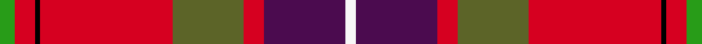

This page is one **sett** — a single exact thread-count. It belongs to the [tartan](/setts/gi3r4k1r26g14r4dp16w2/)
(the same proportion at any scale), whose colour order is pattern [GRKRGRBW](/stripes/grkrgrbw/).

Sourced from tartans-authority.  It is a [8 stripe tartan](/stripes/stripes8/).

Original link http://www.tartansauthority.com/tartan-ferret/display/8892/

## Register references

External register numbers recorded for this tartan.

- Scottish Tartans Authority (ITI): 8892

## Thread count
Gi/6 R8 K2 R52 G28 R8 DP32 W/4

One full sett is **270 threads**.

## Palette
<table><thead><tr><th>Colour</th><th>Shade</th><th>OKLCh</th></tr></thead><tbody><tr><td>DP</td><td><code style="background-color:#4B0B4F;">#4B0B4F</code> <small style="color:#888">#4B0B4F</small></td><td><small style="color:#888">oklch(30.1% 0.125 325.4)</small></td></tr><tr><td>G</td><td><code style="background-color:#289C18;">#289C18</code> <small style="color:#888">#289C18</small></td><td><small style="color:#888">oklch(60.6% 0.191 141.6)</small></td></tr><tr><td>G</td><td><code style="background-color:#5C6428;">#5C6428</code> <small style="color:#888">#5C6428</small></td><td><small style="color:#888">oklch(48.3% 0.084 116.0)</small></td></tr><tr><td>K</td><td><code style="background-color:#000000;">#000000</code> <small style="color:#888">#000000</small></td><td><small style="color:#888">oklch(0.0% 0.000 0.0)</small></td></tr><tr><td>R</td><td><code style="background-color:#D60020;">#D60020</code> <small style="color:#888">#D60020</small></td><td><small style="color:#888">oklch(55.2% 0.224 25.5)</small></td></tr><tr><td>W</td><td><code style="background-color:#F7F7F7;">#F7F7F7</code> <small style="color:#888">#F7F7F7</small></td><td><small style="color:#888">oklch(97.6% 0.000 89.9)</small></td></tr></tbody></table>

# Sample pattern

## Nearest variants

The nearest existing variants by ΔTartan distance, with this cloth at the top so the swatches line up against it.

ΔTartan

Threads

Variant

Sett

—

270

<a href="/variants/s8/gi3r4k1r26g14r4dp16w2~x2~gi2408144-g1903114/">MacQueen of Dalmagarry (Clan?)</a>

<a href="/ttd/edit/#slug=y3r4k1r27g14r4db15w2~x2&amp;base=gi3r4k1r26g14r4dp16w2~x2~gi2408144-g1903114" title="compare in the TTD">1.73</a>

270

<a href="/variants/s8/y3r4k1r27g14r4db15w2~x2/">Dalmagarry (Corporate)</a>

<a href="/ttd/edit/#slug=lb5k1r30dp15r8g30r8dp2~x2&amp;base=gi3r4k1r26g14r4dp16w2~x2~gi2408144-g1903114" title="compare in the TTD">2.30</a>

382

<a href="/variants/s8/lb5k1r30dp15r8g30r8dp2~x2/">Shaw Red of Tordarroch Dress (Clan 2</a>

<a href="/ttd/edit/#slug=lb5k1r30dp15r8g30r8dp2&amp;base=gi3r4k1r26g14r4dp16w2~x2~gi2408144-g1903114" title="compare in the TTD">2.30</a>

191

<a href="/variants/s8/lb5k1r30dp15r8g30r8dp2/">Shaw of Tordarroch Clan Tartan</a>

<a href="/ttd/edit/#slug=r8y1g20r29k2r29w20r2db7~x2&amp;base=gi3r4k1r26g14r4dp16w2~x2~gi2408144-g1903114" title="compare in the TTD">2.71</a>

442

<a href="/variants/s9/r8y1g20r29k2r29w20r2db7~x2/">Unidentified Travelling costume</a>

## Neighbour map

Every grey dot is one of 13620 variants placed by the first two principal components of the ΔTartan feature space (42% of its variance). Red is this tartan; blue dots are its nearest — click one to open its page.

<svg viewBox="0 0 640 380" role="img" style="max-width:100%;height:auto;border:1px solid #e0e0e0;border-radius:4px;display:block" xmlns="http://www.w3.org/2000/svg"><image href="/nn/cloud.v1.png" width="640" height="380"/><a href="/variants/s8/y3r4k1r27g14r4db15w2~x2/"><circle cx="238.3" cy="104.3" r="4" fill="#3465a4"><title>Dalmagarry (Corporate)</title></circle></a><a href="/variants/s8/lb5k1r30dp15r8g30r8dp2~x2/"><circle cx="254.7" cy="126.4" r="4" fill="#3465a4"><title>Shaw Red of Tordarroch Dress (Clan 2</title></circle></a><a href="/variants/s8/lb5k1r30dp15r8g30r8dp2/"><circle cx="254.7" cy="126.4" r="4" fill="#3465a4"><title>Shaw of Tordarroch Clan Tartan</title></circle></a><a href="/variants/s9/r8y1g20r29k2r29w20r2db7~x2/"><circle cx="258.8" cy="102.0" r="4" fill="#3465a4"><title>Unidentified Travelling costume</title></circle></a><circle cx="257.3" cy="112.3" r="5" fill="#c00000"/><text x="320" y="376" text-anchor="middle" font-size="11" fill="#999">ground</text><text x="11" y="190" text-anchor="middle" font-size="11" fill="#999" transform="rotate(-90 11 190)">complexity</text></svg>

ID: /variants/s8/gi3r4k1r26g14r4dp16w2~x2~gi2408144-g1903114/
