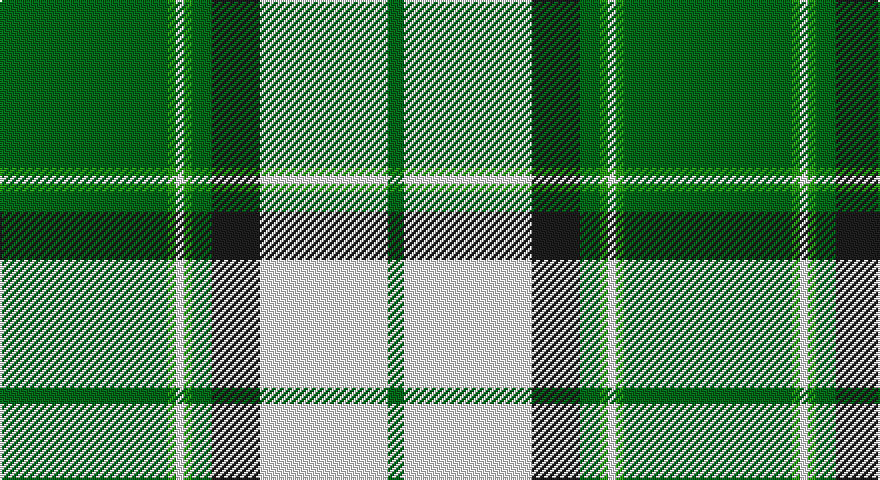

This page is one **sett** — a single exact thread-count. It belongs to the [tartan](/setts/gi42g2w2g2gi5dt12w32gi4/)
(the same proportion at any scale), whose colour order is pattern [GGWGGBWG](/stripes/ggwggbwg/).

Part of the [Longniddry](/tartans/longniddry/) tartan — the named design grouping this sett with its other cloths.

Sourced from register-of-tartans.  It is a [8 stripe tartan](/stripes/stripes8/).

Original link https://www.tartanregister.gov.uk/tartanDetails.aspx?ref=2208

## Also known as

This cloth is also recorded under:

- Longniddry Green
- Longniddry Green Error
- Longniddry, Green
- Longniddry, Green Error

2 attestations — the source records this cloth was collapsed from (oldest owns this page)

<ul>
<li>01/01/2002 — Longniddry Green (Dance) (register-of-tartans, <a href="https://www.tartanregister.gov.uk/tartanDetails.aspx?ref=2208">record</a>)</li>
<li>pre 2002 — Longniddry, Green (Dance) (tartans-authority, <a href="http://www.tartansauthority.com/tartan-ferret/display/764/">record</a>)</li>
</ul>

## Register references

External register numbers recorded for this tartan.

- Scottish Register of Tartans: [2208](https://www.tartanregister.gov.uk/tartanDetails.aspx?ref=2208)
- Scottish Tartans Authority (ITI): 764
- Scottish Tartans World Register: 764

## Thread count
G/84 Ga4 W4 Ga4 G10 K24 W64 G/8

One full sett is **312 threads**.

## Palette

Palette: <strong>Tartan Register</strong>
<table><thead><tr><th>Colour</th><th>Threads</th><th>Shade</th><th>Base</th><th>OKLCh</th></tr></thead><tbody><tr><td>G/</td><td style="text-align:right;font-variant-numeric:tabular-nums">84</td><td><code style="background-color:#006818;">#006818</code> <small style="color:#888">#006818</small></td><td>G <code style="background-color:#006100;">#006100</code></td><td><small style="color:#888">oklch(45.0% 0.142 145.0)</small></td></tr><tr><td>Ga</td><td style="text-align:right;font-variant-numeric:tabular-nums">4</td><td><code style="background-color:#289C18;">#289C18</code> <small style="color:#888">#289C18</small></td><td>G <code style="background-color:#006100;">#006100</code></td><td><small style="color:#888">oklch(60.6% 0.191 141.6)</small></td></tr><tr><td>W</td><td style="text-align:right;font-variant-numeric:tabular-nums">4</td><td><code style="background-color:#FCFCFC;">#FCFCFC</code> <small style="color:#888">#FCFCFC</small></td><td>W <code style="background-color:#F7F7F7;">#F7F7F7</code></td><td><small style="color:#888">oklch(99.1% 0.000 89.9)</small></td></tr><tr><td>Ga</td><td style="text-align:right;font-variant-numeric:tabular-nums">4</td><td><code style="background-color:#289C18;">#289C18</code> <small style="color:#888">#289C18</small></td><td>G <code style="background-color:#006100;">#006100</code></td><td><small style="color:#888">oklch(60.6% 0.191 141.6)</small></td></tr><tr><td>G</td><td style="text-align:right;font-variant-numeric:tabular-nums">10</td><td><code style="background-color:#006818;">#006818</code> <small style="color:#888">#006818</small></td><td>G <code style="background-color:#006100;">#006100</code></td><td><small style="color:#888">oklch(45.0% 0.142 145.0)</small></td></tr><tr><td>K</td><td style="text-align:right;font-variant-numeric:tabular-nums">24</td><td><code style="background-color:#1C1C1C;">#1C1C1C</code> <small style="color:#888">#1C1C1C</small></td><td>B <code style="background-color:#2A418A;">#2A418A</code></td><td><small style="color:#888">oklch(22.6% 0.000 89.9)</small></td></tr><tr><td>W</td><td style="text-align:right;font-variant-numeric:tabular-nums">64</td><td><code style="background-color:#FCFCFC;">#FCFCFC</code> <small style="color:#888">#FCFCFC</small></td><td>W <code style="background-color:#F7F7F7;">#F7F7F7</code></td><td><small style="color:#888">oklch(99.1% 0.000 89.9)</small></td></tr><tr><td>G/</td><td style="text-align:right;font-variant-numeric:tabular-nums">8</td><td><code style="background-color:#006818;">#006818</code> <small style="color:#888">#006818</small></td><td>G <code style="background-color:#006100;">#006100</code></td><td><small style="color:#888">oklch(45.0% 0.142 145.0)</small></td></tr></tbody></table>

# Sample pattern

## Compared to the master

This cloth is one sett of its design; the master sett (the exemplar the design is anchored on) is below for comparison.

<figure style="margin:0"><figcaption style="color:#888;font-size:smaller">this sett</figcaption></figure>
<figure style="margin:0"><figcaption style="color:#888;font-size:smaller"><a href="/setts/g42ly1w2ly1g5dg12w32g4/">master sett →</a></figcaption></figure>

## Nearest tartans

The nearest existing variants by ΔTartan distance, with this tartan at the top so the swatches line up against it.

ΔTartan

Tartan

Sett

—

<a href="/ttd/edit/#slug=gi42g2w2g2gi5dt12w32gi4~x2">Longniddry Green (Dance)</a> <a class="nn-out" href="/variants/s8/gi42g2w2g2gi5dt12w32gi4~x2/" title="open its dictionary page">↗</a>

0.54

<a href="/ttd/edit/#slug=gi42g2w2g2gi5dg12w32gi4~x2&amp;base=gi42g2w2g2gi5dt12w32gi4~x2">Longniddry Green District Tartan</a> <a class="nn-out" href="/variants/s8/gi42g2w2g2gi5dg12w32gi4~x2/" title="open its dictionary page">↗</a>

0.86

<a href="/ttd/edit/#slug=g42gi2w2gi2g5dg12w32g4~x2&amp;base=gi42g2w2g2gi5dt12w32gi4~x2">Longniddry, Green</a> <a class="nn-out" href="/variants/s8/g42gi2w2gi2g5dg12w32g4~x2/" title="open its dictionary page">↗</a>

0.97

<a href="/ttd/edit/#slug=g3r2g27dg3w30dg2w3~x2&amp;base=gi42g2w2g2gi5dt12w32gi4~x2">Uist, Green (Dance)</a> <a class="nn-out" href="/variants/s7/g3r2g27dg3w30dg2w3~x2/" title="open its dictionary page">↗</a>

1.07

<a href="/ttd/edit/#slug=g42ly1w2ly1g5dg12w32g4~x2&amp;base=gi42g2w2g2gi5dt12w32gi4~x2">Longniddry Green Error (Dance)</a> <a class="nn-out" href="/variants/s8/g42ly1w2ly1g5dg12w32g4~x2/" title="open its dictionary page">↗</a>

1.37

<a href="/ttd/edit/#slug=ly6dg36w5b4w30b1w2~x2&amp;base=gi42g2w2g2gi5dt12w32gi4~x2">Pearce Scotch Plaid 4 (Fashion)</a> <a class="nn-out" href="/variants/s7/ly6dg36w5b4w30b1w2~x2/" title="open its dictionary page">↗</a>

1.38

<a href="/ttd/edit/#slug=dg41lo3g7n3w24dg10g7n7w3~x2&amp;base=gi42g2w2g2gi5dt12w32gi4~x2">Drummond of Perth Dress (Dance)</a> <a class="nn-out" href="/variants/s9/dg41lo3g7n3w24dg10g7n7w3~x2/" title="open its dictionary page">↗</a>

1.43

<a href="/ttd/edit/#slug=g26r5k1r2k1r5g16r5w16g2w8~x2&amp;base=gi42g2w2g2gi5dt12w32gi4~x2">Livingston (Personal)</a> <a class="nn-out" href="/variants/s11/g26r5k1r2k1r5g16r5w16g2w8~x2/" title="open its dictionary page">↗</a>

1.45

<a href="/ttd/edit/#slug=w5db3w25k2w2k16g8k1w4&amp;base=gi42g2w2g2gi5dt12w32gi4~x2">Unidentified (shirt fabric)</a> <a class="nn-out" href="/variants/s9/w5db3w25k2w2k16g8k1w4/" title="open its dictionary page">↗</a>

1.45

<a href="/ttd/edit/#slug=w12k3g50w3k13lo6~x2&amp;base=gi42g2w2g2gi5dt12w32gi4~x2">Limerick County Crest (Fashion)</a> <a class="nn-out" href="/variants/s6/w12k3g50w3k13lo6~x2/" title="open its dictionary page">↗</a>

1.45

<a href="/ttd/edit/#slug=dg4do10dg10o6do1w26dg2do1~x4&amp;base=gi42g2w2g2gi5dt12w32gi4~x2">Dogwood</a> <a class="nn-out" href="/variants/s8/dg4do10dg10o6do1w26dg2do1~x4/" title="open its dictionary page">↗</a>

## Neighbour map

Every grey dot is one of 14360 variants placed by the first two principal components of the ΔTartan feature space (44% of its variance). Red is this tartan; blue dots are its nearest — click one to open its page.

<svg viewBox="0 0 640 380" role="img" style="max-width:100%;height:auto;border:1px solid #e0e0e0;border-radius:4px;display:block" xmlns="http://www.w3.org/2000/svg"><image href="/nn/cloud.v1.png" width="640" height="380"/><a href="/variants/s8/gi42g2w2g2gi5dg12w32gi4~x2/"><circle cx="279.7" cy="138.8" r="4" fill="#3465a4"><title>Longniddry Green District Tartan</title></circle></a><a href="/variants/s8/g42gi2w2gi2g5dg12w32g4~x2/"><circle cx="280.1" cy="139.1" r="4" fill="#3465a4"><title>Longniddry, Green</title></circle></a><a href="/variants/s7/g3r2g27dg3w30dg2w3~x2/"><circle cx="266.4" cy="145.5" r="4" fill="#3465a4"><title>Uist, Green (Dance)</title></circle></a><a href="/variants/s8/g42ly1w2ly1g5dg12w32g4~x2/"><circle cx="302.8" cy="103.9" r="4" fill="#3465a4"><title>Longniddry Green Error (Dance)</title></circle></a><a href="/variants/s7/ly6dg36w5b4w30b1w2~x2/"><circle cx="268.8" cy="114.9" r="4" fill="#3465a4"><title>Pearce Scotch Plaid 4 (Fashion)</title></circle></a><a href="/variants/s9/dg41lo3g7n3w24dg10g7n7w3~x2/"><circle cx="211.8" cy="137.5" r="4" fill="#3465a4"><title>Drummond of Perth Dress (Dance)</title></circle></a><a href="/variants/s11/g26r5k1r2k1r5g16r5w16g2w8~x2/"><circle cx="271.4" cy="123.6" r="4" fill="#3465a4"><title>Livingston (Personal)</title></circle></a><a href="/variants/s9/w5db3w25k2w2k16g8k1w4/"><circle cx="277.0" cy="118.1" r="4" fill="#3465a4"><title>Unidentified (shirt fabric)</title></circle></a><a href="/variants/s6/w12k3g50w3k13lo6~x2/"><circle cx="308.9" cy="166.7" r="4" fill="#3465a4"><title>Limerick County Crest (Fashion)</title></circle></a><a href="/variants/s8/dg4do10dg10o6do1w26dg2do1~x4/"><circle cx="216.7" cy="118.6" r="4" fill="#3465a4"><title>Dogwood</title></circle></a><circle cx="265.5" cy="129.7" r="5" fill="#c00000"/></svg>

ID: /variants/s8/gi42g2w2g2gi5dt12w32gi4~x2/
