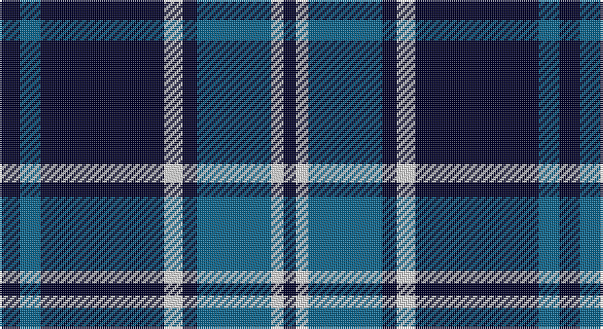

This page is one **sett** — a single exact thread-count. It belongs to the [tartan](/setts/k10n10k60w9k7n36w6k6/)
(the same proportion at any scale), whose colour order is pattern [KBKWKBWK](/stripes/kbkwkbwk/).

Sourced from register-of-tartans.  It is a [8 stripe tartan](/stripes/stripes8/).

Original link https://www.tartanregister.gov.uk/tartanDetails.aspx?ref=3642

## Register references

External register numbers recorded for this tartan.

- Scottish Register of Tartans: [3642](https://www.tartanregister.gov.uk/tartanDetails.aspx?ref=3642)
- Scottish Tartans World Register: 2811

## Thread count
DB/10 B10 DB60 LN9 DB7 B36 LN6 DB/6

One full sett is **272 threads**.

## Palette

Palette: <strong>Tartan Dictionary</strong> <small style="color:#888">(1 of 3 colours)</small>
<table><thead><tr><th>Colour</th><th>Threads</th><th>Shade</th><th>Base</th><th>OKLCh</th></tr></thead><tbody><tr><td>DB/</td><td style="text-align:right;font-variant-numeric:tabular-nums">10</td><td><code style="background-color:#000028;">#000028</code> <small style="color:#888">#000028</small></td><td>K <code style="background-color:#000000;">#000000</code></td><td><small style="color:#888">oklch(12.5% 0.087 264.1)</small></td></tr><tr><td>B</td><td style="text-align:right;font-variant-numeric:tabular-nums">10</td><td><code style="background-color:#0A648C;">#0A648C</code> <small style="color:#888">#0A648C</small></td><td>B <code style="background-color:#2A418A;">#2A418A</code></td><td><small style="color:#888">oklch(47.6% 0.099 235.6)</small></td></tr><tr><td>DB</td><td style="text-align:right;font-variant-numeric:tabular-nums">60</td><td><code style="background-color:#000028;">#000028</code> <small style="color:#888">#000028</small></td><td>K <code style="background-color:#000000;">#000000</code></td><td><small style="color:#888">oklch(12.5% 0.087 264.1)</small></td></tr><tr><td>LN</td><td style="text-align:right;font-variant-numeric:tabular-nums">9</td><td><code style="background-color:#E0E0E0;">#E0E0E0</code> <small style="color:#888">#E0E0E0</small></td><td>W <code style="background-color:#F7F7F7;">#F7F7F7</code></td><td><small style="color:#888">oklch(90.7% 0.000 89.9)</small></td></tr><tr><td>DB</td><td style="text-align:right;font-variant-numeric:tabular-nums">7</td><td><code style="background-color:#000028;">#000028</code> <small style="color:#888">#000028</small></td><td>K <code style="background-color:#000000;">#000000</code></td><td><small style="color:#888">oklch(12.5% 0.087 264.1)</small></td></tr><tr><td>B</td><td style="text-align:right;font-variant-numeric:tabular-nums">36</td><td><code style="background-color:#0A648C;">#0A648C</code> <small style="color:#888">#0A648C</small></td><td>B <code style="background-color:#2A418A;">#2A418A</code></td><td><small style="color:#888">oklch(47.6% 0.099 235.6)</small></td></tr><tr><td>LN</td><td style="text-align:right;font-variant-numeric:tabular-nums">6</td><td><code style="background-color:#E0E0E0;">#E0E0E0</code> <small style="color:#888">#E0E0E0</small></td><td>W <code style="background-color:#F7F7F7;">#F7F7F7</code></td><td><small style="color:#888">oklch(90.7% 0.000 89.9)</small></td></tr><tr><td>DB/</td><td style="text-align:right;font-variant-numeric:tabular-nums">6</td><td><code style="background-color:#000028;">#000028</code> <small style="color:#888">#000028</small></td><td>K <code style="background-color:#000000;">#000000</code></td><td><small style="color:#888">oklch(12.5% 0.087 264.1)</small></td></tr></tbody></table>

# Sample pattern

## Nearest tartans

The nearest existing variants by ΔTartan distance, with this tartan at the top so the swatches line up against it.

ΔTartan

Tartan

Sett

—

<a href="/ttd/edit/#slug=k10n10k60w9k7n36w6k6">Salem Scottish Dancer's Wee Bluet</a> <a class="nn-out" href="/variants/s8/k10n10k60w9k7n36w6k6/" title="open its dictionary page">↗</a>

1.05

<a href="/ttd/edit/#slug=dt5b5dt30w4dt4b18w3dt3~x2&amp;base=k10n10k60w9k7n36w6k6">Salem Scottish Dancers (Corporate)</a> <a class="nn-out" href="/variants/s8/dt5b5dt30w4dt4b18w3dt3~x2/" title="open its dictionary page">↗</a>

1.23

<a href="/ttd/edit/#slug=k28b3k3b25k3b25k3b3k28m4~x2&amp;base=k10n10k60w9k7n36w6k6">Slanj</a> <a class="nn-out" href="/variants/s10/k28b3k3b25k3b25k3b3k28m4~x2/" title="open its dictionary page">↗</a>

1.25

<a href="/ttd/edit/#slug=m4k28b3k3b25k3~x2&amp;base=k10n10k60w9k7n36w6k6">Slanj (Corporate)</a> <a class="nn-out" href="/variants/s6/m4k28b3k3b25k3~x2/" title="open its dictionary page">↗</a>

1.28

<a href="/ttd/edit/#slug=k1w1db8k9w1k9w1db2w1k4w1~x2&amp;base=k10n10k60w9k7n36w6k6">Clergy (Mackinlay)</a> <a class="nn-out" href="/variants/s11/k1w1db8k9w1k9w1db2w1k4w1~x2/" title="open its dictionary page">↗</a>

1.37

<a href="/ttd/edit/#slug=k3lb2k18db18k2db3~x4&amp;base=k10n10k60w9k7n36w6k6">Swan</a> <a class="nn-out" href="/variants/s6/k3lb2k18db18k2db3~x4/" title="open its dictionary page">↗</a>

1.44

<a href="/ttd/edit/#slug=k10t1k2t1k4t10g1t2~x4&amp;base=k10n10k60w9k7n36w6k6">Martin's Own</a> <a class="nn-out" href="/variants/s8/k10t1k2t1k4t10g1t2~x4/" title="open its dictionary page">↗</a>

1.45

<a href="/variants/s6/ly8k3b40ki12k3ly3~x2/">Wolverine Corporate Tartan</a>

1.56

<a href="/ttd/edit/#slug=r3db2w2db26k22w3db3w3~x2&amp;base=k10n10k60w9k7n36w6k6">DeCloud-McMasters (Personal)</a> <a class="nn-out" href="/variants/s8/r3db2w2db26k22w3db3w3~x2/" title="open its dictionary page">↗</a>

1.58

<a href="/ttd/edit/#slug=db30dbi2k9w3db6w4k3dbi6~x2&amp;base=k10n10k60w9k7n36w6k6">Auto Docs</a> <a class="nn-out" href="/variants/s8/db30dbi2k9w3db6w4k3dbi6~x2/" title="open its dictionary page">↗</a>

1.59

<a href="/variants/s14/dt5b5dt30w4dt4b18w3dt3w3b18dt4w4dt30b5~x2/">Salem Scottish Dancers (Dance) #2</a>

## Neighbour map

Every grey dot is one of 14360 variants placed by the first two principal components of the ΔTartan feature space (44% of its variance). Red is this tartan; blue dots are its nearest — click one to open its page.

<svg viewBox="0 0 640 380" role="img" style="max-width:100%;height:auto;border:1px solid #e0e0e0;border-radius:4px;display:block" xmlns="http://www.w3.org/2000/svg"><image href="/nn/cloud.v1.png" width="640" height="380"/><a href="/variants/s8/dt5b5dt30w4dt4b18w3dt3~x2/"><circle cx="328.6" cy="204.1" r="4" fill="#3465a4"><title>Salem Scottish Dancers (Corporate)</title></circle></a><a href="/variants/s10/k28b3k3b25k3b25k3b3k28m4~x2/"><circle cx="317.5" cy="214.7" r="4" fill="#3465a4"><title>Slanj</title></circle></a><a href="/variants/s6/m4k28b3k3b25k3~x2/"><circle cx="323.2" cy="228.3" r="4" fill="#3465a4"><title>Slanj (Corporate)</title></circle></a><a href="/variants/s11/k1w1db8k9w1k9w1db2w1k4w1~x2/"><circle cx="320.2" cy="196.4" r="4" fill="#3465a4"><title>Clergy (Mackinlay)</title></circle></a><a href="/variants/s6/k3lb2k18db18k2db3~x4/"><circle cx="298.4" cy="230.8" r="4" fill="#3465a4"><title>Swan</title></circle></a><a href="/variants/s8/k10t1k2t1k4t10g1t2~x4/"><circle cx="309.6" cy="209.0" r="4" fill="#3465a4"><title>Martin's Own</title></circle></a><a href="/variants/s6/ly8k3b40ki12k3ly3~x2/"><circle cx="314.0" cy="181.3" r="4" fill="#3465a4"><title>Wolverine Corporate Tartan</title></circle></a><a href="/variants/s8/r3db2w2db26k22w3db3w3~x2/"><circle cx="256.3" cy="162.2" r="4" fill="#3465a4"><title>DeCloud-McMasters (Personal)</title></circle></a><a href="/variants/s8/db30dbi2k9w3db6w4k3dbi6~x2/"><circle cx="301.0" cy="170.0" r="4" fill="#3465a4"><title>Auto Docs</title></circle></a><a href="/variants/s14/dt5b5dt30w4dt4b18w3dt3w3b18dt4w4dt30b5~x2/"><circle cx="300.2" cy="181.6" r="4" fill="#3465a4"><title>Salem Scottish Dancers (Dance) #2</title></circle></a><circle cx="315.8" cy="204.4" r="5" fill="#c00000"/></svg>

ID: /variants/s8/k10n10k60w9k7n36w6k6/
