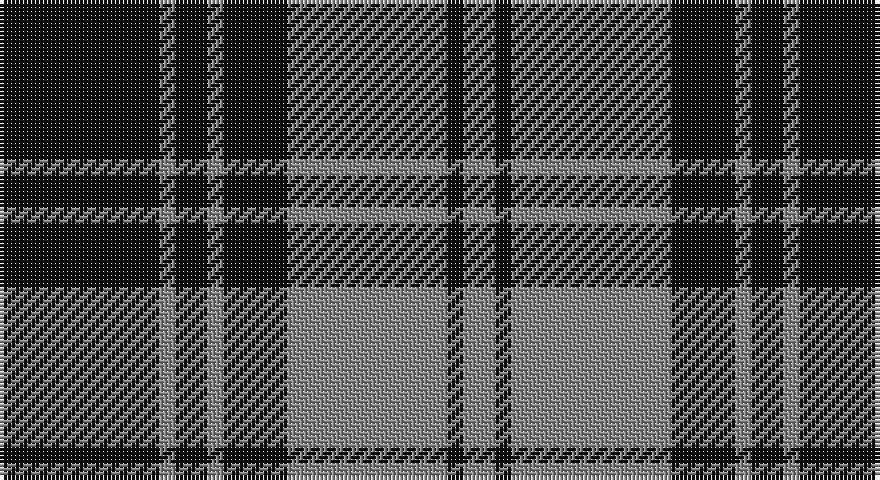

This page is one **sett** — a single exact thread-count. It belongs to the [tartan](/setts/k10o1k2o1k4o10k1o2/)
(the same proportion at any scale), whose colour order is pattern [KRKRKRKR](/stripes/krkrkrkr/).

Part of the [Douglas](/tartans/douglas/) tartan — the named design grouping this sett with its other cloths.

Sourced from register-of-tartans.  It is a [8 stripe tartan](/stripes/stripes8/).

Original link https://www.tartanregister.gov.uk/tartanDetails.aspx?ref=957

## Also known as

This cloth is also recorded under:

- Douglas Ancient Red
- Douglas Green
- Douglas,
- Douglas, Black
- Douglas, Green
- Douglas, Grey
- Douglas, brown

2 attestations — the source records this cloth was collapsed from (oldest owns this page)

<ul>
<li>01/01/1842 — Douglas, Grey (Vestiarium Scoticum) (register-of-tartans, <a href="https://www.tartanregister.gov.uk/tartanDetails.aspx?ref=957">record</a>)</li>
<li>1842 — Douglas, Grey (Clan) (tartans-authority, <a href="http://www.tartansauthority.com/tartan-ferret/display/1127/">record</a>)</li>
</ul>

## Register references

External register numbers recorded for this tartan.

- Scottish Register of Tartans: [957](https://www.tartanregister.gov.uk/tartanDetails.aspx?ref=957)
- Scottish Tartans Authority (ITI): 1127
- Scottish Tartans World Register: 1127

## Thread count
K/40 N4 K8 N4 K16 N40 K4 N/8

One full sett is **200 threads**.

## Palette

Palette: <strong>Tartan Register</strong>
<table><thead><tr><th>Colour</th><th>Threads</th><th>Shade</th><th>Base</th><th>OKLCh</th></tr></thead><tbody><tr><td>K/</td><td style="text-align:right;font-variant-numeric:tabular-nums">40</td><td><code style="background-color:#101010;">#101010</code> <small style="color:#888">#101010</small></td><td>K <code style="background-color:#000000;">#000000</code></td><td><small style="color:#888">oklch(17.3% 0.000 89.9)</small></td></tr><tr><td>N</td><td style="text-align:right;font-variant-numeric:tabular-nums">4</td><td><code style="background-color:#888888;">#888888</code> <small style="color:#888">#888888</small></td><td>R <code style="background-color:#CC0000;">#CC0000</code></td><td><small style="color:#888">oklch(62.7% 0.000 89.9)</small></td></tr><tr><td>K</td><td style="text-align:right;font-variant-numeric:tabular-nums">8</td><td><code style="background-color:#101010;">#101010</code> <small style="color:#888">#101010</small></td><td>K <code style="background-color:#000000;">#000000</code></td><td><small style="color:#888">oklch(17.3% 0.000 89.9)</small></td></tr><tr><td>N</td><td style="text-align:right;font-variant-numeric:tabular-nums">4</td><td><code style="background-color:#888888;">#888888</code> <small style="color:#888">#888888</small></td><td>R <code style="background-color:#CC0000;">#CC0000</code></td><td><small style="color:#888">oklch(62.7% 0.000 89.9)</small></td></tr><tr><td>K</td><td style="text-align:right;font-variant-numeric:tabular-nums">16</td><td><code style="background-color:#101010;">#101010</code> <small style="color:#888">#101010</small></td><td>K <code style="background-color:#000000;">#000000</code></td><td><small style="color:#888">oklch(17.3% 0.000 89.9)</small></td></tr><tr><td>N</td><td style="text-align:right;font-variant-numeric:tabular-nums">40</td><td><code style="background-color:#888888;">#888888</code> <small style="color:#888">#888888</small></td><td>R <code style="background-color:#CC0000;">#CC0000</code></td><td><small style="color:#888">oklch(62.7% 0.000 89.9)</small></td></tr><tr><td>K</td><td style="text-align:right;font-variant-numeric:tabular-nums">4</td><td><code style="background-color:#101010;">#101010</code> <small style="color:#888">#101010</small></td><td>K <code style="background-color:#000000;">#000000</code></td><td><small style="color:#888">oklch(17.3% 0.000 89.9)</small></td></tr><tr><td>N/</td><td style="text-align:right;font-variant-numeric:tabular-nums">8</td><td><code style="background-color:#888888;">#888888</code> <small style="color:#888">#888888</small></td><td>R <code style="background-color:#CC0000;">#CC0000</code></td><td><small style="color:#888">oklch(62.7% 0.000 89.9)</small></td></tr></tbody></table>

# Sample pattern

## Compared to the master

This cloth is one sett of its design; the master sett (the exemplar the design is anchored on) is below for comparison.

<figure style="margin:0"><figcaption style="color:#888;font-size:smaller">this sett</figcaption></figure>
<figure style="margin:0"><figcaption style="color:#888;font-size:smaller"><a href="/setts/k6db4dg44k41w4/">master sett →</a></figcaption></figure>

## Nearest tartans

The nearest existing variants by ΔTartan distance, with this tartan at the top so the swatches line up against it.

ΔTartan

Tartan

Sett

—

<a href="/ttd/edit/#slug=k10o1k2o1k4o10k1o2~x4">Douglas, Grey (Vestiarium Scoticum)</a> <a class="nn-out" href="/variants/s8/k10o1k2o1k4o10k1o2~x4/" title="open its dictionary page">↗</a>

0.84

<a href="/ttd/edit/#slug=k6y20k6y4k4y8y2k8y2k5~x2&amp;base=k10o1k2o1k4o10k1o2~x4">Bute Heather, Black</a> <a class="nn-out" href="/variants/s10/k6y20k6y4k4y8y2k8y2k5~x2/" title="open its dictionary page">↗</a>

0.96

<a href="/ttd/edit/#slug=k10o1k2o1k4o10ly1o2~x4&amp;base=k10o1k2o1k4o10k1o2~x4">West Point Military Academy (Mil.)</a> <a class="nn-out" href="/variants/s8/k10o1k2o1k4o10ly1o2~x4/" title="open its dictionary page">↗</a>

0.98

<a href="/ttd/edit/#slug=k4y2k27y2k8y31k2y4~x2&amp;base=k10o1k2o1k4o10k1o2~x4">Watertown Library Assoc. (Corporate)</a> <a class="nn-out" href="/variants/s8/k4y2k27y2k8y31k2y4~x2/" title="open its dictionary page">↗</a>

1.09

<a href="/ttd/edit/#slug=k13o1k1o1k4o10ly1o1~x6&amp;base=k10o1k2o1k4o10k1o2~x4">West Point</a> <a class="nn-out" href="/variants/s8/k13o1k1o1k4o10ly1o1~x6/" title="open its dictionary page">↗</a>

1.12

<a href="/ttd/edit/#slug=k39o3k3o3k14o28r3~x2&amp;base=k10o1k2o1k4o10k1o2~x4">Moffat (1984)</a> <a class="nn-out" href="/variants/s7/k39o3k3o3k14o28r3~x2/" title="open its dictionary page">↗</a>

1.12

<a href="/ttd/edit/#slug=k9lr1k2lr1k4lr9k1lr2~x4&amp;base=k10o1k2o1k4o10k1o2~x4">Douglas, Grey Clan/Family Tartan</a> <a class="nn-out" href="/variants/s8/k9lr1k2lr1k4lr9k1lr2~x4/" title="open its dictionary page">↗</a>

1.14

<a href="/ttd/edit/#slug=k10t1k2t1k4t10g1t2~x4&amp;base=k10o1k2o1k4o10k1o2~x4">Martin's Own</a> <a class="nn-out" href="/variants/s8/k10t1k2t1k4t10g1t2~x4/" title="open its dictionary page">↗</a>

1.23

<a href="/ttd/edit/#slug=k2o6k2o6k12r1~x4&amp;base=k10o1k2o1k4o10k1o2~x4">MacSween, Black (Personal)</a> <a class="nn-out" href="/variants/s6/k2o6k2o6k12r1~x4/" title="open its dictionary page">↗</a>

1.24

<a href="/ttd/edit/#slug=o58k22o8k17r5k14~x2&amp;base=k10o1k2o1k4o10k1o2~x4">Flynn</a> <a class="nn-out" href="/variants/s6/o58k22o8k17r5k14~x2/" title="open its dictionary page">↗</a>

1.33

<a href="/ttd/edit/#slug=y5r3y35k28y4k11y2~x2&amp;base=k10o1k2o1k4o10k1o2~x4">Korner-Macpherson (Personal)</a> <a class="nn-out" href="/variants/s7/y5r3y35k28y4k11y2~x2/" title="open its dictionary page">↗</a>

## Neighbour map

Every grey dot is one of 14360 variants placed by the first two principal components of the ΔTartan feature space (44% of its variance). Red is this tartan; blue dots are its nearest — click one to open its page.

<svg viewBox="0 0 640 380" role="img" style="max-width:100%;height:auto;border:1px solid #e0e0e0;border-radius:4px;display:block" xmlns="http://www.w3.org/2000/svg"><image href="/nn/cloud.v1.png" width="640" height="380"/><a href="/variants/s10/k6y20k6y4k4y8y2k8y2k5~x2/"><circle cx="340.1" cy="229.2" r="4" fill="#3465a4"><title>Bute Heather, Black</title></circle></a><a href="/variants/s8/k10o1k2o1k4o10ly1o2~x4/"><circle cx="309.0" cy="203.1" r="4" fill="#3465a4"><title>West Point Military Academy (Mil.)</title></circle></a><a href="/variants/s8/k4y2k27y2k8y31k2y4~x2/"><circle cx="361.2" cy="193.8" r="4" fill="#3465a4"><title>Watertown Library Assoc. (Corporate)</title></circle></a><a href="/variants/s8/k13o1k1o1k4o10ly1o1~x6/"><circle cx="350.9" cy="183.3" r="4" fill="#3465a4"><title>West Point</title></circle></a><a href="/variants/s7/k39o3k3o3k14o28r3~x2/"><circle cx="372.2" cy="198.8" r="4" fill="#3465a4"><title>Moffat (1984)</title></circle></a><a href="/variants/s8/k9lr1k2lr1k4lr9k1lr2~x4/"><circle cx="326.6" cy="224.5" r="4" fill="#3465a4"><title>Douglas, Grey Clan/Family Tartan</title></circle></a><a href="/variants/s8/k10t1k2t1k4t10g1t2~x4/"><circle cx="309.6" cy="209.0" r="4" fill="#3465a4"><title>Martin's Own</title></circle></a><a href="/variants/s6/k2o6k2o6k12r1~x4/"><circle cx="327.4" cy="224.9" r="4" fill="#3465a4"><title>MacSween, Black (Personal)</title></circle></a><a href="/variants/s6/o58k22o8k17r5k14~x2/"><circle cx="320.6" cy="215.7" r="4" fill="#3465a4"><title>Flynn</title></circle></a><a href="/variants/s7/y5r3y35k28y4k11y2~x2/"><circle cx="346.9" cy="188.6" r="4" fill="#3465a4"><title>Korner-Macpherson (Personal)</title></circle></a><circle cx="352.9" cy="222.3" r="5" fill="#c00000"/></svg>

ID: /variants/s8/k10o1k2o1k4o10k1o2~x4/
