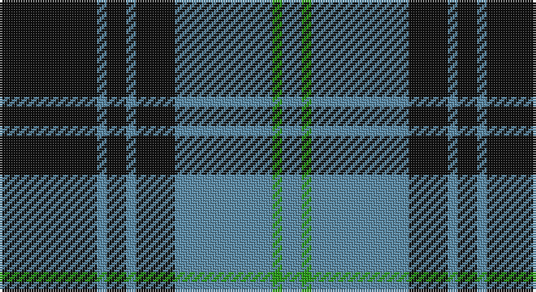

This page is one **sett** — a single exact thread-count. It belongs to the [tartan](/setts/k10t1k2t1k4t10g1t2/)
(the same proportion at any scale), whose colour order is pattern [BGBKBKBK](/stripes/bgbkbkbk/).

Sourced from register-of-tartans.  It is a [8 stripe tartan](/stripes/stripes8/).

Original link https://www.tartanregister.gov.uk/tartanDetails.aspx?ref=3433

2 attestations — the source records this cloth was collapsed from (oldest owns this page)

<ul>
<li>01/01/2004 — Martin's Own (register-of-tartans, <a href="https://www.tartanregister.gov.uk/tartanDetails.aspx?ref=3433">record</a>)</li>
<li>2004 — Martin's Own (Personal) (tartans-authority, <a href="http://www.tartansauthority.com/tartan-ferret/display/6590/">record</a>)</li>
</ul>

## Register references

External register numbers recorded for this tartan.

- Scottish Register of Tartans: [3433](https://www.tartanregister.gov.uk/tartanDetails.aspx?ref=3433)
- Scottish Tartans Authority (ITI): 6590

## Thread count
K/40 B4 K8 B4 K16 B40 G4 B/8

One full sett is **200 threads**.

## Palette

Palette: <strong>Tartan Register</strong>
<table><thead><tr><th>Colour</th><th>Threads</th><th>Shade</th><th>Base</th><th>OKLCh</th></tr></thead><tbody><tr><td>K/</td><td style="text-align:right;font-variant-numeric:tabular-nums">40</td><td><code style="background-color:#101010;">#101010</code> <small style="color:#888">#101010</small></td><td>K <code style="background-color:#000000;">#000000</code></td><td><small style="color:#888">oklch(17.3% 0.000 89.9)</small></td></tr><tr><td>B</td><td style="text-align:right;font-variant-numeric:tabular-nums">4</td><td><code style="background-color:#5C8CA8;">#5C8CA8</code> <small style="color:#888">#5C8CA8</small></td><td>B <code style="background-color:#2A418A;">#2A418A</code></td><td><small style="color:#888">oklch(61.7% 0.067 235.0)</small></td></tr><tr><td>K</td><td style="text-align:right;font-variant-numeric:tabular-nums">8</td><td><code style="background-color:#101010;">#101010</code> <small style="color:#888">#101010</small></td><td>K <code style="background-color:#000000;">#000000</code></td><td><small style="color:#888">oklch(17.3% 0.000 89.9)</small></td></tr><tr><td>B</td><td style="text-align:right;font-variant-numeric:tabular-nums">4</td><td><code style="background-color:#5C8CA8;">#5C8CA8</code> <small style="color:#888">#5C8CA8</small></td><td>B <code style="background-color:#2A418A;">#2A418A</code></td><td><small style="color:#888">oklch(61.7% 0.067 235.0)</small></td></tr><tr><td>K</td><td style="text-align:right;font-variant-numeric:tabular-nums">16</td><td><code style="background-color:#101010;">#101010</code> <small style="color:#888">#101010</small></td><td>K <code style="background-color:#000000;">#000000</code></td><td><small style="color:#888">oklch(17.3% 0.000 89.9)</small></td></tr><tr><td>B</td><td style="text-align:right;font-variant-numeric:tabular-nums">40</td><td><code style="background-color:#5C8CA8;">#5C8CA8</code> <small style="color:#888">#5C8CA8</small></td><td>B <code style="background-color:#2A418A;">#2A418A</code></td><td><small style="color:#888">oklch(61.7% 0.067 235.0)</small></td></tr><tr><td>G</td><td style="text-align:right;font-variant-numeric:tabular-nums">4</td><td><code style="background-color:#289C18;">#289C18</code> <small style="color:#888">#289C18</small></td><td>G <code style="background-color:#006100;">#006100</code></td><td><small style="color:#888">oklch(60.6% 0.191 141.6)</small></td></tr><tr><td>B/</td><td style="text-align:right;font-variant-numeric:tabular-nums">8</td><td><code style="background-color:#5C8CA8;">#5C8CA8</code> <small style="color:#888">#5C8CA8</small></td><td>B <code style="background-color:#2A418A;">#2A418A</code></td><td><small style="color:#888">oklch(61.7% 0.067 235.0)</small></td></tr></tbody></table>

# Sample pattern

## Nearest tartans

The nearest existing variants by ΔTartan distance, with this tartan at the top so the swatches line up against it.

ΔTartan

Tartan

Sett

—

<a href="/ttd/edit/#slug=k10t1k2t1k4t10g1t2~x4">Martin's Own</a> <a class="nn-out" href="/variants/s8/k10t1k2t1k4t10g1t2~x4/" title="open its dictionary page">↗</a>

0.72

<a href="/ttd/edit/#slug=k10o1k2o1k4o10ly1o2~x4&amp;base=k10t1k2t1k4t10g1t2~x4">West Point Military Academy (Mil.)</a> <a class="nn-out" href="/variants/s8/k10o1k2o1k4o10ly1o2~x4/" title="open its dictionary page">↗</a>

1.02

<a href="/ttd/edit/#slug=k28b3k3b25k3b25k3b3k28m4~x2&amp;base=k10t1k2t1k4t10g1t2~x4">Slanj</a> <a class="nn-out" href="/variants/s10/k28b3k3b25k3b25k3b3k28m4~x2/" title="open its dictionary page">↗</a>

1.03

<a href="/ttd/edit/#slug=k13o1k1o1k4o10ly1o1~x6&amp;base=k10t1k2t1k4t10g1t2~x4">West Point</a> <a class="nn-out" href="/variants/s8/k13o1k1o1k4o10ly1o1~x6/" title="open its dictionary page">↗</a>

1.09

<a href="/ttd/edit/#slug=m4k28b3k3b25k3~x2&amp;base=k10t1k2t1k4t10g1t2~x4">Slanj (Corporate)</a> <a class="nn-out" href="/variants/s6/m4k28b3k3b25k3~x2/" title="open its dictionary page">↗</a>

1.11

<a href="/ttd/edit/#slug=dt5b5dt30w4dt4b18w3dt3~x2&amp;base=k10t1k2t1k4t10g1t2~x4">Salem Scottish Dancers (Corporate)</a> <a class="nn-out" href="/variants/s8/dt5b5dt30w4dt4b18w3dt3~x2/" title="open its dictionary page">↗</a>

1.13

<a href="/ttd/edit/#slug=k51g5r15g37k17r6g7~x2&amp;base=k10t1k2t1k4t10g1t2~x4">Cadence Design Systems (Corporate)</a> <a class="nn-out" href="/variants/s7/k51g5r15g37k17r6g7~x2/" title="open its dictionary page">↗</a>

1.13

<a href="/ttd/edit/#slug=o58k22o8k17r5k14~x2&amp;base=k10t1k2t1k4t10g1t2~x4">Flynn</a> <a class="nn-out" href="/variants/s6/o58k22o8k17r5k14~x2/" title="open its dictionary page">↗</a>

1.14

<a href="/ttd/edit/#slug=k10o1k2o1k4o10k1o2~x4&amp;base=k10t1k2t1k4t10g1t2~x4">Douglas, Grey (Vestiarium Scoticum)</a> <a class="nn-out" href="/variants/s8/k10o1k2o1k4o10k1o2~x4/" title="open its dictionary page">↗</a>

1.20

<a href="/ttd/edit/#slug=k2o6k2o6k12r1~x4&amp;base=k10t1k2t1k4t10g1t2~x4">MacSween, Black (Personal)</a> <a class="nn-out" href="/variants/s6/k2o6k2o6k12r1~x4/" title="open its dictionary page">↗</a>

1.21

<a href="/ttd/edit/#slug=w4k26t26k2t5w2~x2&amp;base=k10t1k2t1k4t10g1t2~x4">Indian Pipe Band (Corporate)</a> <a class="nn-out" href="/variants/s6/w4k26t26k2t5w2~x2/" title="open its dictionary page">↗</a>

## Neighbour map

Every grey dot is one of 14360 variants placed by the first two principal components of the ΔTartan feature space (44% of its variance). Red is this tartan; blue dots are its nearest — click one to open its page.

<svg viewBox="0 0 640 380" role="img" style="max-width:100%;height:auto;border:1px solid #e0e0e0;border-radius:4px;display:block" xmlns="http://www.w3.org/2000/svg"><image href="/nn/cloud.v1.png" width="640" height="380"/><a href="/variants/s8/k10o1k2o1k4o10ly1o2~x4/"><circle cx="309.0" cy="203.1" r="4" fill="#3465a4"><title>West Point Military Academy (Mil.)</title></circle></a><a href="/variants/s10/k28b3k3b25k3b25k3b3k28m4~x2/"><circle cx="317.5" cy="214.7" r="4" fill="#3465a4"><title>Slanj</title></circle></a><a href="/variants/s8/k13o1k1o1k4o10ly1o1~x6/"><circle cx="350.9" cy="183.3" r="4" fill="#3465a4"><title>West Point</title></circle></a><a href="/variants/s6/m4k28b3k3b25k3~x2/"><circle cx="323.2" cy="228.3" r="4" fill="#3465a4"><title>Slanj (Corporate)</title></circle></a><a href="/variants/s8/dt5b5dt30w4dt4b18w3dt3~x2/"><circle cx="328.6" cy="204.1" r="4" fill="#3465a4"><title>Salem Scottish Dancers (Corporate)</title></circle></a><a href="/variants/s7/k51g5r15g37k17r6g7~x2/"><circle cx="278.9" cy="227.9" r="4" fill="#3465a4"><title>Cadence Design Systems (Corporate)</title></circle></a><a href="/variants/s6/o58k22o8k17r5k14~x2/"><circle cx="320.6" cy="215.7" r="4" fill="#3465a4"><title>Flynn</title></circle></a><a href="/variants/s8/k10o1k2o1k4o10k1o2~x4/"><circle cx="352.9" cy="222.3" r="4" fill="#3465a4"><title>Douglas, Grey (Vestiarium Scoticum)</title></circle></a><a href="/variants/s6/k2o6k2o6k12r1~x4/"><circle cx="327.4" cy="224.9" r="4" fill="#3465a4"><title>MacSween, Black (Personal)</title></circle></a><a href="/variants/s6/w4k26t26k2t5w2~x2/"><circle cx="280.5" cy="194.7" r="4" fill="#3465a4"><title>Indian Pipe Band (Corporate)</title></circle></a><circle cx="309.6" cy="209.0" r="5" fill="#c00000"/></svg>

ID: /variants/s8/k10t1k2t1k4t10g1t2~x4/
