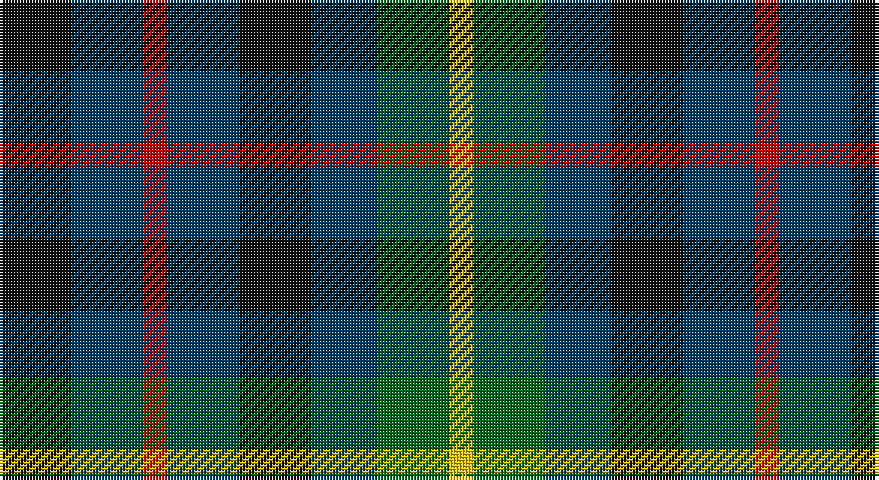

This page is one **sett** — a single exact thread-count. It belongs to the [tartan](/setts/k12dt12r4dt12k12dt11g12ly4/)
(the same proportion at any scale), whose colour order is pattern [KBRBKBGY](/stripes/kbrbkbgy/).

Sourced from register-of-tartans.  It is a [8 stripe tartan](/stripes/stripes8/).

Original link https://www.tartanregister.gov.uk/tartanDetails.aspx?ref=3000

2 attestations — the source records this cloth was collapsed from (oldest owns this page)

<ul>
<li>01/10/1996 — Montrose of Alabama (register-of-tartans, <a href="https://www.tartanregister.gov.uk/tartanDetails.aspx?ref=3000">record</a>)</li>
<li>1996 — Montrose of Alabama (District) (tartans-authority, <a href="http://www.tartansauthority.com/tartan-ferret/display/2288/">record</a>)</li>
</ul>

## Register references

External register numbers recorded for this tartan.

- Scottish Register of Tartans: [3000](https://www.tartanregister.gov.uk/tartanDetails.aspx?ref=3000)
- Scottish Tartans Authority (ITI): 2288
- Scottish Tartans World Register: 2288

## Thread count
K/24 DB24 R8 DB24 K24 DB22 G24 Y/8

One full sett is **284 threads**.

## Palette

Palette: <strong>Tartan Register</strong>
<table><thead><tr><th>Colour</th><th>Threads</th><th>Shade</th><th>Base</th><th>OKLCh</th></tr></thead><tbody><tr><td>K/</td><td style="text-align:right;font-variant-numeric:tabular-nums">24</td><td><code style="background-color:#101010;">#101010</code> <small style="color:#888">#101010</small></td><td>K <code style="background-color:#000000;">#000000</code></td><td><small style="color:#888">oklch(17.3% 0.000 89.9)</small></td></tr><tr><td>DB</td><td style="text-align:right;font-variant-numeric:tabular-nums">24</td><td><code style="background-color:#003C64;">#003C64</code> <small style="color:#888">#003C64</small></td><td>B <code style="background-color:#2A418A;">#2A418A</code></td><td><small style="color:#888">oklch(34.5% 0.089 246.0)</small></td></tr><tr><td>R</td><td style="text-align:right;font-variant-numeric:tabular-nums">8</td><td><code style="background-color:#C80000;">#C80000</code> <small style="color:#888">#C80000</small></td><td>R <code style="background-color:#CC0000;">#CC0000</code></td><td><small style="color:#888">oklch(52.3% 0.215 29.2)</small></td></tr><tr><td>DB</td><td style="text-align:right;font-variant-numeric:tabular-nums">24</td><td><code style="background-color:#003C64;">#003C64</code> <small style="color:#888">#003C64</small></td><td>B <code style="background-color:#2A418A;">#2A418A</code></td><td><small style="color:#888">oklch(34.5% 0.089 246.0)</small></td></tr><tr><td>K</td><td style="text-align:right;font-variant-numeric:tabular-nums">24</td><td><code style="background-color:#101010;">#101010</code> <small style="color:#888">#101010</small></td><td>K <code style="background-color:#000000;">#000000</code></td><td><small style="color:#888">oklch(17.3% 0.000 89.9)</small></td></tr><tr><td>DB</td><td style="text-align:right;font-variant-numeric:tabular-nums">22</td><td><code style="background-color:#003C64;">#003C64</code> <small style="color:#888">#003C64</small></td><td>B <code style="background-color:#2A418A;">#2A418A</code></td><td><small style="color:#888">oklch(34.5% 0.089 246.0)</small></td></tr><tr><td>G</td><td style="text-align:right;font-variant-numeric:tabular-nums">24</td><td><code style="background-color:#006818;">#006818</code> <small style="color:#888">#006818</small></td><td>G <code style="background-color:#006100;">#006100</code></td><td><small style="color:#888">oklch(45.0% 0.142 145.0)</small></td></tr><tr><td>Y/</td><td style="text-align:right;font-variant-numeric:tabular-nums">8</td><td><code style="background-color:#E8C000;">#E8C000</code> <small style="color:#888">#E8C000</small></td><td>Y <code style="background-color:#F2BF00;">#F2BF00</code></td><td><small style="color:#888">oklch(81.9% 0.168 93.7)</small></td></tr></tbody></table>

# Sample pattern

## Nearest tartans

The nearest existing variants by ΔTartan distance, with this tartan at the top so the swatches line up against it.

ΔTartan

Tartan

Sett

—

<a href="/ttd/edit/#slug=k12dt12r4dt12k12dt11g12ly4~x2">Montrose of Alabama</a> <a class="nn-out" href="/variants/s8/k12dt12r4dt12k12dt11g12ly4~x2/" title="open its dictionary page">↗</a>

1.28

<a href="/ttd/edit/#slug=k4dg4ly1dg4k4db4k1~x2&amp;base=k12dt12r4dt12k12dt11g12ly4~x2">MacKay Coat</a> <a class="nn-out" href="/variants/s7/k4dg4ly1dg4k4db4k1~x2/" title="open its dictionary page">↗</a>

1.28

<a href="/ttd/edit/#slug=k4dg4k1dg4k4db4ly1~x2&amp;base=k12dt12r4dt12k12dt11g12ly4~x2">Unidentified No 39</a> <a class="nn-out" href="/variants/s7/k4dg4k1dg4k4db4ly1~x2/" title="open its dictionary page">↗</a>

1.29

<a href="/variants/s8/dg6dp3ki3dp3ki3dp3dg6k2~x2/">Wilson's No.173</a>

1.32

<a href="/variants/s14/k12dt12r4dt12k12dt11g12ly4~x2/">Montrose of Alabama American District Tartan</a>

1.37

<a href="/ttd/edit/#slug=k4dg4w1dg4k4db4k1db4k4dg4w1~x2&amp;base=k12dt12r4dt12k12dt11g12ly4~x2">Graham of Montrose #3</a> <a class="nn-out" href="/variants/s11/k4dg4w1dg4k4db4k1db4k4dg4w1~x2/" title="open its dictionary page">↗</a>

1.39

<a href="/ttd/edit/#slug=g6dp3k3dp3k3dp3g6r2~x2&amp;base=k12dt12r4dt12k12dt11g12ly4~x2">Wilson's No.137</a> <a class="nn-out" href="/variants/s8/g6dp3k3dp3k3dp3g6r2~x2/" title="open its dictionary page">↗</a>

1.40

<a href="/ttd/edit/#slug=k9g9w2g9k9db9k3~x2&amp;base=k12dt12r4dt12k12dt11g12ly4~x2">Graham of Montrose - 1850 (Clan)</a> <a class="nn-out" href="/variants/s7/k9g9w2g9k9db9k3~x2/" title="open its dictionary page">↗</a>

1.45

<a href="/ttd/edit/#slug=k1db3k3dg3r1dg3k3dg1r1~x2&amp;base=k12dt12r4dt12k12dt11g12ly4~x2">Unidentified No 30</a> <a class="nn-out" href="/variants/s9/k1db3k3dg3r1dg3k3dg1r1~x2/" title="open its dictionary page">↗</a>

1.48

<a href="/ttd/edit/#slug=k14g14k8ly4k4g14k14db14dp5db4dp5db14~x2&amp;base=k12dt12r4dt12k12dt11g12ly4~x2">Price-Powell (Personal)</a> <a class="nn-out" href="/variants/s12/k14g14k8ly4k4g14k14db14dp5db4dp5db14~x2/" title="open its dictionary page">↗</a>

1.49

<a href="/ttd/edit/#slug=g8k7db12r2db12k7g8t2~x4&amp;base=k12dt12r4dt12k12dt11g12ly4~x2">Forbo Nairn Corporate Tartan</a> <a class="nn-out" href="/variants/s8/g8k7db12r2db12k7g8t2~x4/" title="open its dictionary page">↗</a>

## Neighbour map

Every grey dot is one of 14360 variants placed by the first two principal components of the ΔTartan feature space (44% of its variance). Red is this tartan; blue dots are its nearest — click one to open its page.

<svg viewBox="0 0 640 380" role="img" style="max-width:100%;height:auto;border:1px solid #e0e0e0;border-radius:4px;display:block" xmlns="http://www.w3.org/2000/svg"><image href="/nn/cloud.v1.png" width="640" height="380"/><a href="/variants/s7/k4dg4ly1dg4k4db4k1~x2/"><circle cx="169.1" cy="306.5" r="4" fill="#3465a4"><title>MacKay Coat</title></circle></a><a href="/variants/s7/k4dg4k1dg4k4db4ly1~x2/"><circle cx="169.1" cy="306.5" r="4" fill="#3465a4"><title>Unidentified No 39</title></circle></a><a href="/variants/s8/dg6dp3ki3dp3ki3dp3dg6k2~x2/"><circle cx="136.0" cy="301.9" r="4" fill="#3465a4"><title>Wilson's No.173</title></circle></a><a href="/variants/s14/k12dt12r4dt12k12dt11g12ly4~x2/"><circle cx="142.5" cy="289.6" r="4" fill="#3465a4"><title>Montrose of Alabama American District Tartan</title></circle></a><a href="/variants/s11/k4dg4w1dg4k4db4k1db4k4dg4w1~x2/"><circle cx="123.5" cy="280.8" r="4" fill="#3465a4"><title>Graham of Montrose #3</title></circle></a><a href="/variants/s8/g6dp3k3dp3k3dp3g6r2~x2/"><circle cx="131.8" cy="296.9" r="4" fill="#3465a4"><title>Wilson's No.137</title></circle></a><a href="/variants/s7/k9g9w2g9k9db9k3~x2/"><circle cx="148.3" cy="290.3" r="4" fill="#3465a4"><title>Graham of Montrose - 1850 (Clan)</title></circle></a><a href="/variants/s9/k1db3k3dg3r1dg3k3dg1r1~x2/"><circle cx="140.1" cy="297.1" r="4" fill="#3465a4"><title>Unidentified No 30</title></circle></a><a href="/variants/s12/k14g14k8ly4k4g14k14db14dp5db4dp5db14~x2/"><circle cx="94.0" cy="257.8" r="4" fill="#3465a4"><title>Price-Powell (Personal)</title></circle></a><a href="/variants/s8/g8k7db12r2db12k7g8t2~x4/"><circle cx="163.7" cy="259.9" r="4" fill="#3465a4"><title>Forbo Nairn Corporate Tartan</title></circle></a><circle cx="120.6" cy="300.5" r="5" fill="#c00000"/></svg>

ID: /variants/s8/k12dt12r4dt12k12dt11g12ly4~x2/
