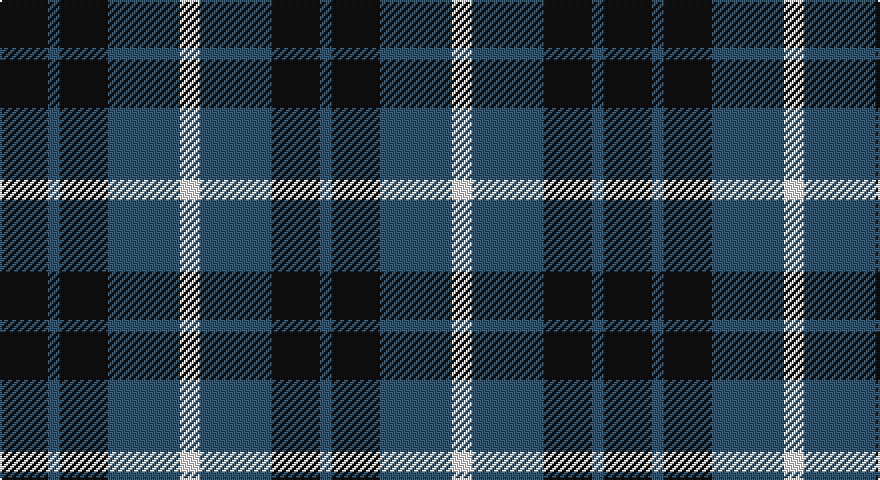

This page is one **sett** — a single exact thread-count. It belongs to the [tartan](/setts/k12n3k12n18w5/)
(the same proportion at any scale), whose colour order is pattern [BKBWBKBK](/stripes/bkbwbkbk/).

Sourced from register-of-tartans.  It is a [8 stripe tartan](/stripes/stripes8/).

Original link https://www.tartanregister.gov.uk/tartanDetails.aspx?ref=1491

## Register references

External register numbers recorded for this tartan.

- Scottish Register of Tartans: [1491](https://www.tartanregister.gov.uk/tartanDetails.aspx?ref=1491)
- Scottish Tartans Authority (ITI): 1058
- Scottish Tartans World Register: 1058

## Thread count
K/24 B6 K24 B36 W10 B36 K24 B/6

One full sett is **302 threads**.

## Palette

Palette: <strong>Logan (The Scottish Gael, 1831)</strong> <small style="color:#888">(2 of 3 colours)</small>
<table><thead><tr><th>Colour</th><th>Threads</th><th>Shade</th><th>Base</th><th>OKLCh</th></tr></thead><tbody><tr><td>K/</td><td style="text-align:right;font-variant-numeric:tabular-nums">24</td><td><code style="background-color:#101010;">#101010</code> <small style="color:#888">#101010</small></td><td>K <code style="background-color:#000000;">#000000</code></td><td><small style="color:#888">oklch(17.3% 0.000 89.9)</small></td></tr><tr><td>B</td><td style="text-align:right;font-variant-numeric:tabular-nums">6</td><td><code style="background-color:#305470;">#305470</code> <small style="color:#888">#305470</small></td><td>B <code style="background-color:#2A418A;">#2A418A</code></td><td><small style="color:#888">oklch(43.1% 0.063 243.4)</small></td></tr><tr><td>K</td><td style="text-align:right;font-variant-numeric:tabular-nums">24</td><td><code style="background-color:#101010;">#101010</code> <small style="color:#888">#101010</small></td><td>K <code style="background-color:#000000;">#000000</code></td><td><small style="color:#888">oklch(17.3% 0.000 89.9)</small></td></tr><tr><td>B</td><td style="text-align:right;font-variant-numeric:tabular-nums">36</td><td><code style="background-color:#305470;">#305470</code> <small style="color:#888">#305470</small></td><td>B <code style="background-color:#2A418A;">#2A418A</code></td><td><small style="color:#888">oklch(43.1% 0.063 243.4)</small></td></tr><tr><td>W</td><td style="text-align:right;font-variant-numeric:tabular-nums">10</td><td><code style="background-color:#FCFCFC;">#FCFCFC</code> <small style="color:#888">#FCFCFC</small></td><td>W <code style="background-color:#F7F7F7;">#F7F7F7</code></td><td><small style="color:#888">oklch(99.1% 0.000 89.9)</small></td></tr><tr><td>B</td><td style="text-align:right;font-variant-numeric:tabular-nums">36</td><td><code style="background-color:#305470;">#305470</code> <small style="color:#888">#305470</small></td><td>B <code style="background-color:#2A418A;">#2A418A</code></td><td><small style="color:#888">oklch(43.1% 0.063 243.4)</small></td></tr><tr><td>K</td><td style="text-align:right;font-variant-numeric:tabular-nums">24</td><td><code style="background-color:#101010;">#101010</code> <small style="color:#888">#101010</small></td><td>K <code style="background-color:#000000;">#000000</code></td><td><small style="color:#888">oklch(17.3% 0.000 89.9)</small></td></tr><tr><td>B/</td><td style="text-align:right;font-variant-numeric:tabular-nums">6</td><td><code style="background-color:#305470;">#305470</code> <small style="color:#888">#305470</small></td><td>B <code style="background-color:#2A418A;">#2A418A</code></td><td><small style="color:#888">oklch(43.1% 0.063 243.4)</small></td></tr></tbody></table>

# Sample pattern

## Nearest tartans

The nearest existing variants by ΔTartan distance, with this tartan at the top so the swatches line up against it.

ΔTartan

Tartan

Sett

—

<a href="/ttd/edit/#slug=k12n3k12n18w5~x2">Grampian Television</a> <a class="nn-out" href="/variants/s8/k12n3k12n18w5~x2/" title="open its dictionary page">↗</a>

1.17

<a href="/ttd/edit/#slug=k12n3k12n18w5~x2">Grampian Television (Corporate)</a> <a class="nn-out" href="/variants/s5/k12n3k12n18w5~x2/" title="open its dictionary page">↗</a>

1.39

<a href="/ttd/edit/#slug=g7r4g14db10g5db10w2db10g5db5~x2&amp;base=k12n3k12n18w5~x2">Edmonstone of Duntreath</a> <a class="nn-out" href="/variants/s10/g7r4g14db10g5db10w2db10g5db5~x2/" title="open its dictionary page">↗</a>

1.43

<a href="/ttd/edit/#slug=db8g2db8g15lb2~x4&amp;base=k12n3k12n18w5~x2">Hamilton Green Hunting</a> <a class="nn-out" href="/variants/s5/db8g2db8g15lb2~x4/" title="open its dictionary page">↗</a>

1.46

<a href="/ttd/edit/#slug=db1k6db6k6g6k1w1~x6&amp;base=k12n3k12n18w5~x2">Forbes - 1947 (Lyon Court)</a> <a class="nn-out" href="/variants/s7/db1k6db6k6g6k1w1~x6/" title="open its dictionary page">↗</a>

1.57

<a href="/ttd/edit/#slug=db2g6db6dp5db1dp2~x2&amp;base=k12n3k12n18w5~x2">Unnamed, No 54</a> <a class="nn-out" href="/variants/s6/db2g6db6dp5db1dp2~x2/" title="open its dictionary page">↗</a>

1.57

<a href="/ttd/edit/#slug=g9b4k4b3k4b4g9k2~x4&amp;base=k12n3k12n18w5~x2">Keith Clan</a> <a class="nn-out" href="/variants/s8/g9b4k4b3k4b4g9k2~x4/" title="open its dictionary page">↗</a>

1.58

<a href="/ttd/edit/#slug=g9b9k24b35dr5b35k24b9g9dr5~x2&amp;base=k12n3k12n18w5~x2">Notre Dame Marching Guard</a> <a class="nn-out" href="/variants/s10/g9b9k24b35dr5b35k24b9g9dr5~x2/" title="open its dictionary page">↗</a>

1.59

<a href="/ttd/edit/#slug=k51g5r15g37k17r6g7~x2&amp;base=k12n3k12n18w5~x2">Cadence Design Systems (Corporate)</a> <a class="nn-out" href="/variants/s7/k51g5r15g37k17r6g7~x2/" title="open its dictionary page">↗</a>

1.60

<a href="/ttd/edit/#slug=k1db5k4g3k1g3k6g1~x4&amp;base=k12n3k12n18w5~x2">Keith McCormick (Personal)</a> <a class="nn-out" href="/variants/s8/k1db5k4g3k1g3k6g1~x4/" title="open its dictionary page">↗</a>

1.61

<a href="/ttd/edit/#slug=db20k5db18lo26k6~x2&amp;base=k12n3k12n18w5~x2">Johore Regiment (Military)</a> <a class="nn-out" href="/variants/s5/db20k5db18lo26k6~x2/" title="open its dictionary page">↗</a>

## Neighbour map

Every grey dot is one of 14360 variants placed by the first two principal components of the ΔTartan feature space (44% of its variance). Red is this tartan; blue dots are its nearest — click one to open its page.

<svg viewBox="0 0 640 380" role="img" style="max-width:100%;height:auto;border:1px solid #e0e0e0;border-radius:4px;display:block" xmlns="http://www.w3.org/2000/svg"><image href="/nn/cloud.v1.png" width="640" height="380"/><a href="/variants/s5/k12n3k12n18w5~x2/"><circle cx="229.7" cy="282.0" r="4" fill="#3465a4"><title>Grampian Television (Corporate)</title></circle></a><a href="/variants/s10/g7r4g14db10g5db10w2db10g5db5~x2/"><circle cx="206.0" cy="247.7" r="4" fill="#3465a4"><title>Edmonstone of Duntreath</title></circle></a><a href="/variants/s5/db8g2db8g15lb2~x4/"><circle cx="282.4" cy="272.2" r="4" fill="#3465a4"><title>Hamilton Green Hunting</title></circle></a><a href="/variants/s7/db1k6db6k6g6k1w1~x6/"><circle cx="216.3" cy="255.2" r="4" fill="#3465a4"><title>Forbes - 1947 (Lyon Court)</title></circle></a><a href="/variants/s6/db2g6db6dp5db1dp2~x2/"><circle cx="207.7" cy="289.9" r="4" fill="#3465a4"><title>Unnamed, No 54</title></circle></a><a href="/variants/s8/g9b4k4b3k4b4g9k2~x4/"><circle cx="190.6" cy="283.9" r="4" fill="#3465a4"><title>Keith Clan</title></circle></a><a href="/variants/s10/g9b9k24b35dr5b35k24b9g9dr5~x2/"><circle cx="238.4" cy="223.5" r="4" fill="#3465a4"><title>Notre Dame Marching Guard</title></circle></a><a href="/variants/s7/k51g5r15g37k17r6g7~x2/"><circle cx="278.9" cy="227.9" r="4" fill="#3465a4"><title>Cadence Design Systems (Corporate)</title></circle></a><a href="/variants/s8/k1db5k4g3k1g3k6g1~x4/"><circle cx="226.2" cy="265.3" r="4" fill="#3465a4"><title>Keith McCormick (Personal)</title></circle></a><a href="/variants/s5/db20k5db18lo26k6~x2/"><circle cx="226.7" cy="276.1" r="4" fill="#3465a4"><title>Johore Regiment (Military)</title></circle></a><circle cx="257.8" cy="271.4" r="5" fill="#c00000"/></svg>

ID: /variants/s8/k12n3k12n18w5~x2/
