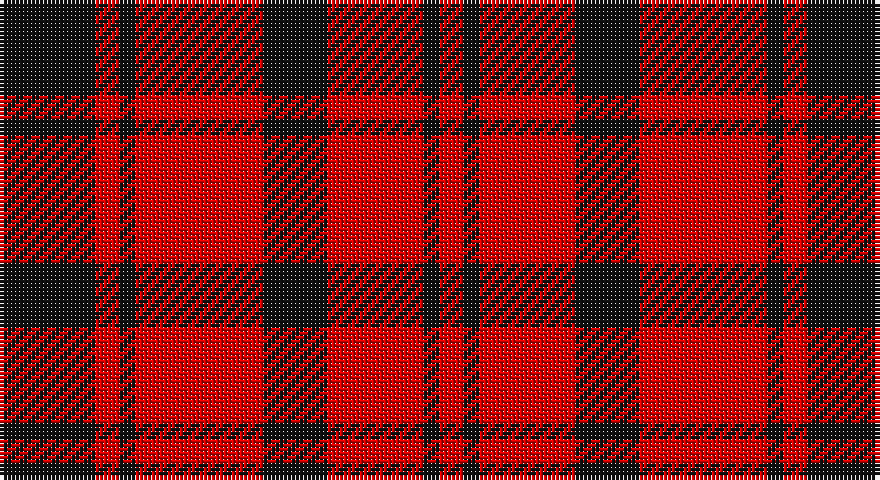

This page is one **sett** — a single exact thread-count. It belongs to the [tartan](/setts/k12r3k2r16k8r12k2r3/)
(the same proportion at any scale), whose colour order is pattern [KRKRKRKR](/stripes/krkrkrkr/).

Part of the [MacLeod](/tartans/macleod/) tartan — the named design grouping this sett with its other cloths.

Sourced from register-of-tartans.  It is a [8 stripe tartan](/stripes/stripes8/).

Original link https://www.tartanregister.gov.uk/tartanDetails.aspx?ref=2627

## Also known as

This cloth is also recorded under:

- MacLeod #2
- MacLeod #3
- MacLeod Red
- MacLeod Snuffbox
- MacLeod, Macleod of Harris
- MacLeod, Snuffbox

## Register references

External register numbers recorded for this tartan.

- Scottish Register of Tartans: [2627](https://www.tartanregister.gov.uk/tartanDetails.aspx?ref=2627)
- Scottish Tartans World Register: 1183

## Thread count
K/24 R6 K4 R32 K16 R24 K4 R/6

One full sett is **202 threads**.

## Palette

Palette: <strong>Logan (The Scottish Gael, 1831)</strong>
<table><thead><tr><th>Colour</th><th>Threads</th><th>Shade</th><th>Base</th><th>OKLCh</th></tr></thead><tbody><tr><td>K/</td><td style="text-align:right;font-variant-numeric:tabular-nums">24</td><td><code style="background-color:#101010;">#101010</code> <small style="color:#888">#101010</small></td><td>K <code style="background-color:#000000;">#000000</code></td><td><small style="color:#888">oklch(17.3% 0.000 89.9)</small></td></tr><tr><td>R</td><td style="text-align:right;font-variant-numeric:tabular-nums">6</td><td><code style="background-color:#DC0000;">#DC0000</code> <small style="color:#888">#DC0000</small></td><td>R <code style="background-color:#CC0000;">#CC0000</code></td><td><small style="color:#888">oklch(56.2% 0.230 29.2)</small></td></tr><tr><td>K</td><td style="text-align:right;font-variant-numeric:tabular-nums">4</td><td><code style="background-color:#101010;">#101010</code> <small style="color:#888">#101010</small></td><td>K <code style="background-color:#000000;">#000000</code></td><td><small style="color:#888">oklch(17.3% 0.000 89.9)</small></td></tr><tr><td>R</td><td style="text-align:right;font-variant-numeric:tabular-nums">32</td><td><code style="background-color:#DC0000;">#DC0000</code> <small style="color:#888">#DC0000</small></td><td>R <code style="background-color:#CC0000;">#CC0000</code></td><td><small style="color:#888">oklch(56.2% 0.230 29.2)</small></td></tr><tr><td>K</td><td style="text-align:right;font-variant-numeric:tabular-nums">16</td><td><code style="background-color:#101010;">#101010</code> <small style="color:#888">#101010</small></td><td>K <code style="background-color:#000000;">#000000</code></td><td><small style="color:#888">oklch(17.3% 0.000 89.9)</small></td></tr><tr><td>R</td><td style="text-align:right;font-variant-numeric:tabular-nums">24</td><td><code style="background-color:#DC0000;">#DC0000</code> <small style="color:#888">#DC0000</small></td><td>R <code style="background-color:#CC0000;">#CC0000</code></td><td><small style="color:#888">oklch(56.2% 0.230 29.2)</small></td></tr><tr><td>K</td><td style="text-align:right;font-variant-numeric:tabular-nums">4</td><td><code style="background-color:#101010;">#101010</code> <small style="color:#888">#101010</small></td><td>K <code style="background-color:#000000;">#000000</code></td><td><small style="color:#888">oklch(17.3% 0.000 89.9)</small></td></tr><tr><td>R/</td><td style="text-align:right;font-variant-numeric:tabular-nums">6</td><td><code style="background-color:#DC0000;">#DC0000</code> <small style="color:#888">#DC0000</small></td><td>R <code style="background-color:#CC0000;">#CC0000</code></td><td><small style="color:#888">oklch(56.2% 0.230 29.2)</small></td></tr></tbody></table>

# Sample pattern

## Compared to the master

This cloth is one sett of its design; the master sett (the exemplar the design is anchored on) is below for comparison.

<figure style="margin:0"><figcaption style="color:#888;font-size:smaller">this sett</figcaption></figure>
<figure style="margin:0"><figcaption style="color:#888;font-size:smaller"><a href="/setts/db4r1db1r2db11r2db1r1ly1r1db1r16db8r4g4r16g11r8db4r2ly2/">master sett →</a></figcaption></figure>

## Nearest tartans

The nearest existing variants by ΔTartan distance, with this tartan at the top so the swatches line up against it.

ΔTartan

Tartan

Sett

—

<a href="/ttd/edit/#slug=k12r3k2r16k8r12k2r3~x2">MacLeod #2</a> <a class="nn-out" href="/variants/s8/k12r3k2r16k8r12k2r3~x2/" title="open its dictionary page">↗</a>

1.12

<a href="/ttd/edit/#slug=r5k5r2k1r1k1r2k5r5k1r2~x4&amp;base=k12r3k2r16k8r12k2r3~x2">Border Reiver, The</a> <a class="nn-out" href="/variants/s11/r5k5r2k1r1k1r2k5r5k1r2~x4/" title="open its dictionary page">↗</a>

1.15

<a href="/ttd/edit/#slug=r8k1r8k12r1~x2&amp;base=k12r3k2r16k8r12k2r3~x2">MacLeod Black &amp; Red</a> <a class="nn-out" href="/variants/s5/r8k1r8k12r1~x2/" title="open its dictionary page">↗</a>

1.21

<a href="/ttd/edit/#slug=k31r4k47r47k4r31~x2&amp;base=k12r3k2r16k8r12k2r3~x2">Erskine (Paton)</a> <a class="nn-out" href="/variants/s6/k31r4k47r47k4r31~x2/" title="open its dictionary page">↗</a>

1.33

<a href="/ttd/edit/#slug=r4k8r4k8r12k1ly1~x2&amp;base=k12r3k2r16k8r12k2r3~x2">MacKeane (Clan?)</a> <a class="nn-out" href="/variants/s7/r4k8r4k8r12k1ly1~x2/" title="open its dictionary page">↗</a>

1.39

<a href="/ttd/edit/#slug=r4g5r2k6r18k2r4~x2&amp;base=k12r3k2r16k8r12k2r3~x2">MacQuarrie 5</a> <a class="nn-out" href="/variants/s7/r4g5r2k6r18k2r4~x2/" title="open its dictionary page">↗</a>

1.40

<a href="/ttd/edit/#slug=k6r3k28r28k3r6~x2&amp;base=k12r3k2r16k8r12k2r3~x2">Erskine, Black &amp; Red (Clan)</a> <a class="nn-out" href="/variants/s6/k6r3k28r28k3r6~x2/" title="open its dictionary page">↗</a>

1.41

<a href="/ttd/edit/#slug=r16k2r2k2r13k12r2k12r13k13r2ly2~x2&amp;base=k12r3k2r16k8r12k2r3~x2">German National (US) (Fashion)</a> <a class="nn-out" href="/variants/s12/r16k2r2k2r13k12r2k12r13k13r2ly2~x2/" title="open its dictionary page">↗</a>

1.45

<a href="/ttd/edit/#slug=r4k8r4k8r12k1ly2~x4&amp;base=k12r3k2r16k8r12k2r3~x2">MacDonald of Ardnamurchan (Clan?)</a> <a class="nn-out" href="/variants/s7/r4k8r4k8r12k1ly2~x4/" title="open its dictionary page">↗</a>

1.48

<a href="/ttd/edit/#slug=r26k18r7k4ly4~x2&amp;base=k12r3k2r16k8r12k2r3~x2">Haig &amp; Haig Whisky (Corporate)</a> <a class="nn-out" href="/variants/s5/r26k18r7k4ly4~x2/" title="open its dictionary page">↗</a>

1.49

<a href="/variants/s8/r26k18r7k4ly4~x2/">Haig &amp; Haig Whisky</a>

## Neighbour map

Every grey dot is one of 14360 variants placed by the first two principal components of the ΔTartan feature space (44% of its variance). Red is this tartan; blue dots are its nearest — click one to open its page.

<svg viewBox="0 0 640 380" role="img" style="max-width:100%;height:auto;border:1px solid #e0e0e0;border-radius:4px;display:block" xmlns="http://www.w3.org/2000/svg"><image href="/nn/cloud.v1.png" width="640" height="380"/><a href="/variants/s11/r5k5r2k1r1k1r2k5r5k1r2~x4/"><circle cx="328.8" cy="249.8" r="4" fill="#3465a4"><title>Border Reiver, The</title></circle></a><a href="/variants/s5/r8k1r8k12r1~x2/"><circle cx="375.0" cy="237.2" r="4" fill="#3465a4"><title>MacLeod Black &amp; Red</title></circle></a><a href="/variants/s6/k31r4k47r47k4r31~x2/"><circle cx="337.6" cy="240.8" r="4" fill="#3465a4"><title>Erskine (Paton)</title></circle></a><a href="/variants/s7/r4k8r4k8r12k1ly1~x2/"><circle cx="326.8" cy="214.9" r="4" fill="#3465a4"><title>MacKeane (Clan?)</title></circle></a><a href="/variants/s7/r4g5r2k6r18k2r4~x2/"><circle cx="388.8" cy="201.6" r="4" fill="#3465a4"><title>MacQuarrie 5</title></circle></a><a href="/variants/s6/k6r3k28r28k3r6~x2/"><circle cx="360.7" cy="232.7" r="4" fill="#3465a4"><title>Erskine, Black &amp; Red (Clan)</title></circle></a><a href="/variants/s12/r16k2r2k2r13k12r2k12r13k13r2ly2~x2/"><circle cx="308.5" cy="202.3" r="4" fill="#3465a4"><title>German National (US) (Fashion)</title></circle></a><a href="/variants/s7/r4k8r4k8r12k1ly2~x4/"><circle cx="305.0" cy="216.4" r="4" fill="#3465a4"><title>MacDonald of Ardnamurchan (Clan?)</title></circle></a><a href="/variants/s5/r26k18r7k4ly4~x2/"><circle cx="313.1" cy="239.4" r="4" fill="#3465a4"><title>Haig &amp; Haig Whisky (Corporate)</title></circle></a><a href="/variants/s8/r26k18r7k4ly4~x2/"><circle cx="283.1" cy="228.6" r="4" fill="#3465a4"><title>Haig &amp; Haig Whisky</title></circle></a><circle cx="358.8" cy="232.2" r="5" fill="#c00000"/></svg>

ID: /variants/s8/k12r3k2r16k8r12k2r3~x2/
