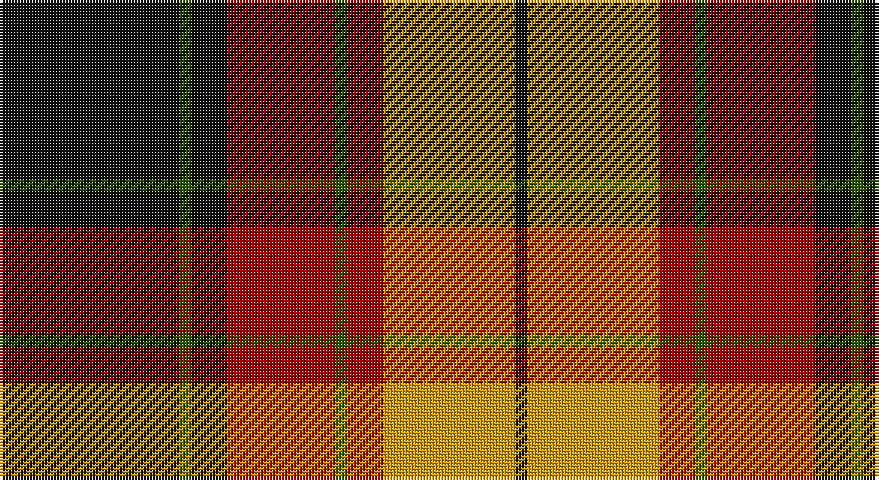

This page is one **sett** — a single exact thread-count. It belongs to the [tartan](/setts/k15dg1k3r9dg1r3lo11k1/)
(the same proportion at any scale), whose colour order is pattern [KGKRGRYK](/stripes/kgkrgryk/).

Sourced from register-of-tartans.  It is a [8 stripe tartan](/stripes/stripes8/).

Original link https://www.tartanregister.gov.uk/tartanDetails.aspx?ref=1863

2 attestations — the source records this cloth was collapsed from (oldest owns this page)

<ul>
<li>01/01/1972 — Island of Innis, The (register-of-tartans, <a href="https://www.tartanregister.gov.uk/tartanDetails.aspx?ref=1863">record</a>)</li>
<li>pre 1972 — Island of Innis, The (Fashion) (tartans-authority, <a href="http://www.tartansauthority.com/tartan-ferret/display/5279/">record</a>)</li>
</ul>

## Register references

External register numbers recorded for this tartan.

- Scottish Register of Tartans: [1863](https://www.tartanregister.gov.uk/tartanDetails.aspx?ref=1863)
- Scottish Tartans Authority (ITI): 5279

## Thread count
K/60 G4 K12 DR36 G4 DR12 DY44 K/4

One full sett is **288 threads**.

## Palette

Palette: <strong>Tartan Register</strong> <small style="color:#888">(3 of 4 colours)</small>
<table><thead><tr><th>Colour</th><th>Threads</th><th>Shade</th><th>Base</th><th>OKLCh</th></tr></thead><tbody><tr><td>K/</td><td style="text-align:right;font-variant-numeric:tabular-nums">60</td><td><code style="background-color:#101010;">#101010</code> <small style="color:#888">#101010</small></td><td>K <code style="background-color:#000000;">#000000</code></td><td><small style="color:#888">oklch(17.3% 0.000 89.9)</small></td></tr><tr><td>G</td><td style="text-align:right;font-variant-numeric:tabular-nums">4</td><td><code style="background-color:#285800;">#285800</code> <small style="color:#888">#285800</small></td><td>G <code style="background-color:#006100;">#006100</code></td><td><small style="color:#888">oklch(41.0% 0.122 135.8)</small></td></tr><tr><td>K</td><td style="text-align:right;font-variant-numeric:tabular-nums">12</td><td><code style="background-color:#101010;">#101010</code> <small style="color:#888">#101010</small></td><td>K <code style="background-color:#000000;">#000000</code></td><td><small style="color:#888">oklch(17.3% 0.000 89.9)</small></td></tr><tr><td>DR</td><td style="text-align:right;font-variant-numeric:tabular-nums">36</td><td><code style="background-color:#A00000;">#A00000</code> <small style="color:#888">#A00000</small></td><td>R <code style="background-color:#CC0000;">#CC0000</code></td><td><small style="color:#888">oklch(44.3% 0.182 29.2)</small></td></tr><tr><td>G</td><td style="text-align:right;font-variant-numeric:tabular-nums">4</td><td><code style="background-color:#285800;">#285800</code> <small style="color:#888">#285800</small></td><td>G <code style="background-color:#006100;">#006100</code></td><td><small style="color:#888">oklch(41.0% 0.122 135.8)</small></td></tr><tr><td>DR</td><td style="text-align:right;font-variant-numeric:tabular-nums">12</td><td><code style="background-color:#A00000;">#A00000</code> <small style="color:#888">#A00000</small></td><td>R <code style="background-color:#CC0000;">#CC0000</code></td><td><small style="color:#888">oklch(44.3% 0.182 29.2)</small></td></tr><tr><td>DY</td><td style="text-align:right;font-variant-numeric:tabular-nums">44</td><td><code style="background-color:#D09800;">#D09800</code> <small style="color:#888">#D09800</small></td><td>Y <code style="background-color:#F2BF00;">#F2BF00</code></td><td><small style="color:#888">oklch(71.4% 0.147 82.1)</small></td></tr><tr><td>K/</td><td style="text-align:right;font-variant-numeric:tabular-nums">4</td><td><code style="background-color:#101010;">#101010</code> <small style="color:#888">#101010</small></td><td>K <code style="background-color:#000000;">#000000</code></td><td><small style="color:#888">oklch(17.3% 0.000 89.9)</small></td></tr></tbody></table>

# Sample pattern

## Nearest tartans

The nearest existing variants by ΔTartan distance, with this tartan at the top so the swatches line up against it.

ΔTartan

Tartan

Sett

—

<a href="/ttd/edit/#slug=k15dg1k3r9dg1r3lo11k1~x4">Island of Innis, The</a> <a class="nn-out" href="/variants/s8/k15dg1k3r9dg1r3lo11k1~x4/" title="open its dictionary page">↗</a>

0.52

<a href="/ttd/edit/#slug=k1db1r16g16k12db8r16db1k1~x2&amp;base=k15dg1k3r9dg1r3lo11k1~x4">MacNaughton</a> <a class="nn-out" href="/variants/s9/k1db1r16g16k12db8r16db1k1~x2/" title="open its dictionary page">↗</a>

0.64

<a href="/ttd/edit/#slug=db1k1r12g12k6db5r12k1db1~x2&amp;base=k15dg1k3r9dg1r3lo11k1~x4">Montrose</a> <a class="nn-out" href="/variants/s9/db1k1r12g12k6db5r12k1db1~x2/" title="open its dictionary page">↗</a>

0.69

<a href="/ttd/edit/#slug=g8r2g12k6g3db6r24k4~x2&amp;base=k15dg1k3r9dg1r3lo11k1~x4">Dickie</a> <a class="nn-out" href="/variants/s8/g8r2g12k6g3db6r24k4~x2/" title="open its dictionary page">↗</a>

0.83

<a href="/ttd/edit/#slug=k1b1r16dg16k12b8r16b1k1~x2&amp;base=k15dg1k3r9dg1r3lo11k1~x4">MacNaughten</a> <a class="nn-out" href="/variants/s9/k1b1r16dg16k12b8r16b1k1~x2/" title="open its dictionary page">↗</a>

0.83

<a href="/ttd/edit/#slug=k1lb1r16dg16k12lb8r16lb1k1~x2&amp;base=k15dg1k3r9dg1r3lo11k1~x4">MacNaughton</a> <a class="nn-out" href="/variants/s9/k1lb1r16dg16k12lb8r16lb1k1~x2/" title="open its dictionary page">↗</a>

0.83

<a href="/ttd/edit/#slug=r3dr14g8r2g2w2g2r1~x2&amp;base=k15dg1k3r9dg1r3lo11k1~x4">Scott Hunting Clan Tartan</a> <a class="nn-out" href="/variants/s8/r3dr14g8r2g2w2g2r1~x2/" title="open its dictionary page">↗</a>

0.84

<a href="/ttd/edit/#slug=ly2dg7k6r11k1r1ly2~x4&amp;base=k15dg1k3r9dg1r3lo11k1~x4">Blackstock Red (Dress)</a> <a class="nn-out" href="/variants/s7/ly2dg7k6r11k1r1ly2~x4/" title="open its dictionary page">↗</a>

0.85

<a href="/ttd/edit/#slug=k3r8k3r8lo19r7dt36r3~x2&amp;base=k15dg1k3r9dg1r3lo11k1~x4">Private SA Club</a> <a class="nn-out" href="/variants/s8/k3r8k3r8lo19r7dt36r3~x2/" title="open its dictionary page">↗</a>

0.89

<a href="/ttd/edit/#slug=k44lo9k3lo8lo16lo15lo6k7~x2&amp;base=k15dg1k3r9dg1r3lo11k1~x4">Longford County Crest (Fashion)</a> <a class="nn-out" href="/variants/s8/k44lo9k3lo8lo16lo15lo6k7~x2/" title="open its dictionary page">↗</a>

0.91

<a href="/ttd/edit/#slug=r4k2r24k6db6g16r3~x2&amp;base=k15dg1k3r9dg1r3lo11k1~x4">MacDuff</a> <a class="nn-out" href="/variants/s7/r4k2r24k6db6g16r3~x2/" title="open its dictionary page">↗</a>

## Neighbour map

Every grey dot is one of 14360 variants placed by the first two principal components of the ΔTartan feature space (44% of its variance). Red is this tartan; blue dots are its nearest — click one to open its page.

<svg viewBox="0 0 640 380" role="img" style="max-width:100%;height:auto;border:1px solid #e0e0e0;border-radius:4px;display:block" xmlns="http://www.w3.org/2000/svg"><image href="/nn/cloud.v1.png" width="640" height="380"/><a href="/variants/s9/k1db1r16g16k12db8r16db1k1~x2/"><circle cx="218.3" cy="160.0" r="4" fill="#3465a4"><title>MacNaughton</title></circle></a><a href="/variants/s9/db1k1r12g12k6db5r12k1db1~x2/"><circle cx="226.2" cy="169.7" r="4" fill="#3465a4"><title>Montrose</title></circle></a><a href="/variants/s8/g8r2g12k6g3db6r24k4~x2/"><circle cx="200.1" cy="181.3" r="4" fill="#3465a4"><title>Dickie</title></circle></a><a href="/variants/s9/k1b1r16dg16k12b8r16b1k1~x2/"><circle cx="231.1" cy="168.3" r="4" fill="#3465a4"><title>MacNaughten</title></circle></a><a href="/variants/s9/k1lb1r16dg16k12lb8r16lb1k1~x2/"><circle cx="207.8" cy="150.6" r="4" fill="#3465a4"><title>MacNaughton</title></circle></a><a href="/variants/s8/r3dr14g8r2g2w2g2r1~x2/"><circle cx="245.5" cy="171.8" r="4" fill="#3465a4"><title>Scott Hunting Clan Tartan</title></circle></a><a href="/variants/s7/ly2dg7k6r11k1r1ly2~x4/"><circle cx="187.8" cy="183.9" r="4" fill="#3465a4"><title>Blackstock Red (Dress)</title></circle></a><a href="/variants/s8/k3r8k3r8lo19r7dt36r3~x2/"><circle cx="229.0" cy="173.9" r="4" fill="#3465a4"><title>Private SA Club</title></circle></a><a href="/variants/s8/k44lo9k3lo8lo16lo15lo6k7~x2/"><circle cx="212.1" cy="166.7" r="4" fill="#3465a4"><title>Longford County Crest (Fashion)</title></circle></a><a href="/variants/s7/r4k2r24k6db6g16r3~x2/"><circle cx="260.4" cy="179.1" r="4" fill="#3465a4"><title>MacDuff</title></circle></a><circle cx="232.9" cy="163.7" r="5" fill="#c00000"/></svg>

ID: /variants/s8/k15dg1k3r9dg1r3lo11k1~x4/
