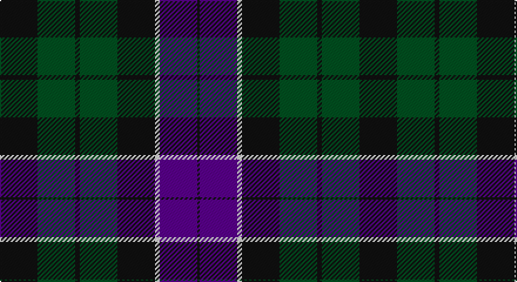

This page is one **sett** — a single exact thread-count. It belongs to the [tartan](/setts/k16dg16k2dg16k16w2dp16k1/)
(the same proportion at any scale), whose colour order is pattern [KBWKGKGK](/stripes/kbwkgkgk/).

Part of the [Unidentified](/tartans/unidentified/) tartan — the named design grouping this sett with its other cloths.

Sourced from register-of-tartans.  It is a [8 stripe tartan](/stripes/stripes8/).

Original link https://www.tartanregister.gov.uk/tartanDetails.aspx?ref=4237

## Also known as

This cloth is also recorded under:

- Unidentified #10
- Unidentified #12
- Unidentified #14
- Unidentified #15
- Unidentified #16
- Unidentified #18
- Unidentified #2
- Unidentified #21
- Unidentified #22
- Unidentified #24
- Unidentified #25
- Unidentified #28
- Unidentified #29
- Unidentified #30
- Unidentified #31
- Unidentified #32
- Unidentified #36
- Unidentified #37
- Unidentified #38
- Unidentified #40
- Unidentified #43
- Unidentified #44
- Unidentified #45
- Unidentified #46
- Unidentified #47
- Unidentified #48
- Unidentified #49
- Unidentified #5
- Unidentified #50
- Unidentified #51
- Unidentified #52
- Unidentified #53
- Unidentified #54
- Unidentified #55
- Unidentified #56
- Unidentified #57
- Unidentified #58
- Unidentified #59
- Unidentified #60
- Unidentified #61
- Unidentified #62
- Unidentified #63
- Unidentified #64
- Unidentified #65
- Unidentified #66
- Unidentified #7
- Unidentified #8
- Unidentified #9
- Unidentified 16
- Unidentified Artifact
- Unidentified Plaid
- Unidentified Plaid #11
- Unidentified Plaid #13
- Unidentified Plaid #2
- Unidentified Plaid #3
- Unidentified Plaid #7
- Unidentified Plaid #8
- Unidentified Plaid #9
- Unidentified Portrait

## Register references

External register numbers recorded for this tartan.

- Scottish Register of Tartans: [4237](https://www.tartanregister.gov.uk/tartanDetails.aspx?ref=4237)
- Scottish Tartans World Register: 1074

## Thread count
K/32 G32 K4 G32 K32 LN4 P32 K/2

One full sett is **306 threads**.

## Palette

Palette: <strong>Tartan Register</strong>
<table><thead><tr><th>Colour</th><th>Threads</th><th>Shade</th><th>Base</th><th>OKLCh</th></tr></thead><tbody><tr><td>K/</td><td style="text-align:right;font-variant-numeric:tabular-nums">32</td><td><code style="background-color:#101010;">#101010</code> <small style="color:#888">#101010</small></td><td>K <code style="background-color:#000000;">#000000</code></td><td><small style="color:#888">oklch(17.3% 0.000 89.9)</small></td></tr><tr><td>G</td><td style="text-align:right;font-variant-numeric:tabular-nums">32</td><td><code style="background-color:#005020;">#005020</code> <small style="color:#888">#005020</small></td><td>G <code style="background-color:#006100;">#006100</code></td><td><small style="color:#888">oklch(37.7% 0.105 149.6)</small></td></tr><tr><td>K</td><td style="text-align:right;font-variant-numeric:tabular-nums">4</td><td><code style="background-color:#101010;">#101010</code> <small style="color:#888">#101010</small></td><td>K <code style="background-color:#000000;">#000000</code></td><td><small style="color:#888">oklch(17.3% 0.000 89.9)</small></td></tr><tr><td>G</td><td style="text-align:right;font-variant-numeric:tabular-nums">32</td><td><code style="background-color:#005020;">#005020</code> <small style="color:#888">#005020</small></td><td>G <code style="background-color:#006100;">#006100</code></td><td><small style="color:#888">oklch(37.7% 0.105 149.6)</small></td></tr><tr><td>K</td><td style="text-align:right;font-variant-numeric:tabular-nums">32</td><td><code style="background-color:#101010;">#101010</code> <small style="color:#888">#101010</small></td><td>K <code style="background-color:#000000;">#000000</code></td><td><small style="color:#888">oklch(17.3% 0.000 89.9)</small></td></tr><tr><td>LN</td><td style="text-align:right;font-variant-numeric:tabular-nums">4</td><td><code style="background-color:#E0E0E0;">#E0E0E0</code> <small style="color:#888">#E0E0E0</small></td><td>W <code style="background-color:#F7F7F7;">#F7F7F7</code></td><td><small style="color:#888">oklch(90.7% 0.000 89.9)</small></td></tr><tr><td>P</td><td style="text-align:right;font-variant-numeric:tabular-nums">32</td><td><code style="background-color:#5A008C;">#5A008C</code> <small style="color:#888">#5A008C</small></td><td>B <code style="background-color:#2A418A;">#2A418A</code></td><td><small style="color:#888">oklch(37.0% 0.191 306.3)</small></td></tr><tr><td>K/</td><td style="text-align:right;font-variant-numeric:tabular-nums">2</td><td><code style="background-color:#101010;">#101010</code> <small style="color:#888">#101010</small></td><td>K <code style="background-color:#000000;">#000000</code></td><td><small style="color:#888">oklch(17.3% 0.000 89.9)</small></td></tr></tbody></table>

# Sample pattern

## Compared to the master

This cloth is one sett of its design; the master sett (the exemplar the design is anchored on) is below for comparison.

<figure style="margin:0"><figcaption style="color:#888;font-size:smaller">this sett</figcaption></figure>
<figure style="margin:0"><figcaption style="color:#888;font-size:smaller"><a href="/setts/dp4r3dp26r26dg26r4/">master sett →</a></figcaption></figure>

## Nearest tartans

The nearest existing variants by ΔTartan distance, with this tartan at the top so the swatches line up against it.

ΔTartan

Tartan

Sett

—

<a href="/ttd/edit/#slug=k16dg16k2dg16k16w2dp16k1~x2">Unidentified #36</a> <a class="nn-out" href="/variants/s8/k16dg16k2dg16k16w2dp16k1~x2/" title="open its dictionary page">↗</a>

0.67

<a href="/ttd/edit/#slug=db24k3db5k23ly2k11g22~x2&amp;base=k16dg16k2dg16k16w2dp16k1~x2">Mowat (Clans Originaux)</a> <a class="nn-out" href="/variants/s7/db24k3db5k23ly2k11g22~x2/" title="open its dictionary page">↗</a>

0.88

<a href="/ttd/edit/#slug=k7g22k22db6r2db15r2~x2&amp;base=k16dg16k2dg16k16w2dp16k1~x2">National Galleries of Scotland</a> <a class="nn-out" href="/variants/s7/k7g22k22db6r2db15r2~x2/" title="open its dictionary page">↗</a>

0.89

<a href="/ttd/edit/#slug=k4db16k12g12r1g2k2~x2&amp;base=k16dg16k2dg16k16w2dp16k1~x2">Dundas #2</a> <a class="nn-out" href="/variants/s7/k4db16k12g12r1g2k2~x2/" title="open its dictionary page">↗</a>

1.03

<a href="/ttd/edit/#slug=db26k1db2k18ly2g16k16~x2&amp;base=k16dg16k2dg16k16w2dp16k1~x2">Mowat</a> <a class="nn-out" href="/variants/s7/db26k1db2k18ly2g16k16~x2/" title="open its dictionary page">↗</a>

1.06

<a href="/ttd/edit/#slug=r2g12k12g1db12g2~x2&amp;base=k16dg16k2dg16k16w2dp16k1~x2">Gunn</a> <a class="nn-out" href="/variants/s6/r2g12k12g1db12g2~x2/" title="open its dictionary page">↗</a>

1.06

<a href="/ttd/edit/#slug=k4g21k10r2k10db21k4db4k4~x2&amp;base=k16dg16k2dg16k16w2dp16k1~x2">Swallow Hotels (Corporate)</a> <a class="nn-out" href="/variants/s9/k4g21k10r2k10db21k4db4k4~x2/" title="open its dictionary page">↗</a>

1.09

<a href="/ttd/edit/#slug=k3db17k20dg18w4dg18k20db18k2db2~x2&amp;base=k16dg16k2dg16k16w2dp16k1~x2">Argyll Campbell</a> <a class="nn-out" href="/variants/s10/k3db17k20dg18w4dg18k20db18k2db2~x2/" title="open its dictionary page">↗</a>

1.12

<a href="/ttd/edit/#slug=g27k21db12k4db40k4db12k21g27w4~x2&amp;base=k16dg16k2dg16k16w2dp16k1~x2">Granger/Grainger (Personal)</a> <a class="nn-out" href="/variants/s10/g27k21db12k4db40k4db12k21g27w4~x2/" title="open its dictionary page">↗</a>

1.14

<a href="/ttd/edit/#slug=g2db12r1k12g12k2g12k12r1db12g1~x4&amp;base=k16dg16k2dg16k16w2dp16k1~x2">Ferguson</a> <a class="nn-out" href="/variants/s11/g2db12r1k12g12k2g12k12r1db12g1~x4/" title="open its dictionary page">↗</a>

1.15

<a href="/ttd/edit/#slug=r4k4db24k24g24k2r3~x2&amp;base=k16dg16k2dg16k16w2dp16k1~x2">Black Watch (Coarse Kilt)</a> <a class="nn-out" href="/variants/s7/r4k4db24k24g24k2r3~x2/" title="open its dictionary page">↗</a>

## Neighbour map

Every grey dot is one of 14360 variants placed by the first two principal components of the ΔTartan feature space (44% of its variance). Red is this tartan; blue dots are its nearest — click one to open its page.

<svg viewBox="0 0 640 380" role="img" style="max-width:100%;height:auto;border:1px solid #e0e0e0;border-radius:4px;display:block" xmlns="http://www.w3.org/2000/svg"><image href="/nn/cloud.v1.png" width="640" height="380"/><a href="/variants/s7/db24k3db5k23ly2k11g22~x2/"><circle cx="238.5" cy="232.6" r="4" fill="#3465a4"><title>Mowat (Clans Originaux)</title></circle></a><a href="/variants/s7/k7g22k22db6r2db15r2~x2/"><circle cx="218.5" cy="230.5" r="4" fill="#3465a4"><title>National Galleries of Scotland</title></circle></a><a href="/variants/s7/k4db16k12g12r1g2k2~x2/"><circle cx="248.8" cy="217.5" r="4" fill="#3465a4"><title>Dundas #2</title></circle></a><a href="/variants/s7/db26k1db2k18ly2g16k16~x2/"><circle cx="286.8" cy="199.5" r="4" fill="#3465a4"><title>Mowat</title></circle></a><a href="/variants/s6/r2g12k12g1db12g2~x2/"><circle cx="216.6" cy="231.7" r="4" fill="#3465a4"><title>Gunn</title></circle></a><a href="/variants/s9/k4g21k10r2k10db21k4db4k4~x2/"><circle cx="224.7" cy="214.8" r="4" fill="#3465a4"><title>Swallow Hotels (Corporate)</title></circle></a><a href="/variants/s10/k3db17k20dg18w4dg18k20db18k2db2~x2/"><circle cx="203.0" cy="235.4" r="4" fill="#3465a4"><title>Argyll Campbell</title></circle></a><a href="/variants/s10/g27k21db12k4db40k4db12k21g27w4~x2/"><circle cx="197.4" cy="225.7" r="4" fill="#3465a4"><title>Granger/Grainger (Personal)</title></circle></a><a href="/variants/s11/g2db12r1k12g12k2g12k12r1db12g1~x4/"><circle cx="208.2" cy="213.4" r="4" fill="#3465a4"><title>Ferguson</title></circle></a><a href="/variants/s7/r4k4db24k24g24k2r3~x2/"><circle cx="220.5" cy="219.1" r="4" fill="#3465a4"><title>Black Watch (Coarse Kilt)</title></circle></a><circle cx="249.1" cy="223.0" r="5" fill="#c00000"/></svg>

ID: /variants/s8/k16dg16k2dg16k16w2dp16k1~x2/
