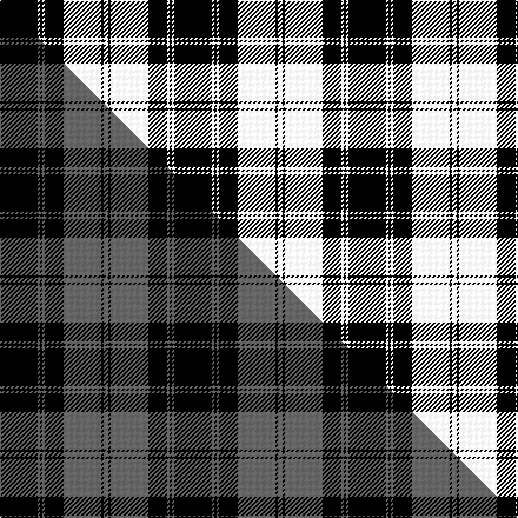

This page is one **sett** — a single exact thread-count. It belongs to the [tartan](/setts/k16w1k1w1k8w16k1w2/)
(the same proportion at any scale), whose colour order is pattern [KWKWKWKW](/stripes/kwkwkwkw/).

Part of the [Douglas VS](/tartans/douglas-vs/) tartan — the named design grouping this sett with its other cloths.

Sourced from weddslist.  It is a [8 stripe tartan](/stripes/stripes8/).

Original link http://www.weddslist.com/cgi-bin/tartans/pg.pl?source=rb

## Thread count
K/32 W2 K2 W2 K16 W32 K2 W/4

One full sett is **148 threads**.

## Palette
<table><thead><tr><th>Colour</th><th>Shade</th><th>OKLCh</th></tr></thead><tbody><tr><td>K</td><td><code style="background-color:#000000;">#000000</code> <small style="color:#888">#000000</small></td><td><small style="color:#888">oklch(0.0% 0.000 0.0)</small></td></tr><tr><td>W</td><td><code style="background-color:#F7F7F7;">#F7F7F7</code> <small style="color:#888">#F7F7F7</small></td><td><small style="color:#888">oklch(97.6% 0.000 89.9)</small></td></tr></tbody></table>

# Sample pattern

## Compared to the master

This cloth is one sett of its design; the master sett (the exemplar the design is anchored on) is below for comparison.

Its **ΔTartan distance** from the master is **1.89** — the same measure the nearest-tartans table ranks by (0 is identical; a re-scale of the same cloth is near 0, a recolour or a different proportion further).

<figure class="master-compare" style="margin:0">

this sett
master sett ★

<figcaption style="color:#888;font-size:smaller">One weave of this sett against the <a href="/setts/k16n1k1n1k8n16k1n2/">master sett ★</a>, split on the diagonal: a shared proportion runs seamlessly across it with only the shades shifting; a different proportion breaks on it.</figcaption>
</figure>

## Nearest tartan variants

The nearest existing variants by ΔTartan distance, with this cloth at the top so the swatches line up against it.

ΔTartan

Threads

Variant

Sett

—

148

<a href="/variants/s8/k16w1k1w1k8w16k1w2~x2/">Douglas VS</a>

<a href="/ttd/edit/#slug=k16n1k1n1k8n16k1n2~x2&amp;base=k16w1k1w1k8w16k1w2~x2" title="compare in the TTD">0.00</a>

148

<a href="/variants/s8/k16n1k1n1k8n16k1n2~x2/">Douglas VS</a>

<a href="/ttd/edit/#slug=k1w8k8w1k8w4k4w1~x2&amp;base=k16w1k1w1k8w16k1w2~x2" title="compare in the TTD">0.66</a>

136

<a href="/variants/s8/k1w8k8w1k8w4k4w1~x2/">Priest</a>

<a href="/ttd/edit/#slug=k36w4k3w4k6w2k1w12~x4&amp;base=k16w1k1w1k8w16k1w2~x2" title="compare in the TTD">0.81</a>

352

<a href="/variants/s8/k36w4k3w4k6w2k1w12~x4/">Menzies (1938)</a>

<a href="/ttd/edit/#slug=w6k1w2k4w4k2w4k15r1~x2&amp;base=k16w1k1w1k8w16k1w2~x2" title="compare in the TTD">0.92</a>

142

<a href="/variants/s9/w6k1w2k4w4k2w4k15r1~x2/">Menzies Dress Tartan</a>

<a href="/ttd/edit/#slug=w2k11w2k2w16k2w2k11lo2~x4&amp;base=k16w1k1w1k8w16k1w2~x2" title="compare in the TTD">0.94</a>

384

<a href="/variants/s9/w2k11w2k2w16k2w2k11lo2~x4/">MacFie of Colonsay Dress (Fashion?)</a>

<a href="/ttd/edit/#slug=w24k16w1k16w3k8w2~x2&amp;base=k16w1k1w1k8w16k1w2~x2" title="compare in the TTD">1.59</a>

228

<a href="/variants/s7/w24k16w1k16w3k8w2~x2/">Saks Fifth Avenue (Corp)</a>

<a href="/ttd/edit/#slug=w5k20w10k1r2~x2&amp;base=k16w1k1w1k8w16k1w2~x2" title="compare in the TTD">1.71</a>

138

<a href="/variants/s5/w5k20w10k1r2~x2/">St. Piran Cornish Flag</a>

<a href="/ttd/edit/#slug=k17n4k13n4k3n45k3~x2&amp;base=k16w1k1w1k8w16k1w2~x2" title="compare in the TTD">1.85</a>

316

<a href="/variants/s7/k17n4k13n4k3n45k3~x2/">Black Spirit Fashion Tartan</a>

<a href="/ttd/edit/#slug=k3n6k8lb2k8n3k5n36k2n3~x2&amp;base=k16w1k1w1k8w16k1w2~x2" title="compare in the TTD">2.27</a>

292

<a href="/variants/s10/k3n6k8lb2k8n3k5n36k2n3~x2/">City Building (Glasgow) LLP (Corp)</a>

<a href="/ttd/edit/#slug=k3n6k8lb2k8n3k5n36k2n3~x2~n1900000&amp;base=k16w1k1w1k8w16k1w2~x2" title="compare in the TTD">2.27</a>

292

<a href="/variants/s10/k3n6k8lb2k8n3k5n36k2n3~x2~n1900000/">City Building (Glasgow) LLP</a>

## Neighbour map

Every grey dot is one of 13620 variants placed by the first two principal components of the ΔTartan feature space (42% of its variance). Red is this tartan; blue dots are its nearest — click one to open its page.

<svg viewBox="0 0 640 380" role="img" style="max-width:100%;height:auto;border:1px solid #e0e0e0;border-radius:4px;display:block" xmlns="http://www.w3.org/2000/svg"><image href="/nn/cloud.v1.png" width="640" height="380"/><a href="/variants/s8/k16n1k1n1k8n16k1n2~x2/"><circle cx="357.7" cy="169.4" r="4" fill="#3465a4"><title>Douglas VS</title></circle></a><a href="/variants/s8/k1w8k8w1k8w4k4w1~x2/"><circle cx="296.9" cy="223.1" r="4" fill="#3465a4"><title>Priest</title></circle></a><a href="/variants/s8/k36w4k3w4k6w2k1w12~x4/"><circle cx="416.3" cy="122.0" r="4" fill="#3465a4"><title>Menzies (1938)</title></circle></a><a href="/variants/s9/w6k1w2k4w4k2w4k15r1~x2/"><circle cx="281.4" cy="153.5" r="4" fill="#3465a4"><title>Menzies Dress Tartan</title></circle></a><a href="/variants/s9/w2k11w2k2w16k2w2k11lo2~x4/"><circle cx="250.8" cy="185.1" r="4" fill="#3465a4"><title>MacFie of Colonsay Dress (Fashion?)</title></circle></a><a href="/variants/s7/w24k16w1k16w3k8w2~x2/"><circle cx="330.7" cy="177.6" r="4" fill="#3465a4"><title>Saks Fifth Avenue (Corp)</title></circle></a><a href="/variants/s5/w5k20w10k1r2~x2/"><circle cx="304.2" cy="151.4" r="4" fill="#3465a4"><title>St. Piran Cornish Flag</title></circle></a><a href="/variants/s7/k17n4k13n4k3n45k3~x2/"><circle cx="363.8" cy="170.6" r="4" fill="#3465a4"><title>Black Spirit Fashion Tartan</title></circle></a><a href="/variants/s10/k3n6k8lb2k8n3k5n36k2n3~x2/"><circle cx="370.3" cy="131.8" r="4" fill="#3465a4"><title>City Building (Glasgow) LLP (Corp)</title></circle></a><a href="/variants/s10/k3n6k8lb2k8n3k5n36k2n3~x2~n1900000/"><circle cx="374.9" cy="133.0" r="4" fill="#3465a4"><title>City Building (Glasgow) LLP</title></circle></a><circle cx="329.7" cy="165.9" r="5" fill="#c00000"/><text x="320" y="376" text-anchor="middle" font-size="11" fill="#999">ground</text><text x="11" y="190" text-anchor="middle" font-size="11" fill="#999" transform="rotate(-90 11 190)">complexity</text></svg>

ID: /variants/s8/k16w1k1w1k8w16k1w2~x2/
