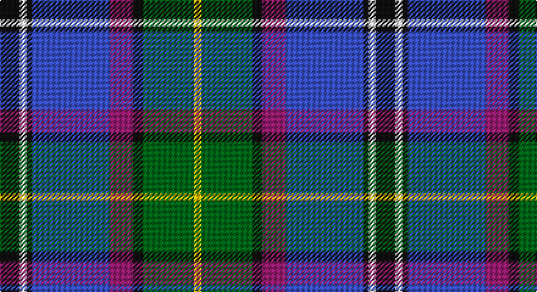

This page is one **sett** — a single exact thread-count. It belongs to the [tartan](/setts/k16w6k4b64m19k8g42ly6/)
(the same proportion at any scale), whose colour order is pattern [KWKBRKGY](/stripes/kwkbrkgy/).

Part of the [Unidentified](/tartans/unidentified/) tartan — the named design grouping this sett with its other cloths.

Sourced from tartans-authority.  It is a [8 stripe tartan](/stripes/stripes8/).

Original link http://www.tartansauthority.com/tartan-ferret/display/5938/

## Also known as

This cloth is also recorded under:

- Unidentified #10
- Unidentified #12
- Unidentified #14
- Unidentified #15
- Unidentified #16
- Unidentified #18
- Unidentified #2
- Unidentified #21
- Unidentified #22
- Unidentified #24
- Unidentified #25
- Unidentified #28
- Unidentified #29
- Unidentified #30
- Unidentified #31
- Unidentified #32
- Unidentified #36
- Unidentified #37
- Unidentified #38
- Unidentified #40
- Unidentified #43
- Unidentified #44
- Unidentified #45
- Unidentified #46
- Unidentified #47
- Unidentified #48
- Unidentified #49
- Unidentified #5
- Unidentified #50
- Unidentified #51
- Unidentified #52
- Unidentified #53
- Unidentified #54
- Unidentified #55
- Unidentified #56
- Unidentified #57
- Unidentified #58
- Unidentified #59
- Unidentified #60
- Unidentified #61
- Unidentified #62
- Unidentified #63
- Unidentified #64
- Unidentified #65
- Unidentified #66
- Unidentified #7
- Unidentified #8
- Unidentified #9
- Unidentified 16
- Unidentified Artifact
- Unidentified Plaid
- Unidentified Plaid #11
- Unidentified Plaid #13
- Unidentified Plaid #2
- Unidentified Plaid #3
- Unidentified Plaid #7
- Unidentified Plaid #8
- Unidentified Plaid #9
- Unidentified Portrait

## Register references

External register numbers recorded for this tartan.

- Scottish Tartans Authority (ITI): 5938

## Thread count
K/16 W6 K4 B64 P19 K8 G42 Y/6

One full sett is **308 threads**.

## Palette

Palette: <strong>Tartan Register</strong> <small style="color:#888">(5 of 6 colours)</small>
<table><thead><tr><th>Colour</th><th>Threads</th><th>Shade</th><th>Base</th><th>OKLCh</th></tr></thead><tbody><tr><td>K/</td><td style="text-align:right;font-variant-numeric:tabular-nums">16</td><td><code style="background-color:#101010;">#101010</code> <small style="color:#888">#101010</small></td><td>K <code style="background-color:#000000;">#000000</code></td><td><small style="color:#888">oklch(17.3% 0.000 89.9)</small></td></tr><tr><td>W</td><td style="text-align:right;font-variant-numeric:tabular-nums">6</td><td><code style="background-color:#F8F8F8;">#F8F8F8</code> <small style="color:#888">#F8F8F8</small></td><td>W <code style="background-color:#F7F7F7;">#F7F7F7</code></td><td><small style="color:#888">oklch(97.9% 0.000 89.9)</small></td></tr><tr><td>K</td><td style="text-align:right;font-variant-numeric:tabular-nums">4</td><td><code style="background-color:#101010;">#101010</code> <small style="color:#888">#101010</small></td><td>K <code style="background-color:#000000;">#000000</code></td><td><small style="color:#888">oklch(17.3% 0.000 89.9)</small></td></tr><tr><td>B</td><td style="text-align:right;font-variant-numeric:tabular-nums">64</td><td><code style="background-color:#3850C8;">#3850C8</code> <small style="color:#888">#3850C8</small></td><td>B <code style="background-color:#2A418A;">#2A418A</code></td><td><small style="color:#888">oklch(48.8% 0.188 269.4)</small></td></tr><tr><td>P</td><td style="text-align:right;font-variant-numeric:tabular-nums">19</td><td><code style="background-color:#981C70;">#981C70</code> <small style="color:#888">#981C70</small></td><td>R <code style="background-color:#CC0000;">#CC0000</code></td><td><small style="color:#888">oklch(46.6% 0.177 344.9)</small></td></tr><tr><td>K</td><td style="text-align:right;font-variant-numeric:tabular-nums">8</td><td><code style="background-color:#101010;">#101010</code> <small style="color:#888">#101010</small></td><td>K <code style="background-color:#000000;">#000000</code></td><td><small style="color:#888">oklch(17.3% 0.000 89.9)</small></td></tr><tr><td>G</td><td style="text-align:right;font-variant-numeric:tabular-nums">42</td><td><code style="background-color:#006818;">#006818</code> <small style="color:#888">#006818</small></td><td>G <code style="background-color:#006100;">#006100</code></td><td><small style="color:#888">oklch(45.0% 0.142 145.0)</small></td></tr><tr><td>Y/</td><td style="text-align:right;font-variant-numeric:tabular-nums">6</td><td><code style="background-color:#E8C000;">#E8C000</code> <small style="color:#888">#E8C000</small></td><td>Y <code style="background-color:#F2BF00;">#F2BF00</code></td><td><small style="color:#888">oklch(81.9% 0.168 93.7)</small></td></tr></tbody></table>

# Sample pattern

## Compared to the master

This cloth is one sett of its design; the master sett (the exemplar the design is anchored on) is below for comparison.

<figure style="margin:0"><figcaption style="color:#888;font-size:smaller">this sett</figcaption></figure>
<figure style="margin:0"><figcaption style="color:#888;font-size:smaller"><a href="/setts/dp4r3dp26r26dg26r4/">master sett →</a></figcaption></figure>

## Nearest tartans

The nearest existing variants by ΔTartan distance, with this tartan at the top so the swatches line up against it.

ΔTartan

Tartan

Sett

—

<a href="/ttd/edit/#slug=k16w6k4b64m19k8g42ly6">Unidentified (Woven sample)</a> <a class="nn-out" href="/variants/s8/k16w6k4b64m19k8g42ly6/" title="open its dictionary page">↗</a>

0.57

<a href="/ttd/edit/#slug=g5m2g2m9k9lr9db30w5~x2&amp;base=k16w6k4b64m19k8g42ly6">Alexander of Menstry</a> <a class="nn-out" href="/variants/s8/g5m2g2m9k9lr9db30w5~x2/" title="open its dictionary page">↗</a>

0.60

<a href="/ttd/edit/#slug=t3r3k5g8w2k13db13t26w3~x2&amp;base=k16w6k4b64m19k8g42ly6">Moran (Virgin Islands) (Personal)</a> <a class="nn-out" href="/variants/s9/t3r3k5g8w2k13db13t26w3~x2/" title="open its dictionary page">↗</a>

0.63

<a href="/ttd/edit/#slug=db60t5w4o12g42p12t5p12&amp;base=k16w6k4b64m19k8g42ly6">St Columba</a> <a class="nn-out" href="/variants/s8/db60t5w4o12g42p12t5p12/" title="open its dictionary page">↗</a>

0.68

<a href="/ttd/edit/#slug=t26db13k13w2g8k5r3t3~x2&amp;base=k16w6k4b64m19k8g42ly6">Moran (Coilessan) (Personal)</a> <a class="nn-out" href="/variants/s8/t26db13k13w2g8k5r3t3~x2/" title="open its dictionary page">↗</a>

0.80

<a href="/ttd/edit/#slug=db28r3w3r3w3r3db14k12t38ly8&amp;base=k16w6k4b64m19k8g42ly6">GYL (Personal)</a> <a class="nn-out" href="/variants/s10/db28r3w3r3w3r3db14k12t38ly8/" title="open its dictionary page">↗</a>

0.81

<a href="/ttd/edit/#slug=w4db8m3db25k13g4t29db3t8db2m3~x2&amp;base=k16w6k4b64m19k8g42ly6">Air Force</a> <a class="nn-out" href="/variants/s11/w4db8m3db25k13g4t29db3t8db2m3~x2/" title="open its dictionary page">↗</a>

0.88

<a href="/ttd/edit/#slug=t1ly3g14w2db22w2dp14t3ly1~x2&amp;base=k16w6k4b64m19k8g42ly6">Yule (Name)</a> <a class="nn-out" href="/variants/s9/t1ly3g14w2db22w2dp14t3ly1~x2/" title="open its dictionary page">↗</a>

0.89

<a href="/ttd/edit/#slug=db16w6r8db3lo1g1lg3db1g10~x4&amp;base=k16w6k4b64m19k8g42ly6">Ogilvie of Inverquharity or Ohio</a> <a class="nn-out" href="/variants/s9/db16w6r8db3lo1g1lg3db1g10~x4/" title="open its dictionary page">↗</a>

0.90

<a href="/ttd/edit/#slug=db35r2k16ly2t25w2t6~x2&amp;base=k16w6k4b64m19k8g42ly6">US Forces (Thurso) Regimental Tartan</a> <a class="nn-out" href="/variants/s7/db35r2k16ly2t25w2t6~x2/" title="open its dictionary page">↗</a>

0.90

<a href="/ttd/edit/#slug=db16w6r8db3ly1g1t3db1g9~x2&amp;base=k16w6k4b64m19k8g42ly6">Ohio District Tartan</a> <a class="nn-out" href="/variants/s9/db16w6r8db3ly1g1t3db1g9~x2/" title="open its dictionary page">↗</a>

## Neighbour map

Every grey dot is one of 14360 variants placed by the first two principal components of the ΔTartan feature space (44% of its variance). Red is this tartan; blue dots are its nearest — click one to open its page.

<svg viewBox="0 0 640 380" role="img" style="max-width:100%;height:auto;border:1px solid #e0e0e0;border-radius:4px;display:block" xmlns="http://www.w3.org/2000/svg"><image href="/nn/cloud.v1.png" width="640" height="380"/><a href="/variants/s8/g5m2g2m9k9lr9db30w5~x2/"><circle cx="163.7" cy="135.9" r="4" fill="#3465a4"><title>Alexander of Menstry</title></circle></a><a href="/variants/s9/t3r3k5g8w2k13db13t26w3~x2/"><circle cx="133.1" cy="146.0" r="4" fill="#3465a4"><title>Moran (Virgin Islands) (Personal)</title></circle></a><a href="/variants/s8/db60t5w4o12g42p12t5p12/"><circle cx="166.3" cy="138.4" r="4" fill="#3465a4"><title>St Columba</title></circle></a><a href="/variants/s8/t26db13k13w2g8k5r3t3~x2/"><circle cx="150.7" cy="160.2" r="4" fill="#3465a4"><title>Moran (Coilessan) (Personal)</title></circle></a><a href="/variants/s10/db28r3w3r3w3r3db14k12t38ly8/"><circle cx="144.0" cy="128.6" r="4" fill="#3465a4"><title>GYL (Personal)</title></circle></a><a href="/variants/s11/w4db8m3db25k13g4t29db3t8db2m3~x2/"><circle cx="161.2" cy="130.8" r="4" fill="#3465a4"><title>Air Force</title></circle></a><a href="/variants/s9/t1ly3g14w2db22w2dp14t3ly1~x2/"><circle cx="166.0" cy="112.7" r="4" fill="#3465a4"><title>Yule (Name)</title></circle></a><a href="/variants/s9/db16w6r8db3lo1g1lg3db1g10~x4/"><circle cx="147.6" cy="126.4" r="4" fill="#3465a4"><title>Ogilvie of Inverquharity or Ohio</title></circle></a><a href="/variants/s7/db35r2k16ly2t25w2t6~x2/"><circle cx="198.7" cy="147.5" r="4" fill="#3465a4"><title>US Forces (Thurso) Regimental Tartan</title></circle></a><a href="/variants/s9/db16w6r8db3ly1g1t3db1g9~x2/"><circle cx="160.4" cy="129.2" r="4" fill="#3465a4"><title>Ohio District Tartan</title></circle></a><circle cx="161.5" cy="136.3" r="5" fill="#c00000"/></svg>

ID: /variants/s8/k16w6k4b64m19k8g42ly6/
