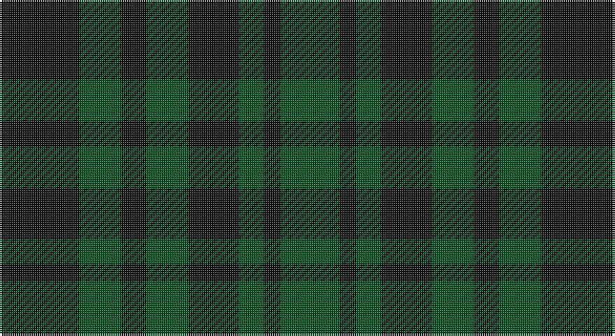

This page is one **sett** — a single exact thread-count. It belongs to the [tartan](/setts/k19dg10k6dg10k12dg6k4dg14/)
(the same proportion at any scale), whose colour order is pattern [GKGKGKGK](/stripes/gkgkgkgk/).

Part of the [Menzies](/tartans/menzies/) tartan — the named design grouping this sett with its other cloths.

Sourced from register-of-tartans.  It is a [8 stripe tartan](/stripes/stripes8/).

Original link https://www.tartanregister.gov.uk/tartanDetails.aspx?ref=2928

## Also known as

This cloth is also recorded under:

- Menzies #3
- Menzies 1938
- Menzies B/W
- Menzies Green
- Menzies, Green

## Register references

External register numbers recorded for this tartan.

- Scottish Register of Tartans: [2928](https://www.tartanregister.gov.uk/tartanDetails.aspx?ref=2928)
- Scottish Tartans World Register: 788

## Thread count
K/38 G20 K12 G20 K24 G12 K8 G/28

One full sett is **258 threads**.

## Palette

Palette: <strong>Tartan Register</strong>
<table><thead><tr><th>Colour</th><th>Threads</th><th>Shade</th><th>Base</th><th>OKLCh</th></tr></thead><tbody><tr><td>K/</td><td style="text-align:right;font-variant-numeric:tabular-nums">38</td><td><code style="background-color:#101010;">#101010</code> <small style="color:#888">#101010</small></td><td>K <code style="background-color:#000000;">#000000</code></td><td><small style="color:#888">oklch(17.3% 0.000 89.9)</small></td></tr><tr><td>G</td><td style="text-align:right;font-variant-numeric:tabular-nums">20</td><td><code style="background-color:#005020;">#005020</code> <small style="color:#888">#005020</small></td><td>G <code style="background-color:#006100;">#006100</code></td><td><small style="color:#888">oklch(37.7% 0.105 149.6)</small></td></tr><tr><td>K</td><td style="text-align:right;font-variant-numeric:tabular-nums">12</td><td><code style="background-color:#101010;">#101010</code> <small style="color:#888">#101010</small></td><td>K <code style="background-color:#000000;">#000000</code></td><td><small style="color:#888">oklch(17.3% 0.000 89.9)</small></td></tr><tr><td>G</td><td style="text-align:right;font-variant-numeric:tabular-nums">20</td><td><code style="background-color:#005020;">#005020</code> <small style="color:#888">#005020</small></td><td>G <code style="background-color:#006100;">#006100</code></td><td><small style="color:#888">oklch(37.7% 0.105 149.6)</small></td></tr><tr><td>K</td><td style="text-align:right;font-variant-numeric:tabular-nums">24</td><td><code style="background-color:#101010;">#101010</code> <small style="color:#888">#101010</small></td><td>K <code style="background-color:#000000;">#000000</code></td><td><small style="color:#888">oklch(17.3% 0.000 89.9)</small></td></tr><tr><td>G</td><td style="text-align:right;font-variant-numeric:tabular-nums">12</td><td><code style="background-color:#005020;">#005020</code> <small style="color:#888">#005020</small></td><td>G <code style="background-color:#006100;">#006100</code></td><td><small style="color:#888">oklch(37.7% 0.105 149.6)</small></td></tr><tr><td>K</td><td style="text-align:right;font-variant-numeric:tabular-nums">8</td><td><code style="background-color:#101010;">#101010</code> <small style="color:#888">#101010</small></td><td>K <code style="background-color:#000000;">#000000</code></td><td><small style="color:#888">oklch(17.3% 0.000 89.9)</small></td></tr><tr><td>G/</td><td style="text-align:right;font-variant-numeric:tabular-nums">28</td><td><code style="background-color:#005020;">#005020</code> <small style="color:#888">#005020</small></td><td>G <code style="background-color:#006100;">#006100</code></td><td><small style="color:#888">oklch(37.7% 0.105 149.6)</small></td></tr></tbody></table>

# Sample pattern

## Nearest tartans

The nearest existing variants by ΔTartan distance, with this tartan at the top so the swatches line up against it.

ΔTartan

Tartan

Sett

—

<a href="/ttd/edit/#slug=k19dg10k6dg10k12dg6k4dg14~x2">Menzies Green</a> <a class="nn-out" href="/variants/s8/k19dg10k6dg10k12dg6k4dg14~x2/" title="open its dictionary page">↗</a>

1.98

<a href="/ttd/edit/#slug=k3dg4k1dg4k3db4k1~x2&amp;base=k19dg10k6dg10k12dg6k4dg14~x2">Unidentified No 63</a> <a class="nn-out" href="/variants/s7/k3dg4k1dg4k3db4k1~x2/" title="open its dictionary page">↗</a>

2.02

<a href="/ttd/edit/#slug=db4g4db1g4db4g1~x4&amp;base=k19dg10k6dg10k12dg6k4dg14~x2">Highland Grey</a> <a class="nn-out" href="/variants/s6/db4g4db1g4db4g1~x4/" title="open its dictionary page">↗</a>

2.24

<a href="/ttd/edit/#slug=dg18k10dg13k9r3k9dg25k16dg9db3~x2&amp;base=k19dg10k6dg10k12dg6k4dg14~x2">Holman</a> <a class="nn-out" href="/variants/s10/dg18k10dg13k9r3k9dg25k16dg9db3~x2/" title="open its dictionary page">↗</a>

2.30

<a href="/ttd/edit/#slug=k1dy4g1k1g1k1dy1~x14&amp;base=k19dg10k6dg10k12dg6k4dg14~x2">McCanna NW (Olympia, USA) Hunting (Personal)</a> <a class="nn-out" href="/variants/s7/k1dy4g1k1g1k1dy1~x14/" title="open its dictionary page">↗</a>

2.31

<a href="/ttd/edit/#slug=k5dg14k16db12dg4~x2&amp;base=k19dg10k6dg10k12dg6k4dg14~x2">Unidentified #29</a> <a class="nn-out" href="/variants/s5/k5dg14k16db12dg4~x2/" title="open its dictionary page">↗</a>

2.32

<a href="/ttd/edit/#slug=dg18k3dg3k3dg3k21g2k21dg21k4~x2&amp;base=k19dg10k6dg10k12dg6k4dg14~x2">Guildry of Stirling</a> <a class="nn-out" href="/variants/s10/dg18k3dg3k3dg3k21g2k21dg21k4~x2/" title="open its dictionary page">↗</a>

2.36

<a href="/ttd/edit/#slug=k1dy4dg1k1dg1k1dy1~x10&amp;base=k19dg10k6dg10k12dg6k4dg14~x2">McCanna NW Htg (Personal)</a> <a class="nn-out" href="/variants/s7/k1dy4dg1k1dg1k1dy1~x10/" title="open its dictionary page">↗</a>

2.37

<a href="/ttd/edit/#slug=k5g23k18db21k33db3~x2&amp;base=k19dg10k6dg10k12dg6k4dg14~x2">Black Watch (variation)</a> <a class="nn-out" href="/variants/s6/k5g23k18db21k33db3~x2/" title="open its dictionary page">↗</a>

2.40

<a href="/ttd/edit/#slug=db2dg15do3db7dg7db2~x4&amp;base=k19dg10k6dg10k12dg6k4dg14~x2">Green Highland, The (Fashion)</a> <a class="nn-out" href="/variants/s6/db2dg15do3db7dg7db2~x4/" title="open its dictionary page">↗</a>

2.42

<a href="/ttd/edit/#slug=k1dg3k3db3k1db1~x4&amp;base=k19dg10k6dg10k12dg6k4dg14~x2">Sutherland 42nd</a> <a class="nn-out" href="/variants/s6/k1dg3k3db3k1db1~x4/" title="open its dictionary page">↗</a>

## Neighbour map

Every grey dot is one of 14360 variants placed by the first two principal components of the ΔTartan feature space (44% of its variance). Red is this tartan; blue dots are its nearest — click one to open its page.

<svg viewBox="0 0 640 380" role="img" style="max-width:100%;height:auto;border:1px solid #e0e0e0;border-radius:4px;display:block" xmlns="http://www.w3.org/2000/svg"><image href="/nn/cloud.v1.png" width="640" height="380"/><a href="/variants/s7/k3dg4k1dg4k3db4k1~x2/"><circle cx="235.9" cy="345.5" r="4" fill="#3465a4"><title>Unidentified No 63</title></circle></a><a href="/variants/s6/db4g4db1g4db4g1~x4/"><circle cx="318.9" cy="351.4" r="4" fill="#3465a4"><title>Highland Grey</title></circle></a><a href="/variants/s10/dg18k10dg13k9r3k9dg25k16dg9db3~x2/"><circle cx="354.5" cy="285.0" r="4" fill="#3465a4"><title>Holman</title></circle></a><a href="/variants/s7/k1dy4g1k1g1k1dy1~x14/"><circle cx="317.5" cy="306.2" r="4" fill="#3465a4"><title>McCanna NW (Olympia, USA) Hunting (Personal)</title></circle></a><a href="/variants/s5/k5dg14k16db12dg4~x2/"><circle cx="265.0" cy="365.6" r="4" fill="#3465a4"><title>Unidentified #29</title></circle></a><a href="/variants/s10/dg18k3dg3k3dg3k21g2k21dg21k4~x2/"><circle cx="402.0" cy="260.3" r="4" fill="#3465a4"><title>Guildry of Stirling</title></circle></a><a href="/variants/s7/k1dy4dg1k1dg1k1dy1~x10/"><circle cx="328.7" cy="313.7" r="4" fill="#3465a4"><title>McCanna NW Htg (Personal)</title></circle></a><a href="/variants/s6/k5g23k18db21k33db3~x2/"><circle cx="346.5" cy="290.3" r="4" fill="#3465a4"><title>Black Watch (variation)</title></circle></a><a href="/variants/s6/db2dg15do3db7dg7db2~x4/"><circle cx="389.1" cy="291.2" r="4" fill="#3465a4"><title>Green Highland, The (Fashion)</title></circle></a><a href="/variants/s6/k1dg3k3db3k1db1~x4/"><circle cx="234.1" cy="350.3" r="4" fill="#3465a4"><title>Sutherland 42nd</title></circle></a><circle cx="358.0" cy="358.1" r="5" fill="#c00000"/></svg>

ID: /variants/s8/k19dg10k6dg10k12dg6k4dg14~x2/
