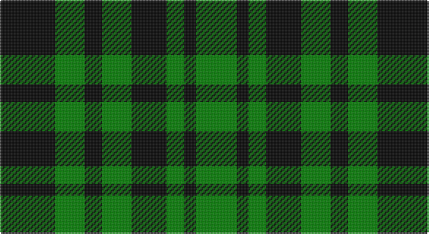

This page is one **sett** — a single exact thread-count. It belongs to the [tartan](/setts/k19g10k6g10k12g6k4g14/)
(the same proportion at any scale), whose colour order is pattern [GKGKGKGK](/stripes/gkgkgkgk/).

Part of the [Menzies](/tartans/menzies/) tartan — the named design grouping this sett with its other cloths.

Sourced from weddslist.  It is a [8 stripe tartan](/stripes/stripes8/).

Original link http://www.weddslist.com/cgi-bin/tartans/pg.pl?source=sts

## Also known as

This cloth is also recorded under:

- Menzies #3
- Menzies 1938
- Menzies B/W
- Menzies Green
- Menzies, Green

## Thread count
K/38 G20 K12 G20 K24 G12 K8 G/28

One full sett is **258 threads**.

## Palette

Palette: <strong>Ingles Buchan</strong> <small style="color:#888">(1 of 2 colours)</small>
<table><thead><tr><th>Colour</th><th>Threads</th><th>Shade</th><th>Base</th><th>OKLCh</th></tr></thead><tbody><tr><td>K/</td><td style="text-align:right;font-variant-numeric:tabular-nums">38</td><td><code style="background-color:#000000;">#000000</code> <small style="color:#888">#000000</small></td><td>K <code style="background-color:#000000;">#000000</code></td><td><small style="color:#888">oklch(0.0% 0.000 0.0)</small></td></tr><tr><td>G</td><td style="text-align:right;font-variant-numeric:tabular-nums">20</td><td><code style="background-color:#008000;">#008000</code> <small style="color:#888">#008000</small></td><td>G <code style="background-color:#006100;">#006100</code></td><td><small style="color:#888">oklch(52.0% 0.177 142.5)</small></td></tr><tr><td>K</td><td style="text-align:right;font-variant-numeric:tabular-nums">12</td><td><code style="background-color:#000000;">#000000</code> <small style="color:#888">#000000</small></td><td>K <code style="background-color:#000000;">#000000</code></td><td><small style="color:#888">oklch(0.0% 0.000 0.0)</small></td></tr><tr><td>G</td><td style="text-align:right;font-variant-numeric:tabular-nums">20</td><td><code style="background-color:#008000;">#008000</code> <small style="color:#888">#008000</small></td><td>G <code style="background-color:#006100;">#006100</code></td><td><small style="color:#888">oklch(52.0% 0.177 142.5)</small></td></tr><tr><td>K</td><td style="text-align:right;font-variant-numeric:tabular-nums">24</td><td><code style="background-color:#000000;">#000000</code> <small style="color:#888">#000000</small></td><td>K <code style="background-color:#000000;">#000000</code></td><td><small style="color:#888">oklch(0.0% 0.000 0.0)</small></td></tr><tr><td>G</td><td style="text-align:right;font-variant-numeric:tabular-nums">12</td><td><code style="background-color:#008000;">#008000</code> <small style="color:#888">#008000</small></td><td>G <code style="background-color:#006100;">#006100</code></td><td><small style="color:#888">oklch(52.0% 0.177 142.5)</small></td></tr><tr><td>K</td><td style="text-align:right;font-variant-numeric:tabular-nums">8</td><td><code style="background-color:#000000;">#000000</code> <small style="color:#888">#000000</small></td><td>K <code style="background-color:#000000;">#000000</code></td><td><small style="color:#888">oklch(0.0% 0.000 0.0)</small></td></tr><tr><td>G/</td><td style="text-align:right;font-variant-numeric:tabular-nums">28</td><td><code style="background-color:#008000;">#008000</code> <small style="color:#888">#008000</small></td><td>G <code style="background-color:#006100;">#006100</code></td><td><small style="color:#888">oklch(52.0% 0.177 142.5)</small></td></tr></tbody></table>

# Sample pattern

## Compared to the master

This cloth is one sett of its design; the master sett (the exemplar the design is anchored on) is below for comparison.

<figure style="margin:0"><figcaption style="color:#888;font-size:smaller">this sett</figcaption></figure>
<figure style="margin:0"><figcaption style="color:#888;font-size:smaller"><a href="/setts/k19dg10k6dg10k12dg6k4dg14/">master sett →</a></figcaption></figure>

## Nearest tartans

The nearest existing variants by ΔTartan distance, with this tartan at the top so the swatches line up against it.

ΔTartan

Tartan

Sett

—

<a href="/ttd/edit/#slug=k19g10k6g10k12g6k4g14~x2">Menzies, Green</a> <a class="nn-out" href="/variants/s8/k19g10k6g10k12g6k4g14~x2/" title="open its dictionary page">↗</a>

1.54

<a href="/ttd/edit/#slug=g8k8ly1k8g8k1~x4&amp;base=k19g10k6g10k12g6k4g14~x2">Wallace Hunting</a> <a class="nn-out" href="/variants/s6/g8k8ly1k8g8k1~x4/" title="open its dictionary page">↗</a>

1.58

<a href="/ttd/edit/#slug=g4k4g4k1g4k4g4k1g4k4g4ly1~x2&amp;base=k19g10k6g10k12g6k4g14~x2">Norwich No.039 (Mackinlay)</a> <a class="nn-out" href="/variants/s12/g4k4g4k1g4k4g4k1g4k4g4ly1~x2/" title="open its dictionary page">↗</a>

1.97

<a href="/ttd/edit/#slug=k3g4k1g4k3db4k1~x2&amp;base=k19g10k6g10k12g6k4g14~x2">Unnamed, No 63</a> <a class="nn-out" href="/variants/s7/k3g4k1g4k3db4k1~x2/" title="open its dictionary page">↗</a>

2.10

<a href="/ttd/edit/#slug=g7k1g7t1k6t1~x4&amp;base=k19g10k6g10k12g6k4g14~x2">Innes, Georgina (Portrait)</a> <a class="nn-out" href="/variants/s6/g7k1g7t1k6t1~x4/" title="open its dictionary page">↗</a>

2.16

<a href="/ttd/edit/#slug=k19g8k10g31r3&amp;base=k19g10k6g10k12g6k4g14~x2">MacArthur-Fox</a> <a class="nn-out" href="/variants/s5/k19g8k10g31r3/" title="open its dictionary page">↗</a>

2.20

<a href="/ttd/edit/#slug=k32g6k12g30ly3&amp;base=k19g10k6g10k12g6k4g14~x2">MacArthur</a> <a class="nn-out" href="/variants/s5/k32g6k12g30ly3/" title="open its dictionary page">↗</a>

2.21

<a href="/ttd/edit/#slug=g7k1g7t1k6t1~x2&amp;base=k19g10k6g10k12g6k4g14~x2">Innes</a> <a class="nn-out" href="/variants/s6/g7k1g7t1k6t1~x2/" title="open its dictionary page">↗</a>

2.23

<a href="/ttd/edit/#slug=k1db5k4g3k1g3k6g1~x4&amp;base=k19g10k6g10k12g6k4g14~x2">Keith McCormick (Personal)</a> <a class="nn-out" href="/variants/s8/k1db5k4g3k1g3k6g1~x4/" title="open its dictionary page">↗</a>

2.26

<a href="/ttd/edit/#slug=db4k3g4k1g4k3g4k1g4k3db4k1~x2&amp;base=k19g10k6g10k12g6k4g14~x2">Norwich No.063</a> <a class="nn-out" href="/variants/s12/db4k3g4k1g4k3g4k1g4k3db4k1~x2/" title="open its dictionary page">↗</a>

2.27

<a href="/ttd/edit/#slug=k9g3k3g12ly2~x4&amp;base=k19g10k6g10k12g6k4g14~x2">MacArthur</a> <a class="nn-out" href="/variants/s5/k9g3k3g12ly2~x4/" title="open its dictionary page">↗</a>

## Neighbour map

Every grey dot is one of 14360 variants placed by the first two principal components of the ΔTartan feature space (44% of its variance). Red is this tartan; blue dots are its nearest — click one to open its page.

<svg viewBox="0 0 640 380" role="img" style="max-width:100%;height:auto;border:1px solid #e0e0e0;border-radius:4px;display:block" xmlns="http://www.w3.org/2000/svg"><image href="/nn/cloud.v1.png" width="640" height="380"/><a href="/variants/s6/g8k8ly1k8g8k1~x4/"><circle cx="265.1" cy="269.4" r="4" fill="#3465a4"><title>Wallace Hunting</title></circle></a><a href="/variants/s12/g4k4g4k1g4k4g4k1g4k4g4ly1~x2/"><circle cx="252.1" cy="288.7" r="4" fill="#3465a4"><title>Norwich No.039 (Mackinlay)</title></circle></a><a href="/variants/s7/k3g4k1g4k3db4k1~x2/"><circle cx="140.2" cy="298.7" r="4" fill="#3465a4"><title>Unnamed, No 63</title></circle></a><a href="/variants/s6/g7k1g7t1k6t1~x4/"><circle cx="310.5" cy="256.8" r="4" fill="#3465a4"><title>Innes, Georgina (Portrait)</title></circle></a><a href="/variants/s5/k19g8k10g31r3/"><circle cx="294.1" cy="249.5" r="4" fill="#3465a4"><title>MacArthur-Fox</title></circle></a><a href="/variants/s5/k32g6k12g30ly3/"><circle cx="292.2" cy="246.1" r="4" fill="#3465a4"><title>MacArthur</title></circle></a><a href="/variants/s6/g7k1g7t1k6t1~x2/"><circle cx="297.9" cy="251.0" r="4" fill="#3465a4"><title>Innes</title></circle></a><a href="/variants/s8/k1db5k4g3k1g3k6g1~x4/"><circle cx="226.2" cy="265.3" r="4" fill="#3465a4"><title>Keith McCormick (Personal)</title></circle></a><a href="/variants/s12/db4k3g4k1g4k3g4k1g4k3db4k1~x2/"><circle cx="152.7" cy="286.4" r="4" fill="#3465a4"><title>Norwich No.063</title></circle></a><a href="/variants/s5/k9g3k3g12ly2~x4/"><circle cx="282.1" cy="279.6" r="4" fill="#3465a4"><title>MacArthur</title></circle></a><circle cx="245.6" cy="305.0" r="5" fill="#c00000"/></svg>

ID: /variants/s8/k19g10k6g10k12g6k4g14~x2/
