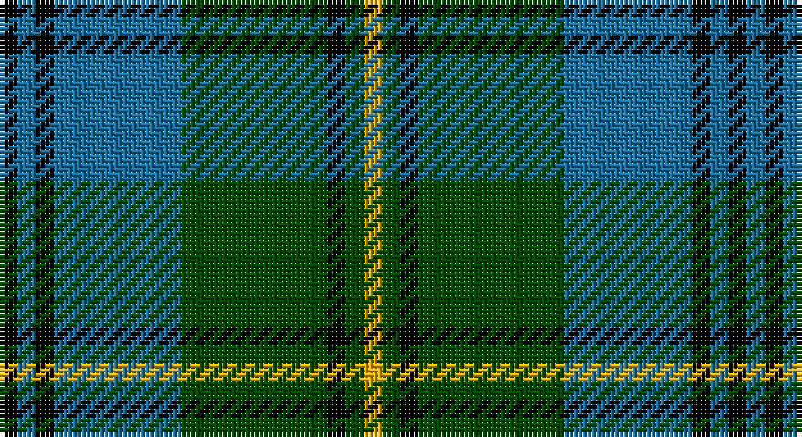

This page is one **sett** — a single exact thread-count. It belongs to the [tartan](/setts/k1b1k1b7dg8k1dg1ly1/)
(the same proportion at any scale), whose colour order is pattern [KBKBGKGY](/stripes/kbkbgkgy/).

Part of the [Banff Centennial](/tartans/banff-centennial/) tartan — the named design grouping this sett with its other cloths.

Sourced from tartans-authority.  It is a [8 stripe tartan](/stripes/stripes8/).

Original link http://www.tartansauthority.com/tartan-ferret/display/3648/

## Register references

External register numbers recorded for this tartan.

- Scottish Tartans Authority (ITI): 3648

## Thread count
K/4 B4 K4 B28 G32 K4 G4 Y/4

One full sett is **160 threads**.

## Palette

Palette: <strong>Tartan Register</strong> <small style="color:#888">(3 of 4 colours)</small>
<table><thead><tr><th>Colour</th><th>Threads</th><th>Shade</th><th>Base</th><th>OKLCh</th></tr></thead><tbody><tr><td>K/</td><td style="text-align:right;font-variant-numeric:tabular-nums">4</td><td><code style="background-color:#000000;">#000000</code> <small style="color:#888">#000000</small></td><td>K <code style="background-color:#000000;">#000000</code></td><td><small style="color:#888">oklch(0.0% 0.000 0.0)</small></td></tr><tr><td>B</td><td style="text-align:right;font-variant-numeric:tabular-nums">4</td><td><code style="background-color:#1870A4;">#1870A4</code> <small style="color:#888">#1870A4</small></td><td>B <code style="background-color:#2A418A;">#2A418A</code></td><td><small style="color:#888">oklch(52.2% 0.113 241.2)</small></td></tr><tr><td>K</td><td style="text-align:right;font-variant-numeric:tabular-nums">4</td><td><code style="background-color:#000000;">#000000</code> <small style="color:#888">#000000</small></td><td>K <code style="background-color:#000000;">#000000</code></td><td><small style="color:#888">oklch(0.0% 0.000 0.0)</small></td></tr><tr><td>B</td><td style="text-align:right;font-variant-numeric:tabular-nums">28</td><td><code style="background-color:#1870A4;">#1870A4</code> <small style="color:#888">#1870A4</small></td><td>B <code style="background-color:#2A418A;">#2A418A</code></td><td><small style="color:#888">oklch(52.2% 0.113 241.2)</small></td></tr><tr><td>G</td><td style="text-align:right;font-variant-numeric:tabular-nums">32</td><td><code style="background-color:#004C00;">#004C00</code> <small style="color:#888">#004C00</small></td><td>G <code style="background-color:#006100;">#006100</code></td><td><small style="color:#888">oklch(36.1% 0.123 142.5)</small></td></tr><tr><td>K</td><td style="text-align:right;font-variant-numeric:tabular-nums">4</td><td><code style="background-color:#000000;">#000000</code> <small style="color:#888">#000000</small></td><td>K <code style="background-color:#000000;">#000000</code></td><td><small style="color:#888">oklch(0.0% 0.000 0.0)</small></td></tr><tr><td>G</td><td style="text-align:right;font-variant-numeric:tabular-nums">4</td><td><code style="background-color:#004C00;">#004C00</code> <small style="color:#888">#004C00</small></td><td>G <code style="background-color:#006100;">#006100</code></td><td><small style="color:#888">oklch(36.1% 0.123 142.5)</small></td></tr><tr><td>Y/</td><td style="text-align:right;font-variant-numeric:tabular-nums">4</td><td><code style="background-color:#FCB000;">#FCB000</code> <small style="color:#888">#FCB000</small></td><td>Y <code style="background-color:#F2BF00;">#F2BF00</code></td><td><small style="color:#888">oklch(80.9% 0.169 77.5)</small></td></tr></tbody></table>

# Sample pattern

## Compared to the master

This cloth is one sett of its design; the master sett (the exemplar the design is anchored on) is below for comparison.

<figure style="margin:0"><figcaption style="color:#888;font-size:smaller">this sett</figcaption></figure>
<figure style="margin:0"><figcaption style="color:#888;font-size:smaller"><a href="/setts/k1b1k1b12dg12k1dg1ly1/">master sett →</a></figcaption></figure>

## Nearest tartans

The nearest existing variants by ΔTartan distance, with this tartan at the top so the swatches line up against it.

ΔTartan

Tartan

Sett

—

<a href="/ttd/edit/#slug=k1b1k1b7dg8k1dg1ly1~x4">Banff Centennial (Commemorative)</a> <a class="nn-out" href="/variants/s8/k1b1k1b7dg8k1dg1ly1~x4/" title="open its dictionary page">↗</a>

0.84

<a href="/ttd/edit/#slug=db22g4k4g14lb3g4lb3g4k3~x2&amp;base=k1b1k1b7dg8k1dg1ly1~x4">Graden (Personal)</a> <a class="nn-out" href="/variants/s9/db22g4k4g14lb3g4lb3g4k3~x2/" title="open its dictionary page">↗</a>

0.91

<a href="/ttd/edit/#slug=k7r3k27g27ly3g3ly3g3~x2&amp;base=k1b1k1b7dg8k1dg1ly1~x4">Brunton (Personal)</a> <a class="nn-out" href="/variants/s8/k7r3k27g27ly3g3ly3g3~x2/" title="open its dictionary page">↗</a>

0.95

<a href="/ttd/edit/#slug=k1b1k1b12dg12k1dg1ly1~x4&amp;base=k1b1k1b7dg8k1dg1ly1~x4">Banff Centennial</a> <a class="nn-out" href="/variants/s8/k1b1k1b12dg12k1dg1ly1~x4/" title="open its dictionary page">↗</a>

1.06

<a href="/ttd/edit/#slug=k3b4g20k20g3lo3~x4&amp;base=k1b1k1b7dg8k1dg1ly1~x4">Michaluk (Personal)</a> <a class="nn-out" href="/variants/s6/k3b4g20k20g3lo3~x4/" title="open its dictionary page">↗</a>

1.10

<a href="/ttd/edit/#slug=g2k1db9k7g1k1g1k1g9r1g1~x4&amp;base=k1b1k1b7dg8k1dg1ly1~x4">Louise</a> <a class="nn-out" href="/variants/s11/g2k1db9k7g1k1g1k1g9r1g1~x4/" title="open its dictionary page">↗</a>

1.12

<a href="/ttd/edit/#slug=db3g28db3k16db28r3&amp;base=k1b1k1b7dg8k1dg1ly1~x4">Flower of Scotland</a> <a class="nn-out" href="/variants/s6/db3g28db3k16db28r3/" title="open its dictionary page">↗</a>

1.13

<a href="/ttd/edit/#slug=db21g5k5g15w3g5w3g5k3~x2&amp;base=k1b1k1b7dg8k1dg1ly1~x4">Tweedside, hunting</a> <a class="nn-out" href="/variants/s9/db21g5k5g15w3g5w3g5k3~x2/" title="open its dictionary page">↗</a>

1.16

<a href="/ttd/edit/#slug=db10k1db1k1db2k8g10w1~x2&amp;base=k1b1k1b7dg8k1dg1ly1~x4">Lamont</a> <a class="nn-out" href="/variants/s8/db10k1db1k1db2k8g10w1~x2/" title="open its dictionary page">↗</a>

1.18

<a href="/ttd/edit/#slug=db10ly4db36g28w3g3w3g8ly6&amp;base=k1b1k1b7dg8k1dg1ly1~x4">MacOrrell</a> <a class="nn-out" href="/variants/s9/db10ly4db36g28w3g3w3g8ly6/" title="open its dictionary page">↗</a>

1.19

<a href="/ttd/edit/#slug=r2g12db2g8db18w3r2w2~x2&amp;base=k1b1k1b7dg8k1dg1ly1~x4">Albuquerque, City of</a> <a class="nn-out" href="/variants/s8/r2g12db2g8db18w3r2w2~x2/" title="open its dictionary page">↗</a>

## Neighbour map

Every grey dot is one of 14360 variants placed by the first two principal components of the ΔTartan feature space (44% of its variance). Red is this tartan; blue dots are its nearest — click one to open its page.

<svg viewBox="0 0 640 380" role="img" style="max-width:100%;height:auto;border:1px solid #e0e0e0;border-radius:4px;display:block" xmlns="http://www.w3.org/2000/svg"><image href="/nn/cloud.v1.png" width="640" height="380"/><a href="/variants/s9/db22g4k4g14lb3g4lb3g4k3~x2/"><circle cx="217.0" cy="209.9" r="4" fill="#3465a4"><title>Graden (Personal)</title></circle></a><a href="/variants/s8/k7r3k27g27ly3g3ly3g3~x2/"><circle cx="251.8" cy="189.6" r="4" fill="#3465a4"><title>Brunton (Personal)</title></circle></a><a href="/variants/s8/k1b1k1b12dg12k1dg1ly1~x4/"><circle cx="275.8" cy="177.4" r="4" fill="#3465a4"><title>Banff Centennial</title></circle></a><a href="/variants/s6/k3b4g20k20g3lo3~x4/"><circle cx="233.7" cy="228.3" r="4" fill="#3465a4"><title>Michaluk (Personal)</title></circle></a><a href="/variants/s11/g2k1db9k7g1k1g1k1g9r1g1~x4/"><circle cx="194.7" cy="173.8" r="4" fill="#3465a4"><title>Louise</title></circle></a><a href="/variants/s6/db3g28db3k16db28r3/"><circle cx="206.9" cy="217.2" r="4" fill="#3465a4"><title>Flower of Scotland</title></circle></a><a href="/variants/s9/db21g5k5g15w3g5w3g5k3~x2/"><circle cx="188.6" cy="203.1" r="4" fill="#3465a4"><title>Tweedside, hunting</title></circle></a><a href="/variants/s8/db10k1db1k1db2k8g10w1~x2/"><circle cx="184.5" cy="190.6" r="4" fill="#3465a4"><title>Lamont</title></circle></a><a href="/variants/s9/db10ly4db36g28w3g3w3g8ly6/"><circle cx="242.5" cy="171.3" r="4" fill="#3465a4"><title>MacOrrell</title></circle></a><a href="/variants/s8/r2g12db2g8db18w3r2w2~x2/"><circle cx="206.4" cy="191.4" r="4" fill="#3465a4"><title>Albuquerque, City of</title></circle></a><circle cx="224.6" cy="196.6" r="5" fill="#c00000"/></svg>

ID: /variants/s8/k1b1k1b7dg8k1dg1ly1~x4/
