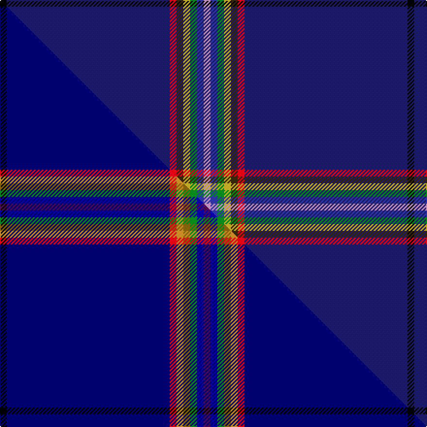

This page is one **sett** — a single exact thread-count. It belongs to the [tartan](/setts/k1db24r1dy1ly1g1dbi1lp1/)
(the same proportion at any scale), whose colour order is pattern [KBRGYGBW](/stripes/kbrgygbw/).

Part of the [Way of the Rainbow](/tartans/way-of-the-rainbow/) tartan — the named design grouping this sett with its other cloths.

Sourced from tartans-authority.  It is a [8 stripe tartan](/stripes/stripes8/).

Original link https://www.tartanregister.gov.uk/tartanDetails.aspx?ref=11048

Dataset <small>— provenance for this record, inherited from the source manifest</small>

<dl class="dataset-prov">
<dt>source</dt><dd><a href="/sources/tartans-authority/">Scottish Tartans Authority</a></dd>
<dt>data captured from</dt><dd><a href="https://github.com/thetartan/tartan-database/blob/master/data/tartans-authority/data.csv">https://github.com/thetartan/tartan-database/blob/master/data/tartans-authority/data.csv</a></dd>
<dt>data date</dt><dd>2014 <small>(this record)</small></dd>
<dt>licence</dt><dd><a href="https://creativecommons.org/licenses/by-nc-nd/4.0/">CC BY-NC-ND 4.0</a></dd>
</dl>

Capture chain <small>— the hands this data passed through, oldest first; each capture carries its own licence</small>

<ol class="capture-chain">
<li><a href="https://www.tartansauthority.com/">Scottish Tartans Authority</a> <small>the heritage body's archive — its tartan-ferret record browser is retired (links repaired to the SRT, above)</small></li>
<li><a href="https://github.com/thetartan/tartan-database">thetartan/tartan-database</a> <small>2016-2017</small> · <a href="https://creativecommons.org/licenses/by-nc-nd/4.0/">CC BY-NC-ND 4.0</a> <small>Levko Kravets's frozen compilation — the capture we vendored, and where its CC licence text came from</small></li>
<li>this dictionary <small>captured 2026-06-10 · commit 5bf86c7566</small> <small>each re-capture is a git commit to data/sources</small></li>
</ol>

## Register references

External register numbers recorded for this tartan.

- Scottish Register of Tartans: [11048](https://www.tartanregister.gov.uk/tartanDetails?ref=11048)
- Scottish Tartans Authority (ITI): 11048

## Thread count
K/7 DB168 R7 DY7 LY7 G7 DBi7 LP/7

One full sett is **420 threads**.

## Palette
<table><thead><tr><th>Colour</th><th>Shade</th><th>OKLCh</th></tr></thead><tbody><tr><td>DB</td><td><code style="background-color:#38409C;">#38409C</code> <small style="color:#888">#38409C</small></td><td><small style="color:#888">oklch(42.1% 0.148 274.4)</small></td></tr><tr><td>DB</td><td><code style="background-color:#202060;">#202060</code> <small style="color:#888">#202060</small></td><td><small style="color:#888">oklch(28.9% 0.111 276.9)</small></td></tr><tr><td>G</td><td><code style="background-color:#008B2A;">#008B2A</code> <small style="color:#888">#008B2A</small></td><td><small style="color:#888">oklch(55.4% 0.170 145.9)</small></td></tr><tr><td>K</td><td><code style="background-color:#000000;">#000000</code> <small style="color:#888">#000000</small></td><td><small style="color:#888">oklch(0.0% 0.000 0.0)</small></td></tr><tr><td>LP</td><td><code style="background-color:#E4A6DB;">#E4A6DB</code> <small style="color:#888">#E4A6DB</small></td><td><small style="color:#888">oklch(80.0% 0.100 331.6)</small></td></tr><tr><td>R</td><td><code style="background-color:#D60020;">#D60020</code> <small style="color:#888">#D60020</small></td><td><small style="color:#888">oklch(55.2% 0.224 25.5)</small></td></tr><tr><td>LY</td><td><code style="background-color:#DCBC32;">#DCBC32</code> <small style="color:#888">#DCBC32</small></td><td><small style="color:#888">oklch(80.0% 0.150 95.2)</small></td></tr><tr><td>DY</td><td><code style="background-color:#3A2B0D;">#3A2B0D</code> <small style="color:#888">#3A2B0D</small></td><td><small style="color:#888">oklch(30.0% 0.049 82.0)</small></td></tr></tbody></table>

# Sample pattern

## Compared to the master

This cloth is one sett of its design; the master sett (the exemplar the design is anchored on) is below for comparison.

Its **ΔTartan distance** from the master is **0.66** — the same measure the nearest-tartans table ranks by (0 is identical; a re-scale of the same cloth is near 0, a recolour or a different proportion further).

<figure class="master-compare" style="margin:0">

this sett
master sett ★

<figcaption style="color:#888;font-size:smaller">One weave of this sett against the <a href="/setts/k1db24r1lo1y1g1dbi1dp1/">master sett ★</a>, split on the diagonal: a shared proportion runs seamlessly across it with only the shades shifting; a different proportion breaks on it.</figcaption>
</figure>

## Nearest tartan variants

The nearest existing variants by ΔTartan distance, with this cloth at the top so the swatches line up against it.

ΔTartan

Threads

Variant

Sett

—

420

<a href="/variants/s8/k1db24r1dy1ly1g1dbi1lp1~x7~db1204274-dbi1706275/">Way of the Rainbow</a>

<a href="/ttd/edit/#slug=k1db24r1lo1y1g1dbi1dp1~x7~db0906265-dbi1208266&amp;base=k1db24r1dy1ly1g1dbi1lp1~x7~db1204274-dbi1706275" title="compare in the TTD">0.66</a>

420

<a href="/variants/s8/k1db24r1lo1y1g1dbi1dp1~x7~db0906265-dbi1208266/">Way of the Rainbow</a>

<a href="/ttd/edit/#slug=w2dp2db25r3y3g1~x4&amp;base=k1db24r1dy1ly1g1dbi1lp1~x7~db1204274-dbi1706275" title="compare in the TTD">1.13</a>

276

<a href="/variants/s6/w2dp2db25r3y3g1~x4/">Pool, Robert David (Personal)</a>

<a href="/ttd/edit/#slug=g5w1r5k5db43r1~x2&amp;base=k1db24r1dy1ly1g1dbi1lp1~x7~db1204274-dbi1706275" title="compare in the TTD">1.69</a>

228

<a href="/variants/s6/g5w1r5k5db43r1~x2/">Michael (John) (Personal)</a>

<a href="/ttd/edit/#slug=dt60w11r5db5k1y4~x2&amp;base=k1db24r1dy1ly1g1dbi1lp1~x7~db1204274-dbi1706275" title="compare in the TTD">1.79</a>

216

<a href="/variants/s6/dt60w11r5db5k1y4~x2/">Christie (London) Hunting</a>

<a href="/ttd/edit/#slug=r5db58lb4n6y4k4~x2~db1406275-n2203265&amp;base=k1db24r1dy1ly1g1dbi1lp1~x7~db1204274-dbi1706275" title="compare in the TTD">1.92</a>

306

<a href="/variants/s6/r5db58lb4n6y4k4~x2~db1406275-n2203265/">Kendle (2013)</a>

<a href="/ttd/edit/#slug=r5db58lb4t6y4k4~x2~lb3103284-t2503227&amp;base=k1db24r1dy1ly1g1dbi1lp1~x7~db1204274-dbi1706275" title="compare in the TTD">1.92</a>

306

<a href="/variants/s6/r5db58lb4t6y4k4~x2~lb3103284-t2503227/">Kendle (2013)</a>

<a href="/ttd/edit/#slug=db60w1y4k4w1lp8w2~x2&amp;base=k1db24r1dy1ly1g1dbi1lp1~x7~db1204274-dbi1706275" title="compare in the TTD">2.06</a>

196

<a href="/variants/s7/db60w1y4k4w1lp8w2~x2/">Nunavut Territory (District)</a>

<a href="/ttd/edit/#slug=t6k3n10db2k2dt45lr2~x2~t2503227-db1004274-dt1102249-lr2800000&amp;base=k1db24r1dy1ly1g1dbi1lp1~x7~db1204274-dbi1706275" title="compare in the TTD">2.13</a>

264

<a href="/variants/s7/t6k3n10db2k2dt45lr2~x2~t2503227-db1004274-dt1102249-lr2800000/">Vonarb, Alfred (Personal)</a>

<a href="/ttd/edit/#slug=k45db2dr2r2y1w1~x2&amp;base=k1db24r1dy1ly1g1dbi1lp1~x7~db1204274-dbi1706275" title="compare in the TTD">2.13</a>

120

<a href="/variants/s6/k45db2dr2r2y1w1~x2/">MacHattie Family Tartan</a>

<a href="/ttd/edit/#slug=w2db45g9r1n9dr1~x2&amp;base=k1db24r1dy1ly1g1dbi1lp1~x7~db1204274-dbi1706275" title="compare in the TTD">2.57</a>

262

<a href="/variants/s6/w2db45g9r1n9dr1~x2/">Wilton (Name)</a>

## Neighbour map

Every grey dot is one of 13620 variants placed by the first two principal components of the ΔTartan feature space (42% of its variance). Red is this tartan; blue dots are its nearest — click one to open its page.

<svg viewBox="0 0 640 380" role="img" style="max-width:100%;height:auto;border:1px solid #e0e0e0;border-radius:4px;display:block" xmlns="http://www.w3.org/2000/svg"><image href="/nn/cloud.v1.png" width="640" height="380"/><a href="/variants/s8/k1db24r1lo1y1g1dbi1dp1~x7~db0906265-dbi1208266/"><circle cx="446.7" cy="46.2" r="4" fill="#3465a4"><title>Way of the Rainbow</title></circle></a><a href="/variants/s6/w2dp2db25r3y3g1~x4/"><circle cx="403.7" cy="109.5" r="4" fill="#3465a4"><title>Pool, Robert David (Personal)</title></circle></a><a href="/variants/s6/g5w1r5k5db43r1~x2/"><circle cx="437.8" cy="85.7" r="4" fill="#3465a4"><title>Michael (John) (Personal)</title></circle></a><a href="/variants/s6/dt60w11r5db5k1y4~x2/"><circle cx="388.0" cy="66.7" r="4" fill="#3465a4"><title>Christie (London) Hunting</title></circle></a><a href="/variants/s6/r5db58lb4n6y4k4~x2~db1406275-n2203265/"><circle cx="411.7" cy="119.1" r="4" fill="#3465a4"><title>Kendle (2013)</title></circle></a><a href="/variants/s6/r5db58lb4t6y4k4~x2~lb3103284-t2503227/"><circle cx="395.1" cy="115.9" r="4" fill="#3465a4"><title>Kendle (2013)</title></circle></a><a href="/variants/s7/db60w1y4k4w1lp8w2~x2/"><circle cx="456.9" cy="59.5" r="4" fill="#3465a4"><title>Nunavut Territory (District)</title></circle></a><a href="/variants/s7/t6k3n10db2k2dt45lr2~x2~t2503227-db1004274-dt1102249-lr2800000/"><circle cx="396.4" cy="114.8" r="4" fill="#3465a4"><title>Vonarb, Alfred (Personal)</title></circle></a><a href="/variants/s6/k45db2dr2r2y1w1~x2/"><circle cx="447.3" cy="19.6" r="4" fill="#3465a4"><title>MacHattie Family Tartan</title></circle></a><a href="/variants/s6/w2db45g9r1n9dr1~x2/"><circle cx="430.1" cy="101.4" r="4" fill="#3465a4"><title>Wilton (Name)</title></circle></a><circle cx="450.4" cy="45.2" r="5" fill="#c00000"/><text x="320" y="376" text-anchor="middle" font-size="11" fill="#999">ground</text><text x="11" y="190" text-anchor="middle" font-size="11" fill="#999" transform="rotate(-90 11 190)">complexity</text></svg>

ID: /variants/s8/k1db24r1dy1ly1g1dbi1lp1~x7~db1204274-dbi1706275/
