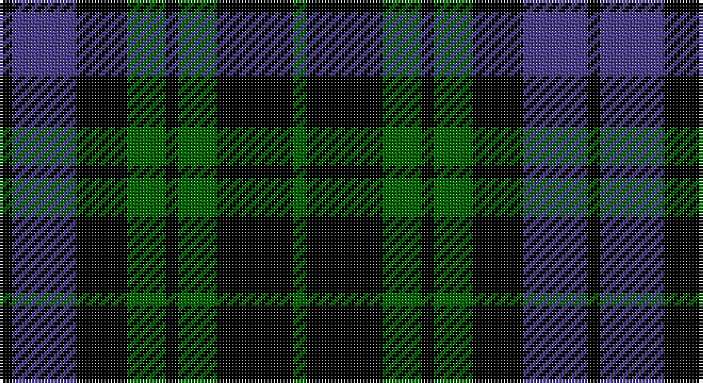

This page is one **sett** — a single exact thread-count. It belongs to the [tartan](/setts/k1db5k4g3k1g3k6g1/)
(the same proportion at any scale), whose colour order is pattern [GKGKGKBK](/stripes/gkgkgkbk/).

Sourced from register-of-tartans.  It is a [8 stripe tartan](/stripes/stripes8/).

Original link https://www.tartanregister.gov.uk/tartanDetails.aspx?ref=10011

## Provenance

Earliest known date: Apr. 2009 A personal tartan for Keith McCormick and his family. Blue represents the Nashwaak River, a well known salmon river in New Brunswick; green is for the forest through which the river flows and since the designer is a retired barrister, his gown is represented by the black. This tartan is for the use of Keith McCormick, his immediate family and those with his permission during his lifetime. After Keith McCormick's death, this tartan can be worn by any of the name McCormick or its variants. This tartan should only be woven by permission of Keith McCormick during his lifetime. After Keith McCormick's death, it may be woven by anyone.

## Also known as

This cloth is also recorded under:

- McCormick, Keith
- McCormick, Keith Canadian Personal

3 attestations — the source records this cloth was collapsed from (oldest owns this page)

<ul>
<li>10/02/2009 — Keith McCormick (Personal) (register-of-tartans, <a href="https://www.tartanregister.gov.uk/tartanDetails.aspx?ref=10011">record</a>)</li>
<li>Apr. 2009 — McCormick, Keith (Personal) (tartans-authority, <a href="http://www.tartansauthority.com/tartan-ferret/display/10011/">record</a>)</li>
<li>undated — McCormick, Keith (Personal) Canadian Personal Tartan (house-of-tartan, <a href="http://www.house-of-tartan.scotland.net/house/TartanViewjs.asp?colr=Def&tnam=10011">record</a>)</li>
</ul>

## Register references

External register numbers recorded for this tartan.

- Scottish Register of Tartans: [10011](https://www.tartanregister.gov.uk/tartanDetails?ref=10011)
- Scottish Tartans Authority (ITI): 10011

## Thread count
K/4 B20 K16 G12 K4 G12 K24 G/4

One full sett is **184 threads**.

## Palette

Palette: <strong>Tartan Register</strong> <small style="color:#888">(2 of 3 colours)</small>
<table><thead><tr><th>Colour</th><th>Threads</th><th>Shade</th><th>Base</th><th>OKLCh</th></tr></thead><tbody><tr><td>K/</td><td style="text-align:right;font-variant-numeric:tabular-nums">4</td><td><code style="background-color:#000000;">#000000</code> <small style="color:#888">#000000</small></td><td>K <code style="background-color:#000000;">#000000</code></td><td><small style="color:#888">oklch(0.0% 0.000 0.0)</small></td></tr><tr><td>B</td><td style="text-align:right;font-variant-numeric:tabular-nums">20</td><td><code style="background-color:#483D8B;">#483D8B</code> <small style="color:#888">#483D8B</small></td><td>B <code style="background-color:#2A418A;">#2A418A</code></td><td><small style="color:#888">oklch(41.4% 0.125 286.0)</small></td></tr><tr><td>K</td><td style="text-align:right;font-variant-numeric:tabular-nums">16</td><td><code style="background-color:#000000;">#000000</code> <small style="color:#888">#000000</small></td><td>K <code style="background-color:#000000;">#000000</code></td><td><small style="color:#888">oklch(0.0% 0.000 0.0)</small></td></tr><tr><td>G</td><td style="text-align:right;font-variant-numeric:tabular-nums">12</td><td><code style="background-color:#006400;">#006400</code> <small style="color:#888">#006400</small></td><td>G <code style="background-color:#006100;">#006100</code></td><td><small style="color:#888">oklch(43.6% 0.148 142.5)</small></td></tr><tr><td>K</td><td style="text-align:right;font-variant-numeric:tabular-nums">4</td><td><code style="background-color:#000000;">#000000</code> <small style="color:#888">#000000</small></td><td>K <code style="background-color:#000000;">#000000</code></td><td><small style="color:#888">oklch(0.0% 0.000 0.0)</small></td></tr><tr><td>G</td><td style="text-align:right;font-variant-numeric:tabular-nums">12</td><td><code style="background-color:#006400;">#006400</code> <small style="color:#888">#006400</small></td><td>G <code style="background-color:#006100;">#006100</code></td><td><small style="color:#888">oklch(43.6% 0.148 142.5)</small></td></tr><tr><td>K</td><td style="text-align:right;font-variant-numeric:tabular-nums">24</td><td><code style="background-color:#000000;">#000000</code> <small style="color:#888">#000000</small></td><td>K <code style="background-color:#000000;">#000000</code></td><td><small style="color:#888">oklch(0.0% 0.000 0.0)</small></td></tr><tr><td>G/</td><td style="text-align:right;font-variant-numeric:tabular-nums">4</td><td><code style="background-color:#006400;">#006400</code> <small style="color:#888">#006400</small></td><td>G <code style="background-color:#006100;">#006100</code></td><td><small style="color:#888">oklch(43.6% 0.148 142.5)</small></td></tr></tbody></table>

# Sample pattern

## Nearest tartans

The nearest existing variants by ΔTartan distance, with this tartan at the top so the swatches line up against it.

ΔTartan

Tartan

Sett

—

<a href="/ttd/edit/#slug=k1db5k4g3k1g3k6g1~x4">Keith McCormick (Personal)</a> <a class="nn-out" href="/variants/s8/k1db5k4g3k1g3k6g1~x4/" title="open its dictionary page">↗</a>

1.08

<a href="/ttd/edit/#slug=k1g5k5db5k1db1k1~x4&amp;base=k1db5k4g3k1g3k6g1~x4">Strathspey</a> <a class="nn-out" href="/variants/s7/k1g5k5db5k1db1k1~x4/" title="open its dictionary page">↗</a>

1.11

<a href="/ttd/edit/#slug=db1k6db6k6g6k1w1~x2&amp;base=k1db5k4g3k1g3k6g1~x4">Forbes Ancient</a> <a class="nn-out" href="/variants/s7/db1k6db6k6g6k1w1~x2/" title="open its dictionary page">↗</a>

1.20

<a href="/ttd/edit/#slug=db1k6db6k6dg6k1lb1&amp;base=k1db5k4g3k1g3k6g1~x4">Forbes LC</a> <a class="nn-out" href="/variants/s7/db1k6db6k6dg6k1lb1/" title="open its dictionary page">↗</a>

1.33

<a href="/ttd/edit/#slug=dg8k2lb1dg4k6db6k1~x2&amp;base=k1db5k4g3k1g3k6g1~x4">MacCallum</a> <a class="nn-out" href="/variants/s7/dg8k2lb1dg4k6db6k1~x2/" title="open its dictionary page">↗</a>

1.39

<a href="/ttd/edit/#slug=t3k16g16k16db3t3~x2&amp;base=k1db5k4g3k1g3k6g1~x4">Murray</a> <a class="nn-out" href="/variants/s6/t3k16g16k16db3t3~x2/" title="open its dictionary page">↗</a>

1.39

<a href="/ttd/edit/#slug=db1k6db6k6dg6k1lr1~x2&amp;base=k1db5k4g3k1g3k6g1~x4">Forbes LC</a> <a class="nn-out" href="/variants/s7/db1k6db6k6dg6k1lr1~x2/" title="open its dictionary page">↗</a>

1.39

<a href="/ttd/edit/#slug=db1k6db6k6dg6k1lr1&amp;base=k1db5k4g3k1g3k6g1~x4">Forbes LC</a> <a class="nn-out" href="/variants/s7/db1k6db6k6dg6k1lr1/" title="open its dictionary page">↗</a>

1.40

<a href="/ttd/edit/#slug=k7g7k1g7k7t1p7k1~x4&amp;base=k1db5k4g3k1g3k6g1~x4">Wilson's, No 108</a> <a class="nn-out" href="/variants/s8/k7g7k1g7k7t1p7k1~x4/" title="open its dictionary page">↗</a>

1.40

<a href="/ttd/edit/#slug=db6k6db18k18g22k5&amp;base=k1db5k4g3k1g3k6g1~x4">Campbell, the 42nd</a> <a class="nn-out" href="/variants/s6/db6k6db18k18g22k5/" title="open its dictionary page">↗</a>

1.40

<a href="/ttd/edit/#slug=k8dg8k1dg8lr1k8o8k1o8k8~x4&amp;base=k1db5k4g3k1g3k6g1~x4">Sackett (Name)</a> <a class="nn-out" href="/variants/s10/k8dg8k1dg8lr1k8o8k1o8k8~x4/" title="open its dictionary page">↗</a>

## Neighbour map

Every grey dot is one of 14360 variants placed by the first two principal components of the ΔTartan feature space (44% of its variance). Red is this tartan; blue dots are its nearest — click one to open its page.

<svg viewBox="0 0 640 380" role="img" style="max-width:100%;height:auto;border:1px solid #e0e0e0;border-radius:4px;display:block" xmlns="http://www.w3.org/2000/svg"><image href="/nn/cloud.v1.png" width="640" height="380"/><a href="/variants/s7/k1g5k5db5k1db1k1~x4/"><circle cx="188.9" cy="258.9" r="4" fill="#3465a4"><title>Strathspey</title></circle></a><a href="/variants/s7/db1k6db6k6g6k1w1~x2/"><circle cx="184.2" cy="242.3" r="4" fill="#3465a4"><title>Forbes Ancient</title></circle></a><a href="/variants/s7/db1k6db6k6dg6k1lb1/"><circle cx="212.7" cy="260.3" r="4" fill="#3465a4"><title>Forbes LC</title></circle></a><a href="/variants/s7/dg8k2lb1dg4k6db6k1~x2/"><circle cx="194.4" cy="246.3" r="4" fill="#3465a4"><title>MacCallum</title></circle></a><a href="/variants/s6/t3k16g16k16db3t3~x2/"><circle cx="234.1" cy="252.3" r="4" fill="#3465a4"><title>Murray</title></circle></a><a href="/variants/s7/db1k6db6k6dg6k1lr1~x2/"><circle cx="223.1" cy="265.2" r="4" fill="#3465a4"><title>Forbes LC</title></circle></a><a href="/variants/s7/db1k6db6k6dg6k1lr1/"><circle cx="223.1" cy="265.2" r="4" fill="#3465a4"><title>Forbes LC</title></circle></a><a href="/variants/s8/k7g7k1g7k7t1p7k1~x4/"><circle cx="163.6" cy="229.8" r="4" fill="#3465a4"><title>Wilson's, No 108</title></circle></a><a href="/variants/s6/db6k6db18k18g22k5/"><circle cx="154.6" cy="287.0" r="4" fill="#3465a4"><title>Campbell, the 42nd</title></circle></a><a href="/variants/s10/k8dg8k1dg8lr1k8o8k1o8k8~x4/"><circle cx="172.5" cy="228.7" r="4" fill="#3465a4"><title>Sackett (Name)</title></circle></a><circle cx="226.2" cy="265.3" r="5" fill="#c00000"/></svg>

ID: /variants/s8/k1db5k4g3k1g3k6g1~x4/
