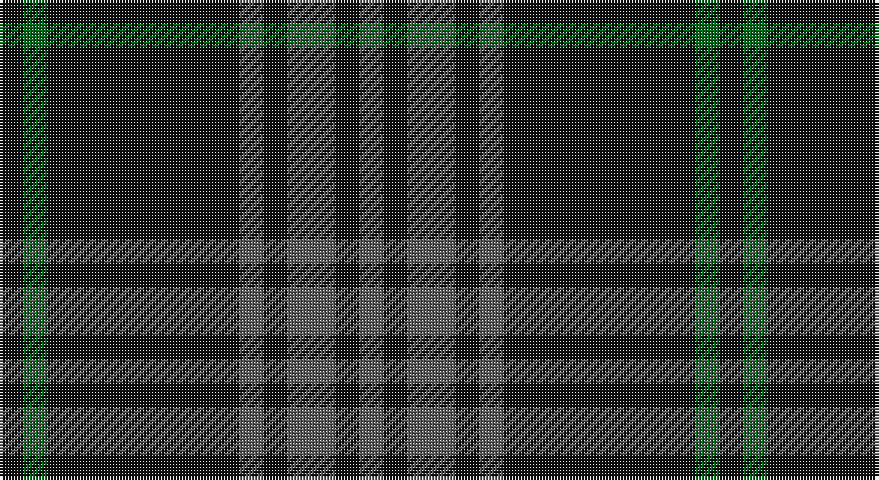

This page is one **sett** — a single exact thread-count. It belongs to the [tartan](/setts/k1g1k8n1k1n2k1n1/)
(the same proportion at any scale), whose colour order is pattern [BKBKBKGK](/stripes/bkbkbkgk/).

Sourced from tartans-authority.  It is a [8 stripe tartan](/stripes/stripes8/).

Original link http://www.tartansauthority.com/tartan-ferret/display/7796/

2 attestations — the source records this cloth was collapsed from (oldest owns this page)

<ul>
<li>pre 2008 — Nightstalker (Corporate) (tartans-authority, <a href="http://www.tartansauthority.com/tartan-ferret/display/7796/">record</a>)</li>
<li>undated — Nightstalker (register-of-tartans, <a href="https://www.tartanregister.gov.uk/tartanDetails.aspx?ref=5760">record</a>)</li>
</ul>

## Register references

External register numbers recorded for this tartan.

- Scottish Register of Tartans: [5760](https://www.tartanregister.gov.uk/tartanDetails.aspx?ref=5760)
- Scottish Tartans Authority (ITI): 7796

## Thread count
K/8 G8 K64 N8 K8 N16 K8 N/8

One full sett is **240 threads**.

## Palette

Palette: <strong>Tartan Register</strong> <small style="color:#888">(2 of 3 colours)</small>
<table><thead><tr><th>Colour</th><th>Threads</th><th>Shade</th><th>Base</th><th>OKLCh</th></tr></thead><tbody><tr><td>K/</td><td style="text-align:right;font-variant-numeric:tabular-nums">8</td><td><code style="background-color:#101010;">#101010</code> <small style="color:#888">#101010</small></td><td>K <code style="background-color:#000000;">#000000</code></td><td><small style="color:#888">oklch(17.3% 0.000 89.9)</small></td></tr><tr><td>G</td><td style="text-align:right;font-variant-numeric:tabular-nums">8</td><td><code style="background-color:#006818;">#006818</code> <small style="color:#888">#006818</small></td><td>G <code style="background-color:#006100;">#006100</code></td><td><small style="color:#888">oklch(45.0% 0.142 145.0)</small></td></tr><tr><td>K</td><td style="text-align:right;font-variant-numeric:tabular-nums">64</td><td><code style="background-color:#101010;">#101010</code> <small style="color:#888">#101010</small></td><td>K <code style="background-color:#000000;">#000000</code></td><td><small style="color:#888">oklch(17.3% 0.000 89.9)</small></td></tr><tr><td>N</td><td style="text-align:right;font-variant-numeric:tabular-nums">8</td><td><code style="background-color:#5C5C5C;">#5C5C5C</code> <small style="color:#888">#5C5C5C</small></td><td>B <code style="background-color:#2A418A;">#2A418A</code></td><td><small style="color:#888">oklch(47.5% 0.000 89.9)</small></td></tr><tr><td>K</td><td style="text-align:right;font-variant-numeric:tabular-nums">8</td><td><code style="background-color:#101010;">#101010</code> <small style="color:#888">#101010</small></td><td>K <code style="background-color:#000000;">#000000</code></td><td><small style="color:#888">oklch(17.3% 0.000 89.9)</small></td></tr><tr><td>N</td><td style="text-align:right;font-variant-numeric:tabular-nums">16</td><td><code style="background-color:#5C5C5C;">#5C5C5C</code> <small style="color:#888">#5C5C5C</small></td><td>B <code style="background-color:#2A418A;">#2A418A</code></td><td><small style="color:#888">oklch(47.5% 0.000 89.9)</small></td></tr><tr><td>K</td><td style="text-align:right;font-variant-numeric:tabular-nums">8</td><td><code style="background-color:#101010;">#101010</code> <small style="color:#888">#101010</small></td><td>K <code style="background-color:#000000;">#000000</code></td><td><small style="color:#888">oklch(17.3% 0.000 89.9)</small></td></tr><tr><td>N/</td><td style="text-align:right;font-variant-numeric:tabular-nums">8</td><td><code style="background-color:#5C5C5C;">#5C5C5C</code> <small style="color:#888">#5C5C5C</small></td><td>B <code style="background-color:#2A418A;">#2A418A</code></td><td><small style="color:#888">oklch(47.5% 0.000 89.9)</small></td></tr></tbody></table>

# Sample pattern

## Nearest tartans

The nearest existing variants by ΔTartan distance, with this tartan at the top so the swatches line up against it.

ΔTartan

Tartan

Sett

—

<a href="/ttd/edit/#slug=k1g1k8n1k1n2k1n1~x8">Nightstalker (Corporate)</a> <a class="nn-out" href="/variants/s8/k1g1k8n1k1n2k1n1~x8/" title="open its dictionary page">↗</a>

0.93

<a href="/ttd/edit/#slug=n13k3n3k3n3k35r3~x2&amp;base=k1g1k8n1k1n2k1n1~x8">Holden Black (Corporate)</a> <a class="nn-out" href="/variants/s7/n13k3n3k3n3k35r3~x2/" title="open its dictionary page">↗</a>

1.26

<a href="/ttd/edit/#slug=k24n18k11n4k11n18k53r4&amp;base=k1g1k8n1k1n2k1n1~x8">Spirit of Glyndwr Gold (Fashion)</a> <a class="nn-out" href="/variants/s8/k24n18k11n4k11n18k53r4/" title="open its dictionary page">↗</a>

1.29

<a href="/ttd/edit/#slug=k24n18k11n4k11n18k53lo4&amp;base=k1g1k8n1k1n2k1n1~x8">Spirit of Glyndwr Gold Welsh Fashion Tartan</a> <a class="nn-out" href="/variants/s8/k24n18k11n4k11n18k53lo4/" title="open its dictionary page">↗</a>

1.51

<a href="/ttd/edit/#slug=dg5k2dg2k2dg2k12r2k12dg6k2dg2~x2&amp;base=k1g1k8n1k1n2k1n1~x8">MacLoughlin of Ardmarnoch (Personal)</a> <a class="nn-out" href="/variants/s11/dg5k2dg2k2dg2k12r2k12dg6k2dg2~x2/" title="open its dictionary page">↗</a>

1.52

<a href="/ttd/edit/#slug=k24n18k11n4k11n18k53n4&amp;base=k1g1k8n1k1n2k1n1~x8">Spirit of Glyndwr Grey (Fashion)</a> <a class="nn-out" href="/variants/s8/k24n18k11n4k11n18k53n4/" title="open its dictionary page">↗</a>

1.55

<a href="/ttd/edit/#slug=k22n17k2n4k2n2k37n4k2r3~x2&amp;base=k1g1k8n1k1n2k1n1~x8">Witches' Blood, The</a> <a class="nn-out" href="/variants/s10/k22n17k2n4k2n2k37n4k2r3~x2/" title="open its dictionary page">↗</a>

1.61

<a href="/ttd/edit/#slug=k24k3k3k3k3k18dg20r4~x2&amp;base=k1g1k8n1k1n2k1n1~x8">The Caledonian Hotel</a> <a class="nn-out" href="/variants/s8/k24k3k3k3k3k18dg20r4~x2/" title="open its dictionary page">↗</a>

1.64

<a href="/ttd/edit/#slug=db5k9g7k3g7k3g7k25g3~x2&amp;base=k1g1k8n1k1n2k1n1~x8">Menez Du</a> <a class="nn-out" href="/variants/s9/db5k9g7k3g7k3g7k25g3~x2/" title="open its dictionary page">↗</a>

1.72

<a href="/ttd/edit/#slug=n6k17n6k17n45k4~x2&amp;base=k1g1k8n1k1n2k1n1~x8">Grey Spirit (Fashion)</a> <a class="nn-out" href="/variants/s6/n6k17n6k17n45k4~x2/" title="open its dictionary page">↗</a>

1.75

<a href="/ttd/edit/#slug=k3n6k8lr2k8n3k5n36k2n3~x2&amp;base=k1g1k8n1k1n2k1n1~x8">City Building (Glasgow) LLP</a> <a class="nn-out" href="/variants/s10/k3n6k8lr2k8n3k5n36k2n3~x2/" title="open its dictionary page">↗</a>

## Neighbour map

Every grey dot is one of 14360 variants placed by the first two principal components of the ΔTartan feature space (44% of its variance). Red is this tartan; blue dots are its nearest — click one to open its page.

<svg viewBox="0 0 640 380" role="img" style="max-width:100%;height:auto;border:1px solid #e0e0e0;border-radius:4px;display:block" xmlns="http://www.w3.org/2000/svg"><image href="/nn/cloud.v1.png" width="640" height="380"/><a href="/variants/s7/n13k3n3k3n3k35r3~x2/"><circle cx="451.0" cy="215.6" r="4" fill="#3465a4"><title>Holden Black (Corporate)</title></circle></a><a href="/variants/s8/k24n18k11n4k11n18k53r4/"><circle cx="460.6" cy="240.0" r="4" fill="#3465a4"><title>Spirit of Glyndwr Gold (Fashion)</title></circle></a><a href="/variants/s8/k24n18k11n4k11n18k53lo4/"><circle cx="453.9" cy="237.4" r="4" fill="#3465a4"><title>Spirit of Glyndwr Gold Welsh Fashion Tartan</title></circle></a><a href="/variants/s11/dg5k2dg2k2dg2k12r2k12dg6k2dg2~x2/"><circle cx="381.3" cy="256.0" r="4" fill="#3465a4"><title>MacLoughlin of Ardmarnoch (Personal)</title></circle></a><a href="/variants/s8/k24n18k11n4k11n18k53n4/"><circle cx="488.8" cy="259.5" r="4" fill="#3465a4"><title>Spirit of Glyndwr Grey (Fashion)</title></circle></a><a href="/variants/s10/k22n17k2n4k2n2k37n4k2r3~x2/"><circle cx="514.3" cy="206.8" r="4" fill="#3465a4"><title>Witches' Blood, The</title></circle></a><a href="/variants/s8/k24k3k3k3k3k18dg20r4~x2/"><circle cx="464.3" cy="274.9" r="4" fill="#3465a4"><title>The Caledonian Hotel</title></circle></a><a href="/variants/s9/db5k9g7k3g7k3g7k25g3~x2/"><circle cx="364.9" cy="252.0" r="4" fill="#3465a4"><title>Menez Du</title></circle></a><a href="/variants/s6/n6k17n6k17n45k4~x2/"><circle cx="433.2" cy="261.7" r="4" fill="#3465a4"><title>Grey Spirit (Fashion)</title></circle></a><a href="/variants/s10/k3n6k8lr2k8n3k5n36k2n3~x2/"><circle cx="452.2" cy="179.6" r="4" fill="#3465a4"><title>City Building (Glasgow) LLP</title></circle></a><circle cx="459.4" cy="238.5" r="5" fill="#c00000"/></svg>

ID: /variants/s8/k1g1k8n1k1n2k1n1~x8/
