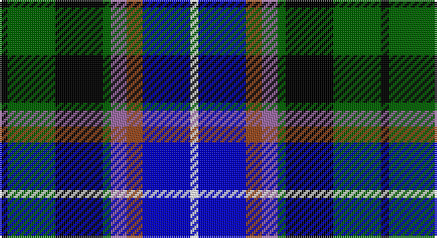

This page is one **sett** — a single exact thread-count. It belongs to the [tartan](/setts/k1g6k6g1m2o2db6w1/)
(the same proportion at any scale), whose colour order is pattern [KGKGRRBW](/stripes/kgkgrrbw/).

Sourced from register-of-tartans.  It is a [8 stripe tartan](/stripes/stripes8/).

Original link https://www.tartanregister.gov.uk/tartanDetails.aspx?ref=11620

## Register references

External register numbers recorded for this tartan.

- Scottish Register of Tartans: [11620](https://www.tartanregister.gov.uk/tartanDetails.aspx?ref=11620)

## Thread count
K/4 G24 K24 G4 LP8 T8 B24 W/4

One full sett is **192 threads**.

## Palette

Palette: <strong>Tartan Register</strong> <small style="color:#888">(5 of 6 colours)</small>
<table><thead><tr><th>Colour</th><th>Threads</th><th>Shade</th><th>Base</th><th>OKLCh</th></tr></thead><tbody><tr><td>K/</td><td style="text-align:right;font-variant-numeric:tabular-nums">4</td><td><code style="background-color:#000000;">#000000</code> <small style="color:#888">#000000</small></td><td>K <code style="background-color:#000000;">#000000</code></td><td><small style="color:#888">oklch(0.0% 0.000 0.0)</small></td></tr><tr><td>G</td><td style="text-align:right;font-variant-numeric:tabular-nums">24</td><td><code style="background-color:#006400;">#006400</code> <small style="color:#888">#006400</small></td><td>G <code style="background-color:#006100;">#006100</code></td><td><small style="color:#888">oklch(43.6% 0.148 142.5)</small></td></tr><tr><td>K</td><td style="text-align:right;font-variant-numeric:tabular-nums">24</td><td><code style="background-color:#000000;">#000000</code> <small style="color:#888">#000000</small></td><td>K <code style="background-color:#000000;">#000000</code></td><td><small style="color:#888">oklch(0.0% 0.000 0.0)</small></td></tr><tr><td>G</td><td style="text-align:right;font-variant-numeric:tabular-nums">4</td><td><code style="background-color:#006400;">#006400</code> <small style="color:#888">#006400</small></td><td>G <code style="background-color:#006100;">#006100</code></td><td><small style="color:#888">oklch(43.6% 0.148 142.5)</small></td></tr><tr><td>LP</td><td style="text-align:right;font-variant-numeric:tabular-nums">8</td><td><code style="background-color:#9C68A4;">#9C68A4</code> <small style="color:#888">#9C68A4</small></td><td>R <code style="background-color:#CC0000;">#CC0000</code></td><td><small style="color:#888">oklch(59.4% 0.107 322.0)</small></td></tr><tr><td>T</td><td style="text-align:right;font-variant-numeric:tabular-nums">8</td><td><code style="background-color:#98481C;">#98481C</code> <small style="color:#888">#98481C</small></td><td>R <code style="background-color:#CC0000;">#CC0000</code></td><td><small style="color:#888">oklch(49.6% 0.121 46.1)</small></td></tr><tr><td>B</td><td style="text-align:right;font-variant-numeric:tabular-nums">24</td><td><code style="background-color:#0000C8;">#0000C8</code> <small style="color:#888">#0000C8</small></td><td>B <code style="background-color:#2A418A;">#2A418A</code></td><td><small style="color:#888">oklch(37.6% 0.261 264.1)</small></td></tr><tr><td>W/</td><td style="text-align:right;font-variant-numeric:tabular-nums">4</td><td><code style="background-color:#FCFCFC;">#FCFCFC</code> <small style="color:#888">#FCFCFC</small></td><td>W <code style="background-color:#F7F7F7;">#F7F7F7</code></td><td><small style="color:#888">oklch(99.1% 0.000 89.9)</small></td></tr></tbody></table>

# Sample pattern

## Nearest tartans

The nearest existing variants by ΔTartan distance, with this tartan at the top so the swatches line up against it.

ΔTartan

Tartan

Sett

—

<a href="/ttd/edit/#slug=k1g6k6g1m2o2db6w1~x4">Hebridean Celebration</a> <a class="nn-out" href="/variants/s8/k1g6k6g1m2o2db6w1~x4/" title="open its dictionary page">↗</a>

0.96

<a href="/ttd/edit/#slug=db4lg2db10k12dg10lb3dg2lb4~x2&amp;base=k1g6k6g1m2o2db6w1~x4">Business Air</a> <a class="nn-out" href="/variants/s8/db4lg2db10k12dg10lb3dg2lb4~x2/" title="open its dictionary page">↗</a>

0.96

<a href="/variants/s10/k5lb14ki3k7g3ki3g7ki6db24w3~x2/">Kagame (Personal)</a>

1.07

<a href="/ttd/edit/#slug=r4dg16w2k15db15k2db2ly2~x2&amp;base=k1g6k6g1m2o2db6w1~x4">Cowan of Inveresk (Personal)</a> <a class="nn-out" href="/variants/s8/r4dg16w2k15db15k2db2ly2~x2/" title="open its dictionary page">↗</a>

1.12

<a href="/ttd/edit/#slug=t3k3db17k20g20dp8p3~x2&amp;base=k1g6k6g1m2o2db6w1~x4">Gracey (2013)</a> <a class="nn-out" href="/variants/s7/t3k3db17k20g20dp8p3~x2/" title="open its dictionary page">↗</a>

1.13

<a href="/ttd/edit/#slug=b2g6ly1k6db6k1db1~x2&amp;base=k1g6k6g1m2o2db6w1~x4">Hogarth, of Firhill</a> <a class="nn-out" href="/variants/s7/b2g6ly1k6db6k1db1~x2/" title="open its dictionary page">↗</a>

1.15

<a href="/ttd/edit/#slug=p3db13y2db4w2db8k13g10k2g8p3~x2&amp;base=k1g6k6g1m2o2db6w1~x4">Smithers</a> <a class="nn-out" href="/variants/s11/p3db13y2db4w2db8k13g10k2g8p3~x2/" title="open its dictionary page">↗</a>

1.15

<a href="/ttd/edit/#slug=p11db2t4db21k16g19ly4~x2&amp;base=k1g6k6g1m2o2db6w1~x4">Ayrshire</a> <a class="nn-out" href="/variants/s7/p11db2t4db21k16g19ly4~x2/" title="open its dictionary page">↗</a>

1.16

<a href="/ttd/edit/#slug=dbi2k1db8k7g8ly2g8k7db8k1r2~x4&amp;base=k1g6k6g1m2o2db6w1~x4">Scottish Economics Society 'Adam Smith'</a> <a class="nn-out" href="/variants/s11/dbi2k1db8k7g8ly2g8k7db8k1r2~x4/" title="open its dictionary page">↗</a>

1.16

<a href="/ttd/edit/#slug=lb7k11lt3db9g19lo3k22db9lt3k3db6~x2&amp;base=k1g6k6g1m2o2db6w1~x4">Veere</a> <a class="nn-out" href="/variants/s11/lb7k11lt3db9g19lo3k22db9lt3k3db6~x2/" title="open its dictionary page">↗</a>

1.17

<a href="/ttd/edit/#slug=r2dt3n12k11dg11ly2~x2&amp;base=k1g6k6g1m2o2db6w1~x4">Huntly Gordon</a> <a class="nn-out" href="/variants/s6/r2dt3n12k11dg11ly2~x2/" title="open its dictionary page">↗</a>

## Neighbour map

Every grey dot is one of 14360 variants placed by the first two principal components of the ΔTartan feature space (44% of its variance). Red is this tartan; blue dots are its nearest — click one to open its page.

<svg viewBox="0 0 640 380" role="img" style="max-width:100%;height:auto;border:1px solid #e0e0e0;border-radius:4px;display:block" xmlns="http://www.w3.org/2000/svg"><image href="/nn/cloud.v1.png" width="640" height="380"/><a href="/variants/s8/db4lg2db10k12dg10lb3dg2lb4~x2/"><circle cx="58.2" cy="212.0" r="4" fill="#3465a4"><title>Business Air</title></circle></a><a href="/variants/s10/k5lb14ki3k7g3ki3g7ki6db24w3~x2/"><circle cx="57.9" cy="151.9" r="4" fill="#3465a4"><title>Kagame (Personal)</title></circle></a><a href="/variants/s8/r4dg16w2k15db15k2db2ly2~x2/"><circle cx="88.2" cy="168.6" r="4" fill="#3465a4"><title>Cowan of Inveresk (Personal)</title></circle></a><a href="/variants/s7/t3k3db17k20g20dp8p3~x2/"><circle cx="84.5" cy="206.1" r="4" fill="#3465a4"><title>Gracey (2013)</title></circle></a><a href="/variants/s7/b2g6ly1k6db6k1db1~x2/"><circle cx="83.1" cy="211.2" r="4" fill="#3465a4"><title>Hogarth, of Firhill</title></circle></a><a href="/variants/s11/p3db13y2db4w2db8k13g10k2g8p3~x2/"><circle cx="84.6" cy="181.1" r="4" fill="#3465a4"><title>Smithers</title></circle></a><a href="/variants/s7/p11db2t4db21k16g19ly4~x2/"><circle cx="69.7" cy="179.8" r="4" fill="#3465a4"><title>Ayrshire</title></circle></a><a href="/variants/s11/dbi2k1db8k7g8ly2g8k7db8k1r2~x4/"><circle cx="62.3" cy="181.5" r="4" fill="#3465a4"><title>Scottish Economics Society 'Adam Smith'</title></circle></a><a href="/variants/s11/lb7k11lt3db9g19lo3k22db9lt3k3db6~x2/"><circle cx="82.8" cy="167.8" r="4" fill="#3465a4"><title>Veere</title></circle></a><a href="/variants/s6/r2dt3n12k11dg11ly2~x2/"><circle cx="65.9" cy="211.0" r="4" fill="#3465a4"><title>Huntly Gordon</title></circle></a><circle cx="40.9" cy="188.2" r="5" fill="#c00000"/></svg>

ID: /variants/s8/k1g6k6g1m2o2db6w1~x4/
