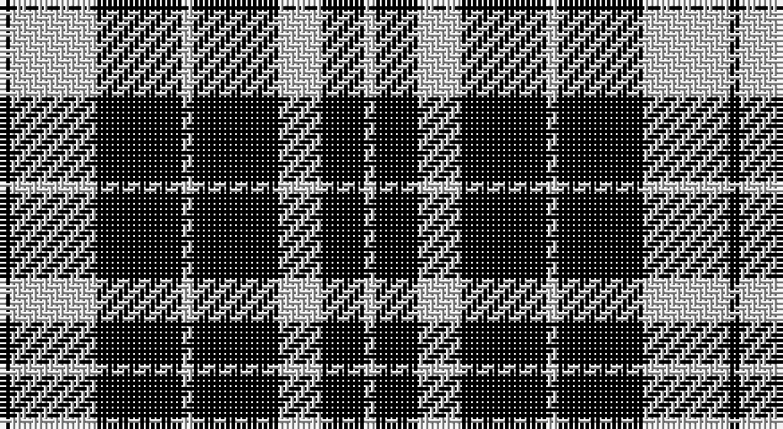

This page is one **sett** — a single exact thread-count. It belongs to the [tartan](/setts/k1lb8k8lb1k8lb4k4lb1/)
(the same proportion at any scale), whose colour order is pattern [KWKWKWKW](/stripes/kwkwkwkw/).

Part of the [Priest](/tartans/priest/) tartan — the named design grouping this sett with its other cloths.

Sourced from weddslist.  It is a [8 stripe tartan](/stripes/stripes8/).

Original link http://www.weddslist.com/cgi-bin/tartans/pg.pl?source=rb

## Thread count
K/2 N16 K16 N2 K16 N8 K8 N/2

One full sett is **136 threads**.

## Palette

Palette: <strong>Ingles Buchan</strong> <small style="color:#888">(1 of 2 colours)</small>
<table><thead><tr><th>Colour</th><th>Threads</th><th>Shade</th><th>Base</th><th>OKLCh</th></tr></thead><tbody><tr><td>K/</td><td style="text-align:right;font-variant-numeric:tabular-nums">2</td><td><code style="background-color:#000000;">#000000</code> <small style="color:#888">#000000</small></td><td>K <code style="background-color:#000000;">#000000</code></td><td><small style="color:#888">oklch(0.0% 0.000 0.0)</small></td></tr><tr><td>N</td><td style="text-align:right;font-variant-numeric:tabular-nums">16</td><td><code style="background-color:#D0D0D0;">#D0D0D0</code> <small style="color:#888">#D0D0D0</small></td><td>W <code style="background-color:#F7F7F7;">#F7F7F7</code></td><td><small style="color:#888">oklch(85.8% 0.000 89.9)</small></td></tr><tr><td>K</td><td style="text-align:right;font-variant-numeric:tabular-nums">16</td><td><code style="background-color:#000000;">#000000</code> <small style="color:#888">#000000</small></td><td>K <code style="background-color:#000000;">#000000</code></td><td><small style="color:#888">oklch(0.0% 0.000 0.0)</small></td></tr><tr><td>N</td><td style="text-align:right;font-variant-numeric:tabular-nums">2</td><td><code style="background-color:#D0D0D0;">#D0D0D0</code> <small style="color:#888">#D0D0D0</small></td><td>W <code style="background-color:#F7F7F7;">#F7F7F7</code></td><td><small style="color:#888">oklch(85.8% 0.000 89.9)</small></td></tr><tr><td>K</td><td style="text-align:right;font-variant-numeric:tabular-nums">16</td><td><code style="background-color:#000000;">#000000</code> <small style="color:#888">#000000</small></td><td>K <code style="background-color:#000000;">#000000</code></td><td><small style="color:#888">oklch(0.0% 0.000 0.0)</small></td></tr><tr><td>N</td><td style="text-align:right;font-variant-numeric:tabular-nums">8</td><td><code style="background-color:#D0D0D0;">#D0D0D0</code> <small style="color:#888">#D0D0D0</small></td><td>W <code style="background-color:#F7F7F7;">#F7F7F7</code></td><td><small style="color:#888">oklch(85.8% 0.000 89.9)</small></td></tr><tr><td>K</td><td style="text-align:right;font-variant-numeric:tabular-nums">8</td><td><code style="background-color:#000000;">#000000</code> <small style="color:#888">#000000</small></td><td>K <code style="background-color:#000000;">#000000</code></td><td><small style="color:#888">oklch(0.0% 0.000 0.0)</small></td></tr><tr><td>N/</td><td style="text-align:right;font-variant-numeric:tabular-nums">2</td><td><code style="background-color:#D0D0D0;">#D0D0D0</code> <small style="color:#888">#D0D0D0</small></td><td>W <code style="background-color:#F7F7F7;">#F7F7F7</code></td><td><small style="color:#888">oklch(85.8% 0.000 89.9)</small></td></tr></tbody></table>

# Sample pattern

## Compared to the master

This cloth is one sett of its design; the master sett (the exemplar the design is anchored on) is below for comparison.

<figure style="margin:0"><figcaption style="color:#888;font-size:smaller">this sett</figcaption></figure>
<figure style="margin:0"><figcaption style="color:#888;font-size:smaller"><a href="/setts/k1y1dp7k8y1k8y1dp2y1k4y1/">master sett →</a></figcaption></figure>

## Nearest tartans

The nearest existing variants by ΔTartan distance, with this tartan at the top so the swatches line up against it.

ΔTartan

Tartan

Sett

—

<a href="/ttd/edit/#slug=k1lb8k8lb1k8lb4k4lb1~x2">Priest</a> <a class="nn-out" href="/variants/s8/k1lb8k8lb1k8lb4k4lb1~x2/" title="open its dictionary page">↗</a>

0.95

<a href="/ttd/edit/#slug=w20k6w9k6w6k12w6k48w8k16w16&amp;base=k1lb8k8lb1k8lb4k4lb1~x2">MacLean, Black &amp; White</a> <a class="nn-out" href="/variants/s11/w20k6w9k6w6k12w6k48w8k16w16/" title="open its dictionary page">↗</a>

0.98

<a href="/ttd/edit/#slug=k9lr1k2lr1k4lr9k1lr2~x4&amp;base=k1lb8k8lb1k8lb4k4lb1~x2">Douglas, Grey Clan/Family Tartan</a> <a class="nn-out" href="/variants/s8/k9lr1k2lr1k4lr9k1lr2~x4/" title="open its dictionary page">↗</a>

1.39

<a href="/ttd/edit/#slug=k17ly2k2ly2k9lb11k2lb11k20ly2~x2&amp;base=k1lb8k8lb1k8lb4k4lb1~x2">Coppa Romana (Corporate)</a> <a class="nn-out" href="/variants/s10/k17ly2k2ly2k9lb11k2lb11k20ly2~x2/" title="open its dictionary page">↗</a>

1.46

<a href="/ttd/edit/#slug=k17ly2k2ly2k9w11k2w11k20ly2~x2&amp;base=k1lb8k8lb1k8lb4k4lb1~x2">Coppa Romana (Switzerland)</a> <a class="nn-out" href="/variants/s10/k17ly2k2ly2k9w11k2w11k20ly2~x2/" title="open its dictionary page">↗</a>

1.55

<a href="/ttd/edit/#slug=k10o1k2o1k4o10k1o2~x4&amp;base=k1lb8k8lb1k8lb4k4lb1~x2">Douglas, Grey (Vestiarium Scoticum)</a> <a class="nn-out" href="/variants/s8/k10o1k2o1k4o10k1o2~x4/" title="open its dictionary page">↗</a>

1.60

<a href="/ttd/edit/#slug=k14w4k14w19k4w4k4y4k16y11k8&amp;base=k1lb8k8lb1k8lb4k4lb1~x2">Royal Stuart / Stewart</a> <a class="nn-out" href="/variants/s11/k14w4k14w19k4w4k4y4k16y11k8/" title="open its dictionary page">↗</a>

1.61

<a href="/ttd/edit/#slug=k6y20k6y4k4y8y2k8y2k5~x2&amp;base=k1lb8k8lb1k8lb4k4lb1~x2">Bute Heather, Black</a> <a class="nn-out" href="/variants/s10/k6y20k6y4k4y8y2k8y2k5~x2/" title="open its dictionary page">↗</a>

1.63

<a href="/ttd/edit/#slug=w6k6w2k1w1k1w2k6w6k1w2~x2&amp;base=k1lb8k8lb1k8lb4k4lb1~x2">Scott, Sir Walter</a> <a class="nn-out" href="/variants/s11/w6k6w2k1w1k1w2k6w6k1w2~x2/" title="open its dictionary page">↗</a>

1.71

<a href="/ttd/edit/#slug=k2lb5k1lb1k10r1k1~x4&amp;base=k1lb8k8lb1k8lb4k4lb1~x2">Lundy Reform</a> <a class="nn-out" href="/variants/s7/k2lb5k1lb1k10r1k1~x4/" title="open its dictionary page">↗</a>

1.71

<a href="/ttd/edit/#slug=k4w14k2w4k8w3k30w2k4w4~x2&amp;base=k1lb8k8lb1k8lb4k4lb1~x2">Kinloch Anderson Black and White</a> <a class="nn-out" href="/variants/s10/k4w14k2w4k8w3k30w2k4w4~x2/" title="open its dictionary page">↗</a>

## Neighbour map

Every grey dot is one of 14360 variants placed by the first two principal components of the ΔTartan feature space (44% of its variance). Red is this tartan; blue dots are its nearest — click one to open its page.

<svg viewBox="0 0 640 380" role="img" style="max-width:100%;height:auto;border:1px solid #e0e0e0;border-radius:4px;display:block" xmlns="http://www.w3.org/2000/svg"><image href="/nn/cloud.v1.png" width="640" height="380"/><a href="/variants/s11/w20k6w9k6w6k12w6k48w8k16w16/"><circle cx="308.4" cy="209.4" r="4" fill="#3465a4"><title>MacLean, Black &amp; White</title></circle></a><a href="/variants/s8/k9lr1k2lr1k4lr9k1lr2~x4/"><circle cx="326.6" cy="224.5" r="4" fill="#3465a4"><title>Douglas, Grey Clan/Family Tartan</title></circle></a><a href="/variants/s10/k17ly2k2ly2k9lb11k2lb11k20ly2~x2/"><circle cx="326.0" cy="193.5" r="4" fill="#3465a4"><title>Coppa Romana (Corporate)</title></circle></a><a href="/variants/s10/k17ly2k2ly2k9w11k2w11k20ly2~x2/"><circle cx="322.2" cy="190.3" r="4" fill="#3465a4"><title>Coppa Romana (Switzerland)</title></circle></a><a href="/variants/s8/k10o1k2o1k4o10k1o2~x4/"><circle cx="352.9" cy="222.3" r="4" fill="#3465a4"><title>Douglas, Grey (Vestiarium Scoticum)</title></circle></a><a href="/variants/s11/k14w4k14w19k4w4k4y4k16y11k8/"><circle cx="228.9" cy="238.9" r="4" fill="#3465a4"><title>Royal Stuart / Stewart</title></circle></a><a href="/variants/s10/k6y20k6y4k4y8y2k8y2k5~x2/"><circle cx="340.1" cy="229.2" r="4" fill="#3465a4"><title>Bute Heather, Black</title></circle></a><a href="/variants/s11/w6k6w2k1w1k1w2k6w6k1w2~x2/"><circle cx="274.9" cy="222.3" r="4" fill="#3465a4"><title>Scott, Sir Walter</title></circle></a><a href="/variants/s7/k2lb5k1lb1k10r1k1~x4/"><circle cx="376.1" cy="196.2" r="4" fill="#3465a4"><title>Lundy Reform</title></circle></a><a href="/variants/s10/k4w14k2w4k8w3k30w2k4w4~x2/"><circle cx="383.3" cy="175.7" r="4" fill="#3465a4"><title>Kinloch Anderson Black and White</title></circle></a><circle cx="315.8" cy="239.9" r="5" fill="#c00000"/></svg>

ID: /variants/s8/k1lb8k8lb1k8lb4k4lb1~x2/
