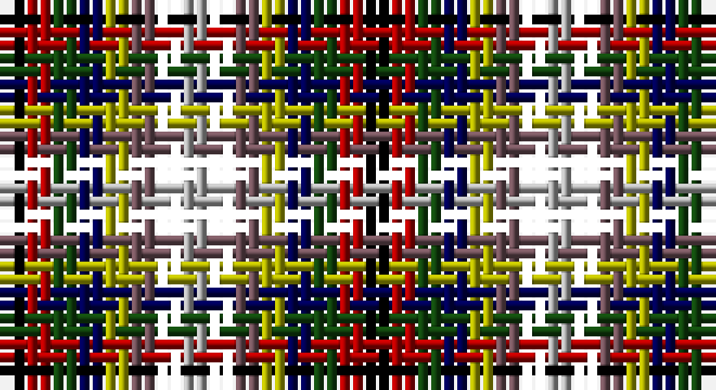

This page is one **sett** — a single exact thread-count. It belongs to the [tartan](/setts/k1r1dg1db1ly1n1ki1lr1/)
(the same proportion at any scale), whose colour order is pattern [KRGBYBKY](/stripes/krgbybky/).

Part of the [Rainbow](/tartans/rainbow/) tartan — the named design grouping this sett with its other cloths.

Sourced from weddslist.  It is a [8 stripe tartan](/stripes/stripes8/).

Original link http://www.weddslist.com/cgi-bin/tartans/pg.pl?source=x

## Also known as

This cloth is also recorded under:

- Rainbow #2
- Rainbow Kilt

## Thread count
K/2 DR2 DG2 DB2 LG2 N2 D2 Na/2

One full sett is **28 threads**.

## Palette

Palette: <strong>Ingles Buchan</strong> <small style="color:#888">(1 of 8 colours)</small>
<table><thead><tr><th>Colour</th><th>Threads</th><th>Shade</th><th>Base</th><th>OKLCh</th></tr></thead><tbody><tr><td>K/</td><td style="text-align:right;font-variant-numeric:tabular-nums">2</td><td><code style="background-color:#000000;">#000000</code> <small style="color:#888">#000000</small></td><td>K <code style="background-color:#000000;">#000000</code></td><td><small style="color:#888">oklch(0.0% 0.000 0.0)</small></td></tr><tr><td>DR</td><td style="text-align:right;font-variant-numeric:tabular-nums">2</td><td><code style="background-color:#AA0000;">#AA0000</code> <small style="color:#888">#AA0000</small></td><td>R <code style="background-color:#CC0000;">#CC0000</code></td><td><small style="color:#888">oklch(46.3% 0.190 29.2)</small></td></tr><tr><td>DG</td><td style="text-align:right;font-variant-numeric:tabular-nums">2</td><td><code style="background-color:#11450D;">#11450D</code> <small style="color:#888">#11450D</small></td><td>G <code style="background-color:#006100;">#006100</code></td><td><small style="color:#888">oklch(34.4% 0.101 142.1)</small></td></tr><tr><td>DB</td><td style="text-align:right;font-variant-numeric:tabular-nums">2</td><td><code style="background-color:#000052;">#000052</code> <small style="color:#888">#000052</small></td><td>B <code style="background-color:#2A418A;">#2A418A</code></td><td><small style="color:#888">oklch(19.8% 0.137 264.1)</small></td></tr><tr><td>LG</td><td style="text-align:right;font-variant-numeric:tabular-nums">2</td><td><code style="background-color:#AAAA00;">#AAAA00</code> <small style="color:#888">#AAAA00</small></td><td>Y <code style="background-color:#F2BF00;">#F2BF00</code></td><td><small style="color:#888">oklch(71.4% 0.156 109.8)</small></td></tr><tr><td>N</td><td style="text-align:right;font-variant-numeric:tabular-nums">2</td><td><code style="background-color:#6E5058;">#6E5058</code> <small style="color:#888">#6E5058</small></td><td>B <code style="background-color:#2A418A;">#2A418A</code></td><td><small style="color:#888">oklch(46.6% 0.042 1.2)</small></td></tr><tr><td></td><td style="text-align:right;font-variant-numeric:tabular-nums">2</td><td><code style="background-color:;"></code> <small style="color:#888"></small></td><td> <code style="background-color:;"></code></td><td><small style="color:#888"></small></td></tr><tr><td>Na/</td><td style="text-align:right;font-variant-numeric:tabular-nums">2</td><td><code style="background-color:#AAAAAA;">#AAAAAA</code> <small style="color:#888">#AAAAAA</small></td><td>Y <code style="background-color:#F2BF00;">#F2BF00</code></td><td><small style="color:#888">oklch(73.8% 0.000 89.9)</small></td></tr></tbody></table>

# Sample pattern

## Compared to the master

This cloth is one sett of its design; the master sett (the exemplar the design is anchored on) is below for comparison.

<figure style="margin:0"><figcaption style="color:#888;font-size:smaller">this sett</figcaption></figure>
<figure style="margin:0"><figcaption style="color:#888;font-size:smaller"><a href="/setts/g2ly1lo1r1dp1db1/">master sett →</a></figcaption></figure>

## Nearest tartans

The nearest existing variants by ΔTartan distance, with this tartan at the top so the swatches line up against it.

ΔTartan

Tartan

Sett

—

<a href="/ttd/edit/#slug=k1r1dg1db1ly1n1ki1lr1~x2">Rainbow</a> <a class="nn-out" href="/variants/s8/k1r1dg1db1ly1n1ki1lr1~x2/" title="open its dictionary page">↗</a>

2.98

<a href="/ttd/edit/#slug=dg4ri5ly4db4dy2k4r4~x10&amp;base=k1r1dg1db1ly1n1ki1lr1~x2">Krifa-Jean (Personal)</a> <a class="nn-out" href="/variants/s7/dg4ri5ly4db4dy2k4r4~x10/" title="open its dictionary page">↗</a>

3.26

<a href="/ttd/edit/#slug=dg4r5db4ly4do2o4r4~x5&amp;base=k1r1dg1db1ly1n1ki1lr1~x2">Krifa-Jean (Personal)</a> <a class="nn-out" href="/variants/s7/dg4r5db4ly4do2o4r4~x5/" title="open its dictionary page">↗</a>

3.49

<a href="/ttd/edit/#slug=k1lt1r1db1g1db1~x25&amp;base=k1r1dg1db1ly1n1ki1lr1~x2">Antonelli (Oklahoma), John (Personal)</a> <a class="nn-out" href="/variants/s6/k1lt1r1db1g1db1~x25/" title="open its dictionary page">↗</a>

3.52

<a href="/ttd/edit/#slug=k1t1r1db1g1db1~x24&amp;base=k1r1dg1db1ly1n1ki1lr1~x2">Antonello (Personal)</a> <a class="nn-out" href="/variants/s6/k1t1r1db1g1db1~x24/" title="open its dictionary page">↗</a>

3.84

<a href="/ttd/edit/#slug=db11dbii11dbi11g11gi11dg11w3r5~x2&amp;base=k1r1dg1db1ly1n1ki1lr1~x2">Reid (Mill City) (Name)</a> <a class="nn-out" href="/variants/s8/db11dbii11dbi11g11gi11dg11w3r5~x2/" title="open its dictionary page">↗</a>

3.94

<a href="/ttd/edit/#slug=dp15dpi15g15dg15k8w5~x2&amp;base=k1r1dg1db1ly1n1ki1lr1~x2">Williams, Edmund (Personal)</a> <a class="nn-out" href="/variants/s6/dp15dpi15g15dg15k8w5~x2/" title="open its dictionary page">↗</a>

4.00

<a href="/variants/s18/n1mi1n1g1n1w1mi1g1w1mi1g1m1mi1n1ni1mi1g1w1~x10/">Welly (Personal)</a>

4.02

<a href="/ttd/edit/#slug=dbi11db11dbii11lg11g11gi11w3r5~x2&amp;base=k1r1dg1db1ly1n1ki1lr1~x2">Reid (Mill City)</a> <a class="nn-out" href="/variants/s8/dbi11db11dbii11lg11g11gi11w3r5~x2/" title="open its dictionary page">↗</a>

4.05

<a href="/ttd/edit/#slug=lp2w1y1g1gi1dg1y1g1dg1~x20&amp;base=k1r1dg1db1ly1n1ki1lr1~x2">Stirling Millennium</a> <a class="nn-out" href="/variants/s9/lp2w1y1g1gi1dg1y1g1dg1~x20/" title="open its dictionary page">↗</a>

4.08

<a href="/ttd/edit/#slug=lb3lbi2db3r3k3ly1~x8&amp;base=k1r1dg1db1ly1n1ki1lr1~x2">Becker (Name)</a> <a class="nn-out" href="/variants/s6/lb3lbi2db3r3k3ly1~x8/" title="open its dictionary page">↗</a>

## Neighbour map

Every grey dot is one of 14360 variants placed by the first two principal components of the ΔTartan feature space (44% of its variance). Red is this tartan; blue dots are its nearest — click one to open its page.

<svg viewBox="0 0 640 380" role="img" style="max-width:100%;height:auto;border:1px solid #e0e0e0;border-radius:4px;display:block" xmlns="http://www.w3.org/2000/svg"><image href="/nn/cloud.v1.png" width="640" height="380"/><a href="/variants/s7/dg4ri5ly4db4dy2k4r4~x10/"><circle cx="14.0" cy="257.6" r="4" fill="#3465a4"><title>Krifa-Jean (Personal)</title></circle></a><a href="/variants/s7/dg4r5db4ly4do2o4r4~x5/"><circle cx="14.0" cy="262.0" r="4" fill="#3465a4"><title>Krifa-Jean (Personal)</title></circle></a><a href="/variants/s6/k1lt1r1db1g1db1~x25/"><circle cx="14.0" cy="366.0" r="4" fill="#3465a4"><title>Antonelli (Oklahoma), John (Personal)</title></circle></a><a href="/variants/s6/k1t1r1db1g1db1~x24/"><circle cx="14.0" cy="366.0" r="4" fill="#3465a4"><title>Antonello (Personal)</title></circle></a><a href="/variants/s8/db11dbii11dbi11g11gi11dg11w3r5~x2/"><circle cx="14.0" cy="233.4" r="4" fill="#3465a4"><title>Reid (Mill City) (Name)</title></circle></a><a href="/variants/s6/dp15dpi15g15dg15k8w5~x2/"><circle cx="14.0" cy="267.6" r="4" fill="#3465a4"><title>Williams, Edmund (Personal)</title></circle></a><a href="/variants/s18/n1mi1n1g1n1w1mi1g1w1mi1g1m1mi1n1ni1mi1g1w1~x10/"><circle cx="14.0" cy="325.0" r="4" fill="#3465a4"><title>Welly (Personal)</title></circle></a><a href="/variants/s8/dbi11db11dbii11lg11g11gi11w3r5~x2/"><circle cx="14.0" cy="218.8" r="4" fill="#3465a4"><title>Reid (Mill City)</title></circle></a><a href="/variants/s9/lp2w1y1g1gi1dg1y1g1dg1~x20/"><circle cx="14.0" cy="276.2" r="4" fill="#3465a4"><title>Stirling Millennium</title></circle></a><a href="/variants/s6/lb3lbi2db3r3k3ly1~x8/"><circle cx="14.0" cy="256.4" r="4" fill="#3465a4"><title>Becker (Name)</title></circle></a><circle cx="14.0" cy="329.3" r="5" fill="#c00000"/></svg>

ID: /variants/s8/k1r1dg1db1ly1n1ki1lr1~x2/
