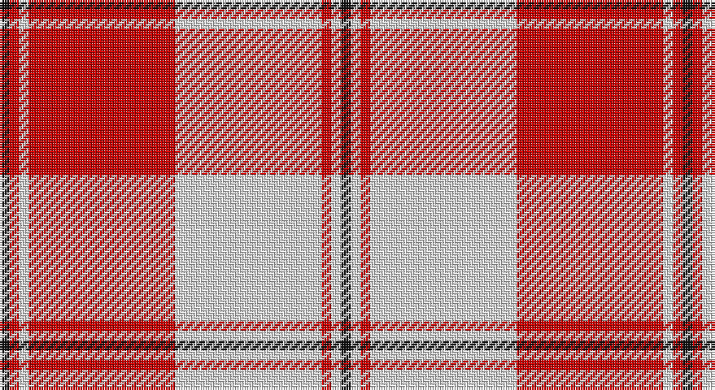

This page is one **sett** — a single exact thread-count. It belongs to the [tartan](/setts/k1r1w1r15w15r1w1k1/)
(the same proportion at any scale), whose colour order is pattern [KRWRWRWK](/stripes/krwrwrwk/).

Part of the [Bundy, Dress](/tartans/bundy-dress/) tartan — the named design grouping this sett with its other cloths.

Sourced from tartans-authority.  It is a [8 stripe tartan](/stripes/stripes8/).

Original link http://www.tartansauthority.com/tartan-ferret/display/8263/

## Also known as

This cloth is also recorded under:

- Bundy, Dress Black Personal)
- Bundy, Dress Red

## Register references

External register numbers recorded for this tartan.

- Scottish Tartans Authority (ITI): 8263

## Thread count
K/4 R4 LN4 R60 LN60 R4 LN4 K/4

One full sett is **280 threads**.

## Palette

Palette: <strong>Tartan Register</strong>
<table><thead><tr><th>Colour</th><th>Threads</th><th>Shade</th><th>Base</th><th>OKLCh</th></tr></thead><tbody><tr><td>K/</td><td style="text-align:right;font-variant-numeric:tabular-nums">4</td><td><code style="background-color:#101010;">#101010</code> <small style="color:#888">#101010</small></td><td>K <code style="background-color:#000000;">#000000</code></td><td><small style="color:#888">oklch(17.3% 0.000 89.9)</small></td></tr><tr><td>R</td><td style="text-align:right;font-variant-numeric:tabular-nums">4</td><td><code style="background-color:#C80000;">#C80000</code> <small style="color:#888">#C80000</small></td><td>R <code style="background-color:#CC0000;">#CC0000</code></td><td><small style="color:#888">oklch(52.3% 0.215 29.2)</small></td></tr><tr><td>LN</td><td style="text-align:right;font-variant-numeric:tabular-nums">4</td><td><code style="background-color:#E0E0E0;">#E0E0E0</code> <small style="color:#888">#E0E0E0</small></td><td>W <code style="background-color:#F7F7F7;">#F7F7F7</code></td><td><small style="color:#888">oklch(90.7% 0.000 89.9)</small></td></tr><tr><td>R</td><td style="text-align:right;font-variant-numeric:tabular-nums">60</td><td><code style="background-color:#C80000;">#C80000</code> <small style="color:#888">#C80000</small></td><td>R <code style="background-color:#CC0000;">#CC0000</code></td><td><small style="color:#888">oklch(52.3% 0.215 29.2)</small></td></tr><tr><td>LN</td><td style="text-align:right;font-variant-numeric:tabular-nums">60</td><td><code style="background-color:#E0E0E0;">#E0E0E0</code> <small style="color:#888">#E0E0E0</small></td><td>W <code style="background-color:#F7F7F7;">#F7F7F7</code></td><td><small style="color:#888">oklch(90.7% 0.000 89.9)</small></td></tr><tr><td>R</td><td style="text-align:right;font-variant-numeric:tabular-nums">4</td><td><code style="background-color:#C80000;">#C80000</code> <small style="color:#888">#C80000</small></td><td>R <code style="background-color:#CC0000;">#CC0000</code></td><td><small style="color:#888">oklch(52.3% 0.215 29.2)</small></td></tr><tr><td>LN</td><td style="text-align:right;font-variant-numeric:tabular-nums">4</td><td><code style="background-color:#E0E0E0;">#E0E0E0</code> <small style="color:#888">#E0E0E0</small></td><td>W <code style="background-color:#F7F7F7;">#F7F7F7</code></td><td><small style="color:#888">oklch(90.7% 0.000 89.9)</small></td></tr><tr><td>K/</td><td style="text-align:right;font-variant-numeric:tabular-nums">4</td><td><code style="background-color:#101010;">#101010</code> <small style="color:#888">#101010</small></td><td>K <code style="background-color:#000000;">#000000</code></td><td><small style="color:#888">oklch(17.3% 0.000 89.9)</small></td></tr></tbody></table>

# Sample pattern

## Compared to the master

This cloth is one sett of its design; the master sett (the exemplar the design is anchored on) is below for comparison.

<figure style="margin:0"><figcaption style="color:#888;font-size:smaller">this sett</figcaption></figure>
<figure style="margin:0"><figcaption style="color:#888;font-size:smaller"><a href="/setts/g1g1w1g15w15g1w1g1/">master sett →</a></figcaption></figure>

## Nearest tartans

The nearest existing variants by ΔTartan distance, with this tartan at the top so the swatches line up against it.

ΔTartan

Tartan

Sett

—

<a href="/ttd/edit/#slug=k1r1w1r15w15r1w1k1~x4">Bundy, Dress Red (Personal Dance)</a> <a class="nn-out" href="/variants/s8/k1r1w1r15w15r1w1k1~x4/" title="open its dictionary page">↗</a>

0.76

<a href="/ttd/edit/#slug=r2dg2w2r23w2dg2w23dg2r2w2~x2&amp;base=k1r1w1r15w15r1w1k1~x4">Hose</a> <a class="nn-out" href="/variants/s10/r2dg2w2r23w2dg2w23dg2r2w2~x2/" title="open its dictionary page">↗</a>

0.87

<a href="/ttd/edit/#slug=w18r9w1r1w2r1w1r9db3r4~x4&amp;base=k1r1w1r15w15r1w1k1~x4">Swiss Red</a> <a class="nn-out" href="/variants/s10/w18r9w1r1w2r1w1r9db3r4~x4/" title="open its dictionary page">↗</a>

0.87

<a href="/ttd/edit/#slug=r2g2w2r23w2g2w23g2r2w2~x2&amp;base=k1r1w1r15w15r1w1k1~x4">Hose</a> <a class="nn-out" href="/variants/s10/r2g2w2r23w2g2w23g2r2w2~x2/" title="open its dictionary page">↗</a>

0.93

<a href="/ttd/edit/#slug=r40w40k5w2k6w2k5w6~x2&amp;base=k1r1w1r15w15r1w1k1~x4">Masai Shuka 14 (Artefact)</a> <a class="nn-out" href="/variants/s8/r40w40k5w2k6w2k5w6~x2/" title="open its dictionary page">↗</a>

1.03

<a href="/ttd/edit/#slug=ri3r2db2r30w30db2w3~x2&amp;base=k1r1w1r15w15r1w1k1~x4">Torridon, Cherry (Dance)</a> <a class="nn-out" href="/variants/s7/ri3r2db2r30w30db2w3~x2/" title="open its dictionary page">↗</a>

1.09

<a href="/ttd/edit/#slug=w5r2w34r34k2r2db4~x2&amp;base=k1r1w1r15w15r1w1k1~x4">Cunningham Dress</a> <a class="nn-out" href="/variants/s7/w5r2w34r34k2r2db4~x2/" title="open its dictionary page">↗</a>

1.21

<a href="/ttd/edit/#slug=w3lg2w30r30n2r2lg3~x2&amp;base=k1r1w1r15w15r1w1k1~x4">Torridon, Burgundy (Dance)</a> <a class="nn-out" href="/variants/s7/w3lg2w30r30n2r2lg3~x2/" title="open its dictionary page">↗</a>

1.26

<a href="/ttd/edit/#slug=w4r1w2r3w24ri5r3ri1r1ri1r20w2~x2&amp;base=k1r1w1r15w15r1w1k1~x4">Menzies #3</a> <a class="nn-out" href="/variants/s12/w4r1w2r3w24ri5r3ri1r1ri1r20w2~x2/" title="open its dictionary page">↗</a>

1.30

<a href="/ttd/edit/#slug=w5r2w34r34k2r2ly4~x2&amp;base=k1r1w1r15w15r1w1k1~x4">Cunningham Dress Burgundy (Dance)</a> <a class="nn-out" href="/variants/s7/w5r2w34r34k2r2ly4~x2/" title="open its dictionary page">↗</a>

1.30

<a href="/ttd/edit/#slug=w5k2w30r24w3r8dt3~x2&amp;base=k1r1w1r15w15r1w1k1~x4">Arduaine, Red (Dance)</a> <a class="nn-out" href="/variants/s7/w5k2w30r24w3r8dt3~x2/" title="open its dictionary page">↗</a>

## Neighbour map

Every grey dot is one of 14360 variants placed by the first two principal components of the ΔTartan feature space (44% of its variance). Red is this tartan; blue dots are its nearest — click one to open its page.

<svg viewBox="0 0 640 380" role="img" style="max-width:100%;height:auto;border:1px solid #e0e0e0;border-radius:4px;display:block" xmlns="http://www.w3.org/2000/svg"><image href="/nn/cloud.v1.png" width="640" height="380"/><a href="/variants/s10/r2dg2w2r23w2dg2w23dg2r2w2~x2/"><circle cx="299.1" cy="130.8" r="4" fill="#3465a4"><title>Hose</title></circle></a><a href="/variants/s10/w18r9w1r1w2r1w1r9db3r4~x4/"><circle cx="318.2" cy="131.4" r="4" fill="#3465a4"><title>Swiss Red</title></circle></a><a href="/variants/s10/r2g2w2r23w2g2w23g2r2w2~x2/"><circle cx="297.4" cy="132.9" r="4" fill="#3465a4"><title>Hose</title></circle></a><a href="/variants/s8/r40w40k5w2k6w2k5w6~x2/"><circle cx="294.7" cy="126.4" r="4" fill="#3465a4"><title>Masai Shuka 14 (Artefact)</title></circle></a><a href="/variants/s7/ri3r2db2r30w30db2w3~x2/"><circle cx="283.3" cy="126.8" r="4" fill="#3465a4"><title>Torridon, Cherry (Dance)</title></circle></a><a href="/variants/s7/w5r2w34r34k2r2db4~x2/"><circle cx="286.1" cy="118.3" r="4" fill="#3465a4"><title>Cunningham Dress</title></circle></a><a href="/variants/s7/w3lg2w30r30n2r2lg3~x2/"><circle cx="274.9" cy="129.1" r="4" fill="#3465a4"><title>Torridon, Burgundy (Dance)</title></circle></a><a href="/variants/s12/w4r1w2r3w24ri5r3ri1r1ri1r20w2~x2/"><circle cx="331.4" cy="97.7" r="4" fill="#3465a4"><title>Menzies #3</title></circle></a><a href="/variants/s7/w5r2w34r34k2r2ly4~x2/"><circle cx="279.5" cy="121.3" r="4" fill="#3465a4"><title>Cunningham Dress Burgundy (Dance)</title></circle></a><a href="/variants/s7/w5k2w30r24w3r8dt3~x2/"><circle cx="295.3" cy="141.5" r="4" fill="#3465a4"><title>Arduaine, Red (Dance)</title></circle></a><circle cx="322.1" cy="129.7" r="5" fill="#c00000"/></svg>

ID: /variants/s8/k1r1w1r15w15r1w1k1~x4/
