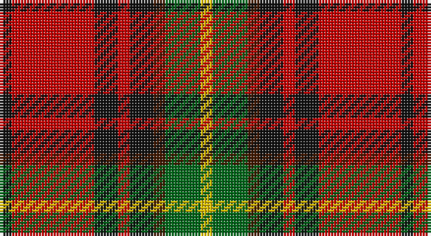

This page is one **sett** — a single exact thread-count. It belongs to the [tartan](/setts/k1r7k2r1k2do1g3ly1/)
(the same proportion at any scale), whose colour order is pattern [KRKRKBGY](/stripes/krkrkbgy/).

Part of the [Craigmoor](/tartans/craigmoor/) tartan — the named design grouping this sett with its other cloths.

Sourced from tartans-authority.  It is a [8 stripe tartan](/stripes/stripes8/).

Original link http://www.tartansauthority.com/tartan-ferret/display/8087/

## Register references

External register numbers recorded for this tartan.

- Scottish Register of Tartans: [8087](https://www.tartanregister.gov.uk/tartanDetails?ref=8087)
- Scottish Tartans Authority (ITI): 8087

## Thread count
K/4 R28 K8 R4 K8 DR4 G12 Y/4

One full sett is **136 threads**.

## Palette

Palette: <strong>Tartan Register</strong>
<table><thead><tr><th>Colour</th><th>Threads</th><th>Shade</th><th>Base</th><th>OKLCh</th></tr></thead><tbody><tr><td>K/</td><td style="text-align:right;font-variant-numeric:tabular-nums">4</td><td><code style="background-color:#101010;">#101010</code> <small style="color:#888">#101010</small></td><td>K <code style="background-color:#000000;">#000000</code></td><td><small style="color:#888">oklch(17.3% 0.000 89.9)</small></td></tr><tr><td>R</td><td style="text-align:right;font-variant-numeric:tabular-nums">28</td><td><code style="background-color:#C80000;">#C80000</code> <small style="color:#888">#C80000</small></td><td>R <code style="background-color:#CC0000;">#CC0000</code></td><td><small style="color:#888">oklch(52.3% 0.215 29.2)</small></td></tr><tr><td>K</td><td style="text-align:right;font-variant-numeric:tabular-nums">8</td><td><code style="background-color:#101010;">#101010</code> <small style="color:#888">#101010</small></td><td>K <code style="background-color:#000000;">#000000</code></td><td><small style="color:#888">oklch(17.3% 0.000 89.9)</small></td></tr><tr><td>R</td><td style="text-align:right;font-variant-numeric:tabular-nums">4</td><td><code style="background-color:#C80000;">#C80000</code> <small style="color:#888">#C80000</small></td><td>R <code style="background-color:#CC0000;">#CC0000</code></td><td><small style="color:#888">oklch(52.3% 0.215 29.2)</small></td></tr><tr><td>K</td><td style="text-align:right;font-variant-numeric:tabular-nums">8</td><td><code style="background-color:#101010;">#101010</code> <small style="color:#888">#101010</small></td><td>K <code style="background-color:#000000;">#000000</code></td><td><small style="color:#888">oklch(17.3% 0.000 89.9)</small></td></tr><tr><td>DR</td><td style="text-align:right;font-variant-numeric:tabular-nums">4</td><td><code style="background-color:#441800;">#441800</code> <small style="color:#888">#441800</small></td><td>B <code style="background-color:#2A418A;">#2A418A</code></td><td><small style="color:#888">oklch(27.3% 0.076 46.3)</small></td></tr><tr><td>G</td><td style="text-align:right;font-variant-numeric:tabular-nums">12</td><td><code style="background-color:#006818;">#006818</code> <small style="color:#888">#006818</small></td><td>G <code style="background-color:#006100;">#006100</code></td><td><small style="color:#888">oklch(45.0% 0.142 145.0)</small></td></tr><tr><td>Y/</td><td style="text-align:right;font-variant-numeric:tabular-nums">4</td><td><code style="background-color:#E8C000;">#E8C000</code> <small style="color:#888">#E8C000</small></td><td>Y <code style="background-color:#F2BF00;">#F2BF00</code></td><td><small style="color:#888">oklch(81.9% 0.168 93.7)</small></td></tr></tbody></table>

# Sample pattern

## Compared to the master

This cloth is one sett of its design; the master sett (the exemplar the design is anchored on) is below for comparison.

<figure style="margin:0"><figcaption style="color:#888;font-size:smaller">this sett</figcaption></figure>
<figure style="margin:0"><figcaption style="color:#888;font-size:smaller"><a href="/setts/k2r8db2k2r2k6dy2dg6ly1/">master sett →</a></figcaption></figure>

## Nearest tartans

The nearest existing variants by ΔTartan distance, with this tartan at the top so the swatches line up against it.

ΔTartan

Tartan

Sett

—

<a href="/ttd/edit/#slug=k1r7k2r1k2do1g3ly1~x4">Craigmoor (Fashion)</a> <a class="nn-out" href="/variants/s8/k1r7k2r1k2do1g3ly1~x4/" title="open its dictionary page">↗</a>

0.85

<a href="/ttd/edit/#slug=w15g8k12g14r64k12r16k10ly8k14&amp;base=k1r7k2r1k2do1g3ly1~x4">Carlow County Crest (Fashion)</a> <a class="nn-out" href="/variants/s10/w15g8k12g14r64k12r16k10ly8k14/" title="open its dictionary page">↗</a>

1.07

<a href="/ttd/edit/#slug=lb4k13g6r16lbi2r2g2~x2&amp;base=k1r7k2r1k2do1g3ly1~x4">Caledonian Brewery Corporate Tartan</a> <a class="nn-out" href="/variants/s7/lb4k13g6r16lbi2r2g2~x2/" title="open its dictionary page">↗</a>

1.09

<a href="/ttd/edit/#slug=lb1k1r10g10k5lb5r10k1lb1~x4&amp;base=k1r7k2r1k2do1g3ly1~x4">Graham of Montrose Red</a> <a class="nn-out" href="/variants/s9/lb1k1r10g10k5lb5r10k1lb1~x4/" title="open its dictionary page">↗</a>

1.12

<a href="/ttd/edit/#slug=g2lo9do6r3do2r3do2r10w2~x4&amp;base=k1r7k2r1k2do1g3ly1~x4">Tinkler (Corporate)</a> <a class="nn-out" href="/variants/s9/g2lo9do6r3do2r3do2r10w2~x4/" title="open its dictionary page">↗</a>

1.13

<a href="/ttd/edit/#slug=lo7k3db4k3r21k2r4k2w4~x2&amp;base=k1r7k2r1k2do1g3ly1~x4">Castle Stewart (District)</a> <a class="nn-out" href="/variants/s9/lo7k3db4k3r21k2r4k2w4~x2/" title="open its dictionary page">↗</a>

1.13

<a href="/ttd/edit/#slug=g6k2g3k2g6db8r20ly2r3g2~x2&amp;base=k1r7k2r1k2do1g3ly1~x4">Connolly Dress (Name)</a> <a class="nn-out" href="/variants/s10/g6k2g3k2g6db8r20ly2r3g2~x2/" title="open its dictionary page">↗</a>

1.14

<a href="/ttd/edit/#slug=y1k1r8dg8k6y4r8k1y1~x8&amp;base=k1r7k2r1k2do1g3ly1~x4">Montrose (Graham)</a> <a class="nn-out" href="/variants/s9/y1k1r8dg8k6y4r8k1y1~x8/" title="open its dictionary page">↗</a>

1.15

<a href="/ttd/edit/#slug=k10y24r3y3r24dg3y6k6~x2&amp;base=k1r7k2r1k2do1g3ly1~x4">Earle's Flame</a> <a class="nn-out" href="/variants/s8/k10y24r3y3r24dg3y6k6~x2/" title="open its dictionary page">↗</a>

1.16

<a href="/ttd/edit/#slug=w4dg20dgi10r25b2r2dgi2~x2&amp;base=k1r7k2r1k2do1g3ly1~x4">Caledonian Brewery (Corporate)</a> <a class="nn-out" href="/variants/s7/w4dg20dgi10r25b2r2dgi2~x2/" title="open its dictionary page">↗</a>

1.19

<a href="/ttd/edit/#slug=k23r27db3r5w3k14ly6~x2&amp;base=k1r7k2r1k2do1g3ly1~x4">Hoffman Texas German</a> <a class="nn-out" href="/variants/s7/k23r27db3r5w3k14ly6~x2/" title="open its dictionary page">↗</a>

## Neighbour map

Every grey dot is one of 14360 variants placed by the first two principal components of the ΔTartan feature space (44% of its variance). Red is this tartan; blue dots are its nearest — click one to open its page.

<svg viewBox="0 0 640 380" role="img" style="max-width:100%;height:auto;border:1px solid #e0e0e0;border-radius:4px;display:block" xmlns="http://www.w3.org/2000/svg"><image href="/nn/cloud.v1.png" width="640" height="380"/><a href="/variants/s10/w15g8k12g14r64k12r16k10ly8k14/"><circle cx="189.0" cy="150.9" r="4" fill="#3465a4"><title>Carlow County Crest (Fashion)</title></circle></a><a href="/variants/s7/lb4k13g6r16lbi2r2g2~x2/"><circle cx="171.7" cy="189.2" r="4" fill="#3465a4"><title>Caledonian Brewery Corporate Tartan</title></circle></a><a href="/variants/s9/lb1k1r10g10k5lb5r10k1lb1~x4/"><circle cx="198.3" cy="173.1" r="4" fill="#3465a4"><title>Graham of Montrose Red</title></circle></a><a href="/variants/s9/g2lo9do6r3do2r3do2r10w2~x4/"><circle cx="159.0" cy="206.4" r="4" fill="#3465a4"><title>Tinkler (Corporate)</title></circle></a><a href="/variants/s9/lo7k3db4k3r21k2r4k2w4~x2/"><circle cx="237.5" cy="146.6" r="4" fill="#3465a4"><title>Castle Stewart (District)</title></circle></a><a href="/variants/s10/g6k2g3k2g6db8r20ly2r3g2~x2/"><circle cx="209.2" cy="154.5" r="4" fill="#3465a4"><title>Connolly Dress (Name)</title></circle></a><a href="/variants/s9/y1k1r8dg8k6y4r8k1y1~x8/"><circle cx="191.8" cy="200.0" r="4" fill="#3465a4"><title>Montrose (Graham)</title></circle></a><a href="/variants/s8/k10y24r3y3r24dg3y6k6~x2/"><circle cx="225.2" cy="202.4" r="4" fill="#3465a4"><title>Earle's Flame</title></circle></a><a href="/variants/s7/w4dg20dgi10r25b2r2dgi2~x2/"><circle cx="202.2" cy="154.6" r="4" fill="#3465a4"><title>Caledonian Brewery (Corporate)</title></circle></a><a href="/variants/s7/k23r27db3r5w3k14ly6~x2/"><circle cx="206.5" cy="174.1" r="4" fill="#3465a4"><title>Hoffman Texas German</title></circle></a><circle cx="190.7" cy="179.8" r="5" fill="#c00000"/></svg>

ID: /variants/s8/k1r7k2r1k2do1g3ly1~x4/
