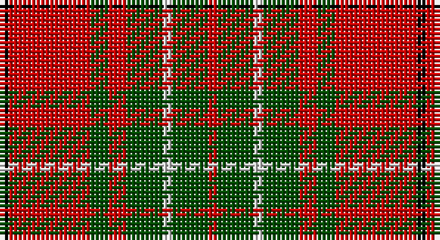

This page is one **sett** — a single exact thread-count. It belongs to the [tartan](/setts/k1r9dg2r2dg4lb1dg4r1/)
(the same proportion at any scale), whose colour order is pattern [KRGRGWGR](/stripes/krgrgwgr/).

Sourced from weddslist.  It is a [8 stripe tartan](/stripes/stripes8/).

Original link http://www.weddslist.com/cgi-bin/tartans/pg.pl?source=rb

## Thread count
K/2 R18 G4 R4 G8 N2 G8 R/2

One full sett is **92 threads**.

## Palette

Palette: <strong>Tartan Register</strong> <small style="color:#888">(3 of 4 colours)</small>
<table><thead><tr><th>Colour</th><th>Threads</th><th>Shade</th><th>Base</th><th>OKLCh</th></tr></thead><tbody><tr><td>K/</td><td style="text-align:right;font-variant-numeric:tabular-nums">2</td><td><code style="background-color:#000000;">#000000</code> <small style="color:#888">#000000</small></td><td>K <code style="background-color:#000000;">#000000</code></td><td><small style="color:#888">oklch(0.0% 0.000 0.0)</small></td></tr><tr><td>R</td><td style="text-align:right;font-variant-numeric:tabular-nums">18</td><td><code style="background-color:#C80000;">#C80000</code> <small style="color:#888">#C80000</small></td><td>R <code style="background-color:#CC0000;">#CC0000</code></td><td><small style="color:#888">oklch(52.3% 0.215 29.2)</small></td></tr><tr><td>G</td><td style="text-align:right;font-variant-numeric:tabular-nums">4</td><td><code style="background-color:#004C00;">#004C00</code> <small style="color:#888">#004C00</small></td><td>G <code style="background-color:#006100;">#006100</code></td><td><small style="color:#888">oklch(36.1% 0.123 142.5)</small></td></tr><tr><td>R</td><td style="text-align:right;font-variant-numeric:tabular-nums">4</td><td><code style="background-color:#C80000;">#C80000</code> <small style="color:#888">#C80000</small></td><td>R <code style="background-color:#CC0000;">#CC0000</code></td><td><small style="color:#888">oklch(52.3% 0.215 29.2)</small></td></tr><tr><td>G</td><td style="text-align:right;font-variant-numeric:tabular-nums">8</td><td><code style="background-color:#004C00;">#004C00</code> <small style="color:#888">#004C00</small></td><td>G <code style="background-color:#006100;">#006100</code></td><td><small style="color:#888">oklch(36.1% 0.123 142.5)</small></td></tr><tr><td>N</td><td style="text-align:right;font-variant-numeric:tabular-nums">2</td><td><code style="background-color:#D0D0D0;">#D0D0D0</code> <small style="color:#888">#D0D0D0</small></td><td>W <code style="background-color:#F7F7F7;">#F7F7F7</code></td><td><small style="color:#888">oklch(85.8% 0.000 89.9)</small></td></tr><tr><td>G</td><td style="text-align:right;font-variant-numeric:tabular-nums">8</td><td><code style="background-color:#004C00;">#004C00</code> <small style="color:#888">#004C00</small></td><td>G <code style="background-color:#006100;">#006100</code></td><td><small style="color:#888">oklch(36.1% 0.123 142.5)</small></td></tr><tr><td>R/</td><td style="text-align:right;font-variant-numeric:tabular-nums">2</td><td><code style="background-color:#C80000;">#C80000</code> <small style="color:#888">#C80000</small></td><td>R <code style="background-color:#CC0000;">#CC0000</code></td><td><small style="color:#888">oklch(52.3% 0.215 29.2)</small></td></tr></tbody></table>

# Sample pattern

## Nearest tartans

The nearest existing variants by ΔTartan distance, with this tartan at the top so the swatches line up against it.

ΔTartan

Tartan

Sett

—

<a href="/ttd/edit/#slug=k1r9dg2r2dg4lb1dg4r1~x2">Comyn</a> <a class="nn-out" href="/variants/s8/k1r9dg2r2dg4lb1dg4r1~x2/" title="open its dictionary page">↗</a>

0.78

<a href="/ttd/edit/#slug=g5w2g8r9k3r4k3r17g3~x2&amp;base=k1r9dg2r2dg4lb1dg4r1~x2">Morrison</a> <a class="nn-out" href="/variants/s9/g5w2g8r9k3r4k3r17g3~x2/" title="open its dictionary page">↗</a>

0.85

<a href="/ttd/edit/#slug=k1r9dg2r2dg4lr1dg4r1~x2&amp;base=k1r9dg2r2dg4lb1dg4r1~x2">Comyn</a> <a class="nn-out" href="/variants/s8/k1r9dg2r2dg4lr1dg4r1~x2/" title="open its dictionary page">↗</a>

0.90

<a href="/ttd/edit/#slug=do5lo4do26loi26do4loi3w5~x2&amp;base=k1r9dg2r2dg4lb1dg4r1~x2">Elgin District Tartan</a> <a class="nn-out" href="/variants/s7/do5lo4do26loi26do4loi3w5~x2/" title="open its dictionary page">↗</a>

0.91

<a href="/ttd/edit/#slug=dg9lb4dg15r17k5r7k5r32dg5&amp;base=k1r9dg2r2dg4lb1dg4r1~x2">Morrison LC</a> <a class="nn-out" href="/variants/s9/dg9lb4dg15r17k5r7k5r32dg5/" title="open its dictionary page">↗</a>

0.93

<a href="/ttd/edit/#slug=r5w2g3w2r10g10r2w1r2dg1~x4&amp;base=k1r9dg2r2dg4lb1dg4r1~x2">Glenfinnan (Fashion)</a> <a class="nn-out" href="/variants/s10/r5w2g3w2r10g10r2w1r2dg1~x4/" title="open its dictionary page">↗</a>

0.94

<a href="/ttd/edit/#slug=dg9lr4dg15r17k5r7k5r32dg5~x2&amp;base=k1r9dg2r2dg4lb1dg4r1~x2">Morrison LC</a> <a class="nn-out" href="/variants/s9/dg9lr4dg15r17k5r7k5r32dg5~x2/" title="open its dictionary page">↗</a>

0.94

<a href="/ttd/edit/#slug=dg9lr4dg15r17k5r7k5r32dg5&amp;base=k1r9dg2r2dg4lb1dg4r1~x2">Morrison LC</a> <a class="nn-out" href="/variants/s9/dg9lr4dg15r17k5r7k5r32dg5/" title="open its dictionary page">↗</a>

0.98

<a href="/ttd/edit/#slug=r2db1r10k4r2g8r2g8r7k1r2db1~x2&amp;base=k1r9dg2r2dg4lb1dg4r1~x2">MacQuarrie, Ancient</a> <a class="nn-out" href="/variants/s12/r2db1r10k4r2g8r2g8r7k1r2db1~x2/" title="open its dictionary page">↗</a>

0.99

<a href="/ttd/edit/#slug=g28r7m7g14m7r48k4~x2&amp;base=k1r9dg2r2dg4lb1dg4r1~x2">MacNab 6</a> <a class="nn-out" href="/variants/s7/g28r7m7g14m7r48k4~x2/" title="open its dictionary page">↗</a>

1.00

<a href="/ttd/edit/#slug=w2r4dg8r16t2r3dg16r4t2r4w2~x2&amp;base=k1r9dg2r2dg4lb1dg4r1~x2">MacKinnon #10</a> <a class="nn-out" href="/variants/s11/w2r4dg8r16t2r3dg16r4t2r4w2~x2/" title="open its dictionary page">↗</a>

## Neighbour map

Every grey dot is one of 14360 variants placed by the first two principal components of the ΔTartan feature space (44% of its variance). Red is this tartan; blue dots are its nearest — click one to open its page.

<svg viewBox="0 0 640 380" role="img" style="max-width:100%;height:auto;border:1px solid #e0e0e0;border-radius:4px;display:block" xmlns="http://www.w3.org/2000/svg"><image href="/nn/cloud.v1.png" width="640" height="380"/><a href="/variants/s9/g5w2g8r9k3r4k3r17g3~x2/"><circle cx="285.1" cy="195.8" r="4" fill="#3465a4"><title>Morrison</title></circle></a><a href="/variants/s8/k1r9dg2r2dg4lr1dg4r1~x2/"><circle cx="304.6" cy="206.9" r="4" fill="#3465a4"><title>Comyn</title></circle></a><a href="/variants/s7/do5lo4do26loi26do4loi3w5~x2/"><circle cx="262.4" cy="189.3" r="4" fill="#3465a4"><title>Elgin District Tartan</title></circle></a><a href="/variants/s9/dg9lb4dg15r17k5r7k5r32dg5/"><circle cx="280.4" cy="189.6" r="4" fill="#3465a4"><title>Morrison LC</title></circle></a><a href="/variants/s10/r5w2g3w2r10g10r2w1r2dg1~x4/"><circle cx="261.1" cy="178.5" r="4" fill="#3465a4"><title>Glenfinnan (Fashion)</title></circle></a><a href="/variants/s9/dg9lr4dg15r17k5r7k5r32dg5~x2/"><circle cx="297.6" cy="202.0" r="4" fill="#3465a4"><title>Morrison LC</title></circle></a><a href="/variants/s9/dg9lr4dg15r17k5r7k5r32dg5/"><circle cx="297.6" cy="202.0" r="4" fill="#3465a4"><title>Morrison LC</title></circle></a><a href="/variants/s12/r2db1r10k4r2g8r2g8r7k1r2db1~x2/"><circle cx="258.0" cy="171.9" r="4" fill="#3465a4"><title>MacQuarrie, Ancient</title></circle></a><a href="/variants/s7/g28r7m7g14m7r48k4~x2/"><circle cx="288.4" cy="187.6" r="4" fill="#3465a4"><title>MacNab 6</title></circle></a><a href="/variants/s11/w2r4dg8r16t2r3dg16r4t2r4w2~x2/"><circle cx="259.0" cy="174.2" r="4" fill="#3465a4"><title>MacKinnon #10</title></circle></a><circle cx="282.4" cy="192.6" r="5" fill="#c00000"/></svg>

ID: /variants/s8/k1r9dg2r2dg4lb1dg4r1~x2/
