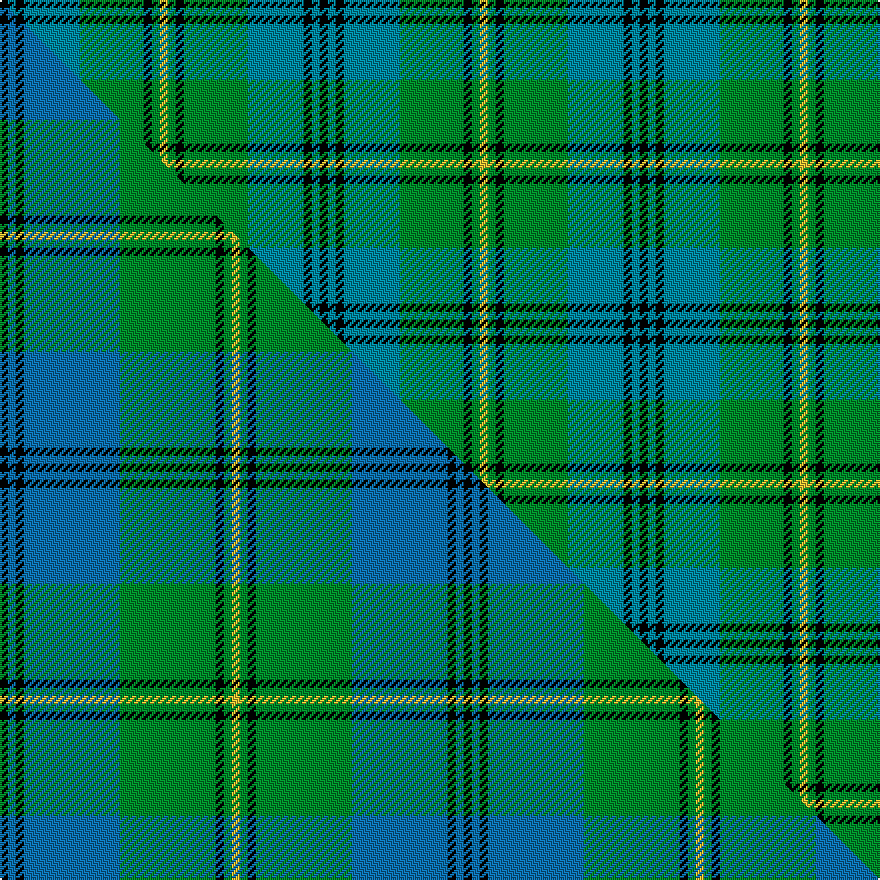

This is one **variant** — a specific cloth: this exact thread count and colourway, with its own
provenance below. It is one weaving of the [sett](/tartans/b/ba/banff-centennial/) (the scale-free proportion — the
same cloth at any scale or shade), whose colour order is pattern [KBKBGKGY](/stripes/kbkbgkgy/).

Part of the [Banff Centennial](/tartans/b/ba/banff-centennial/) tartan — the named design grouping this sett with its other cloths.

Sourced from tartans-authority.  It is a [8 stripe tartan](/stripes/stripes8/).

Original link <code>http://www.tartansauthority.com/tartan-ferret/display/3648/</code> — retired · [Internet Archive copy](https://web.archive.org/web/*/http://www.tartansauthority.com/tartan-ferret/display/3648/*)

Dataset <small>— provenance for this record, inherited from the source manifest</small>

<dl class="dataset-prov">
<dt>source</dt><dd><a href="/sources/tartans-authority/">Scottish Tartans Authority</a></dd>
<dt>data captured from</dt><dd><a href="https://github.com/thetartan/tartan-database/blob/master/data/tartans-authority/data.csv">https://github.com/thetartan/tartan-database/blob/master/data/tartans-authority/data.csv</a></dd>
<dt>data date</dt><dd>1986 <small>(this record)</small></dd>
<dt>licence</dt><dd><a href="https://creativecommons.org/licenses/by-nc-nd/4.0/">CC BY-NC-ND 4.0</a></dd>
</dl>

Capture chain <small>— the hands this data passed through, oldest first; each capture carries its own licence</small>

<ol class="capture-chain">
<li><a href="https://www.tartansauthority.com/">Scottish Tartans Authority</a> <small>the heritage body’s archive — its tartan-ferret record browser is retired; dead record links are shown unlinked, with an Internet Archive copy (ITI numbers are not SRT references)</small></li>
<li><a href="https://github.com/thetartan/tartan-database">thetartan/tartan-database</a> <small>2016-2017</small> · <a href="https://creativecommons.org/licenses/by-nc-nd/4.0/">CC BY-NC-ND 4.0</a> <small>Levko Kravets's frozen compilation — the capture we vendored, and where its CC licence text came from</small></li>
<li>this dictionary <small>captured 2026-06-10 · commit 5bf86c7566</small> <small>each re-capture is a git commit to data/sources</small></li>
</ol>

## Register references

External register numbers recorded for this tartan.

- Scottish Tartans Authority (ITI): 3648

## Thread count
K/4 T4 K4 T28 G32 K4 G4 LY/4

One full sett is **160 threads**.

## Palette
<table><thead><tr><th>Colour</th><th>Shade</th><th>OKLCh</th></tr></thead><tbody><tr><td>T</td><td><code style="background-color:#00879F;">#00879F</code> <small style="color:#888">#00879F</small></td><td><small style="color:#888">oklch(57.4% 0.102 216.1)</small></td></tr><tr><td>G</td><td><code style="background-color:#008B2A;">#008B2A</code> <small style="color:#888">#008B2A</small></td><td><small style="color:#888">oklch(55.4% 0.170 145.9)</small></td></tr><tr><td>K</td><td><code style="background-color:#000000;">#000000</code> <small style="color:#888">#000000</small></td><td><small style="color:#888">oklch(0.0% 0.000 0.0)</small></td></tr><tr><td>LY</td><td><code style="background-color:#DCBC32;">#DCBC32</code> <small style="color:#888">#DCBC32</small></td><td><small style="color:#888">oklch(80.0% 0.150 95.2)</small></td></tr></tbody></table>

# Sample pattern

## Compared to the master

This cloth is one sett of its design; the master sett (the exemplar the design is anchored on) is below for comparison.

Its **ΔTartan distance** from the master is **0.45** — the same measure the nearest-tartans table ranks by (0 is identical; a re-scale of the same cloth is near 0, a recolour or a different proportion further).

<figure class="master-compare" style="margin:0">

this sett
master sett ★

<figcaption style="color:#888;font-size:smaller">One weave of this sett against the <a href="/setts/k1t1k1t12g12k1g1ly1/">master sett ★</a>, split on the diagonal: a shared proportion runs seamlessly across it with only the shades shifting; a different proportion breaks on it.</figcaption>
</figure>

## Nearest tartan variants

The nearest existing variants by ΔTartan distance, with this cloth at the top so the swatches line up against it.

ΔTartan

Threads

Variant

Sett

—

160

<a href="/variants/s8/k1t1k1t7g8k1g1ly1~x4/">Banff Centennial (Commemorative)</a>

<a href="/ttd/edit/#slug=k1b1k1b12g12k1g1ly1~x4~b2105244&amp;base=k1t1k1t7g8k1g1ly1~x4" title="compare in the TTD">0.45</a>

232

<a href="/variants/s8/k1t1k1t12g12k1g1ly1~x4~t2105244/">Banff Centennial</a>

<a href="/ttd/edit/#slug=k2lb2k2lb15g15k2g2w2~x4&amp;base=k1t1k1t7g8k1g1ly1~x4" title="compare in the TTD">0.52</a>

320

<a href="/variants/s8/k2lb2k2lb15g15k2g2w2~x4/">Ben Lomond (Fashion)</a>

<a href="/ttd/edit/#slug=w6g5k6g42db42k5db5k5&amp;base=k1t1k1t7g8k1g1ly1~x4" title="compare in the TTD">0.58</a>

221

<a href="/variants/s8/w6g5k6g42db42k5db5k5/">Ben Lomond Fashion Tartan</a>

<a href="/ttd/edit/#slug=r3g1k1g12t12k1t1k1~x4&amp;base=k1t1k1t7g8k1g1ly1~x4" title="compare in the TTD">0.72</a>

240

<a href="/variants/s8/r3g1k1g12t12k1t1k1~x4/">Peter of Lee (Personal)</a>

<a href="/ttd/edit/#slug=db3r2db21k11g21r2g3~x2&amp;base=k1t1k1t7g8k1g1ly1~x4" title="compare in the TTD">1.55</a>

240

<a href="/variants/s7/db3r2db21k11g21r2g3~x2/">MacThomas</a>

<a href="/ttd/edit/#slug=db3r2db21k11g21r2g3&amp;base=k1t1k1t7g8k1g1ly1~x4" title="compare in the TTD">1.55</a>

120

<a href="/variants/s7/db3r2db21k11g21r2g3/">MacThomas</a>

<a href="/ttd/edit/#slug=db3r2db22k11g22r2g3~x2&amp;base=k1t1k1t7g8k1g1ly1~x4" title="compare in the TTD">1.55</a>

248

<a href="/variants/s7/db3r2db22k11g22r2g3~x2/">Gammell (1978) (Personal)</a>

<a href="/ttd/edit/#slug=db2r2db21k11g21r2g2~x2&amp;base=k1t1k1t7g8k1g1ly1~x4" title="compare in the TTD">1.56</a>

236

<a href="/variants/s7/db2r2db21k11g21r2g2~x2/">MacThomas</a>

<a href="/ttd/edit/#slug=t32k12t12g6r6g18k2y3~x2&amp;base=k1t1k1t7g8k1g1ly1~x4" title="compare in the TTD">1.82</a>

294

<a href="/variants/s8/t32k12t12g6r6g18k2y3~x2/">Gillies (House of Edgar)</a>

<a href="/ttd/edit/#slug=k5g30y3t15k15t7w3~x2&amp;base=k1t1k1t7g8k1g1ly1~x4" title="compare in the TTD">1.97</a>

296

<a href="/variants/s7/k5g30y3t15k15t7w3~x2/">Dick (Personal)</a>

## Neighbour map

Every grey dot is one of 13657 variants placed by the first two principal components of the ΔTartan feature space (42% of its variance). Red is this tartan; blue dots are its nearest — click one to open its page. The map is a flat projection of a many-dimensional space — [how to read it](/posts/neighbourhood-maps/).

<svg viewBox="0 0 640 380" role="img" style="max-width:100%;height:auto;border:1px solid #e0e0e0;border-radius:4px;display:block" xmlns="http://www.w3.org/2000/svg"><image href="/nn/cloud.v1.png" width="640" height="380"/><a href="/variants/s8/k1t1k1t12g12k1g1ly1~x4~t2105244/"><circle cx="266.7" cy="167.0" r="4" fill="#3465a4"><title>Banff Centennial</title></circle></a><a href="/variants/s8/k2lb2k2lb15g15k2g2w2~x4/"><circle cx="179.3" cy="180.2" r="4" fill="#3465a4"><title>Ben Lomond (Fashion)</title></circle></a><a href="/variants/s8/w6g5k6g42db42k5db5k5/"><circle cx="191.1" cy="175.5" r="4" fill="#3465a4"><title>Ben Lomond Fashion Tartan</title></circle></a><a href="/variants/s8/r3g1k1g12t12k1t1k1~x4/"><circle cx="238.7" cy="170.8" r="4" fill="#3465a4"><title>Peter of Lee (Personal)</title></circle></a><a href="/variants/s7/db3r2db21k11g21r2g3~x2/"><circle cx="181.5" cy="186.7" r="4" fill="#3465a4"><title>MacThomas</title></circle></a><a href="/variants/s7/db3r2db21k11g21r2g3/"><circle cx="181.5" cy="186.7" r="4" fill="#3465a4"><title>MacThomas</title></circle></a><a href="/variants/s7/db3r2db22k11g22r2g3~x2/"><circle cx="186.8" cy="183.8" r="4" fill="#3465a4"><title>Gammell (1978) (Personal)</title></circle></a><a href="/variants/s7/db2r2db21k11g21r2g2~x2/"><circle cx="182.0" cy="182.2" r="4" fill="#3465a4"><title>MacThomas</title></circle></a><a href="/variants/s8/t32k12t12g6r6g18k2y3~x2/"><circle cx="211.9" cy="164.9" r="4" fill="#3465a4"><title>Gillies (House of Edgar)</title></circle></a><a href="/variants/s7/k5g30y3t15k15t7w3~x2/"><circle cx="135.2" cy="183.1" r="4" fill="#3465a4"><title>Dick (Personal)</title></circle></a><circle cx="215.6" cy="189.6" r="5" fill="#c00000"/><text x="320" y="376" text-anchor="middle" font-size="11" fill="#999">ground</text><text x="11" y="190" text-anchor="middle" font-size="11" fill="#999" transform="rotate(-90 11 190)">complexity</text></svg>

ID: /variants/s8/k1t1k1t7g8k1g1ly1~x4/
