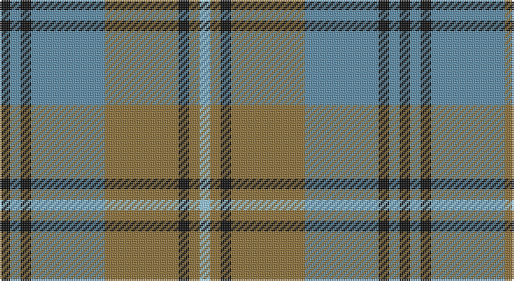

This page is one **sett** — a single exact thread-count. It belongs to the [tartan](/setts/k1t1k1t7y7k1y1lb1/)
(the same proportion at any scale), whose colour order is pattern [KBKBGKGW](/stripes/kbkbgkgw/).

Part of the [Auld Lang Syne](/tartans/auld-lang-syne/) tartan — the named design grouping this sett with its other cloths.

Sourced from register-of-tartans.  It is a [8 stripe tartan](/stripes/stripes8/).

Original link https://www.tartanregister.gov.uk/tartanDetails.aspx?ref=5313

## Also known as

This cloth is also recorded under:

- Auld Lang Syne Blue
- Auld Lang Syne Brown
- Auld Lang Syne, Blue
- Auld Lang Syne, Grey
- MacRae, Rae
- MacRae/Rae

## Register references

External register numbers recorded for this tartan.

- Scottish Register of Tartans: [5313](https://www.tartanregister.gov.uk/tartanDetails.aspx?ref=5313)
- Scottish Tartans Authority (ITI): 3580

## Thread count
K/6 B6 K6 B42 LT42 K6 LT6 LB/6

One full sett is **228 threads**.

## Palette

Palette: <strong>Tartan Register</strong>
<table><thead><tr><th>Colour</th><th>Threads</th><th>Shade</th><th>Base</th><th>OKLCh</th></tr></thead><tbody><tr><td>K/</td><td style="text-align:right;font-variant-numeric:tabular-nums">6</td><td><code style="background-color:#101010;">#101010</code> <small style="color:#888">#101010</small></td><td>K <code style="background-color:#000000;">#000000</code></td><td><small style="color:#888">oklch(17.3% 0.000 89.9)</small></td></tr><tr><td>B</td><td style="text-align:right;font-variant-numeric:tabular-nums">6</td><td><code style="background-color:#5C8CA8;">#5C8CA8</code> <small style="color:#888">#5C8CA8</small></td><td>B <code style="background-color:#2A418A;">#2A418A</code></td><td><small style="color:#888">oklch(61.7% 0.067 235.0)</small></td></tr><tr><td>K</td><td style="text-align:right;font-variant-numeric:tabular-nums">6</td><td><code style="background-color:#101010;">#101010</code> <small style="color:#888">#101010</small></td><td>K <code style="background-color:#000000;">#000000</code></td><td><small style="color:#888">oklch(17.3% 0.000 89.9)</small></td></tr><tr><td>B</td><td style="text-align:right;font-variant-numeric:tabular-nums">42</td><td><code style="background-color:#5C8CA8;">#5C8CA8</code> <small style="color:#888">#5C8CA8</small></td><td>B <code style="background-color:#2A418A;">#2A418A</code></td><td><small style="color:#888">oklch(61.7% 0.067 235.0)</small></td></tr><tr><td>LT</td><td style="text-align:right;font-variant-numeric:tabular-nums">42</td><td><code style="background-color:#8C7038;">#8C7038</code> <small style="color:#888">#8C7038</small></td><td>G <code style="background-color:#006100;">#006100</code></td><td><small style="color:#888">oklch(56.0% 0.082 83.0)</small></td></tr><tr><td>K</td><td style="text-align:right;font-variant-numeric:tabular-nums">6</td><td><code style="background-color:#101010;">#101010</code> <small style="color:#888">#101010</small></td><td>K <code style="background-color:#000000;">#000000</code></td><td><small style="color:#888">oklch(17.3% 0.000 89.9)</small></td></tr><tr><td>LT</td><td style="text-align:right;font-variant-numeric:tabular-nums">6</td><td><code style="background-color:#8C7038;">#8C7038</code> <small style="color:#888">#8C7038</small></td><td>G <code style="background-color:#006100;">#006100</code></td><td><small style="color:#888">oklch(56.0% 0.082 83.0)</small></td></tr><tr><td>LB/</td><td style="text-align:right;font-variant-numeric:tabular-nums">6</td><td><code style="background-color:#98C8E8;">#98C8E8</code> <small style="color:#888">#98C8E8</small></td><td>W <code style="background-color:#F7F7F7;">#F7F7F7</code></td><td><small style="color:#888">oklch(81.0% 0.068 237.9)</small></td></tr></tbody></table>

# Sample pattern

## Compared to the master

This cloth is one sett of its design; the master sett (the exemplar the design is anchored on) is below for comparison.

<figure style="margin:0"><figcaption style="color:#888;font-size:smaller">this sett</figcaption></figure>
<figure style="margin:0"><figcaption style="color:#888;font-size:smaller"><a href="/setts/dp27dg6dp27dg28dp5dg7dp5dg28dp31dg6dp31dg28dp2dg2dp4dg2dp2dg28dp2dg2dp4dg2dp2dg28dp27dg6dp27/">master sett →</a></figcaption></figure>

## Nearest tartans

The nearest existing variants by ΔTartan distance, with this tartan at the top so the swatches line up against it.

ΔTartan

Tartan

Sett

—

<a href="/ttd/edit/#slug=k1t1k1t7y7k1y1lb1~x6">Auld Lang Syne (Philip King Tailoring)</a> <a class="nn-out" href="/variants/s8/k1t1k1t7y7k1y1lb1~x6/" title="open its dictionary page">↗</a>

0.43

<a href="/ttd/edit/#slug=r1o1m1o7dg7m1dg1m1~x6&amp;base=k1t1k1t7y7k1y1lb1~x6">Beck-McSorley</a> <a class="nn-out" href="/variants/s8/r1o1m1o7dg7m1dg1m1~x6/" title="open its dictionary page">↗</a>

1.03

<a href="/ttd/edit/#slug=r2ly1b8r1g7ly1r2~x6&amp;base=k1t1k1t7y7k1y1lb1~x6">Cercle de Fermieres de St-Elie . . .</a> <a class="nn-out" href="/variants/s7/r2ly1b8r1g7ly1r2~x6/" title="open its dictionary page">↗</a>

1.10

<a href="/ttd/edit/#slug=o19k2w4k2n5k2n5~x2&amp;base=k1t1k1t7y7k1y1lb1~x6">Kyle Tartan</a> <a class="nn-out" href="/variants/s7/o19k2w4k2n5k2n5~x2/" title="open its dictionary page">↗</a>

1.11

<a href="/ttd/edit/#slug=db2r3g11r3db2t2db11r2g2~x2&amp;base=k1t1k1t7y7k1y1lb1~x6">Hebridean 1</a> <a class="nn-out" href="/variants/s9/db2r3g11r3db2t2db11r2g2~x2/" title="open its dictionary page">↗</a>

1.15

<a href="/ttd/edit/#slug=n32k3n3k3b5k8o21k4~x2&amp;base=k1t1k1t7y7k1y1lb1~x6">Speyside Blue (Fashion)</a> <a class="nn-out" href="/variants/s8/n32k3n3k3b5k8o21k4~x2/" title="open its dictionary page">↗</a>

1.17

<a href="/ttd/edit/#slug=y19k2w2k2n5k2n5~x4&amp;base=k1t1k1t7y7k1y1lb1~x6">Kyle</a> <a class="nn-out" href="/variants/s7/y19k2w2k2n5k2n5~x4/" title="open its dictionary page">↗</a>

1.18

<a href="/ttd/edit/#slug=k1n1k1n7dy7k1dy1lt1~x6&amp;base=k1t1k1t7y7k1y1lb1~x6">Auld Lang Syne</a> <a class="nn-out" href="/variants/s8/k1n1k1n7dy7k1dy1lt1~x6/" title="open its dictionary page">↗</a>

1.19

<a href="/ttd/edit/#slug=n32k3n3k3o5k8oi21k4~x2&amp;base=k1t1k1t7y7k1y1lb1~x6">Speyside Grey (Fashion)</a> <a class="nn-out" href="/variants/s8/n32k3n3k3o5k8oi21k4~x2/" title="open its dictionary page">↗</a>

1.20

<a href="/ttd/edit/#slug=p11o2p2o2p2o11g14w2~x2&amp;base=k1t1k1t7y7k1y1lb1~x6">Lamont</a> <a class="nn-out" href="/variants/s8/p11o2p2o2p2o11g14w2~x2/" title="open its dictionary page">↗</a>

1.27

<a href="/ttd/edit/#slug=k2t2k2t15g15k2g2w2~x4&amp;base=k1t1k1t7y7k1y1lb1~x6">Ben Lomond (Fashion)</a> <a class="nn-out" href="/variants/s8/k2t2k2t15g15k2g2w2~x4/" title="open its dictionary page">↗</a>

## Neighbour map

Every grey dot is one of 14360 variants placed by the first two principal components of the ΔTartan feature space (44% of its variance). Red is this tartan; blue dots are its nearest — click one to open its page.

<svg viewBox="0 0 640 380" role="img" style="max-width:100%;height:auto;border:1px solid #e0e0e0;border-radius:4px;display:block" xmlns="http://www.w3.org/2000/svg"><image href="/nn/cloud.v1.png" width="640" height="380"/><a href="/variants/s8/r1o1m1o7dg7m1dg1m1~x6/"><circle cx="235.4" cy="204.3" r="4" fill="#3465a4"><title>Beck-McSorley</title></circle></a><a href="/variants/s7/r2ly1b8r1g7ly1r2~x6/"><circle cx="184.9" cy="204.3" r="4" fill="#3465a4"><title>Cercle de Fermieres de St-Elie . . .</title></circle></a><a href="/variants/s7/o19k2w4k2n5k2n5~x2/"><circle cx="255.1" cy="189.1" r="4" fill="#3465a4"><title>Kyle Tartan</title></circle></a><a href="/variants/s9/db2r3g11r3db2t2db11r2g2~x2/"><circle cx="212.2" cy="229.8" r="4" fill="#3465a4"><title>Hebridean 1</title></circle></a><a href="/variants/s8/n32k3n3k3b5k8o21k4~x2/"><circle cx="266.9" cy="198.4" r="4" fill="#3465a4"><title>Speyside Blue (Fashion)</title></circle></a><a href="/variants/s7/y19k2w2k2n5k2n5~x4/"><circle cx="292.4" cy="193.3" r="4" fill="#3465a4"><title>Kyle</title></circle></a><a href="/variants/s8/k1n1k1n7dy7k1dy1lt1~x6/"><circle cx="243.8" cy="216.8" r="4" fill="#3465a4"><title>Auld Lang Syne</title></circle></a><a href="/variants/s8/n32k3n3k3o5k8oi21k4~x2/"><circle cx="270.0" cy="197.8" r="4" fill="#3465a4"><title>Speyside Grey (Fashion)</title></circle></a><a href="/variants/s8/p11o2p2o2p2o11g14w2~x2/"><circle cx="186.8" cy="212.2" r="4" fill="#3465a4"><title>Lamont</title></circle></a><a href="/variants/s8/k2t2k2t15g15k2g2w2~x4/"><circle cx="232.9" cy="204.6" r="4" fill="#3465a4"><title>Ben Lomond (Fashion)</title></circle></a><circle cx="234.0" cy="203.4" r="5" fill="#c00000"/></svg>

ID: /variants/s8/k1t1k1t7y7k1y1lb1~x6/
